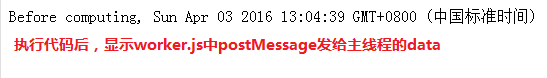
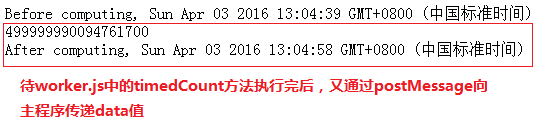

# 浅谈 webworker 的使用场景

### 一、webWorker 之初体验

在"setTimeout 那些事儿"中，说到 JavaScript 是单线程。也就是同一时间只能做同一事情。

也好理解，作为浏览器脚本语言，如果 JavaScript 不是单线程，那么就有点棘手了。比如，与用户交互或者对 DOM 进行操作时，在一个线程上修改某个 DOM，另外的线程删除 DOM，这时浏览器该如何抉择呢?

所以，JavaScript 是单线程也是有背景的。

<!-- more -->

如下：

```html
<!DOCTYPE html>
    <head>
        <title>singleThread</title>
        <meta http-equiv="Content-Type" content="text/html; charset=utf-8"/>
    </head>
    <body>
        <script>
            //添加到任务队列中，待同步任务所处的‘执行栈’执行完毕，1秒后执行任务队列中的这个匿名函数
            setTimeout(function(){
                console.log('come on');
            },1000);
            //只要不关闭该alert，‘执行栈’就没结束，从而也就不会进入到任务队列中
            alert('waiting');
        </script>
    </body>
</html>
```

但，HTML5 引入了一个工作线程（webWorker）的概念。它允许开发人员编写能够长时间运行而不被用户所中断的后台程序，去执行事务或者逻辑，并同时保证页面对用户的响应。

简而言之，就是允许 JavaScript 创建多个线程，但是子线程完全受主线程控制，且不得操作 DOM。

从而，可以用 webWorker 来处理一些比较耗时的计算。

如下，主页面：

```html
<!DOCTYPE html>
    <head>
        <title>worker</title>
        <meta http-equiv="Content-Type" content="text/html; charset=utf-8"/>
        <script>
            function init(){
                //创建一个Worker对象，并向它传递将在新线程中执行的脚本url
                var worker = new Worker('worker.js');
                //接收worker传递过来的数据
                worker.onmessage = function(event){
                    document.getElementById('result').innerHTML+=event.data+"<br/>" ;
                };
            };
        </script>
    </head>
    <body onload = "init()">
        <div id="result"></div>
    </body>
</html>
```

下面是 worker.js 的内容:

```javascript
var i = 0
function timedCount() {
  for (var j = 0, sum = 0; j < 100; j++) {
    for (var i = 0; i < 100000000; i++) {
      sum += i
    }
  }
  //将得到的sum发送回主线程
  postMessage(sum)
}
//将执行timedCount前的时间，通过postMessage发送回主线程
postMessage('Before computing, ' + new Date())
timedCount()
//结束timedCount后，将结束时间发送回主线程
postMessage('After computing, ' + new Date())
```

上面代码执行的流程是：创建的 worker 对象，并用 onmessage 方法接收 worker.js 里面 postMessage 传递过来的数据(event.data)，并将数据追加到 div#result 中。

所以，执行上面的代码结果如下：



待 worker.js 中的 timedCount 方法运算完后，执行 postMessage 操作，向主线程传数据，得图二。期间，并不影响主线程的运作。



### 二、webWorker 之常用ＡＰＩ

接下来，再来看看关于 worker 的常用 API：

#### 1、postMessage(data)

子线程与主线程之间互相通信使用方法，传递的 data 为任意值。

```javascript
//worker = new Worker('url');
//worker.postMessage传递给子线程数据，对象
worker.postMessage({first:1,second:2});

//子线程中也可以使用postMessage，如传递字符串
postMessage(‘test’);
```

#### 2、terminate()

主线程中终止 worker，此后无法再利用其进行消息传递。注意：一旦 terminate 后，无法重新启用，只能另外创建。

```javascript
//worker = new Worker('url');
worker.terminate()
```

如，主页面：

```html
<!DOCTYPE html>
    <head>
        <title>worker</title>
        <meta http-equiv="Content-Type" content="text/html; charset=utf-8"/>
        <script>
            function init(){
                var worker = new Worker('worker.js');
                //每隔100毫秒，向子线程传递{name: 'monkey'}信息
                setInterval(function(){
                    worker.postMessage({name: 'monkey'});
                },100);
                //当主线程worker收到来自子线程的消息后，触发message事件
                worker.onmessage = function(event){
                    document.getElementById('result').innerHTML+=event.data+"<br/>" ;
                    //主线程使用terminate方法中断与子线程来往，在浏览器中只能显示一次event.data
                    worker.terminate();
                };
            };
        </script>
    </head>
    <body onload = "init()">
        <div id="result"></div>
    </body>
</html>
```

子线程 worker.js 代码：

```javascript
<script>
//当主线程发来信息后，触发该message事件
onmessage = function(event){
    //向主线程发送event.data.name信息
    postMessage(event.data.name);
};
</script>
```

#### 3、message

当有消息发送时，触发该事件。且，消息发送是双向的，消息内容可通过 data 来获取。

message 使用，可见 terminate 中的 demo

#### 4、error

出错处理。且错误消息可以通过 e.message 来获取。

如下：

```javascript
//worker = new Worker('url');
worker.onerror = function(e) {
  //打印出错消息
  console.log(e.message)
  //中断与子线程的联系
  worker.terminate()
}
```

另：worker 线程从上到下同步运行它的代码，然后进入异步阶段来对事件及计时器响应，如果 worker 注册了 message 事件处理程序，只要其有可能触发，worker 就一直在内存中，不会退出，所以通信完毕后得手动在主线程中 terminate 或者子线程中 close 掉，但如果 worker 没有监听消息，那么当所有任务执行完毕（包括计数器）后，他就会退出。

### 三、worker 上下文

先看下面这段代码：

主页面：

```javascript
<!DOCTYPE html>
    <head>
        <title>worker</title>
        <meta http-equiv="Content-Type" content="text/html; charset=utf-8"/>
        <script>
            function init(){
                var worker = new Worker('worker.js');
                //接收消息事件
                worker.onmessage = function(event){
                    console.log(event.data);
                };
                //错误信息事件
                worker.onerror = function(e){
                    console.log('erro: ' + e.message);
                    //终止线程
                    worker.terminate();
                };
            };
        </script>
    </head>
    <body onload = "init()">

    </body>
</html>
```

worker.js

```javascript
//window对象的alert方法
alert(1)
onmessage = function(event) {
  //向主线程发送event.data.name信息
  postMessage(event.data.name)
}
```

执行上面代码结果：


为什么会这样呢？原因是 alert 为 window 对象的方法，所以会报错 undefined。

worker.js 执行的上下文，与主页面 html 执行时的上下文并不相同，最顶层的对象并不是 window，woker.js 执行的全局上下文，是个叫做 WorkerGlobalScope 的东东，所以无法访问 window、与 window 相关的 DOM API，但是可以与 setTimeout、setInterval 等协作。
WorkerGlobalScope 作用域下的常用属性、方法如下：

#### 1、self

我们可以使用 WorkerGlobalScope 的 self 属性来或者这个对象本身的引用

#### 2、location

location 属性返回当线程被创建出来的时候与之关联的 WorkerLocation 对象，它表示用于初始化这个工作线程的脚步资源的绝对 URL，即使页面被多次重定向后，这个 URL 资源位置也不会改变。

#### 3、close

关闭当前线程，与 terminate 作用类似

#### 4、importScripts

我们可以通过 importScripts()方法通过 url 在 worker 中加载库函数

#### 5、XMLHttpRequest

有了它，才能发出 Ajax 请求

#### 6、setTimeout/setInterval 以及 addEventListener/postMessage

### 四、关于 worker

我们可以做什么：

1.可以加载一个 JS 进行大量的复杂计算而不挂起主进程，并通过 postMessage，onmessage 进行通信

2.可以在 worker 中通过 importScripts(url)加载另外的脚本文件

3.可以使用 setTimeout(), clearTimeout(), setInterval(), and clearInterval()

4.可以使用 XMLHttpRequest 来发送请求

5.可以访问 navigator 的部分属性

局限性：

1.不能跨域加载 JS

2.worker 内代码不能访问 DOM

3.各个浏览器对 Worker 的实现不大一致，例如 FF 里允许 worker 中创建新的 worker,而 Chrome 中就不行

4.IE 这个新特性
