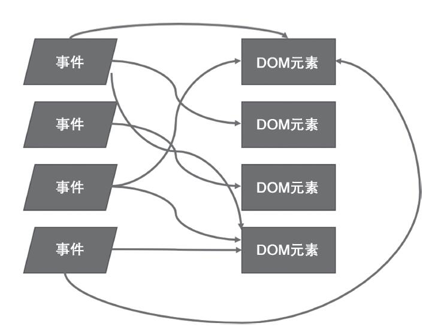
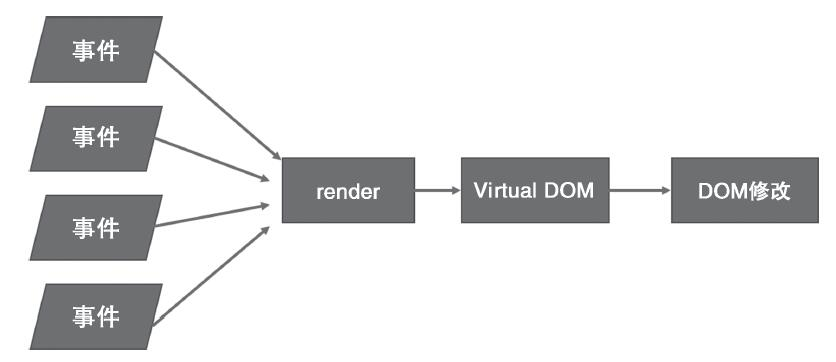

# React 深入浅出系列--React 的工作方式

### jQuery 如何工作

在讲解 React 的工作方式之前，先了解下 jQuery 的工作方式，我们使用 jQuery 给网页添加一个 onclick 事件基本写发如下：

```html
<div>
  <button type="btn" id="btn">点击我</button>
</div>
<script>
  $(function(){
    $("#btn").click(fucntion(){
      // do some things
    })
  })
</script>
```

在 jQuery 的解决方案中，首先根据 css 规则找到 id 为 btn 的按钮，挂上一个匿名事件处理函数，在事件处理函数中，选中那个需要被修改的 DOM 元素，读取其中的文本值，加以修改，然后修改这个 DOM 元素。

但是对于庞大的项目，这种模式会造成代码结构复杂，难易维护，每个 jQuery 的使用者都会有这种体会。

<!-- more -->

### React 的理念

react 给 dom 添加事件并不是通过选择器选中某个 dom，然后添加相应的事件，使用 react 开发，开发者不需要关心 dom 的组成结构，只需关注数据从哪里来，该去哪个组件中显示，也就是关心整个数据流的走向，通过 render 函数将相应的数据显示在界面上，如果需要更新界面，只需要找到相应的数据 data 更新即可，用户界面自然会做出响应，所以说 react 也是响应式编程。

### Virtual DOM

对于改变普通的 html 中的 DOM 会造成页面的重排和重绘，这也是前端性能优化主要的方面，就是尽量减少对 DOM 的操作。其实虚拟 DOM 说的简单点就是 js 动态生成的 html 标签在 js 内存中存储，并没有实际插入到页面当中。例如使用 createElement（'Button'）和 DocumentFragment 创建虚拟的标签。简单的虚拟 DOM 代码示例如下，主要是方面从简单的层面理解虚拟 DOM：

```javascript
var frag = document.createDocumentFragment()
for (var i = 0; i < 10; i++) {
  var l = document.createElement('li')
  l.innerHTML = 'ss'
  frag.appendChild(l)
}
document.getElementById('list').appendChild(frag)
```

当然 React 中的虚拟 DOM 并没有像以上的例子这么简单，但是核心思想是这样的，相比直接操作 DOM 而言，通过操作 js 生成的 DOM 数结构改变映射到页面上的内容能提高不少性能。虚拟 DOM 就是对 DOM 树的抽象，仅仅是存在与 javascript 空间的树形结构，例如最简单的形式如下：

```javascript
var a = {
  type: 'a',
  props: {
    children: 'React',
    className: 'link',
    href: 'facebook/react · GitHub'
  },
  _isReactElement: true
}

React.render(a, document.body)
```

虚拟 DOM 中有个核心算法就是 diff 算法，主要实现以下三个步骤：

- 步骤一：用 JS 对象模拟 DOM 树
- 步骤二：比较两棵虚拟 DOM 树的差异
- 步骤三：把差异应用到真正的 DOM 树上
  react 会根据 diff 算法计算出需要更新改变虚拟 DOM，从而只更新页面中映射的那一小块 DOM。对于 diff 算法以及 react 性能优化后期会单独用一节分析。

### React 工作方式的优点

传统化的 jquery 的方式直观易懂，但是随着项目变得庞大时，用 jquery 写出的代码往往相互纠缠，难以维护。



使用 react 的方式，可以避免构建这样复杂的程序结构，无论何种事件，引发的都是 react 组件的重新渲染，至于如何只修改必要的 DOM 部分，则完全交给 React 去操作，开发这不需要关心。react 利用函数式编程的思想来解决用户界面渲染问题，最大的优势能够提高开发效率，代码可维护性和可阅读性增强。



react 会强制所有组件都按照这种由数据驱动渲染的模式来工作，无论应用多大，都让程序处于可控范围内。下一篇将为大家介绍如何设计高质量的 React 组件。
