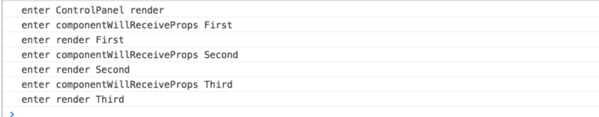

# React 深入浅出系列--如何设计高质量的 React 组件

### 组件的设计要素

在项目开发初期，针对模块或者组件的分配是及其重要，基本会按照“分而治之”的思想去合理的设计组件的功能以及扩展它们的复用性等等。拆分组件最关键的就是确定组件功能的边界，每个组件都应该是可以独立存在的，如果两个组件逻辑太紧密，无法清晰定义各自的职责，那这两个组件本身就不该被拆分，作为同一个组件或许更加合理。

组件的划分需要满足两个基本原则：<b>高内聚</b>和<b>低耦合</b>

<b>高内聚:</b>把逻辑紧密相关的内容放在一个组件中。早期开发 html、css、js 基本会以三个不同的文件存放，这样其实是违背高聚合的原则，react 正好提供将跟组件相关的 css、js、html 放在一起的语法结构，这样一来，组件的复用性能够达到极致。

<b>低耦合:</b>不同的组件之间的依赖关系要尽量弱化。也就是每个组件要尽量独立。保持整个系统的低耦合度，让不同的组件去实现不同的功能，复杂的功能是通过细分的组件组装起来完成的，这样设计的话，方便开发者写出低耦合的系统。

<!-- more -->

### react 组件的数据

react 组件的数据主要分两种：<b>prop</b>和<b>state</b>。无论 prop、state 的改变都可能引发组件的渲染，其实 react 有基本的规范，prop 主要作为组件对外部的接口，负责接受其他组件传过来的数据参数等，state 主要是组件内部定义的数据状态，仅仅属于当前组件内部使用，片段代码如下：

```javascript
// 定义一个子组件
class Counter extends Component {
  constructor(props) {
    // 在构造函数中定义super主要是为了接受父组件传进来的参数，保证内部正常使用this.props
    super(props)
    //使用state定义自己内部状态数据
    this.state = {
      text: 1
    }
  }
  render() {
    const { caption } = this.props //通过this.props来获取父亲组件传进来的caption值
    return <div className="App">{this.state.text}</div>
  }
}
// 定义一个父组件
class ControlPanel extends Component {
  render() {
    console.log('enter ControlPanel render')
    return (
      <div style={style}>
        <Counter caption="First" />
      </div>
    )
  }
}
```

#### React 中的 prop

给 prop 赋值和读取 prop 的值，以下只是代码片段，主要为了解释那些是赋值那些是读取值

```javascript
//在构造函数中读取父组件传过来的值
constructor(props) {
    // 在构造函数中定义super主要是为了接受父组件传进来的参数，保证内部正常使用this.props
    super(props);
    //使用state定义自己内部状态数据
    this.state = {
      text: 1
    }
  }

//在render函数中返回一个组件，并且带上要给该组件传递的数据
return (
    <Counter caption="First"/>
);
```

如果一个组件需要定义自己的构造函数，一定要在构造函数的第一行通过 super 调用父级也就是 React.Component 的构造函数，只有这样才能通过 this.props 来获取父级传下来的数据。因此常常会在构造函数中绑定 this 的指向，避免在 render 中多次绑定而造成性能问题。

#### propTypes 的检查

通过 propTypes 属性来定义 prop 规格，在组件渲染运行和静态代码检查时，都可以根据 propTypes 判断外部传递数据的格式是否正确，基本代码片段如下：

```javascript
Counter.propTypes = {
  caption: PropTypes.string.isRequired,
  initValue: PropTypes.number
}
```

其中要求 caption 必须是 string 类型，initValue 必须是 number 类型，isRequired 代表该 caption 必须传递，不能缺失，而 initValue 可以不传。

所以在具体项目开发中，最好的方式是，在开发模式下带上 propTypes，而在上线的时候可以去掉这些代码，可以用 babel-react-optimize 工具自动去除 propTypes，这样部署到产品环境的代码就会更优。

#### React 中的 state

state 代表组件内部状态，常常用来定义组件内部初始值。组件内部的 state 必须是一个对象，不能是 string 或者 number 这样简单的数据类型。基本使用如下：

```javascript
constructor(props) {
    this.state = {
      text: 1, // 使用state定义自己内部状态数据
      num:props.num || 1 // 接受父组件传来的参数
    }
  }
```

在当前组件对象内部通过 this.state 来访问内部定义的变量，如果要改变状态千万不要直接通过 this.state 赋值改变，使用 react 提供的 setState 这个方法来改变状态，这样改变能够直接触发组件重新 render 使得界面绑定的相应的状态更新。

#### prop 和 state 的对比

- prop 用于定义外部接口，state 用于定义内部状态；
- prop 的赋值在外部世界使用组件时，state 的赋值在组件内部；
- 组件不应该改变 prop 的值，而 state 存在的目的就是让组件来改变的；

一个子组件去修改 props 中的值，就是违背 react 的设计初衷，如果必须修改，建议使用组件内部状态先保存 props，然后通过改变组件内部状态变相改变了 props。

### 使用 prop 建立组件间的通信

应用示例如下：


使用 prop 建立组件间的通信原理就是在子组件内部定义改变内部状态的方法并且触发父组件改变父组件的方法，并且在自组件自定一个空函数作为父子组件通信的桥接。

具体实现代码如下，我们现在 Counter 子组件中定义需要改变状态的方法，除了触发改变内部状态的 updateCount 方法，同时也会触发父组件的 this.props.onUpdate 方法：

```javascript
  onClickIncrementButton() {
    this.updateCount(true);
  }

  onClickDecrementButton() {
    this.updateCount(false);
  }

  updateCount(isIncrement) {
    const previousValue = this.state.count;
    const newValue = isIncrement ? previousValue + 1 : previousValue - 1;

    this.setState({count: newValue})
    this.props.onUpdate(newValue, previousValue)
  }
```

接下来我们定义一个默认的空函数，来桥接父子组件通信，代码片段如下：

```javascript
Counter.propTypes = {
  caption: PropTypes.string.isRequired,
  initValue: PropTypes.number,
  onUpdate: PropTypes.func
}

Counter.defaultProps = {
  initValue: 0,
  onUpdate: f => f //什么都不做的函数
}
```

并且在父组件中建立相应的更新方法，并且在 render 将 onCounterUpdate 方法以 onUpdate 名字传递给子组件中，自组件定义 onUpdate 来接受父组件传递下来的方法，从而解决了父子组件的通信，代码片段如下：

```javascript
  onCounterUpdate(newValue, previousValue) {
    const valueChange = newValue - previousValue;
    this.setState({ sum: this.state.sum + valueChange});
  }
  render() {
    return (
      <div style={style}>
        <Counter onUpdate={this.onCounterUpdate} caption="First" />
        <Counter onUpdate={this.onCounterUpdate} caption="Second" initValue={this.initValues[1]} />
        <Counter onUpdate={this.onCounterUpdate} caption="Third" initValue={this.initValues[2]} />
        <hr/>
        <div>Total Count: {this.state.sum}</div>
      </div>
    );
  }
```

### 使用 prop 传递参数的局限

从上面的示例不难看出，子组件和父组件都各自维护一套属于自己的状态，并且通过 update 来相互通信，如果 update 内部内部逻辑出现 bug，这个时候，计数器的结果到底是子组件的对还是父组件的对呢，这个时候就需要共享状态的概念出现，通过一个全局状态来同步各个子组件内部的状态，开发者也只要关注共享全局状态走向就行。

组件状态不统一：

全局状态同步状态：


如果一个系统中，存在多层嵌套组件，如果按照 prop 规则传递参数，岂不是非常麻烦，所以必须引入全局状态 Redux，将在下节中为大家介绍基本的 Redux 思想及原理。

### react 生命周期介绍

生命周期基本分成三个主要阶段：

- 装载过程，组件第一次渲染过程
- 更新过程，当组件重新渲染过程
- 卸载过程，组件从 DOM 中删除过程

#### 装载过程

依次调用一下生命周期函数方法(按照 es6 最新语法介绍)：

- constructor
- defaultProps
- componentWillMount
- render
- componentDidMount

##### constructor

这是 es6 中构造函数的写法，如果是无状态的 React 组件无需定义构造函数，因此定义构造函数基本的作用是：

- 初始化 state，在组件定义个函数中需要访问 state 状态。
- 绑定函数的 this 上下文。

代码片段如下：

```javascript
constructor(props) {
    super(props);
    this.onClickIncrementButton = this.onClickIncrementButton.bind(this);
    this.onClickDecrementButton = this.onClickDecrementButton.bind(this);
  }
```

##### defaultProps

主要作用是给 props 定义初始值，基本写法如下：

```javascript
Counter.defaultProps = {
  initValue: 0,
  onUpdate: f => f //什么都不做的函数
}
```

##### render

主要作用返回一个 JSX 描述的结构，最终再交付给 React 来操作渲染，组件在有些情况下如果不需要返回 JSX 结构，可以通过返回 null 或者 false 来告诉 React 不渲染任何 DOM 元素。

> 注意：在 render 中不要操作对状态的改变，应该在自定义函数中改变

##### componentWillMount 和 componentDidMount

componentWillMount 在 render 函数之前调用，也就是 DOM 还没有挂载，这个时候如果调用 this.setState 修改状态也不会发生重新渲染，其实我们可以在创建构造函数中就做好在 componentWillMount 应该做的事情。此函数既可以在服务端被调用，也可以在浏览器端被调用。

componentDidMount 在 render 之后调用，也就是挂载 DOM 的操作，如果一个父组件嵌套多个子组件，这个时候挂载 DOM 的顺序是等到子组件全部调用 render 函数之后再开始挂载相应子组件的 DOM。该函数只能在浏览器端被调用。如果需要对 DOM 操作的话，建议可以在 componentDidMount 中定义函数进行操作。DOM 挂载顺序结果如下：


#### 更新过程

- componentWillReceiveProps
- shouldComponentUpdate
- componentWillUpdate
- render
- componentDidUpdate

##### componentWillReceiveProps

这个函数是根据新的 props 的值来计算出是不是要更新组件内部 state 状态。同同时，只要父组件的 render 函数被调用，在 render 函数里面被渲染的子组件就会经历更新过程，不管父组件传给子组件的 props 有没有改变，都会触发 componentWillReceiveProps 函数运行。

在 Counter 组件中增加函数：

```javascript
componentWillReceiveProps(nextProps) {
    console.log('enter componentWillReceiveProps ' + this.props.caption)
  }
```

在 ControlPanel 函数中定义强制更新函数：

```javascript
render() {
    console.log('enter ControlPanel render');
    return (
      <div style={style}>
        <Counter onUpdate={this.onCounterUpdate} caption="First" />
        <Counter onUpdate={this.onCounterUpdate} caption="Second" initValue={this.initValues[1]} />
        <Counter onUpdate={this.onCounterUpdate} caption="Third" initValue={this.initValues[2]} />
        <button onClick={ () => this.forceUpdate() }>
          Click me to re-render!
        </button>
        <hr/>
        <div>Total Count: {this.state.sum}</div>
      </div>
    );
```

ControlPanel 组件中触发了 render 函数，子组件中的 componentWillReceiveProps 都被触发了，但是并没有改变 props 的值，运行结果截图如下：


这个函数会接受 nextProps 参数，一般会用 nextProps（这一次渲染传入的值）与 this.props（上一次渲染传入的值）进行比较，只有两者有变化的时候才会调用 this.setState 更新内部状态。

##### shouldComponentUpdate

主要作用根据 nextProps, nextState 接收的两个参数来判断组件是否需要执行 render 函数，react 中这个函数如果不做任何设置，默认都是返回 true，所以再做性能优化的时候，这个函数起到了至关重要的作用。
在 Counter 组件中增加函数：

```javascript
shouldComponentUpdate(nextProps, nextState) {
    return (nextProps.caption !== this.props.caption) ||
           (nextState.count !== this.state.count);
  }
```

改变任何一个值，只会触发当前这个组件调用 render 函数，运行结构如下：


##### componentWillUpdate 和 componentDidUpdate

只要 shouldComponentUpdate 函数返回为 true，就会以此调用 componentWillUpdate、render、componentDidUpdate 这三个函数，同样这两个函数即可以在服务端调用也可以在浏览器端调用。

#### 卸载过程

这个过程主要是卸载不使用的组件 DOM 元素，或者使用非 React 方式创建的 DOM 元素，还是非常有作用的，例如，如果在 componentDidMount 中可以使用了 js 原生创建了 DOM 元素，但是在组件卸载过程中没有清楚，这个时候会造成内存泄露，所以在使用卸载组件的函数，必须确定相关的 DOM 都清除。

本篇简要的 React 组件的通信和基本的生命周期运行流程，在使用 prop 通信会有一定的局限，下节会引入 Redux 共享状态概念，来解决 prop 传递的局限，本篇涉及到的源码可以访问https://github.com/wqzwh/react-redux-demo/tree/master/src/demo/01
