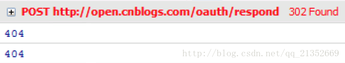

# ajax 如何截取 302 响应

在 ajax 请求中，如果服务器端的响应是 302 Found，在 ajax 的回调函数中能够获取这个状态码吗？能够从 Response Headers 中得到 Location 的值进行重定向吗？让我们来一起看看实际情况。

##### 使用 jQuery 的\$.ajax()发起 ajax 请求的 JavaScript 代码如下：

```javascript
$.ajax({
  url: '/oauth/respond',
  type: 'post',
  data: data,
  complete: function(jqXHR) {
    console.log(jqXHR.status)
  },
  error: function(xhr) {
    console.log(xhr.status)
  }
})
```

<!-- more -->

##### 当服务器端返回 302 Found 的响应时，浏览器中的运行结果如下：



在 ajax 的 complete()与 error()回调函数中得到的状态码都是 404，而不是 302。
为什么呢？在 stackoverflow 上找到了答案：

原来，当服务器将 302 响应发给浏览器时，浏览器并不是直接进行 ajax 回调处理，而是先执行 302 重定向——从 Response Headers 中读取 Location 信息，然后向 Location 中的 Url 发出请求，在收到这个请求的响应后才会进行 ajax 回调处理。大致流程如下：

ajax -> browser -> server -> 302 -> browser(redirect) -> server -> browser -> ajax callback

而在我们的测试程序中，由于 302 返回的重定向 URL 在服务器上没有相应的处理程序，所以在 ajax 回调函数中得到的是 404 状态码；如果存在对应的 URL，得到的状态码就是 200。

所以，如果你想在 ajax 请求中根据 302 响应通过 location.href 进行重定向是不可行的。

#### 如何解决？

#### 【方法一】

继续用 ajax，修改服务器端代码，将原来的 302 响应改为 json 响应，比如下面的 ASP.NET MVC 示例代码：

```javascript
return Json(new { status = 302, location = "/oauth/respond" });

ajax代码稍作修改即可：

$.ajax({
    url: '/oauth/respond',
    type: 'post',
    data: data,
    dataType: 'json',
    success: function (data) {
        if (data.status == 302) {
            location.href = data.location;
        }
    }
});
```

#### 【方法二】

不用 ajax，改用 form。

```javascript
<form method="post" action="/oauth/respond" />
```
