# WebGL 系列教程--3D 图形学入门

### 3D 的基本元素

2D 坐标系由 x 轴和 y 轴构成。其中，笛卡尔坐标系是最常见的 2D 坐标系。原点为（0.0），每个系统的坐标系不一样，有的系统 y 轴是正方向，有的是 y 轴的负方向为正方向。

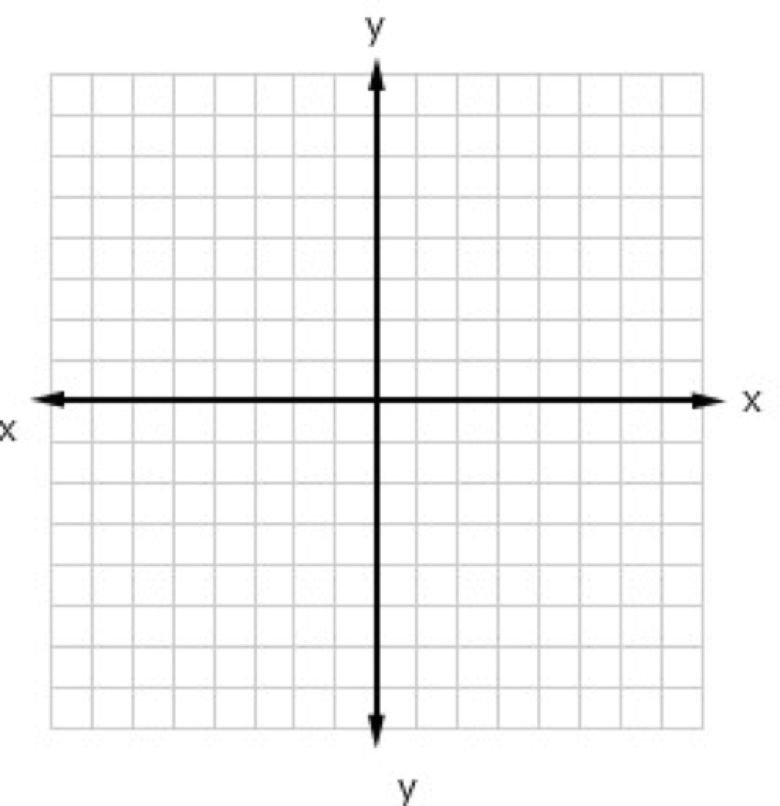

<!-- more -->

HTML5 canvas2D 坐标系,canvas 坐标原点在左上角，从 x 为右是正方向，向下为 y 轴的正方向

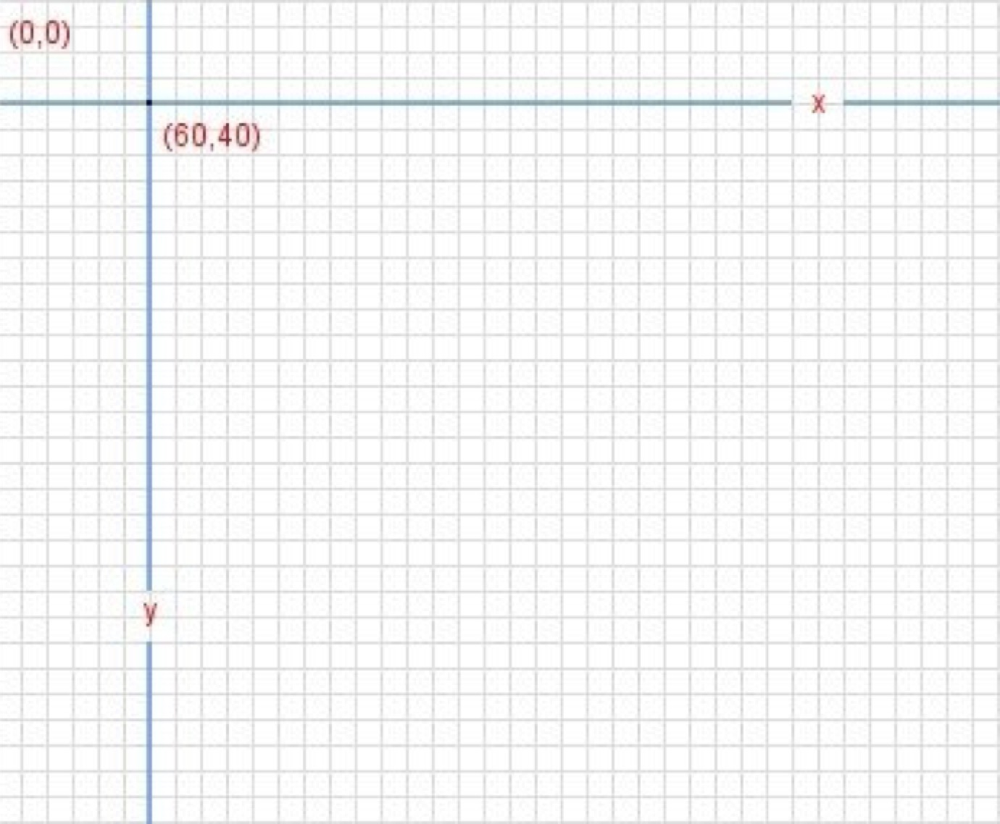

示例代码片段：

```html
<style>
  * {
    margin: 0;
    padding: 0;
  }
</style>
<canvas id="canvas"></canvas>
<script>
  var cxt = canvas.getContext('2d')

  // 设置正方体左上角坐标（x，y）
  var x = 50
  var y = 50

  // 绘制正方形
  cxt.fillRect(x, y, 50, 50)
</script>
```

效果如下：

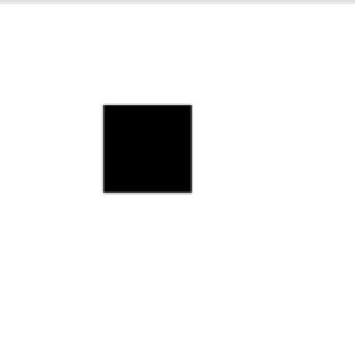
修改x和y轴后展示效果如下：
``` javascript
  // 设置正方体左上角坐标（x，y）
  var x = 0;
  var y = 0;
```
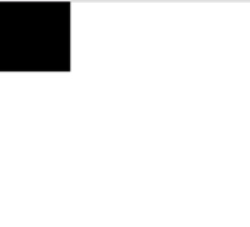

3D 坐标系增加了表示深度的 z 轴，即 3D 物体离屏幕的深度。

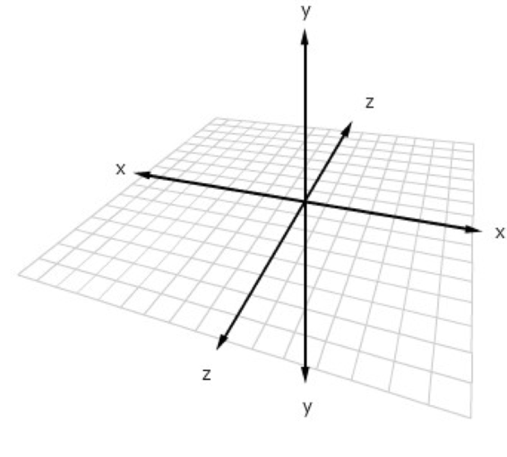

WebGL 坐标系的方向，向上为 y 轴的正方向，向右为 x 轴的正方向，从原点向外为 z 轴的正方向。绘图的可视范围是+1 到-1 之间

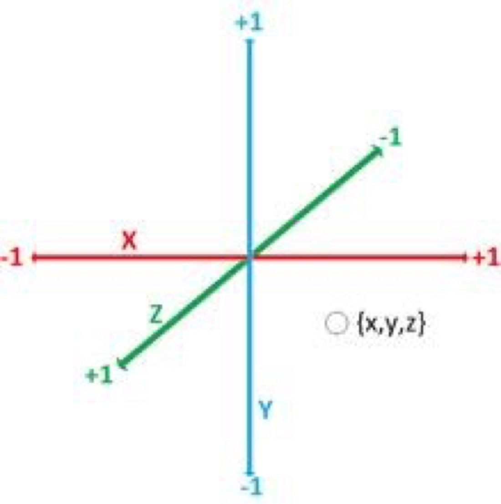

基本示例代码如下：

```javascript
const VSHADER_SOURCE = `void main() {
    gl_Position = vec4(1.0,0.0,0.0,1.0);
    gl_PointSize = 30.0;
}`
```

webgl 规定 1.0 为可视区域的最外层，不是像素值的意义。

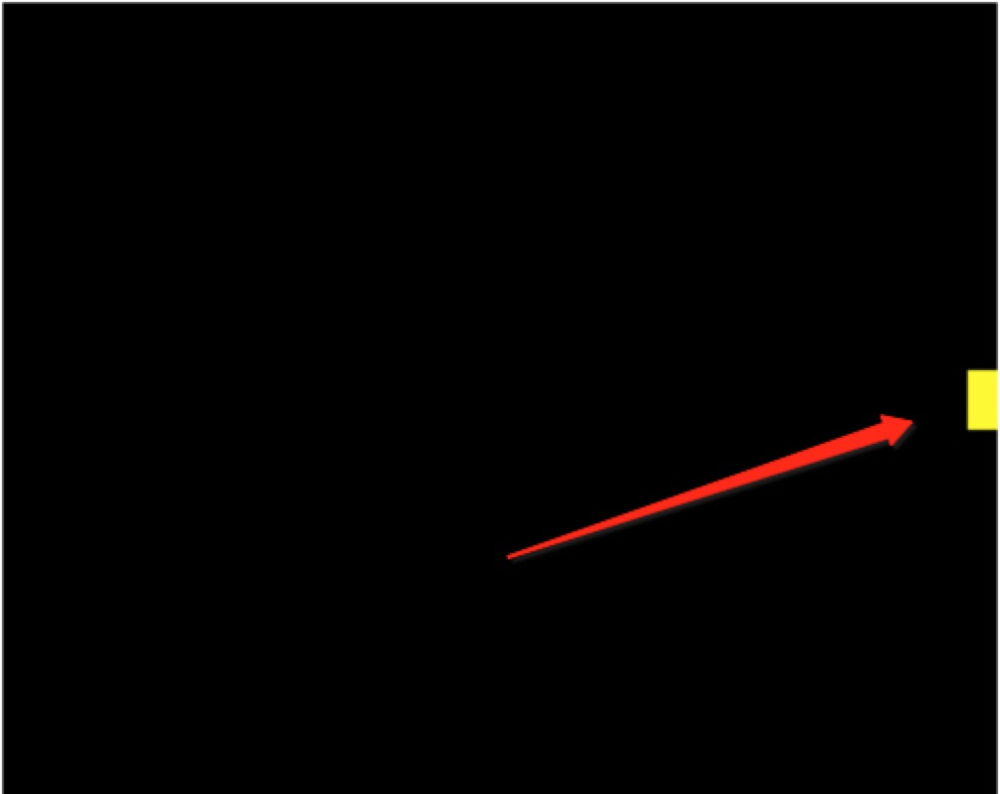

三角形是基础图形，所有的图形都能根据三角形进行拼凑而成，也就是 3D 图形是由一个或者多个三角形组成；网格是由一个或者多个图形组成。

<b>法线</b>:始终垂直于某平面的虚线，在几何中，法线是指平面上垂直于曲线在某点切线的直线。法线和切线的交点称作切点，法线在 3D 绘图当中尤其在切图当中起到很大作用，通常的切图会失真，用法线切图方式算法的切图效果相对比较逼真。

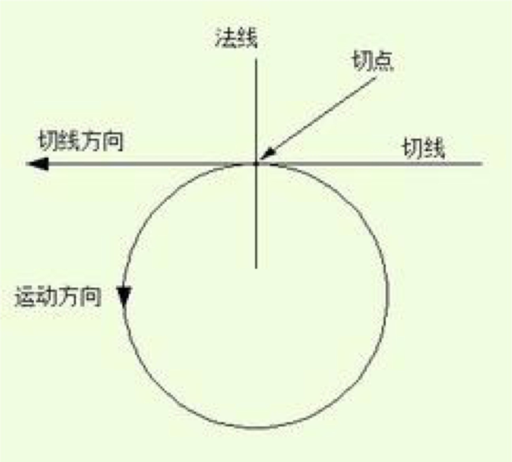

### 3D 的变换概念

<b>变换</b>：变换的原理是对顶点的改变，变换的方式有三种，分别是缩放、平移、旋转。
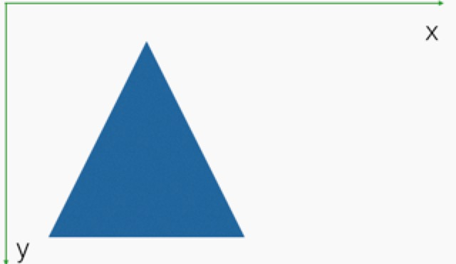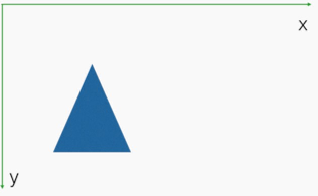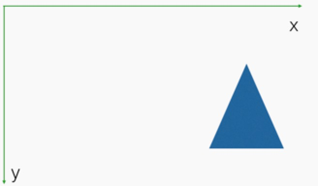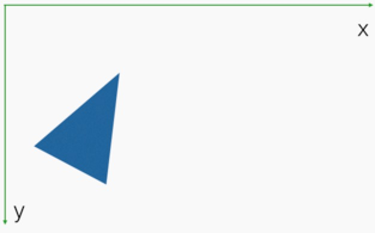

旋转规定 Z 轴不变，定义初始旋转角度变量，示例代码我们先用着色器来计算顶点坐标位置，性能会比较低，在实际开发中，会定义矩阵来计算复杂的位置，示例代码片段如下：

```javascript
// 定义旋转角度
var ANGLE = 30.0
const VSHADER_SOURCE = ` attribute vec4 a_Position;
    uniform float u_CosB,u_SinB;
    attribute float a_PointSize;
    void main() {
       gl_Position.x = a_Position.x * u_CosB -  a_Position.y * u_SinB;
       gl_Position.y = a_Position.x * u_SinB -  a_Position.y * u_CosB;
       gl_Position.z = a_Position.z;
       gl_Position.w = 1.0;
     }`
// 片元着色器程序
const FSHADER_SOURCE = ` precision mediump float;
    uniform vec4 u_FragColor;
    void main() {
      gl_FragColor = vec4(1.0,1.0,0.0,1.0);
    }`
```

<b>矩阵</b>：解决的复杂是针对着色器的，在实际开发中，应保证着色器的简单，因为着色器越复杂性能就越低。在 webgl 中矩阵可以理解为是一种数据类型，专门处理复杂的计算，可以进行乘法和加法的运算。代码片段如下：

```javascript
// 定义矩阵的方式来处理变换效果
// 定义旋转角度
var ANGLE = 30.0
const VSHADER_SOURCE = ` attribute vec4 a_Position;
    uniform mat4 u_xformMatrix; //定义矩阵来变化
    void main() {
       gl_Position = u_xformMatrix * a_Position;
     }`
// 片元着色器程序
const FSHADER_SOURCE = ` void main() {
      gl_FragColor = vec4(1.0,1.0,0.0,1.0);
    }`
```

### 网格表面

<b>纹理与材质</b>：纹理可以定义网格表面的外观，例如在模型上贴一张图片；材质是网格表面的特性，也就是光滑度、透明度等等。
<b>光照原理</b>：光线方向决定物体的明暗度与阴影,在着色过程中，需要考虑光源类型与反射类型。
<b>光照类型</b>：平行光（从一个方向平行的打在一个物体上，有方向感的）、点光源光（由中心光源散发出来的光线，越往四周光线越弱）、环境光（在任何一个地方，光线的强弱都是一样的）

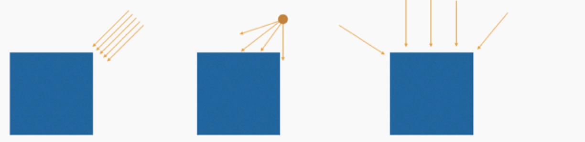

<b>反射类型</b>：漫反射光色由入射光色、表面漆色和入射角决定，环境反射由入射光色和表面漆色决定。

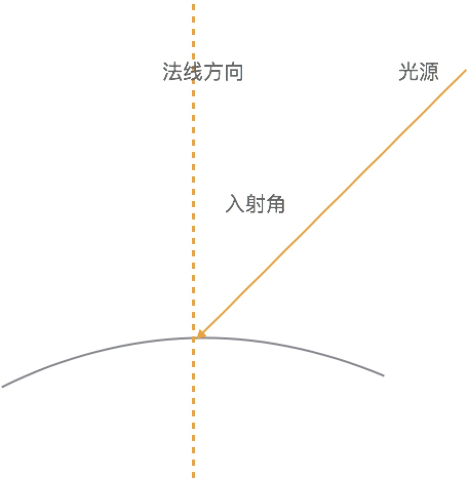

### 着色器

代替传统的固定渲染管线，固定的渲染管线是不可变的；着色器具有可编程性的；着色器分为，顶点着色器和片元着色器。

<b>顶点着色器</b>：顶点着色器用来描述顶点的位置、颜色的程序，写法类似 c 语言，会定义一个主函数 main，同时有系统变量，这个变量是不可以变的，变量对应的值是强类型，片段代码如下：

```javascript
void main() {
    gl_Position = vec4(0.0,0.0,0.0,1.0);
    gl_PointSize = 20.0;
}
```

<b>片元着色器</b>：对网格表面像素的处理程序，例如网格表面的贴图就需要用到片元着色器，系统变量对应的值是不能超过 1.0 的，片段代码如下：

```javascript
void main(){
    gl_FragColor = vec4(1.0,0.0,0.0,1.0);
}
```

### 3D 世界

<b>相机、视口、投影</b>：相机角度的不同，观察物力的景象就是不同的，远近决定观察看到物体的大小不同，图片中绿色的区域表示视口，也就是 canvas 决定的，它的大小决定了可视化的范围，红色部分表示场景显示最远能够到哪里，两者之间的可视化锥体，就代表可视化的范围，最终的影像会在视口中呈现出来，大小是由相机决定的。投影的概念就是物体投影在前方视口最终形成的影像。

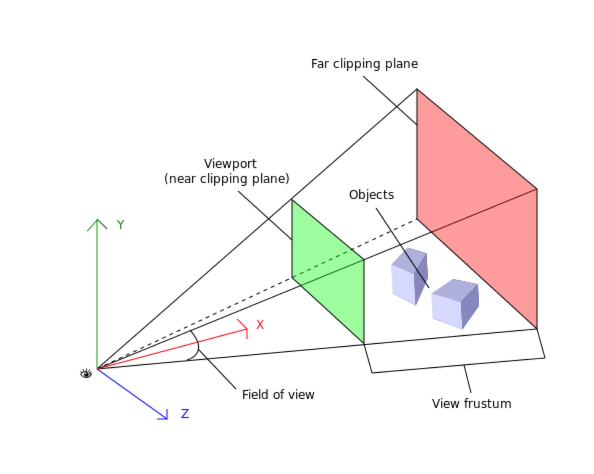

这一节简要的介绍了以上几个概念的基本知识，下一节将介绍 WebGL 的基本概念。后期所有的例子都会提供源码供大家下载。
