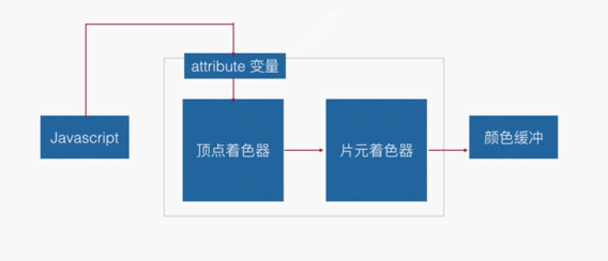
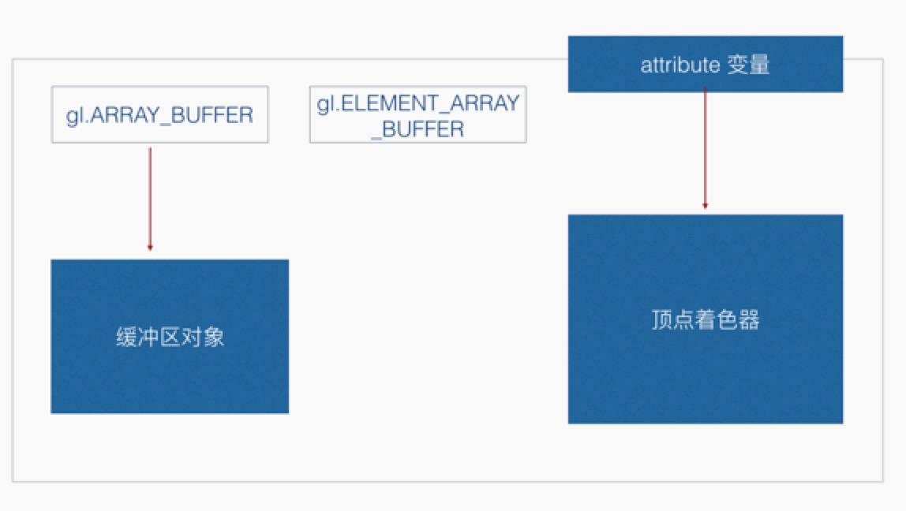
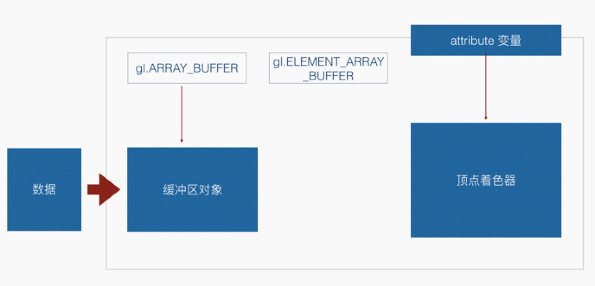
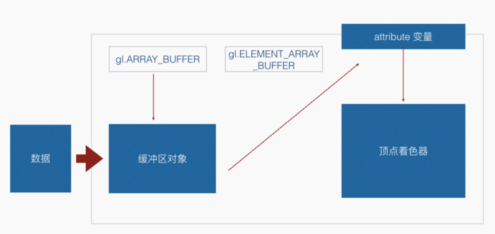
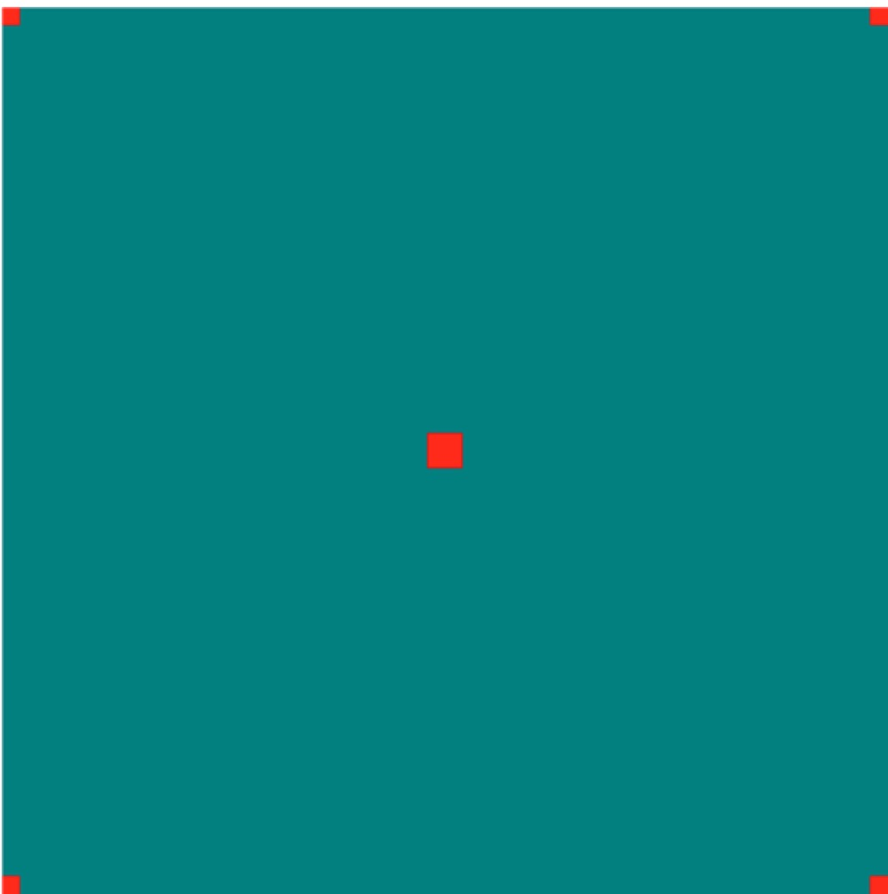

# WebGL 系列教程--缓冲区对象

### attribute 变量的使用

主要职能是在顶点着色器当中使用的，只能被申明为全局变量，用来表示顶点的信息，比如一个图形中包含多个顶点，顶点着色器是针对逐顶点进行运算的，都会传导到 attribute 变量中，然而，两个顶点之间的部分是不会被传导到顶点着色器中的。

这个变量只能支持矢量和矩阵两种类型，attribute 变量的个数限制和设备有关系，最小支持 8 个 attribute 变量。



- 在顶点着色器中，声明 attribute 变量
- 将 attribute 变量赋值给 gl_Position 变量
- 向 attribute 变量传递数据

<!-- more -->

首先创建顶点着色器的基本代码：

```javascript
// 顶点着色器程序
const vertexShaderSource = `attribute vec4 apos;
    void main() {
  gl_Position = apos;
  gl_PointSize = 10.0;
}`
```

书写基本的片元着色器的代码：

```javascript
// 片元着色器程序
const fragmentShaderSource = `void main() {
  gl_FragColor = vec4(1.0,0.5,0.0,1.0);
  }`
```

获取 webgl 上下文代码：

```javascript
var cxt = canvas.getContext('webgl')
```

获得顶点着色器和片元着色器对象,并且把源代码写入到顶点着色器及片元着色器中去，然后进行编译，片段代码如下：

```javascript
var vertexShader = cxt.createShader(cxt.VERTEX_SHADER)
var fragmentShader = cxt.createShader(cxt.FRAGMENT_SHADER)
cxt.shaderSource(vertexShader, vertexShaderSource)
cxt.shaderSource(fragmentShader, fragmentShaderSource)
cxt.compileShader(vertexShader)
cxt.compileShader(fragmentShader)
```

创建 program，并且将顶点着色器和片元着色器附着在 program 上，代码如下

```javascript
var program = cxt.createProgram()
cxt.attachShader(program, vertexShader)
cxt.attachShader(program, fragmentShader)
cxt.linkProgram(program)
cxt.useProgram(program)
```

得到顶点着色器中的变量 apos，片段代码如下：

```javascript
var aposLocation = cxt.getAttribLocation(program, 'apos')
```

清屏处理，代码如下：

```javascript
cxt.clearColor(0.2, 0.2, 0.2, 1.0)
cxt.clear(cxt.COLOR_BUFFER_BIT)
```

通过 for 循环来绘制多个点，代码如下：

```javascript
for (var i = 0, num = points.length; i < num; i++) {
  cxt.vertexAttrib4f(aposLocation, points[i].x, points[i].y, 1.0, 1.0)
  cxt.drawArrays(cxt.POINTS, 0, 1)
}
```

### 缓冲区对象的创建、绑定、写入数据

#### 缓冲区对象是什么

- 绘制面所必需的技术
- 一次性写入多个顶点数据
- 一块内存区域

#### 创建缓冲区对象

- 创建缓冲区的方法 var buffer = gl.createBuffer()
- 根据返回值判断是否创建成功
- 绑定缓冲区方法 gl.bindBuffer(gl.ARRAY_BUFFER , buffer)



#### 写入数据

- gl.bufferData(gl.ARRAY_BUFFER , data , gl.STATIC_DRAW)
- data 是类型化数组
- gl.STATIC_DRAW，一次写入多次绘制
- gl.STREAM_DRAW，一次写入多次绘制，比第一次调用的少
- gl.DYNAMIC_DRAW，多次写入多次绘制



#### 类型化数组

接口都是通过类型化数组来进行通信

- Int8Array Uint8Array
- Int16Array Uint16Array
- Int32Array Uint32Array
- Float32Array
- Float64Array

#### 缓冲区数据导入 attribute 变量

- vertexAttribPointer(location , size , type , normalized , stride , offset )
- 错误信息 INVALID_OPERATION，表示没有可用的 program 对象
- 错误信息 INVALID_VALUE，表示 attribute 的最大值已经超出的范围
- enableVertexAttribArray(location)，激活 localtion
- 错误信息 INVALID_OPERATION，表示没有可用的 program 对象



### 代码分析

创建类型化数组对象

```javascript
var data = new Float32Array([
  -1.0,
  1.0,
  1.0,
  1.0,
  -1.0,
  -1.0,
  1.0,
  -1.0,
  0.0,
  0.0
])
```

创建 buffer 和绑定 baffer 片段代码如下：

```javascript
var buf = cxt.createBuffer()
cxt.bindBuffer(cxt.ARRAY_BUFFER, buf)
```

将类型化数组绑定到缓冲区中：

```javascript
cxt.bufferData(cxt.ARRAY_BUFFER, data, cxt.STATIC_DRAW)
```

将缓冲区数据导入 attribute 变量中：

```javascript
cxt.vertexAttribPointer(aposLocation, 2, cxt.FLOAT, false, 0, 0)
cxt.enableVertexAttribArray(aposLocation)
```

开始绘制，代码如下：

```javascript
cxt.clearColor(0.0, 0.5, 0.5, 1.0)
cxt.clear(cxt.COLOR_BUFFER_BIT)
cxt.drawArrays(cxt.POINTS, 0, 5)
```

完整代码如下：

```html
<canvas id="e03" width="500" height="500"></canvas>
<script src="./assets/../lib.js"></script>
<script>
  var canvas = document.getElementById('e03')
  var cxt = canvas.getContext('webgl')
  // 顶点着色器程序
  const vertexShaderSource = `attribute vec4 apos;
        void main() {
    gl_Position = apos;
    gl_PointSize = 10.0;
    }`
  // 片元着色器程序
  const fragmentShaderSource = `void main() {
    gl_FragColor = vec4(1.0,0.5,0.0,1.0);
    }`
  var program = initShader(cxt, vertexShaderSource, fragmentShaderSource)
  var aposLocation = cxt.getAttribLocation(program, 'apos')
  var buffer = cxt.createBuffer()
  cxt.bindBuffer(cxt.ARRAY_BUFFER, buffer)
  var data = new Float32Array([
    -1.0,
    1.0,
    1.0,
    1.0,
    -1.0,
    -1.0,
    1.0,
    -1.0,
    0.0,
    0.0
  ])
  cxt.bufferData(cxt.ARRAY_BUFFER, data, cxt.STATIC_DRAW)
  cxt.vertexAttribPointer(aposLocation, 2, cxt.FLOAT, false, 0, 0)
  cxt.enableVertexAttribArray(aposLocation)
  cxt.clearColor(0.0, 0.5, 0.5, 1.0)
  cxt.clear(cxt.COLOR_BUFFER_BIT)
  cxt.drawArrays(cxt.POINTS, 0, 5)
</script>
```

运行效果图如下：



源码链接请访问 https://github.com/wqzwh/webgl-code/tree/master/03
