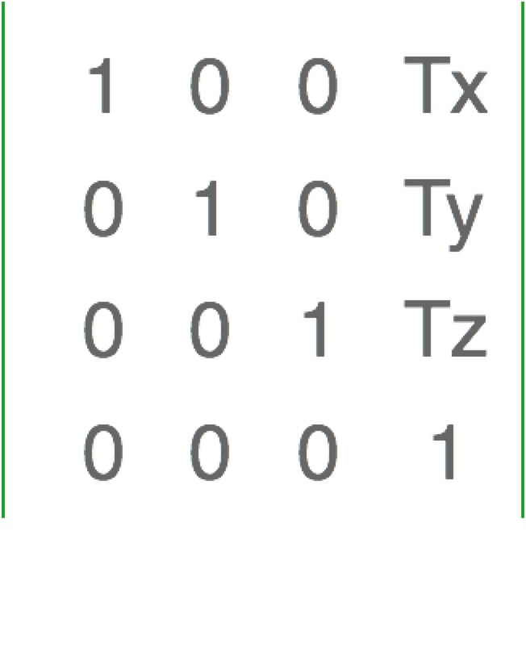
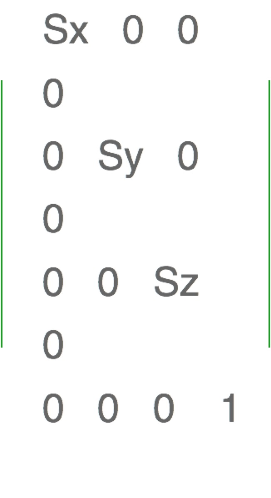
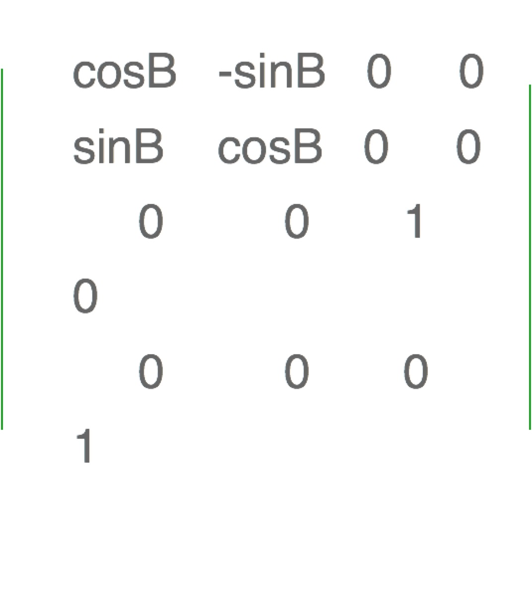
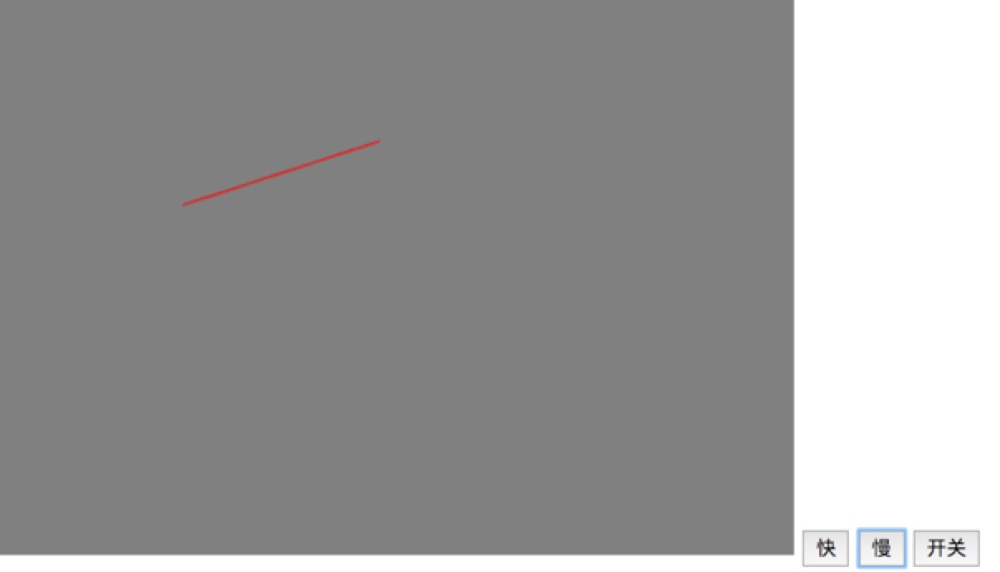
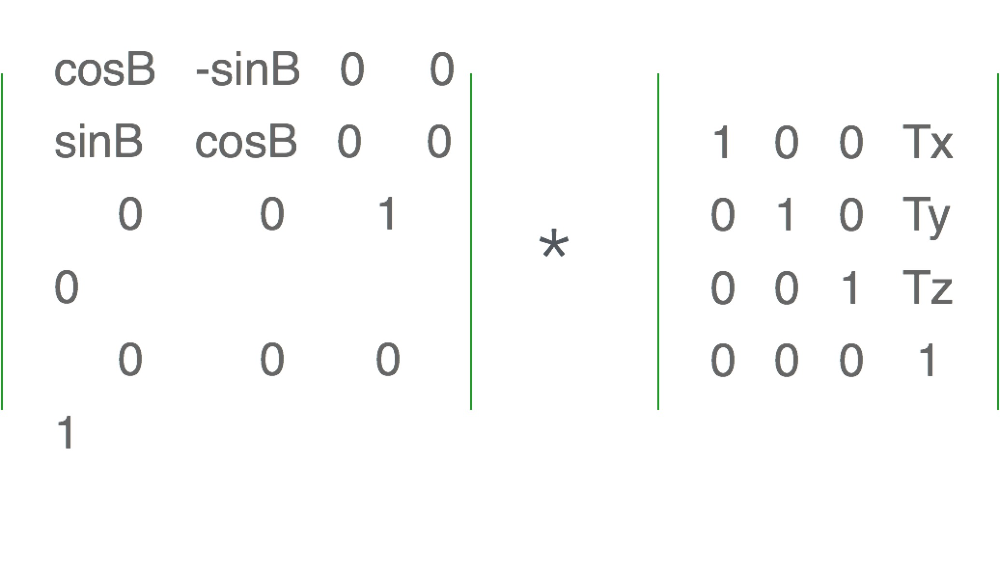

# WebGL 系列教程--图形的变换

### 图形的移动

#### 原理

- 图形的移动，实际上就是定量改变顶点的位置。
- 在顶点着色器中，顶点修改是逐个进行的，且偏移值一致。

可以使用 setTimeout 定时执行画点的方法，来逐一改变点的位置实现图形的移动。

<!-- more -->

先编写顶点着色器，需要单独定义 a，b 来分别改变点的 x 方向和 y 方向，基本代码如下：

```javascript
const vertexShaderSource = `
    attribute vec4 pos;
    uniform float a;
    uniform float b;
    void main() {
      gl_Position.x = pos.x + a;
      gl_Position.y = pos.y + b;
      gl_Position.z = .0;
      gl_PointSize = 10.0;
}`
```

片元着色器代码和之前写法基本一致，基本代码如下：

```javascript
const fragmentShaderSource = `void main() {
      gl_FragColor = vec4(1.0,0.5,0.0,1.0);
  }`
```

给顶点着色器中的变量定义响应的 location，基本代码如下：

```javascript
var posLocation = cxt.getAttribLocation(program, 'pos')
var aLocation = cxt.getUniformLocation(program, 'a')
var bLocation = cxt.getUniformLocation(program, 'b')
```

使用 setTimeOut 函数定义简单的平移效果，基本代码如下：

```javascript
run()
function run() {
  cxt.uniform1f(aLocation, a)
  cxt.uniform1f(bLocation, b)
  cxt.clearColor(0.0, 0.0, 0.0, 1.0)
  cxt.clear(cxt.COLOR_BUFFER_BIT)

  cxt.drawArrays(cxt.TRIANGLES, 0, 3)

  a += 0.05
  b += 0.05

  setTimeout(run, 500)
}
```

### 图形的缩放

#### 原理

- 基于原点，基于定义的某一个点进行缩小和放大(其实还做了平移操作)
- 在着色器中，逐顶点乘以缩放的倍数，对 x 轴和 y 轴同时进行缩放

编写顶点着色器,定义一个 cj 变量，通过 x 轴和 y 轴同时乘以 cj 这个变量，来实现逐顶点缩放，基本代码如下：

```javascript
const vertexShaderSource = `
   attribute vec4 pos;
   uniform float cj;
   void main() {
     gl_Position.x = pos.x * cj;
     gl_Position.y = pos.y * cj;
     gl_Position.z = .0;
     gl_Position.w = 1.0;
     gl_PointSize = 10.0;
}`
```

定义 cjLocation，代码如下：

```javascript
var cjLocation = cxt.getUniformLocation(program, 'cj')
```

定义基本渲染函数 render，再单独定义放大缩小函数，基本代码如下：

```javascript
var cj = 1.0
render()
function render() {
  cxt.clearColor(0.0, 0.0, 0.0, 1.0)
  cxt.clear(cxt.COLOR_BUFFER_BIT)
  cxt.uniform1f(cjLocation, cj)
  cxt.drawArrays(cxt.TRIANGLES, 0, 3)
}
function fangda() {
  cj += 0.05
  render()
}

function suoxiao() {
  cj -= 0.05
  render()
}
```

#### 利用 w 快速缩放

修改着色器代码，将 vec4 改成 vec2，基本意思就是 pos 存在 x 和 y 两个点，基本修改后如下：

```javascript
const vertexShaderSource = `
   attribute vec2 pos;
   uniform float w;
   void main() {
     gl_Position = vec4(pos,0.0,w);
}`
```

该方法实现效果刚好和 vec4 的时候相反，基本原因是 vec4(x/w,y/w,z/w,w),所以 w 越大，其实 x 和 y 轴会越小，所以最终放大效果和之前是相反的。

### 图形的旋转

#### 原理

- 基于原点，以一定的角度旋转
- 在顶点着色器中，更改 gl.Position.x 和 gl.Position.y 的值

#### 旋转方程

- x = r.cos(a)
- y = r.sin(a)
- x1 = r.cos(a+b)
- y1 = r.sin(a+b)
- x1 = x.cos(b) - y.sin(b)
- y1 = x.sin(b) + y.cos(b)
- z1 = z = 0.0

顶点着色器代码基本写法如下：

```javascript
const vertexShaderSource = `
   attribute vec4 pos;
   uniform float cosB;
   uniform float sinB;
   void main() {
     gl_Position.x = pos.x * cosB - pos.y * sinB;
     gl_Position.y = pos.x * sinB + pos.y * cosB;
     gl_Position.z = .0;
     gl_Position.w = 1.0;
}`
```

实现简单动画基本如下：

```javascript
var angle = 10.0
function render() {
  var t = (Math.PI * angle) / 180
  var cosB = Math.sin(t)
  var sinB = Math.cos(t)
  cxt.clearColor(0.0, 0.0, 0.0, 1.0)
  cxt.clear(cxt.COLOR_BUFFER_BIT)
  cxt.uniform1f(cosBLocation, cosB)
  cxt.uniform1f(sinBLocation, sinB)
  cxt.drawArrays(cxt.TRIANGLES, 0, 3)
}

setInterval(() => {
  angle += 1.0
  render()
}, 1000)
```

### 矩阵变换实现图形的移动

#### 原理

- 图形的移动，实际上就是定量改变顶点的位置。
- 在顶点着色器中，顶点修改是逐个进行的，且偏移值一致。

只要改变 Tx,Ty,就能分别改变图形的 x 方向和 y 方向



在顶点着色器中定义一个 xf 举证变量，基本代码如下：

```javascript
const vertexShaderSource = `
   attribute vec4 pos;
   uniform mat4 xf;
   void main() {
     gl_Position = xf * pos;
}`
```

定义一个矩阵代码：

```javascript
var xf = new Float32Array([
  1.0,
  0.0,
  0.0,
  0.0,
  0.0,
  1.0,
  0.0,
  0.0,
  0.0,
  0.0,
  1.0,
  0.0,
  Tx,
  Ty,
  0.0,
  1.0
])
```

只需要通过改变 Tx，Ty 就能实现改变图形的移动，并不需要改变着色器代码，这样效率会很高，render 函数基本如下：

```javascript
var Tx = 1.0,
  Ty = 0.0

function render() {
  var xf = new Float32Array([
    1.0,
    0.0,
    0.0,
    0.0,
    0.0,
    1.0,
    0.0,
    0.0,
    0.0,
    0.0,
    1.0,
    0.0,
    Tx,
    Ty,
    0.0,
    1.0
  ])

  cxt.clearColor(0.0, 0.0, 0.0, 1.0)
  cxt.clear(cxt.COLOR_BUFFER_BIT)
  cxt.uniformMatrix4fv(xfLocation, false, xf)
  cxt.drawArrays(cxt.TRIANGLES, 0, 3)
}
render()
```

### 矩阵变换实现图形的缩放

#### 原理

- 基于原点。
- 在着色器中，逐顶点乘以缩放倍数

Sx,Sy 改变就会使得图形成比例的缩放


主要是矩阵函数不一样，其他基本一样，代码基本如下：

```javascript
var sx = 1.0,
  sy = 1.0

function render() {
  var xf = new Float32Array([
    sx,
    0.0,
    0.0,
    0.0,
    0.0,
    sy,
    0.0,
    0.0,
    0.0,
    0.0,
    1.0,
    0.0,
    0.0,
    0.0,
    0.0,
    1.0
  ])

  cxt.clearColor(0.0, 0.0, 0.0, 1.0)
  cxt.clear(cxt.COLOR_BUFFER_BIT)
  cxt.uniformMatrix4fv(xfLocation, false, xf)
  cxt.drawArrays(cxt.TRIANGLES, 0, 3)
}

render()
```

### 矩阵变换实现图形的旋转

#### 原理

- 基于原点，以一定的角度旋转。
- 在顶点着色器中，更改 gl_Position.x 和 gl_Position.y 值。



实现一个时钟指针的旋转，并且控制其速度和开关。

定义一个顶点着色器和片元着色器，基本代码如下：

```javascript
// 顶点着色器程序
const vertexShaderSource = `
    attribute vec4 pos;
    uniform mat4 xf;
    void main() {
      gl_Position = xf * pos;
}`

// 片元着色器程序
const fragmentShaderSource = `void main() {
      gl_FragColor = vec4(1.0,.0,.0,1.0);
  }`
```

最终 render 函数基本如下：

```javascript
var time

function render() {
  angle += zl

  t = (Math.PI * angle) / 180
  sinB = Math.sin(t)
  cosB = Math.cos(t)
  var xf = new Float32Array([
    cosB,
    sinB,
    0.0,
    0.0,
    -sinB,
    cosB,
    0.0,
    0.0,
    0.0,
    0.0,
    1.0,
    0.0,
    0.0,
    0.0,
    0.0,
    1.0
  ])
  cxt.uniformMatrix4fv(xfLocation, false, xf)

  cxt.clearColor(0.5, 0.5, 0.5, 1.0)
  cxt.clear(cxt.COLOR_BUFFER_BIT)

  cxt.drawArrays(cxt.LINES, 0, 2)
  time = setTimeout(render, 500)

  if (!isOpen) {
    clearTimeout(time)
  }
}

render()
```

最终效果如下图：


### WebGL 动画原理

#### 原理

- 通过 setTimeout 定时渲染
- 每次渲染都用背景色刷屏
- 每次渲染都修改变换参数
- 变换矩阵 A _ 变换矩阵 B _ 原始顶点坐标矢量 ＝ 最终顶点坐标矢量

#### 基本步骤

- 编写着色器代码
- 编写基础代码
- 编写平移和缩放代码
- 开发平移且缩放小动画

编写着色器代码，示例如下：

```javascript
// 顶点着色器程序
const vertexShaderSource = `
    attribute vec4 pos;
    uniform mat4 xz;
    uniform mat4 py;
    void main() {
      gl_Position = pos * xz * py;
}`

// 片元着色器程序
const fragmentShaderSource = `void main() {
      gl_FragColor = vec4(1.0,.0,.0,1.0);
  }`
```

编写基础代码，上下文确定，buffer 编写以及 buffer 数据加载等等，基本代码如下：

```javascript
var cxt = document.getElementById('example08').getContext('webgl')

var buffer = cxt.createBuffer()
cxt.bindBuffer(cxt.ARRAY_BUFFER, buffer)
var data = new Float32Array([0.0, 0.2, -0.2, -0.2, 0.2, -0.2])

cxt.bufferData(cxt.ARRAY_BUFFER, data, cxt.STATIC_DRAW)

var program = initShader(cxt, vertexShaderSource, fragmentShaderSource)

var posLocation = cxt.getAttribLocation(program, 'pos')
var xzLocation = cxt.getUniformLocation(program, 'xz')
var pyLocation = cxt.getUniformLocation(program, 'py')

cxt.vertexAttribPointer(posLocation, 2, cxt.FLOAT, false, 0, 0)
cxt.enableVertexAttribArray(posLocation)
```

定义平移矩阵和缩放矩阵代码：

```javascript
var xz = new Float32Array([
  cosB,
  sinB,
  0.0,
  0.0,
  -sinB,
  cosB,
  0.0,
  0.0,
  0.0,
  0.0,
  1.0,
  0.0,
  0.0,
  0.0,
  0.0,
  1.0
])
var py = new Float32Array([
  1.0,
  0.0,
  0.0,
  0.0,
  0.0,
  1.0,
  0.0,
  0.0,
  0.0,
  0.0,
  1.0,
  0.0,
  tx,
  ty,
  0.0,
  1.0
])

cxt.uniformMatrix4fv(xzLocation, false, xz)
cxt.uniformMatrix4fv(pyLocation, false, py)
```

最终加入 setTimeOut 函数的 run 方法代码如下：

```javascript
function run() {
  var t = (Math.PI * ANGLE) / 180
  sinB = Math.sin(t)
  cosB = Math.cos(t)

  var xz = new Float32Array([
    cosB,
    sinB,
    0.0,
    0.0,
    -sinB,
    cosB,
    0.0,
    0.0,
    0.0,
    0.0,
    1.0,
    0.0,
    0.0,
    0.0,
    0.0,
    1.0
  ])

  tx += 0.005
  ty += 0.005

  ANGLE += 1

  var py = new Float32Array([
    1.0,
    0.0,
    0.0,
    0.0,
    0.0,
    1.0,
    0.0,
    0.0,
    0.0,
    0.0,
    1.0,
    0.0,
    tx,
    ty,
    0.0,
    1.0
  ])

  cxt.uniformMatrix4fv(xzLocation, false, xz)
  cxt.uniformMatrix4fv(pyLocation, false, py)
  cxt.clearColor(0.0, 0.0, 0.0, 1.0)
  cxt.clear(cxt.COLOR_BUFFER_BIT)

  cxt.drawArrays(cxt.TRIANGLES, 0, 3)

  setTimeout(run, 500)
}

run()
```

### 矩阵复合变换

- 复合变换是多种变换同时进行，通过 4 \* 4 矩阵相乘得出来的结果，可以使用上面的示例，简化着色器中定义的矩阵变量。

开发一个矩阵运算方法，基本原理如下图：



完整方法代码如下：

```javascript
function mix(a, b) {
  var result = new Float32Array(16)

  for (var i = 0; i < 4; i++) {
    result[i] =
      a[i] * b[0] + a[i + 4] * b[1] + a[i + 8] * b[2] + a[i + 12] * b[3]
    result[i + 4] =
      a[i] * b[4] + a[i + 4] * b[5] + a[i + 8] * b[6] + a[i + 12] * b[7]
    result[i + 8] =
      a[i] * b[8] + a[i + 4] * b[9] + a[i + 8] * b[10] + a[i + 12] * b[11]
    result[i + 12] =
      a[i] * b[12] + a[i + 4] * b[13] + a[i + 8] * b[14] + a[i + 12] * b[15]
  }

  return result
}
```

简化着色器代码，基本如下：

```javascript
const vertexShaderSource = `
    attribute vec4 pos;
    uniform mat4 xf;
    void main() {
      gl_Position = pos * xf;
}`

// 片元着色器程序
const fragmentShaderSource = `void main() {
      gl_FragColor = vec4(1.0,.0,.0,1.0);
  }`
```

简化 Location 和矩阵数据导入的函数方法，剩余代码和前面的动画原理示例一样，片段代码如下：

```javascript
var xfLocation = cxt.getUniformLocation(program, 'xf')
cxt.uniformMatrix4fv(xfLocation, false, mix(xz, py))
```

源码链接请访问 https://github.com/wqzwh/webgl-code/tree/master/05
