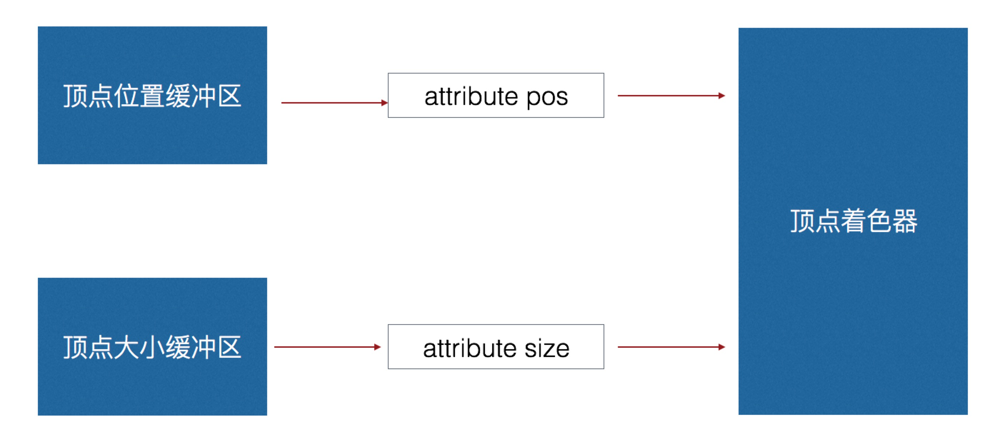
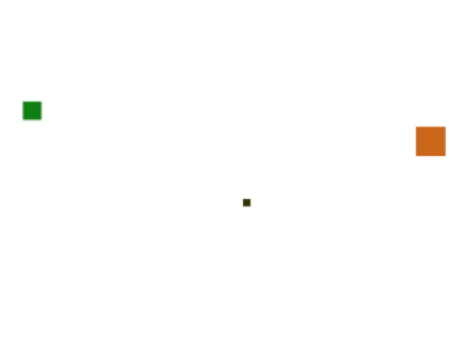
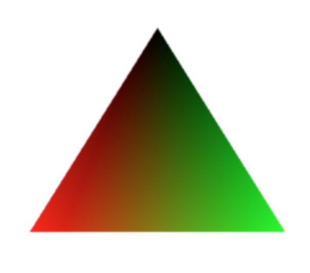
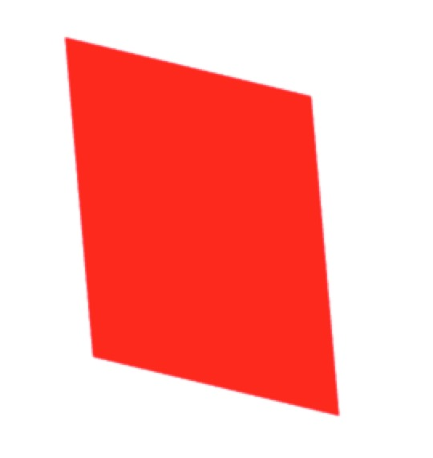
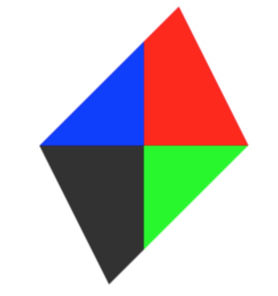

# WebGL 系列教程--着色器技术

### 数据传入顶点着色器

#### 创建多个缓冲区



例如上图显示的，创建点的坐标和创建点的大小两个缓冲区，就要在顶点着色器中创建两个 attribute 变量

在顶点着色器中定义两个 attribute 变量，分别是点和点的大小，基本代码如下：

```javascript
// 顶点着色器程序
const vertexShaderSource = `
    attribute vec4 pos;
    attribute float size;
    void main() {
      gl_Position = pos;
      gl_PointSize = size;
}`
```

<!-- more -->

创建 program 变量，代码基本如下：

```javascript
var program = initShader(cxt, vertexShaderSource, fragmentShaderSource)
```

使用 lib 库中的 bindAttribute 函数创建两个 buffer 相关代码，基本如下：

```javascript
bindAttribute(
  cxt,
  'pos',
  new Float32Array([0.0, 0.0, 0.3, 0.5, 0.2, 1.0]),
  program,
  2
)
bindAttribute(cxt, 'size', new Float32Array([10.0, 20.0, 30.0]), program, 1)
```

最后调用 drawArrays 直接画点即可，代码如下：

```javascript
cxt.drawArrays(cxt.POINTS, 0, 3)
```

### 偏移参数

- 一个缓冲区多种用途
- 通过偏移参数划分数据类别

类数组定义方式有所变化，将点的位置和点的大小定义在一个数组中，前面两位代表点的位置，最后一位代表点的大小，基本代码如下：

```javascript
var data = new Float32Array([0.0, 0.0, 10.0, 0.5, 0.5, 30.0, 0.2, -0.6, 50.0])
```

vertexAttribPointer 函数的参数形式有所变化，data.BYTES_PER_ELEMENT 代表偏移量单位，*3 代表每一组数据有三个，所以*3，\*2 代表从偏移 2 两位开始计算，基本代码如下：

```javascript
cxt.vertexAttribPointer(
  posLocation,
  2,
  cxt.FLOAT,
  false,
  data.BYTES_PER_ELEMENT * 3,
  0
)
cxt.vertexAttribPointer(
  sizeLocation,
  1,
  cxt.FLOAT,
  false,
  data.BYTES_PER_ELEMENT * 3,
  data.BYTES_PER_ELEMENT * 2
)
```

### 顶点着色器和片元着色器通信

- 通过 uniform 实现顶点和片元着色器共用数据，uniform 是不可变的值
- 通过 varying 传递数据

着色器代码如下：

```javascript
// 顶点着色器程序
const vertexShaderSource = `
    attribute vec4 pos;
    varying vec4 color;
    void main() {
      gl_Position = pos;
      gl_PointSize = abs(pos.x) * 30.0;
      color = pos;
}`

// 片元着色器程序
const fragmentShaderSource = `
		precision lowp float;
		varying vec4 color;
        void main() {
      gl_FragColor = color;
  }`
```

最终效果是根据坐标的大小和坐标的位置，显示不同的颜色，基本效果如下：


编写一个渐变三角形的示例效果，使用一个 buffer 数据，分别定义坐标点和点的颜色值，着色器代码如下：

```javascript
// 顶点着色器程序
const vertexShaderSource = `
    attribute vec4 pos;
    attribute vec4 vcolor;
    varying vec4 color;
    void main() {
      gl_Position = pos;
      color = vcolor;
}`

// 片元着色器程序
const fragmentShaderSource = `
		precision lowp float;
		varying vec4 color;
        void main() {
      gl_FragColor = color;
  }`
```

buffer 数据 data 代码如下：

```javascript
var data = new Float32Array([
  0.0,
  0.3,
  1.0,
  0.0,
  0.0,
  -0.5,
  -0.5,
  0.0,
  1.0,
  0.0,
  0.5,
  -0.5,
  0.0,
  0.0,
  1.0
])
```

最终效果效果如下：


制作一个旋转四边形，并且四边形四个坐标系分别是不同的颜色，首先初步定义着色器代码，基本代码如下：

```javascript
// 顶点着色器程序
const vertexShaderSource = `
        uniform mat4 xf;
    attribute vec4 pos;
    varying vec4 vpos;
    void main() {
      gl_Position =  xf * pos;
      vpos = gl_Position;
}`

// 片元着色器程序
const fragmentShaderSource = `
		precision lowp float;
        varying vec4 vpos;
        void main() {
      gl_FragColor = vec4(1.0,0.0,0.0,1.0);
  }`
```

获取上下文和 program 示例代码，利用 lib 库中的 initShader 函数，基本如下：

```javascript
var cxt = document.getElementById('example06').getContext('webgl')

var program = initShader(cxt, vertexShaderSource, fragmentShaderSource)
```

定义一个四边形相关的 buffer 数据内容，基本代码如下：

```javascript
var data = new Float32Array([-0.3, 0.3, -0.5, -0.3, 0.5, 0.3, 0.3, -0.3])

bindAttribute(cxt, 'pos', data, program)
```

定义着色器中定义的 xf 变量相关代码，并且创建旋转矩阵，定义旋转角度等，基本如下：

```javascript
var xfLocation = cxt.getUniformLocation(program, 'xf')
var angle = 0
run()
function run() {
  angle++
  var xzm = createXZMatrix(angle)
  cxt.uniformMatrix4fv(xfLocation, false, xzm)
  cxt.drawArrays(cxt.TRIANGLE_STRIP, 0, 4)
  setTimeout(run, 100)
}
```

此时的效果是四边形可以旋转，但是颜色还是之前定义的红色，基本效果如下：



通过修改片元着色器中的代码实现不同象限中显示不同颜色，基本代码如下：

```javascript
// 片元着色器程序
const fragmentShaderSource = `
		precision lowp float;
        varying vec4 vpos;
        void main() {
      if(vpos.x >= 0.0 && vpos.y >= 0.0){
                   gl_FragColor = vec4(1.0,0.0,0.0,1.0);
               }else if(vpos.x >0.0 && vpos.y < 0.0){
                   gl_FragColor = vec4(0.0,1.0,0.0,1.0);
               }else if(vpos.x < 0.0 && vpos.y > 0.0){
                   gl_FragColor = vec4(0.0,0.0,1.0,1.0);
               }else{
                   gl_FragColor = vec4(0.2,0.2,0.2,1.0);
            }
  }`
```

修改完之后，最终效果如下：


源码链接请访问 https://github.com/wqzwh/webgl-code/tree/master/06
