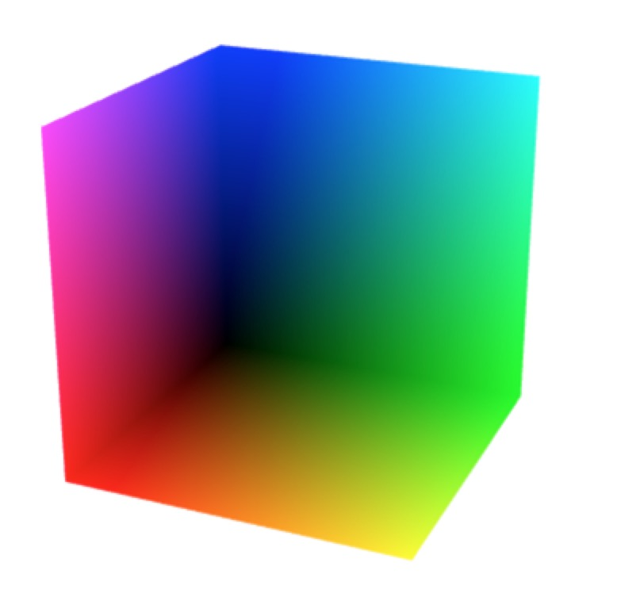
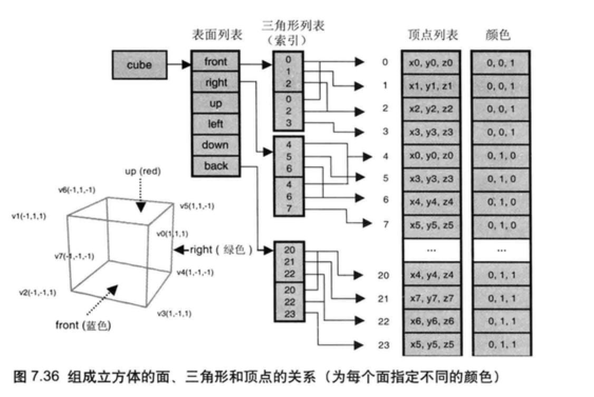
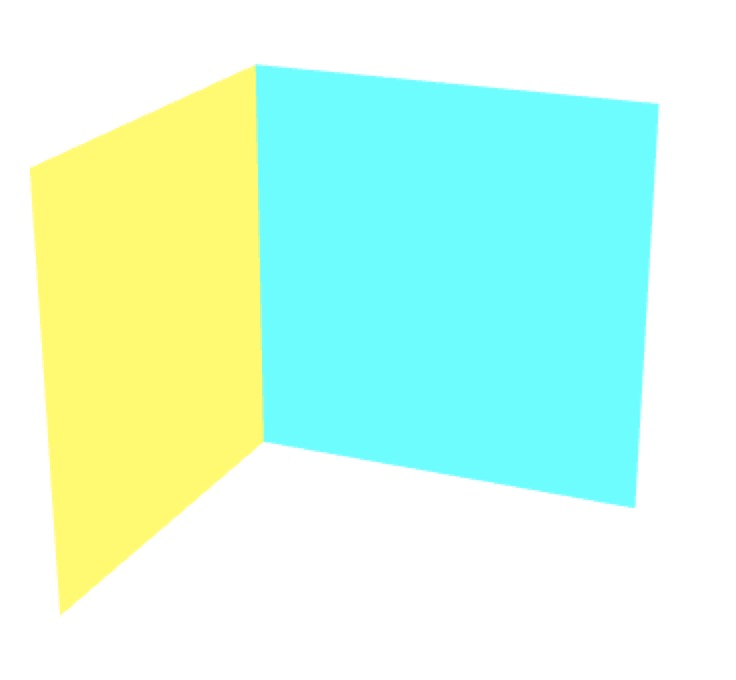
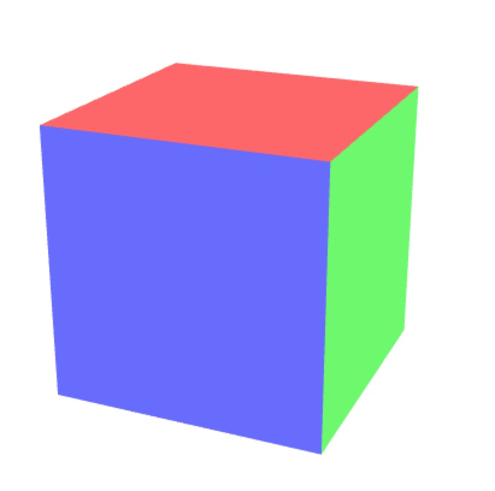

# WebGL 系列教程--绘制立方体

### 顶点索引绘制立方体

- 正方体只有 8 个顶点。
- 压缩 36 个顶点到 8 个顶点。
- 顶点索引是减少顶点的解决之道。
- 使用 new Uint8Array( … ) 创建顶点索引数据。

运用到的绘制方法

- gl.drawElements(mode , count , type , offset)
- mode 绘制方式。
- count 绘制顶点的数量。
- type 索引数据类型。
- offset 指定索引数组中开始绘制的位置，以字节为单位。

<!-- more -->

核心代码如下：

定义 8 个顶点的数据，并且将数据添加到 buffer 对象上：

```javascript
var buffer_data = new Float32Array([
  // 设置顶点和颜色（偷的顶点代码位置）
  1.0,
  1.0,
  1.0,
  1.0,
  1.0,
  1.0, // v0 White
  -1.0,
  1.0,
  1.0,
  1.0,
  0.0,
  1.0, // v1 Magenta
  -1.0,
  -1.0,
  1.0,
  1.0,
  0.0,
  0.0, // v2 Red
  1.0,
  -1.0,
  1.0,
  1.0,
  1.0,
  0.0, // v3 Yellow
  1.0,
  -1.0,
  -1.0,
  0.0,
  1.0,
  0.0, // v4 Green
  1.0,
  1.0,
  -1.0,
  0.0,
  1.0,
  1.0, // v5 Cyan
  -1.0,
  1.0,
  -1.0,
  0.0,
  0.0,
  1.0, // v6 Blue
  -1.0,
  -1.0,
  -1.0,
  0.0,
  0.0,
  0.0 // v7 Black
])

var buffer = gl.createBuffer()
gl.bindBuffer(gl.ARRAY_BUFFER, buffer)

gl.bufferData(gl.ARRAY_BUFFER, buffer_data, gl.STATIC_DRAW)
```

同理，简历存放索引的 buffer 数据，并且将其添加到 buffer 对象上：

```javascript
var indices = new Uint8Array([
  0,
  1,
  2,
  0,
  2,
  3, // 前
  0,
  3,
  4,
  0,
  4,
  5, // 右
  0,
  5,
  6,
  0,
  6,
  1, // 上
  1,
  6,
  7,
  1,
  7,
  2, // 左
  7,
  4,
  3,
  7,
  3,
  2, // 下
  4,
  7,
  6,
  4,
  6,
  5 // 后
])
var indexBuffer = gl.createBuffer()

gl.bindBuffer(gl.ELEMENT_ARRAY_BUFFER, indexBuffer)
gl.bufferData(gl.ELEMENT_ARRAY_BUFFER, indices, gl.STATIC_DRAW)
```

建立透视投影矩阵和视图矩阵：

```javascript
// 透视投影矩阵
var tsMX = getTS(30, 1, 1, 100)

// 视图矩阵
var vMX = getVMatrix(3, 3, 7, 0, 0, 0)

var mx = multiplyMatrix(tsMX, vMX)

gl.uniformMatrix4fv(mxLocation, false, mx)
```

使用 gl.drawElements 方法来绘制立方体：

```javascript
gl.drawElements(gl.TRIANGLES, indices.length, gl.UNSIGNED_BYTE, 0)
```

最终效果如下：



### 添加颜色

- 顶点着色器进行的是逐顶点运算。
- 创建多个具有相同顶点坐标的原点。
- 为立方体每个面设置不同颜色。

立方体如下图：

```javascript
// Create a cube
//    v6----- v5
//   /|      /|
//  v1------v0|
//  | |     | |
//  | |v7---|-|v4
//  |/      |/
//  v2------v3
```

基本实现原理如下图：



定义顶点的数据有所更改：

```javascript
var buffer_data = new Float32Array([
  1.0,
  1.0,
  1.0,
  -1.0,
  1.0,
  1.0,
  -1.0,
  -1.0,
  1.0,
  1.0,
  -1.0,
  1.0, // v0-v1-v2-v3 front
  1.0,
  1.0,
  1.0,
  1.0,
  -1.0,
  1.0,
  1.0,
  -1.0,
  -1.0,
  1.0,
  1.0,
  -1.0, // v0-v3-v4-v5 right
  1.0,
  1.0,
  1.0,
  1.0,
  1.0,
  -1.0,
  -1.0,
  1.0,
  -1.0,
  -1.0,
  1.0,
  1.0, // v0-v5-v6-v1 up
  -1.0,
  1.0,
  1.0,
  -1.0,
  1.0,
  -1.0,
  -1.0,
  -1.0,
  -1.0,
  -1.0,
  -1.0,
  1.0, // v1-v6-v7-v2 left
  -1.0,
  -1.0,
  -1.0,
  1.0,
  -1.0,
  -1.0,
  1.0,
  -1.0,
  1.0,
  -1.0,
  -1.0,
  1.0, // v7-v4-v3-v2 down
  1.0,
  -1.0,
  -1.0,
  -1.0,
  -1.0,
  -1.0,
  -1.0,
  1.0,
  -1.0,
  1.0,
  1.0,
  -1.0 // v4-v7-v6-v5 back
])
```

单独定义颜色数据：

```javascript
var color_data = new Float32Array([
  0.4,
  0.4,
  1.0,
  0.4,
  0.4,
  1.0,
  0.4,
  0.4,
  1.0,
  0.4,
  0.4,
  1.0, // v0-v1-v2-v3 front(blue)
  0.4,
  1.0,
  0.4,
  0.4,
  1.0,
  0.4,
  0.4,
  1.0,
  0.4,
  0.4,
  1.0,
  0.4, // v0-v3-v4-v5 right(green)
  1.0,
  0.4,
  0.4,
  1.0,
  0.4,
  0.4,
  1.0,
  0.4,
  0.4,
  1.0,
  0.4,
  0.4, // v0-v5-v6-v1 up(red)
  1.0,
  1.0,
  0.4,
  1.0,
  1.0,
  0.4,
  1.0,
  1.0,
  0.4,
  1.0,
  1.0,
  0.4, // v1-v6-v7-v2 left
  1.0,
  1.0,
  1.0,
  1.0,
  1.0,
  1.0,
  1.0,
  1.0,
  1.0,
  1.0,
  1.0,
  1.0, // v7-v4-v3-v2 down
  0.4,
  1.0,
  1.0,
  0.4,
  1.0,
  1.0,
  0.4,
  1.0,
  1.0,
  0.4,
  1.0,
  1.0 // v4-v7-v6-v5 back
])
```

在绘制前需要开启深度测试代码：

```javascript
// 开启深度测试
gl.enable(gl.DEPTH_TEST)
```

如果不开启则效果如下图：



开启后效果如下图：



源码链接请访问 https://github.com/wqzwh/webgl-code/tree/master/12
