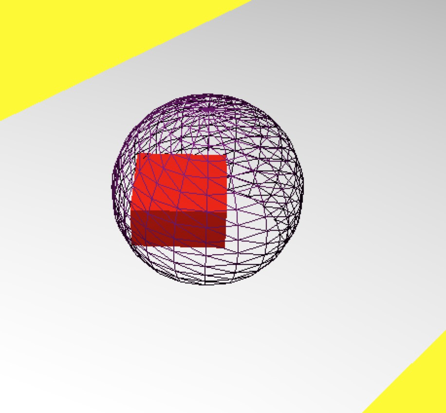
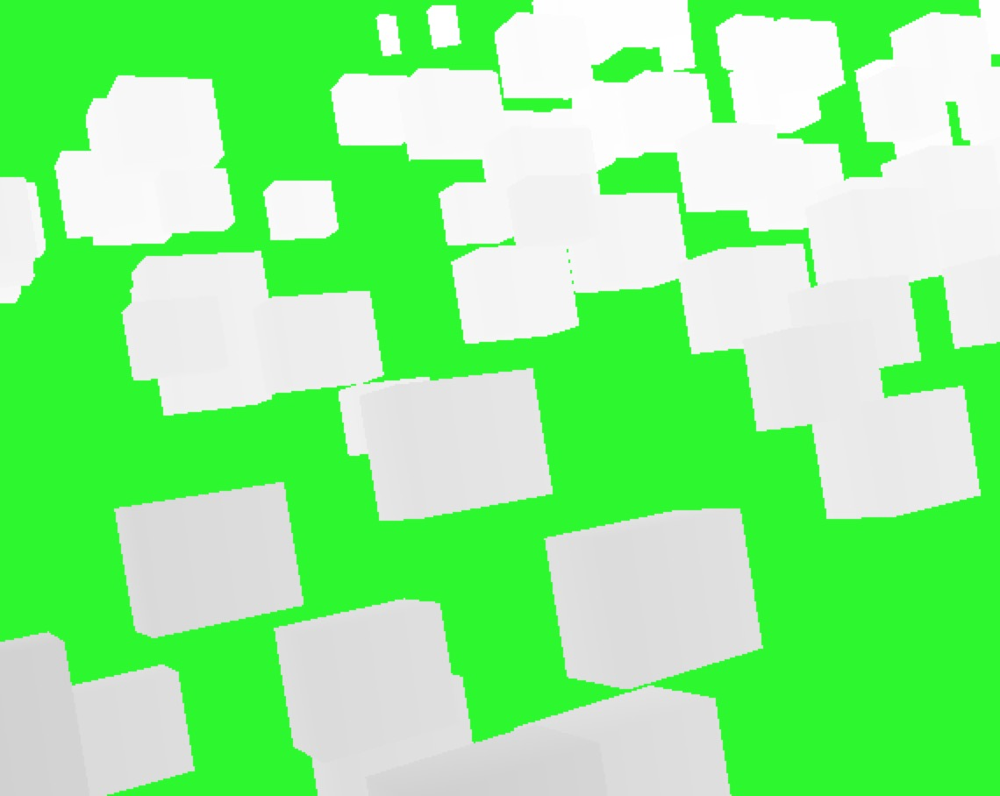
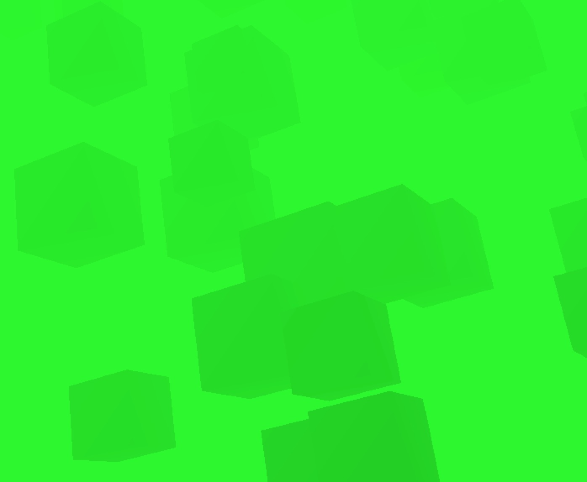
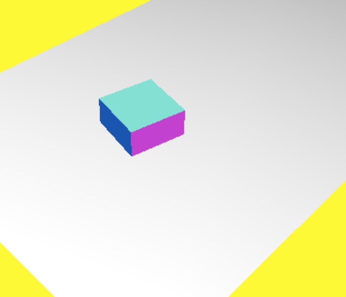

# Three.js 系列教程--材质

### 分类

- 基础材质，赋予几何体简单的颜色或者几何体的线框，也就是结构
- 深度材质，根据网格到相机的距离来决定如何绘制
- 法向材质，根据物体表面向量的计算来得到物体的颜色，并且对表面进行渲染
- 网格面材质，是一个容器，并且在容器里面为物体的各个表面制定不同的色彩
- 朗伯材质，考虑到光照的影响，适合创造光亮暗淡的物体
- Phong 式材质，创造光亮的物体，比如说钻石等
- 着色器材质

#### 共有属性

- id 用来识别材质的标识符。
- name 可以通过这个属性赋予材质名称。
- opacity 物体的透明度。
- transparent 是否透明。
- overdraw 过度描绘。
- visible 是否可见。
- needsUpdate 是否刷新。
- 融合属性
- 深度测试

<!-- more -->

### 简单材质

- 不受光照影响。
- 使用这种材质的网格会被渲染成一些简单的多变形。
- 可以显示出几何体的线框。

#### 常用属性

- color 材质的颜色
- wireframe 设置为 true ，可以显示出线框。
- fog 指定当前材质是否会受全局雾化效果的影响。

完整示例代码如下：

```javascript
var shareObj = share()

var cubeGeometry = new THREE.BoxGeometry(5, 5, 5)
var cubeMaterial = new THREE.MeshLambertMaterial({ color: 0xff0000 })
var cube = new THREE.Mesh(cubeGeometry, cubeMaterial)
cube.castShadow = true

var sphereGeometry = new THREE.SphereGeometry(5, 20, 20)
var sphereMaterial = new THREE.MeshLambertMaterial({
  color: 0x770077,
  wireframe: true
})
var sphere = new THREE.Mesh(sphereGeometry, sphereMaterial)

sphere.position.set(0, 3, 2)

cube.position = sphere.position

sphere.castShadow = true

shareObj.scene.add(sphere)
shareObj.scene.add(cube)

shareObj.camera.position.set(-25, 30, 25)

shareObj.camera.lookAt(shareObj.scene.position)

var ambiLight = new THREE.AmbientLight('#1c1c1c')
shareObj.scene.add(ambiLight)

var spotLight = new THREE.SpotLight(0xffffff)
spotLight.position.set(-40, 60, 10)
spotLight.castShadow = true

shareObj.scene.add(spotLight)

document.body.appendChild(shareObj.renderer.domElement)

render()

function render() {
  shareObj.renderer.render(shareObj.scene, shareObj.camera)
  cube.rotation.y += 0.01
  sphere.rotation.y += 0.01
  requestAnimationFrame(render)
}
```

最终效果如下图：



### 深度材质

- 外观不由光照和材质决定。
- 外观由物体到相机的距离决定。
- 可以与其他材质组合使用。

#### 基本属性

- wireframe 是否显示线框。
- writeframeLinewidth 线框线的宽度。

完整示例代码如下：

```javascript
var scene = new THREE.Scene()
scene.overrideMaterial = new THREE.MeshDepthMaterial()

var camera = new THREE.PerspectiveCamera(
  50,
  window.innerWidth / window.innerHeight,
  10,
  130
)

var renderer = new THREE.WebGLRenderer()
renderer.setClearColor(new THREE.Color(0x000000, 1.0))
renderer.setSize(window.innerWidth, window.innerHeight)

camera.position.set(-50, 40, 50)
camera.lookAt(scene.position)

// 创建立方体的方法
function addCube() {
  var cubeSize = Math.ceil(3 + Math.random() * 3)
  var cubeGeometry = new THREE.BoxGeometry(cubeSize, cubeSize, cubeSize)
  var cubeMaterial = new THREE.MeshLambertMaterial({
    color: Math.random() * 0xffffff
  })
  var cube = new THREE.Mesh(cubeGeometry, cubeMaterial)
  cube.castShadow = true
  cube.position.set(
    -60 + Math.round(Math.random() * 100),
    Math.round(Math.random() * 10),
    -100 + Math.round(Math.random() * 150)
  )
  scene.add(cube)
}

for (var i = 0; i < 100; i++) {
  addCube()
}

document.body.appendChild(renderer.domElement)

render()

function render() {
  requestAnimationFrame(render)

  scene.traverse(function(e) {
    if (e instanceof THREE.Mesh) {
      e.rotation.x += 0.02
      e.rotation.y += 0.02
      e.rotation.z += 0.02
    }
  })

  renderer.render(scene, camera)
}
```

最终效果如下图：



### 联合材质

- 联合多个材质，产生综合渲染效果。
- 联合材质创建方法 THREE.SceneUtils.createMultiMaterialObject

完整示例代码如下：

```javascript
var scene = new THREE.Scene()
var camera = new THREE.PerspectiveCamera(
  45,
  window.innerWidth / window.innerHeight,
  10,
  130
)

var renderer = new THREE.WebGLRenderer()
renderer.setClearColor(new THREE.Color(0x000000, 1.0))
renderer.setSize(window.innerWidth, window.innerHeight)

camera.position.set(-50, 40, 50)
camera.lookAt(scene.position)

// 创建立方体的方法
function addCube() {
  var cubeSize = Math.ceil(3 + Math.random() * 3)
  var cubeGeometry = new THREE.BoxGeometry(cubeSize, cubeSize, cubeSize)
  // 深度材质
  var cubeMaterial = new THREE.MeshDepthMaterial()
  // 基础材质
  var colorMaterial = new THREE.MeshBasicMaterial({
    color: 0x00ff00,
    transparent: true,
    blending: THREE.MultiplyBlending
  })

  var cube = new THREE.SceneUtils.createMultiMaterialObject(cubeGeometry, [
    colorMaterial,
    cubeMaterial
  ])

  cube.children[1].scale.set(0.99, 0.99, 0.99)
  cube.castShadow = true
  cube.position.set(
    -60 + Math.round(Math.random() * 100),
    Math.round(Math.random() * 10),
    -100 + Math.round(Math.random() * 150)
  )

  scene.add(cube)
}

for (var i = 0; i < 100; i++) {
  addCube()
}

document.body.appendChild(renderer.domElement)

render()

function render() {
  requestAnimationFrame(render)

  scene.traverse(function(e) {
    if (e instanceof THREE.Mesh) {
      e.rotation.x += 0.02
      e.rotation.y += 0.02
      e.rotation.z += 0.02
    }
  })

  renderer.render(scene, camera)
}
```

最终效果如下图：



### 法向材质

- MeshNormalMaterial 材质是通过法向计算颜色的。
- 法向量是与面垂直的向量。

#### 基本属性

- wireframe 该属性指定是否显示线框。
- wireframeLineWidth 指定线框线的宽度。
- shading 设置着色方法。

完整示例代码如下：

```javascript
var shareObj = share()

var cubeGeometry = new THREE.BoxGeometry(5, 5, 5)
// 定义法向材质
var cubeMaterial = new THREE.MeshNormalMaterial({ color: 0x7777ff })

var cube = new THREE.Mesh(cubeGeometry, cubeMaterial)

shareObj.scene.add(cube)

shareObj.camera.position.set(-25, 30, 25)

shareObj.camera.lookAt(shareObj.scene.position)

var ambiLight = new THREE.AmbientLight('#1c1c1c')
shareObj.scene.add(ambiLight)

var spotLight = new THREE.SpotLight(0xffffff)
spotLight.position.set(-40, 60, 10)
spotLight.castShadow = true

shareObj.scene.add(spotLight)

document.body.appendChild(shareObj.renderer.domElement)

render()

function render() {
  shareObj.renderer.render(shareObj.scene, shareObj.camera)
  cube.rotation.y += 0.01
  requestAnimationFrame(render)
}
```

最终效果如下图：



源码链接请访问 https://github.com/wqzwh/webgl-code/tree/master/15
