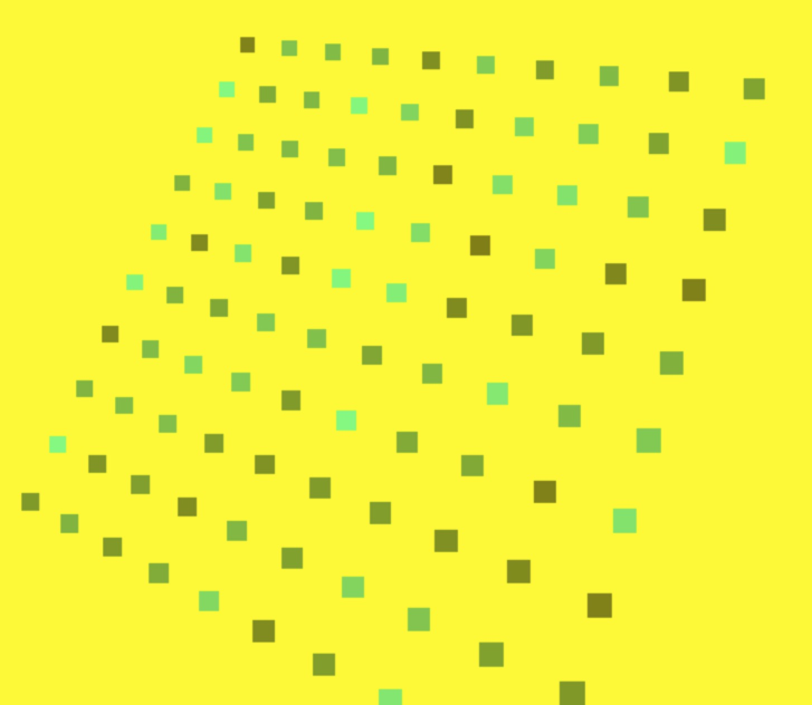
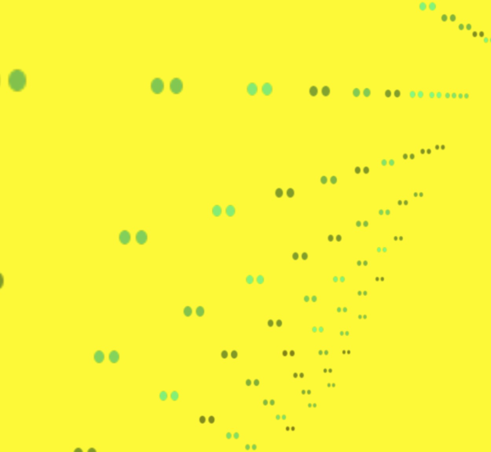
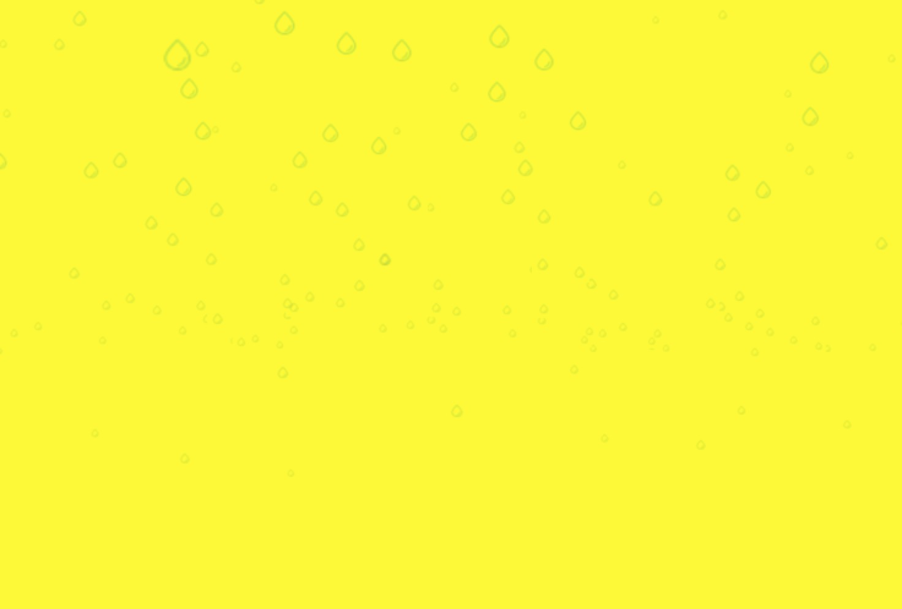
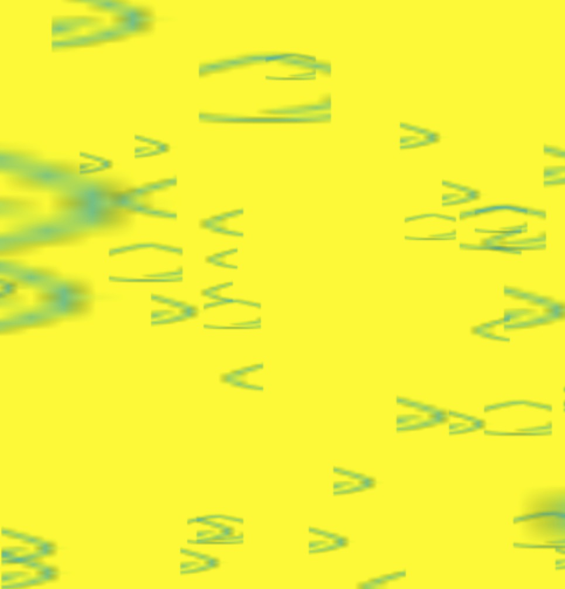

# Three.js 系列教程--粒子

### 粒子与粒子系统

#### 创建基本粒子

- 使用 THREE.Particle 构建粒子
- 使用 CanvasRenderer 渲染器
- WebGLRenderer 需要 THREE.ParticleSystem 配合

#### 常用属性

- color 粒子的颜色
- map 粒子的材质
- size 粒子的大小

<!-- more -->

完整示例代码如下：

```javascript
var shareObj = share(false)

shareObj.camera.position.set(0, 0, 115)

shareObj.camera.lookAt(shareObj.scene.position)

createSprites()
var cloud
// 创建粒子的方法
function createSprites() {
  var geom = new THREE.Geometry()
  var material = new THREE.PointsMaterial({
    size: 5,
    vertexColors: true,
    opacity: 0.5,
    transparent: true,
    sizeAttenuation: true,
    color: 0xffffff
  })
  for (var x = -5; x < 5; x++) {
    for (var y = -5; y < 5; y++) {
      var particle = new THREE.Vector3(x * 10, y * 10, 0)
      geom.vertices.push(particle)
      var color = new THREE.Color(0x00ffff)
      color.setHSL(
        color.getHSL().h,
        color.getHSL().s,
        Math.random() * color.getHSL().l
      )
      geom.colors.push(color)
    }
  }
  cloud = new THREE.Points(geom, material)
  shareObj.scene.add(cloud)
}

var spotLight = new THREE.SpotLight(0xffffff)
spotLight.position.set(-40, 60, 10)
spotLight.castShadow = true

shareObj.scene.add(spotLight)

document.body.appendChild(shareObj.renderer.domElement)

render()

function render() {
  cloud.rotation.x += 0.01
  cloud.rotation.y += 0.01
  cloud.rotation.z += 0.01
  requestAnimationFrame(render)
  shareObj.renderer.render(shareObj.scene, shareObj.camera)
}
```

最终效果如下图：



### 格式化粒子

#### ParticleCanvasMaterial 的属性

- color 粒子的颜色
- program 该函数在渲染粒子时调用
- opacity 粒子的透明度
- transparent 粒子是否透明

#### WebGLRenderer 中使用画布

- 不可使用 ParticleCanvasMaterial
- 只能使用 ParticleBasicMaterial
- 用 map 属性加载纹理，纹理可以是 canvas

#### 使用纹理格式化粒子

- ImageUtils.loadTexture 加载纹理
- 为 map 属性设置纹理
- 设置 blending 属性

采用 canvas 作为纹理的完整示例代码如下：

```javascript
var shareObj = share(false)

shareObj.camera.position.set(0, 0, 65)

shareObj.camera.lookAt(shareObj.scene.position)

// 创建纹理的方法
function getTexture() {
  var canvas = document.createElement('canvas')
  canvas.width = 32
  canvas.height = 32

  var ctx = canvas.getContext('2d')
  ctx.translate(-81, -84)
  ctx.fillStyle = 'white'
  ctx.beginPath()
  ctx.moveTo(91, 96)
  ctx.bezierCurveTo(88, 96, 87, 99, 87, 101)
  ctx.bezierCurveTo(87, 103, 88, 106, 91, 106)
  ctx.bezierCurveTo(94, 106, 95, 103, 95, 101)
  ctx.bezierCurveTo(95, 99, 94, 96, 91, 96)

  ctx.moveTo(103, 96)
  ctx.bezierCurveTo(100, 96, 99, 99, 99, 101)
  ctx.bezierCurveTo(99, 103, 100, 106, 103, 106)
  ctx.bezierCurveTo(106, 106, 107, 103, 107, 101)
  ctx.bezierCurveTo(107, 99, 106, 96, 103, 96)

  ctx.fill()

  var texture = new THREE.Texture(canvas)
  texture.needsUpdate = true
  return texture
}

createSprites()
var cloud
// 创建粒子的方法
function createSprites() {
  var geom = new THREE.Geometry()
  var material = new THREE.PointsMaterial({
    size: 5,
    vertexColors: true,
    opacity: 0.5,
    transparent: true,
    sizeAttenuation: true,
    color: 0xffffff,
    map: getTexture()
  })
  for (var x = -5; x < 5; x++) {
    for (var y = -5; y < 5; y++) {
      var particle = new THREE.Vector3(x * 10, y * 10, 0)
      geom.vertices.push(particle)
      var color = new THREE.Color(0x00ffff)
      color.setHSL(
        color.getHSL().h,
        color.getHSL().s,
        Math.random() * color.getHSL().l
      )
      geom.colors.push(color)
    }
  }
  cloud = new THREE.Points(geom, material)
  shareObj.scene.add(cloud)
}

var spotLight = new THREE.SpotLight(0xffffff)
spotLight.position.set(-40, 60, 10)
spotLight.castShadow = true

shareObj.scene.add(spotLight)

document.body.appendChild(shareObj.renderer.domElement)

render()

function render() {
  cloud.rotation.x += 0.01
  cloud.rotation.y += 0.01
  cloud.rotation.z += 0.01
  requestAnimationFrame(render)
  shareObj.renderer.render(shareObj.scene, shareObj.camera)
}
```

最终效果如下图：



采用 png 图片作为纹理的完整示例代码如下：

```javascript
var shareObj = share(false)

shareObj.camera.position.set(0, 0, 65)

shareObj.camera.lookAt(shareObj.scene.position)

createSprites()
var cloud
// 创建粒子的方法
function createSprites() {
  if (cloud) {
    shareObj.scene.remove(cloud)
  }
  var texture = new THREE.ImageUtils.loadTexture('./yudi.png')
  var geom = new THREE.Geometry()
  var material = new THREE.PointsMaterial({
    size: 10,
    transparent: true,
    opacity: 0.3,
    map: texture,
    // blending:THREE.AdditiveBlending,
    sizeAttenuation: true,
    color: 0xffffff
  })
  var range = 600
  for (var i = 0; i < 1000; i++) {
    var particle = new THREE.Vector3(
      Math.random() * range - range / 2,
      Math.random() * range - range / 2,
      Math.random() * range - range / 2
    )
    particle.velocityY = 0.1 + Math.random() / 5
    particle.velocityX = (Math.random() - 0.5) / 3
    geom.vertices.push(particle)
  }
  cloud = new THREE.Points(geom, material)
  cloud.sortParticles = true
  shareObj.scene.add(cloud)
}

var spotLight = new THREE.SpotLight(0xffffff)
spotLight.position.set(-40, 60, 10)
spotLight.castShadow = true

shareObj.scene.add(spotLight)

document.body.appendChild(shareObj.renderer.domElement)

render()
var startTime = Date.now()

function render() {
  if (Date.now() - startTime > 80) {
    createSprites()
    startTime = Date.now()
  }

  requestAnimationFrame(render)
  // 得到顶点
  var vertices = cloud.geometry.vertices
  vertices.forEach(function(v) {
    v.y = v.y - v.velocityY
    v.x = v.x - v.velocityX
    if (v.y <= 0) v.y = 60
    if (v.x <= -20 || v.x >= 20) v.velocityX = v.velocityX - 1
  })
  shareObj.renderer.render(shareObj.scene, shareObj.camera)
}
```

最终效果如下图：



### 精灵

#### 使用 THREE.Sprit 类的目的

- 创建基于屏幕坐标移动、缩放和定位的对象，可以用它来创建一个平视显示器，就好像三维场景上蒙上一层薄膜，简称 HUD。
- 创建类似粒子的，在三维空间移动的物体。

#### 常用属性

- color 粒子颜色
- map 精灵所用的纹理
- blending 渲染精灵时所用的融合模式
- useScreenCoordinates 精灵的位置是否绝对定位

完整示例代码如下：

```javascript
var shareObj = share(false)

shareObj.camera.position.set(0, 0, 65)

shareObj.camera.lookAt(shareObj.scene.position)

createSprites()
var group
// 创建粒子的方法
function createSprites() {
  group = new THREE.Object3D()
  var range = 200
  for (var i = 0; i < 500; i++) {
    group.add(createSprite(10, false, 0.6, 0xffffff, i % 5, range))
  }
  shareObj.scene.add(group)
}

function getTexture() {
  return new THREE.ImageUtils.loadTexture('./yudi.png')
}

function createSprite(size, transparent, opacity, color, spriteNumber, range) {
  var spriteMaterial = new THREE.SpriteMaterial({
    opacity: opacity,
    color: color,
    transparent: transparent,
    map: getTexture()
  })

  spriteMaterial.map.offset = new THREE.Vector2(0.2 * spriteNumber, 0)
  spriteMaterial.map.repeat = new THREE.Vector2(1 / 5, 1)
  spriteMaterial.depthTest = false
  // spriteMaterial.blending = THREE.AdditiveBlending;
  // 创建精灵类
  var sprite = new THREE.Sprite(spriteMaterial)
  // 对精灵进行裁剪
  sprite.scale.set(size, size, size)
  sprite.position.set(
    Math.random() * range - range / 2,
    Math.random() * range - range / 2,
    Math.random() * range - range / 2
  )
  sprite.velocityX = 5
  return sprite
}

var spotLight = new THREE.SpotLight(0xffffff)
spotLight.position.set(-40, 60, 10)
spotLight.castShadow = true

shareObj.scene.add(spotLight)

document.body.appendChild(shareObj.renderer.domElement)

render()

function render() {
  group.rotation.x += 0.01

  requestAnimationFrame(render)

  shareObj.renderer.render(shareObj.scene, shareObj.camera)
}
```

最终效果如下图：



源码链接请访问 https://github.com/wqzwh/webgl-code/tree/master/17
