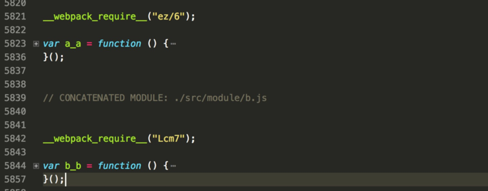
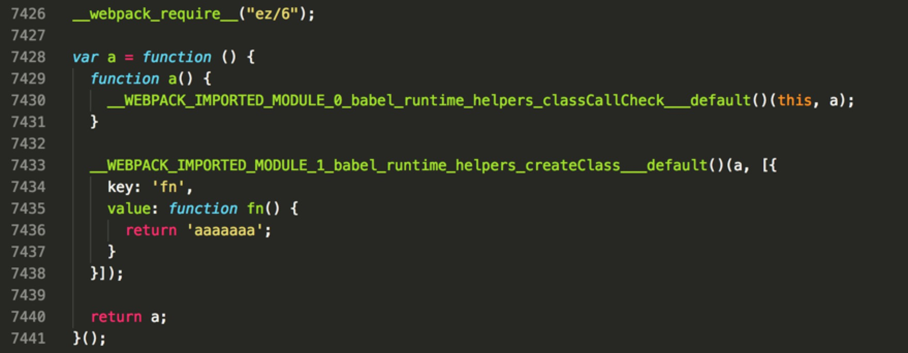
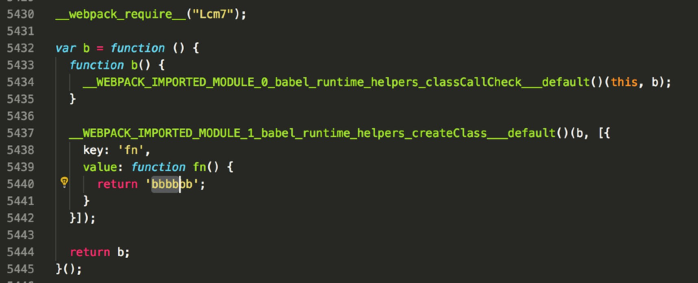
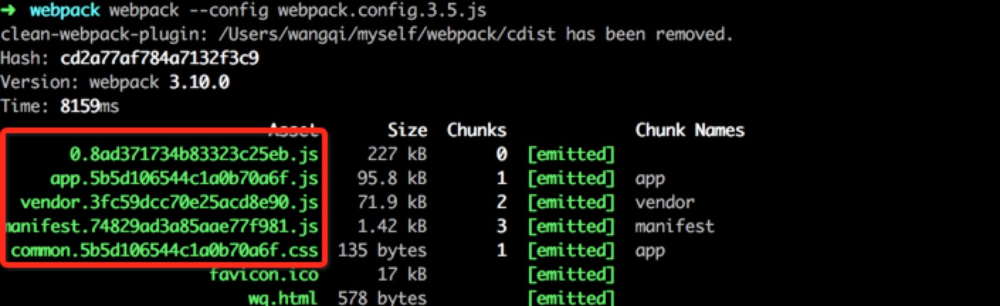
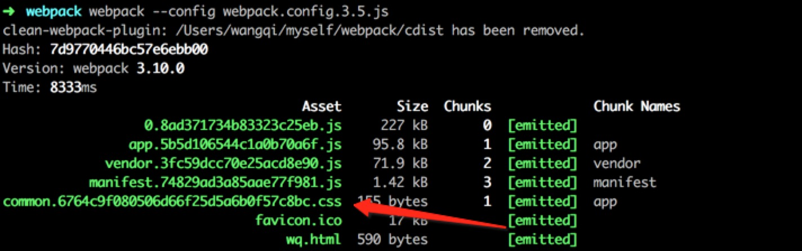
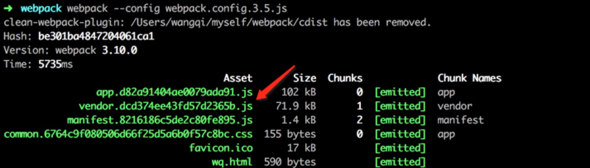
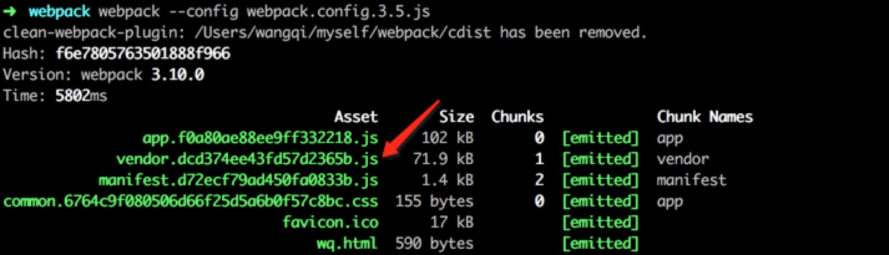

# webpack 优化入门详解

> 以下测试中，均在 webpack 版本 3.5 以上，如有不对的地方请指出，谢谢。

### 新特性优化

Scope Hoisting-作用域提升,将模块都放到一个闭包函数中，通过减少闭包函数数量从而加快 JS 的执行速度。
基本配置如下：

```javascript
plugins: [new webpack.optimize.ModuleConcatenationPlugin()]
```

配置后，自定义的两个模块函数被放在一个必包函数体中，打包结果如下：



<!-- more -->

配置前，自定义的两个模块函数分别在不同的必包函数体中，通过行数就能看出来，打包结果如下：




### 配置项优化

#### externals 配置优化

设置 externals 配置项分离不需要打包的库文件，然后在模版文件中使用 script 引入即可，配置代码片段如下：

```javascript
externals: {
  'jquery': 'jquery'
},
```

#### alias 配置优化

- 可以选择对应的需要打包文件的大小规格
- 通过定义全局路径，减少 webpack 编译过程中的搜索硬盘时间

基本配置代码片段如下：

```javascript
resolve: {
  extensions: ['.js', '.json'],
  alias: {
    'jquery': 'jquery/dist/jquery.slim.min.js',
    '@': resolve('src'),
  }
},
```

### 插件使用优化

#### 内链 css 减少请求

webpack 插件配置片段代码如下：

```javascript
plugins: [
  new StyleExtHtmlWebpackPlugin({
    minify: true
  })
]
```

最终打包可以将 css 文件直接以内链的形式插入网页中，进而可以减少网页请求。

#### preload 插件使用

webpack 插件配置片段代码如下：

```javascript
plugins: [
  new PreloadWebpackPlugin({
    rel: 'preload',
    as: 'script',
    include: 'all'
  })
]
```

最终打包生成的页面在 head 上会生成 preload 的 link 标签，代码片段如下：

```html
<link rel="preload" as="script" href="app.8898b6c9e3b39f7a1c9d.js" />
<link
  rel="preload"
  as="script"
  href="common.6ecc97ec2b5dceebbd5e800322c2a3c0.css"
/>
<link rel="preload" as="script" href="vendor.dcd374ee43fd57d2365b.js" />
<link rel="preload" as="script" href="manifest.f3e58576762e216d8867.js" />
```

更多配置参考这里<a href="https://github.com/GoogleChromeLabs/preload-webpack-plugin" target="_blank">详细更多</a>

### 缓存优化与分析

#### css 打包优化

##### contenthash

使用 webpack 打包 css 用的是 extract-text-webpack-plugin 插件，由于 hash 是 webpack 的 module identifier 计算的，不变内容的情况下每次打包也会产生不同的 hash，因此选用 chunkhash，它是根据文件内容计算的，因此比较符合实际使用，基本配置片段代码如下：

```javascript
module: {
  rules: [{
    test: /\.(less|scss|css)$/,
    use: ExtractTextPlugin.extract({
      fallback: "style-loader",
      use: [
        {
          loader:"css-loader",
          options:{
            minimize: true //css压缩
          }
        },
        {
          loader:"less-loader",
          options:{
            minimize: true //css压缩
          }
        },
        {
          loader:"sass-loader",
          options:{
            minimize: true //css压缩
          }
        }]
    })
  }]
},
plugins: [
  new ExtractTextPlugin({
    filename: 'common.[chunkhash].css',
    allChunks: true
  }),
]
```

单纯改变 css 文件

```less
// a.less
.ac {
  .bc {
    font-size: 12px;
  }
  .cc {
    font-weight: 700;
    border: 1px solid #ccc;
  }
}
```

module 文件中的 a.js 引入了 a.less 文件

```javascript
// module/a.js
require('../style/a.less')
```

多次打包发现 hash 值未改变，不但依赖的 js 文件 hash 未改变，就连 css 文件的 hash 也未改变，最终使用 webpack 打包如下：



这显然不是想要的结果，希望改变 css 文件内容，js 文件的 hash 不会改变，只有相应的 css 文件的 hash 值改变，因此再 ExtractTextPlugin 插件中应该使用 contenthash，这也是官方特别注明的，直到再次看到文档才发现。

设置 contenthash 之后，再次打包发现只有 css 文件 hash 变了，并且改变 js 代码依然不影响 css 文件的打包，最终打包结果如下：



#### js 打包优化

##### HashedModuleIdsPlugin

webpack 插件基本配置片段代码如下：

```javascript
entry: {
  app: './src/app.js',
  vendor: ['lodash']
},
plugins: [
    new CleanWebpackPlugin(['cdist']),
    new HtmlWebpackPlugin({
      template: './src/index.template.html', //html模板路径
      filename: 'wq.html', //生成的html存放路径，相对于path
      favicon: './src/favicon.ico', //favicon路径，通过webpack引入同时可以生成hash值
      inject: 'body', //js插入的位置，true/'head'/'body'/false
      // chunks: ['app', 'vendor'],
      //hash: true ,//为静态资源生成hash值
      minify: { //压缩HTML文件
        removeComments: true, //移除HTML中的注释
        collapseWhitespace: false //删除空白符与换行符
      }
    }),
    new webpack.optimize.CommonsChunkPlugin({
      name: 'vendor'
    }),
    new webpack.optimize.CommonsChunkPlugin({
      name: 'manifest'
    }),
    new ExtractTextPlugin({
      filename: 'common.[contenthash].css',
      allChunks: true
    }),
    new webpack.optimize.UglifyJsPlugin({
      beautify: false,
      comments: false,
      compress: {
        warnings: false,
        drop_console: true,
        collapse_vars: true,
        reduce_vars: true,
      }
    })
  ]
```

项目入口文件为 app.js

```javascript
import _ from 'lodash'
import a from './module/a'
// import b from './module/b';
require('babel-polyfill')
require('./style/lib.css')

function fn() {
  // let aa = _.clone({key:4})
  // aa.key = 2;
  return aa
}

fn()
```

第一次打包生成的文件如下：


修改入口文件 app.js 代码如下：

```javascript
import _ from 'lodash'
import a from './module/a'
import b from './module/b'
require('babel-polyfill')
require('./style/lib.css')

function fn() {
  let aa = _.clone({ key: 4 })
  aa.key = 2
  return aa
}

fn()
```

再次使用 webpack 打包，最后显示如下：


从打包结果来看，不但入口文件 app.js 哈希值变了，第三方库 vendor.js 的哈希值也变了，这当然不是我想要的，因为我更本没有改变第三方库文件。为了解决这个问题可以引入 HashedModuleIdsPlugin 这个配置项，这样就可以解决以上遇到的问题。

将插件配置做如下修改，代码片段如下：

```javascript
plugins: [
  new webpack.HashedModuleIdsPlugin(),
  new webpack.optimize.CommonsChunkPlugin({
    name: 'vendor'
  }),
  new webpack.optimize.CommonsChunkPlugin({
    name: 'manifest'
  })
]
```

在经过以上两个步骤，再次使用 webpack 打包，结果如下：




### webpack3 中 tree-shaking 分析

tree-shaking 其实是 webpack2 中就有的功能特性，但是会因模块函数定义的形式，会有失效的概率，因此，我想用 webpack3 来测试下，看看是否官网有优化这部分特性。

> tree-shaking 必须有 UglifyJsPlugin 这个配置项才能生效，否则统一不生效。

#### 常规定义方法

module/a.js 代码如下：

```javascript
require('../style/a.less')
function a() {
  return 'aaaaaa'
}
export { a }
```

module/b.js 代码如下：

```javascript
require('../style/b.scss')
function b() {
  return 'bbbbbbb'
}
export { b }
```

入口文件代码如下：

```javascript
// app.js
import _ from 'lodash'
import { a } from './module/a'
import { b } from './module/b'
require('babel-polyfill')
require('./style/lib.css')
function wq() {
  return a()
}
wq()
```

最后使用 webpack 打包，在压缩的文件中发现 bbbbbbb 被删除了，因此可以得出一个结论，webpack 会动态判断引入的包是否被使用从而再次精简打包文件大小。

#### 原型定义方法

这次我改写 a.js 和 b.js 的形式，再其原型链上定义方法，基本代码如下：

```javascript
// module/a.js
require('../style/a.less')
function a() {
  return 'aaaaaa'
}
a.prototype.fn = () => {
  return 'aaaaaa'
}
export { a }
```

```javascript
// module/b.js
require('../style/b.scss')
function b() {
  return 'bbbbbbb'
}
b.prototype.fn = () => {
  return 'bbbbbbb'
}
export { b }
```

入口文件代码如下：

```javascript
// app.js
import _ from 'lodash'
import { a } from './module/a'
import { b } from './module/b'
require('babel-polyfill')
require('./style/lib.css')

function wq() {
  return a.prototype.fn()
}

wq()
```

最后使用 webpack 打包，在压缩的文件中发现 bbbbbbb 没有被删除，只是调用函数的方法不一样，导致 tree-shaking 并没有生效。

#### class 类编写模式

我再次使用 es6 中类的概念改写 a、b 的定义方法，基本代码如下：

```javascript
// module/a.js
require('../style/a.less')
class a {
  fn() {
    return 'aaaaaaa'
  }
}
export { a }
```

```javascript
// module/b.js
require('../style/b.scss')
class b {
  fn() {
    return 'bbbbbb'
  }
}
export { b }
```

最后使用 webpack 打包，在压缩的文件中发现 bbbbbbb 依然没有被删除，tree-shaking 并没有生效。

#### let 定义形式

最后我使用最简单的定义形式改写，基本代码如下：

```javascript
// module/a.js
require('../style/a.less')
let a = 'aaaaaaa'

export { a }
```

```javascript
// module/b.js
require('../style/b.scss')
let b = 'bbbbbbb'

export { b }
```

最后使用 webpack 打包，在压缩的文件中发现 bbbbbbb 被删除，tree-shaking 生效。

#### 分析

原型定义写法不会被删除很好理解，就是这些原型方法，因为原型方法可能会将要被调用，是一个未知情况，如果直接删除，那么一旦其他模块会动态调用原型方法，那就会造成代码报错，这样是不合理的。

class 类的写法似乎不会产生副作用，类中的函数似乎也不是将来可能被调用，再来看最后 webpack 打包生成的代码，片段如下：

```javascript
/* harmony import */ var __WEBPACK_IMPORTED_MODULE_0_babel_runtime_helpers_classCallCheck__ = __webpack_require__(
  'Zrlr'
)
/* harmony import */ var __WEBPACK_IMPORTED_MODULE_0_babel_runtime_helpers_classCallCheck___default = __webpack_require__.n(
  __WEBPACK_IMPORTED_MODULE_0_babel_runtime_helpers_classCallCheck__
)
var b = (function() {
  function b() {
    __WEBPACK_IMPORTED_MODULE_0_babel_runtime_helpers_classCallCheck___default()(
      this,
      b
    )
  }

  __WEBPACK_IMPORTED_MODULE_1_babel_runtime_helpers_createClass___default()(b, [
    {
      key: 'fn',
      value: function fn() {
        return 'bbbbbb'
      }
    }
  ])

  return b
})()
```

首先 b 是一个自运行函数，并且最终还调用了**webpack_require**("Zrlr")这个模块，因此就类似 prototype，会产生一点有副作用的函数，所以不能直接删除。

最后贴上完整的 webpack 配置项，这里并没有加上 vue/react 的相关配置，如需要可以自己安装相应插件，通过配合 babel-loader 进行编译打包，<a href="/babelrc-2017-12-23/" target="_blank">.babelrc 配置入门详解</a>。

```javascript
const webpack = require('webpack') //to access built-in plugins
const path = require('path')
const CleanWebpackPlugin = require('clean-webpack-plugin')
const HtmlWebpackPlugin = require('html-webpack-plugin') //installed via npm
const ExtractTextPlugin = require('extract-text-webpack-plugin')
const StyleExtHtmlWebpackPlugin = require('style-ext-html-webpack-plugin')
const PreloadWebpackPlugin = require('preload-webpack-plugin')

const config = {
  entry: {
    app: './src/app.js',
    vendor: ['lodash']
  },
  output: {
    path: path.resolve(__dirname, 'cdist'),
    filename: '[name].[chunkhash].js'
  },
  externals: {
    jquery: 'jquery'
  },
  // resolve: {
  //   extensions: ['.js', '.json'],
  //   alias: {
  //     'jquery': 'jquery/dist/jquery.slim.min.js',
  //     '@': resolve('src'),
  //   }
  // },
  module: {
    rules: [
      {
        test: /\.js$/,
        use: 'babel-loader',
        exclude: /node_modules/
      },
      {
        test: /\.(less|scss|css)$/,
        use: ExtractTextPlugin.extract({
          fallback: 'style-loader',
          use: [
            {
              loader: 'css-loader',
              options: {
                minimize: true //css压缩
              }
            },
            {
              loader: 'less-loader',
              options: {
                minimize: true //css压缩
              }
            },
            {
              loader: 'sass-loader',
              options: {
                minimize: true //css压缩
              }
            }
          ]
        })
      }
    ]
  },
  plugins: [
    new webpack.optimize.ModuleConcatenationPlugin(),
    new CleanWebpackPlugin(['cdist']),
    new HtmlWebpackPlugin({
      template: './src/index.template.html', //html模板路径
      filename: 'wq.html', //生成的html存放路径，相对于path
      favicon: './src/favicon.ico', //favicon路径，通过webpack引入同时可以生成hash值
      inject: 'body', //js插入的位置，true/'head'/'body'/false
      // chunks: ['app', 'vendor'],
      //hash: true ,//为静态资源生成hash值
      minify: {
        //压缩HTML文件
        removeComments: true, //移除HTML中的注释
        collapseWhitespace: false //删除空白符与换行符
      }
    }),
    new PreloadWebpackPlugin({
      rel: 'preload',
      as: 'script',
      include: 'all'
    }),
    // 解决第三方打包文件hash值不变，最大化缓存
    new webpack.HashedModuleIdsPlugin(),
    new webpack.optimize.CommonsChunkPlugin({
      name: 'vendor'
    }),
    new webpack.optimize.CommonsChunkPlugin({
      name: 'manifest'
    }),
    new ExtractTextPlugin({
      filename: 'common.[contenthash].css',
      allChunks: true
    }),
    new webpack.optimize.UglifyJsPlugin({
      beautify: false,
      comments: false,
      compress: {
        warnings: false,
        drop_console: true,
        collapse_vars: true,
        reduce_vars: true
      }
    }),
    new StyleExtHtmlWebpackPlugin({
      minify: true
    })
  ]
}

module.exports = config
```
