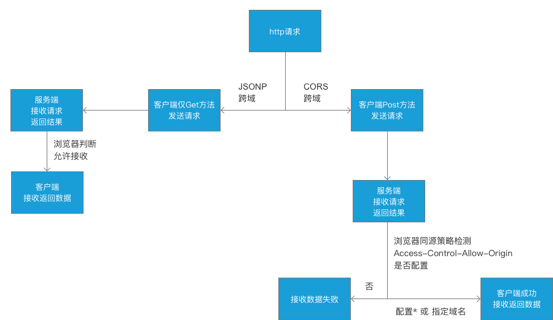

# Web 前端开发工程师必须了解的 HTTP 知识

## 前言

官方解释，HTTP 是一个应用层协议，由请求和响应构成，是一个标准的客户端服务器模型。HTTP 是一个无状态的协议。通俗来说，就是规定服务端和客户端通信的一种规则。更多的是基于浏览器环境下使用，那么从你浏览器输入地址开始到最终页面的呈现，到底经过了哪些过程呢？废话不多说，先贴一张图，如下：


如上图，就是 http 请求发起到返回的完证过程，本以为自己对`http`的了解还算可以，但是乍一看图还是很蒙的，比如说如果让你优化 http 过程，你该从何下手呢？我想大部分还是比较关心`request`和`response`，以及数据返回之后的`DOMContentLoad`和`load`，至于`http`中的一些配置并不是很清楚，其实通过优化配置，同样能够加速网页的打开速度，因此，我大致总结一些关于`http`中会经常使用的配置项，以及这些使用一般会在哪些场景中使用到。

<!-- more -->

> 注意：上图中的`domContentLoadedEventEnd`代表 DOMContentLoaded 事件完成的时间节点，也就是 jQuery 中的 domready 时间。`load`代表的是`onload`事件触发和结束的时间节点。

## HTTP 之跨域相关内容

### 基本内容

这里主要介绍`JSONP`和`CORS`跨域，现实场景中，以上两种使用居多，所以其他跨域方案不做详细介绍。造成跨域的主要原因主要是浏览器本身的`同源策略`引起的。

`JSONP`能够实现跨域主要是因为`浏览器上允许标签上通过src/href加载外链路径`，但是`JSONP`只支持`GET`请求，同时因为浏览器中`url`长度的限制，因此`JSONP`能传输的数据大小也有一定的限制。

`CORS`跨域能够支持的所有 ajax 的方法，当然，目前是支持 ie9+，低版本暂时不支持，随时互联网的发展，相信低版本的浏览器会逐渐被淘汰。在只用`CORS`只需要服务端能够开启允许跨域的头设置即可，也就是`Access-Control-Allow-Origin`。

跨域大致的流程图如下：



> 注意：`JSONP`中的数据限制并不是`GET`请求本身的限制，而是浏览器中`url`本身有长度限制，`GET`方法是没有任何长度限制的；不管是`JSONP`还是`CORS`跨域，其实服务器都可以接收来自客户端的数据请求，并且也都成功返回了，只是浏览器本身有`同源策略`的限制，才会进一步判断返回的数据是否符合浏览器的限制。

这里有个题外话，`Access-Control-Allow-Origin`这个配置项默认支持配置单个域名或者*，为了安全起见，不建议配置`*`，那么如何配置才能支持多个域名跨域呢？有一个简易的方法可以解决，主要思路是通过服务端定义可支持的跨域域名集合，通过循环判断当前请求是否支持即可，片段代码如下：

```js
// 服务端代码，以下是node服务做测试
const http = require('http')
const allowDomains = [
  'http://www.a.com',
  'http://www.b.com',
  'http://www.c.com'
]
const server = http
  .createServer((req, res) => {
    let acao = ''
    for (let i = 0, l = allowDomains.length; i < l; i++) {
      if (allowDomains[i].indexOf(req.headers.host) > -1) {
        acao = allowDomains[i]
        break
      }
    }
    res.writeHead(200, {
      'Access-Control-Allow-Origin': acao
    })
    res.end('Hello World\n')
  })
  .listen(3001)
console.log('server listen 3001')
```

### CORS 跨域限制

- 默认允许的方法有`GET`、`HEAD`、`POST`。
- 默认允许的 Content-Type 有`text/plain`、`multipart/form-data`、`application/x-www-form-urlencoded`。
- HTTP 的头信息包含`Accept`、`Accept-Language`、`Content-Language`、`Last-Event-ID`。

在请求包含以上内容的时候，其实就是简单请求，在跨域的情况下，浏览器默认是直接通过的，其余剩下的称之为复杂请求，浏览器会默认发送一次预请求作为验证，如果验证通过则代表请求成功。

因此需要对上图增加限制的修改，最终如下：


其实就是对于`复杂请求`做了一次校验，大致可以这样解释，如果在发送请求时，例如额外带了`headers`的配置项，如果需要验证通过就必须在服务端也要配置允许该`headers`的返回，这样预请求的验证才会通过。也可以通过代码做一下验证，基本如下：

```js
// 后端服务代码
const http = require('http')
const server = http
  .createServer((req, res) => {
    res.writeHead(200, {
      'Access-Control-Allow-Origin': '*',
      'Access-Control-Allow-Headers': 'aa' // 通过设置了这个，才能使得预请求验证通过
    })
    res.end('Hello World\n')
  })
  .listen(3001)
console.log('server listen 3001')

// 前端服务代码
const http = require('http')
const fs = require('fs')
const server = http
  .createServer((req, res) => {
    const html = fs.readFileSync('index.html', 'utf8')
    res.writeHead(200, {
      'Content-Type': 'text/html'
    })
    res.end(html)
  })
  .listen(3000)
console.log('server listen 3000')

// index.html主要代码如下
fetch('http://localhost:3001', {
  method: 'post',
  headers: {
    aa: '123'
  }
})
```

以上测试代码主要是在发起`post`请求的时候额外携带了一个`headers`参数，只有在服务端配置了允许该`headers`传输才能使得浏览器预请求验证通过，反之则会失败。大家可以根据以上测试代码在自己的本机测试就能明白了。

> 注意：通过设置`Access-Control-Request-Method`可以配置其他的方法，例如`PUT`、`DELETE`等。

细心的同学可能会发现，根据以上代码的确可以通过预请求，但是如果再次刷新网页，会发现仍然还会存在预请求，对于第一次预请求已经通过了，为什么同样的请求还会再发送一次呢？其实这里可以做一个优化，减少预请求的发送。

通过设置`Access-Control-Max-Age`来确定预请求的有效时间，只要在有效时间内，就不会再次发送预请求了。

## HTTP 之 Cache-Control

`Cache-Control`包含很多特性，其中`no-cache`这个配置项肯定最熟悉，官方解释是在释放缓存副本之前，强制高速缓存将请求提交给原始服务器进行验证，其实就是代表没有缓存。但是其实它依然有很多特性，经过资料查询，大致分为以下几类，


介绍下一般常用的配置参数的文字解释：

- `public`代表 http 从请求到返回的整个路径上的都可以被缓存，例如客户端浏览器，经过的代理服务器等等。
- `private`指发起的浏览器这一端才能进行缓存，也就是代理服务器是不能缓存的。
- `no-cache` 是否使用缓存需要通过服务器验证后才能判断。

* `max-age=<seconds>` 最大能缓存多少秒，过期之后，请求会再次发送到服务端，对于返回的数据会再次被缓存。
* `s-maxage=<seconds>` 会覆盖`max-age`或者`Expires`头，应用于共享（如：代理服务器）缓存，并且在代理服务器生效，客户端不生效。
* `max-stale[=<seconds>]` 表明客户端愿意接收一个已经过期的资源。即使`max-age`已经过期，同样会使用本地的过期缓存。

- `must-revalidate` 如果`max-age`过期，必须通过服务端来验证返回的数据是否真的过期。
- `proxy-revalidate` 主要使用在代理服务器端，对于过期的数据必须向服务端重新请求一遍。

* `no-store` 本地和代理服务器都不允许存缓存。
* `no-transform` 不得对资源进行转换或转变，主要使用在代理服务器上。

具体每个配置的官方解释参考[具体说明](https://developer.mozilla.org/zh-CN/docs/Web/HTTP/Headers/Cache-Control)

### 资源验证

- `Last-Modified`表明请求的资源上次的修改时间，主要配合`If-Modified-Since`（客户端保留的资源上次的修改时间）进行使用，主要是在发送请求的时候带上。通过对比上次修改时间以验证资源是否更新。
- `Etag`资源的内容标识。（不唯一，通常为文件的 md5 或者一段 hash 值，只要保证写入和验证时的方法一致即可），配合`If-Match`或者`If-None-Match`进行使用，对比资源的内容标识来判断是否使用缓存。

其实服务器可以通过`Etag`来区分返回哪些数据，具体可以参考下面的示例：

```js
// server.js
const http = require('http')
const fs = require('fs')
const server = http
  .createServer((req, res) => {
    const url = req.url
    const html = fs.readFileSync('index.html', 'utf8')
    const etag = req.headers['if-none-match']
    if (url === '/') {
      res.writeHead(200, {
        'Content-Type': 'text/html',
        'Cache-Control': 'max-age=2000, no-cache',
        'Last-Modified': '123',
        Etag: '444'
      })
      res.end(html)
    }
    if (url === '/aa.js') {
      if (etag === '444') {
        res.writeHead(304, {
          'Content-Type': 'text/javascript',
          'Cache-Control': 'max-age=2000, no-cache',
          'Last-Modified': '123',
          Etag: '444'
        })
        res.end('888888')
      } else {
        res.writeHead(200, {
          'Content-Type': 'text/javascript',
          'Cache-Control': 'max-age=2000, no-cache',
          'Last-Modified': '123',
          Etag: '444'
        })
        res.end('1111111111')
      }
    }
  })
  .listen(3000)
console.log('server listen 3000')
```

```html
<!-- html文件 -->
<!DOCTYPE html>
<html lang="en">
  <head>
    <meta charset="UTF-8" />
    <meta name="viewport" content="width=device-width, initial-scale=1.0" />
    <meta http-equiv="X-UA-Compatible" content="ie=edge" />
    <title>Document</title>
  </head>
  <body>
    <script src="./assets/aa.js"></script>
  </body>
</html>
```

第一次刷新和第二次刷新截图如下：


根据测试代码能得出，在服务端通过`etag === '444'`做了判断，但是最终返回的依然是`1111111111`，这是由于服务端选取了第一次的缓存数据作为返回。虽然发生了一次请求，但请求内容长度减少了，节省了带宽。

### 总结

其实以上所有的概念基本可以用一个图来展示，大致分为 2 个主要部分：

1、本地缓存，其实也就是本地资源的缓存。
2、服务器缓存，包含验证缓存和非验证缓存。


## HTTP 之 cookie

- 通过`Set-Cookie`来设置`cookie`，下次请求的时候，会自动带上之前设置的`cookie`（同域情况下），取值类型是 String/Array。
- 通过`max-age`和`Expires`设置过期时间。
- 通过`Secure`来设置只能在`https`的时候发送。
- 通过`HttpOnly`来设置无法通过`document.cookie`访问。
- 通过`domain=`来设置该`cookie`是否在同域下共享。

以上内容基本能汇总成一张图解释，如下：


## HTTP 之 keep-alive

目前开发 web 网页，所有请求默认都是`Connection: keep-alive`，除非服务端手动去关闭配置（`Connection: close`），使用`keep-alive`可以复用之前的请求的信道，这样减少`tcp`三次握手的时间（同域情况下才能生效）。

## HTTP 之数据协商

web 服务请求会携带以下信息内容：

- Accept 想要的数据类型
- Accept-Encoding 限制服务端数据的压缩方式（gzip、deflate、br）
- Accept-Language 服务端返回数据的语言类型
- User-Agent 浏览器头信息内容

服务端返回数据会携带以下信息内容：

- Content-type 返回的数据类型
- Content-Encoding 对应的是 `Accept-Encoding` 代表数据压缩类型
- Content-Language 对应的是 `Accept-Language` 代表数据语言类型

当然，web 请求也可以自定义`Content-type`来传输数据，一般在`form`表单中比较常用，例如上传文件，会指定`Content-type:multipart/form-data`，这样服务端就能接收上传的文件信息内容。

## HTTP 之重定向

浏览器能识别的重定向`code`码有两种，分别是`301`和`302`，两者在使用上会有一定的区别，大致如下：

- `301`重定向是`永久重定向`，用户在访问资源的时候，浏览器默认是从缓存中获取之前指定的跳转信息；
- `302`重定向可以随时取消，也就是用户在访问资源的时候，每次都会经过服务端并且在服务端通过跳转逻辑进行跳转；

可以使用一段代码来描述以上的不同之处，基本代码如下：

```js
// 302跳转测试代码
const http = require('http')
const fs = require('fs')
const server = http
  .createServer((req, res) => {
    const url = req.url
    const html = fs.readFileSync('index.html', 'utf8')
    console.log(url)
    if (url === '/') {
      res.writeHead(302, {
        Location: '/wq'
      })
      res.end('')
    }
    if (url === '/wq') {
      res.writeHead(200, {
        'Content-Type': 'text/html'
      })
      res.end(html)
    }
  })
  .listen(3000)
console.log('server listen 3000')
```

`301`测试代码跟上面基本一样，只要将`302`改成`301`即可，根据以上代码测试，你会发现，每次在刷新页面的时候，如果是`302`跳转，那么`console.log(url)`每次都会打印`/ 和 /wq`，如果是`301`的话，只会打印`/wq`，这就说明，`302`的跳转是从服务端指定跳转的，而`301`的跳转则是永久性的，除非清楚本地浏览器的缓存，要么无法改变。

## HTTP 之内容安全策略

配置内容安全策略涉及到添加`Content-Security-Policy`，HTTP 头部到一个页面，并配置相应的值，以控制用户代理（浏览器等）可以为该页面获取哪些资源。更多详细参考[具体说明](https://developer.mozilla.org/zh-CN/docs/Web/HTTP/CSP)

常用示例如下：

```js
// 一个网站管理者想要所有内容均来自站点的同一个源 (不包括其子域名)
'Content-Security-Policy': default-src 'self'

// 一个网站管理者允许内容来自信任的域名及其子域名 (域名不必须与CSP设置所在的域名相同)
'Content-Security-Policy': default-src 'self' *.trusted.com

// 该服务器仅允许通过HTTPS方式并仅从onlinebanking.jumbobank.com域名来访问文档
'Content-Security-Policy': default-src https://onlinebanking.jumbobank.com

// 限制向百度请求
'Content-Security-Policy': connect-src http://baidu.com

// 通过设定report-uri来指定上报服务器地址
'Content-Security-Policy': default-src 'self'; report-uri http://reportcollector.example.com/collector.cgi
```

## HTTP 之 HTTP2

`HTTP/2`是 HTTP 协议自 1999 年 HTTP1.1 发布后的首个更新，主要基于`SPDY`协议。它由互联网工程任务组（IETF）的 Hypertext Transfer Protocol Bis（httpbis）工作小组进行开发。该组织于 2014 年 12 月将 HTTP/2 标准提议递交至 IESG 进行讨论，于 2015 年 2 月 17 日被批准。HTTP/2 标准于 2015 年 5 月以 RFC 7540 正式发表。

大致总结有以下特性：

- 二进制分帧
- 多路复用：同域名下所有通信都在单个连接上完成；单个连接可以承载任意数量的双向数据流；数据流以消息的形式发送，而消息又由一个或多个帧组成，多个帧之间可以乱序发送，因为根据帧首部的流标识可以重新组装；
- 服务器推送：服务端可以在发送页面 HTML 时主动推送其它资源，而不用等到浏览器解析到相应位置，发起请求再响应。
- 头部压缩：HTTP/2 对消息头采用 HPACK（专为 http2 头部设计的压缩格式）进行压缩传输，能够节省消息头占用的网络的流量。而 HTTP/1.x 每次请求，都会携带大量冗余头信息，浪费了很多带宽资源。

贴一张简图，可以更好的体现，更多详情[可以参考](https://tech.upyun.com/article/227/%E4%B8%80%E6%96%87%E8%AF%BB%E6%87%82%20HTTP%2F2%20%E7%89%B9%E6%80%A7.html)：


为了能更好的体验实际场景中的效果，做了简单的测试，使用`express`配合`node`开启`http2`来测试具体效果，在这之前，需要生成一个`SSL`，生成代码如下：

```
// 直接在cmd中运行
openssl req -x509 -nodes -newkey rsa:2048 -keyout example.com.key -out example.com.crt
```

编写基础的`server.js`代码，基本如下：

```js
const port = 3000
const spdy = require('spdy')
const express = require('express')
const path = require('path')
const fs = require('fs')
const resolve = file => path.resolve(__dirname, file)
const app = express()

const serve = (path, cache) =>
  express.static(resolve(path), {
    maxAge: cache ? 1000 * 60 * 60 * 24 * 30 : 0
  })
app.use('/html', serve('./html', true))

app.get('/', (req, res) => {
  res.status(200)
  res.send('hello world')
})

app.get('/timg.jpeg', (req, res) => {
  const img = fs.readFileSync('/html/timg.jpeg')
  res.writeHead(200, { 'Content-Type': 'image/jpeg' })
  res.send(img)
})

const options = {
  key: fs.readFileSync(__dirname + '/example.com.key'),
  cert: fs.readFileSync(__dirname + '/example.com.crt')
}
spdy.createServer(options, app).listen(port, error => {
  if (error) {
    console.error(error)
    return process.exit(1)
  } else {
    console.log('Listening on port: ' + port + '.')
  }
})
```

根目录的静态文件定义`fetch`方法来请求`100`张图片，这样来测试请求的信道以及加载时长，基本代码如下：

```html
<!DOCTYPE html>
<html lang="en">
  <head>
    <meta charset="UTF-8" />
    <meta name="viewport" content="width=device-width, initial-scale=1.0" />
    <meta http-equiv="X-UA-Compatible" content="ie=edge" />
    <title>http2测试</title>
  </head>
  <body>
    <script>
      for (let i = 0; i < 100; i++) {
        fetch('//localhost:3000/html/timg.jpeg')
      }
    </script>
  </body>
</html>
```

按照以上代码运行，并且对比`HTTP/1.1`的效果如下（图 1 是 HTTP/1.1，图 2 是 HTTP2）：


从图 1 和图 2 就能看出，图 2 中`Connection ID`只有一个，而图 1 中`Connection ID`会随着请求的增加而增加，每增加一个信道，就会创建一次`TCP`链接，也就是需要经过三次握手，并且还受限浏览器本身的并发数，所以才会出现等待的情况；从`Size`那一列能看出，`HTTP2`中的请求数据也会小（因为本身数据就小，所以不明显），这样能够减少带宽；从最终的`Finsh`时间能看出，同样是 100 张图片的请求，`HTTP2`耗时更少。

## 总结

以上内容主要是和`HTTP`相关的内容，由于比较简单，就不提供测试代码压缩包，基本从示例中直接复制粘贴就能本地测试运行，如果有什么不正确的地方，欢迎提[`Issues`](https://github.com/wqzwh/blog/issues)。
