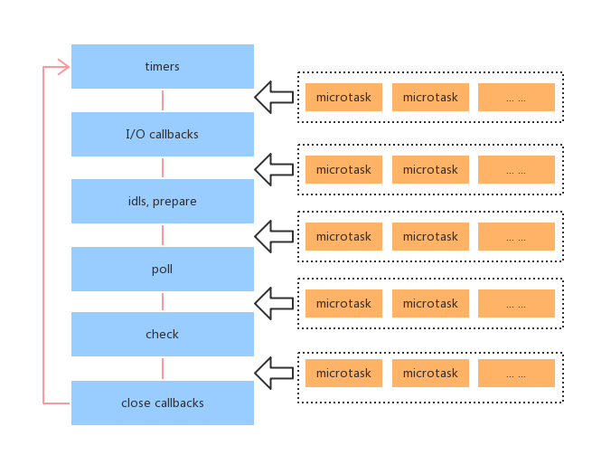

# 深入理解 javascript 事件循环机制（浏览器与 nodejs 环境）

### 浏览器端的事件循环

了解 js 的同学都应该知道，说的最多的就是 js 是单线程，但是单线程的 js 同样能实现异步，通俗的讲，异步其实就是再另外开辟一个进程去执行相关操作，或许对于多线程来讲更能实现异步。那么 js 单线程是如何实现异步的呢？

> js 同步异步也是面试中常常被问到的。

js 其实分同步异步，它们的处理方式也不同，同步任务是在主线程上排队执行，异步任务则会被放到异步任务队列中，若有多个任务（异步任务）则要在任务队列中排队等待，任务队列类似一个缓冲区，任务下一步会被移到调用栈（call stack），然后主线程执行调用栈的任务。

<!-- more -->

单线程是指 js 引擎中负责解析执行 js 代码的线程只有一个（主线程），即每次只能做一件事，例如我们最常用的 ajax 请求，主线程在等待响应返回结果的同时依然会去执行其他的方法，主要是因为浏览器先在事件表注册 ajax 的回调函数，响应回来后回调函数被添加到任务队列中等待执行，不会造成线程阻塞，也就是 ajax 其实是个异步的。

> 这里说的 ajax 是浏览器原生的，而任何二次封装其实有配置项使得该 ajax 为同步。

在上面的概念中提到了两个词，栈（stack）、任务队列，js 在执行主线程代码过程中，会去不断的检查栈中是否有事件需要去执行，哪些事件会被放入任务队列中以及什么时候会去执行任务队列中的事件。这其实就是事件循环需要去做的事情。

下图就是调用栈和任务队列的关系图（截图来自 Philip Roberts 的演讲[《Help, I'm stuck in an event-loop》](https://vimeo.com/96425312)）


上图中，主线程运行的时候，产生堆（heap）和栈（stack），栈中的代码调用各种外部 API，它们在"任务队列"中加入各种事件（click，load，done）。只要主栈中的代码执行完毕，主线程就会去读取"任务队列"，依次执行那些事件所对应的回调函数。

#### 宏任务和微任务

根据上面的说明，可以确认一点，任务队列和栈是两个不同“线程”，例如上面讲的原生 ajax 异步请求，它就会被先放在任务队列中，等待响应之后，再被调用到栈中去执行。

> 事件循环至少包含两个队列，macrotask 队列和 microtask 队列。

其实任务队列中包含两种类型：**宏任务（macrotask）** 、 **微任务（microtask）**。

> 浏览器端和 node 端对宏任务和微任务具体的分类还有所区别，后面会介绍到。

浏览器端：

**宏任务（macrotask）**：执行主线程 js 代码，事件回调，XHR 回调，setTimeout，setInterval，requestAnimationFrame，I/O，UI render

**微任务（microtask）**：promise 回调，Object.observe，async await，MutationObserver

再贴一张牛逼闪闪的解释图（截图来自[《HTML 系列：macrotask 和 microtask》](https://zhuanlan.zhihu.com/p/24460769)）


> 事件循环有两个基本原则：1、同一时间只能执行一个任务。2、任务一直执行到完成，不能被其他任务抢断。

根据上图可以得出一次事件循环基本分以下几个步骤：

1. 事件循环检查 macrotask 队列是否为空，非空则到 2，为空则到 3
2. 执行 macrotask 中的一个任务
3. 事件循环继续检查 microtask 队列是否为空，若有则到 4，否则到 5
4. 取出 microtask 中的任务执行，执行完成返回到步骤 3
5. 执行视图更新，再次到 1

根据上面 5 个步骤以及图示可以看出，

1、js 在执行任何一个任务的时候是不会被中断的。
2、单次事件循环中，只会执行一次宏任务，而会执行全部的微任务。
3、当微任务为空时，事件循环检查是否需要执行 UI 重渲染，如果需要则重渲染 UI。这样就结束了当次循环，继续从头开始检查宏任务。
4、所有的微任务都应该在下次 UI 渲染前执行完，因为其目的就是在渲染前更新应用状态。

贴上一段代码再来一张牛逼闪闪的动图，这样就能更清楚的理解了：

```js
console.log('start')

setTimeout(() => {
  console.log('setTimeout')
}, 0)

Promise.resolve()
  .then(() => {
    console.log('promise1')
  })
  .then(() => {
    console.log('promise2')
  })

console.log('end')

// 浏览器执行顺序是：start end promise1 promise2 setTimeout
```


先输出`start`和`end`没啥问题，根据上面的分析，执行主线程 js 属于宏任务，因此接下来会执行微任务，所以会输出`promise1`和`promise2`，然后做是否 UI 更新操作，到此完成了一次事件循环，然后再次进行检测是否有宏任务，也就是输出了`setTimeout`，然后再次做是否 UI 更新操作，最终结束。

这里有一点需要注意下，`promise`中的`then`才是异步代码，下面代码在浏览器端运行结果可以证明这一点：

```js
setTimeout(() => console.log(4))

new Promise(resolve => {
  resolve()
  console.log(1)
}).then(_ => {
  console.log(3)
})

console.log(2)

// 浏览器执行顺序是：1 2 3 4
```

#### UI 视图渲染何时发生

在上面的介绍中，一直都在说，判断是否需要进行 UI 视图渲染，那么到底这个东西什么时候会发生呢？根据之前定义的一次事件循环的 5 个步骤中解释到：UI 视图渲染将会在所有微任务执行完之后执行。

##### 主动可控的

我们在使用 vue 开发过程中，肯定会使用`nextTick`这个 API，这个就是使用这可以主动去更新视图，通常会在数据变化之后主动去更新视图。其实内部机制是通过原生`Promise.then`和`MessageChannel`（没听过）去实现的，对于低版本的浏览器会降级到使用`setTimeout(fn, 0)`去替代。具体可以查看 vue 中的[异步更新队列介绍](https://cn.vuejs.org/v2/guide/reactivity.html)

> 小程序开发中也会有 nextTick 这个 API，效果其实是一样的。

##### 不可控的

对于不可控的视图更新会想到使用这个`requestAnimationFrame`API，因为这是浏览器来判断是否需要进行视图更新操作，通过下面的示例代码可以验证这一点：

```js
setTimeout(() => {
  console.log('setTimeout1')
}, 0)

requestAnimationFrame(() => {
  console.log('requestAnimationFrame')
})

setTimeout(() => {
  console.log('setTimeout2')
}, 0)

new Promise(resolve => {
  console.log('promise 1')
  resolve()
  console.log('promise 2')
}).then(() => {
  console.log('promise then')
})

console.log('end')

// 谷歌浏览器端执行顺序： promise 1 promise 2 end promise then requestAnimationFrame setTimeout1 setTimeout2
// 火狐浏览器执行顺序：promise 1 promise 2 end promise then setTimeout1 setTimeout2 requestAnimationFrame
```


不同的浏览器执行的结果不一样，如上图所示，`requestAnimationFrame`的执行时机与浏览器的渲染策略有关。

### Node 环境下的事件循环

先运行下面的示例代码：

```js
setTimeout(() => {
  console.log('timer1')
  Promise.resolve().then(() => {
    console.log('promise1')
  })
}, 0)

setTimeout(() => {
  console.log('timer2')
  Promise.resolve().then(() => {
    console.log('promise2')
  })
}, 0)

// 浏览器端执行顺序：timer1 promise1 timer2 promise2
// node环境执行顺序：timer1 timer2 promise1 promise2
```

根据上面的示例代码运行结果可以看出，node 环境下的事件循环和浏览器端的运行机制还是有所不同的，先贴一张图（截图来自阮老师的[《JavaScript 运行机制详解：再谈 Event Loop》](http://www.ruanyifeng.com/blog/2014/10/event-loop.html)）


引用阮老师的解释，Node.js 的运行机制如下：

（1）V8 引擎解析 JavaScript 脚本。

（2）解析后的代码，调用 Node API。

（3）libuv 库负责 Node API 的执行。它将不同的任务分配给不同的线程，形成一个 Event Loop（事件循环），以异步的方式将任务的执行结果返回给 V8 引擎。

（4）V8 引擎再将结果返回给用户。

再说事件循环之前，先列出 node 环境下的宏任务和微任务有哪些：

**宏任务（macrotask）**：执行主线程 js 代码，事件回调，XHR 回调，setTimeout，setInterval，I/O， setImmediate

**微任务（microtask）**：promise 回调，async await，process.nextTick

libuv 库是实现事件循环的关键，贴一段[源码](https://github.com/libuv/libuv/blob/v1.x/src/unix/core.c#L348-L397)，片段如下：

```c
int uv_run(uv_loop_t* loop, uv_run_mode mode) {
  int timeout;
  int r;
  int ran_pending;
  //判断事件循环是否存活。
  r = uv__loop_alive(loop);
  //如果没有存活，更新时间戳
  if (!r)
    uv__update_time(loop);
  //如果事件循环存活，并且事件循环没有停止。
  while (r != 0 && loop->stop_flag == 0) {
    //更新当前时间戳
    uv__update_time(loop);
    // timers阶段
    uv__run_timers(loop);
    // 执行由于上个循环未执行完，并被延迟到这个循环的I/O 回调
    ran_pending = uv__run_pending(loop);
    // idle阶段 内部调用
    uv__run_idle(loop);
    // prepare阶段 内部调用
    uv__run_prepare(loop);

    timeout = 0;
    if ((mode == UV_RUN_ONCE && !ran_pending) || mode == UV_RUN_DEFAULT)
      // 计算距离下一个timer到来的时间差。
      timeout = uv_backend_timeout(loop);

    // poll阶段，该阶段轮询I/O事件，有则执行，无则阻塞，直到超出timeout的时间。
    uv__io_poll(loop, timeout);
    // check阶段 主要执行 setImmediate 回调。
    uv__run_check(loop);
    // close callbacks阶段
    uv__run_closing_handles(loop);

    if (mode == UV_RUN_ONCE) {
      //更新当前时间戳
      uv__update_time(loop);
      //再次执行timers回调。
      uv__run_timers(loop);
    }

    r = uv__loop_alive(loop);
    if (mode == UV_RUN_ONCE || mode == UV_RUN_NOWAIT)
      break;
  }

  /* The if statement lets gcc compile it to a conditional store. Avoids
   * dirtying a cache line.
   */
  if (loop->stop_flag != 0)
    loop->stop_flag = 0;

  return r;
}
```

Node.js 启动时会初始化事件循环, 每一个事件循环都会包含按如下顺序六个循环阶段：

```js
   ┌───────────────────────────┐
┌─>│           timers          │ uv__run_timers(loop)
│  └─────────────┬─────────────┘
│  ┌─────────────┴─────────────┐
│  │       I/O callbacks       │ uv__run_pending(loop)
│  └─────────────┬─────────────┘
│  ┌─────────────┴─────────────┐
│  │       idle, prepare       │ uv__run_idle(loop)
│  └─────────────┬─────────────┘      ┌───────────────┐
│  ┌─────────────┴─────────────┐      │   incoming:   │
│  │           poll            │<─────┤  connections, │ uv__io_poll()
│  └─────────────┬─────────────┘      │   data, etc.  │
│  ┌─────────────┴─────────────┐      └───────────────┘
│  │           check           │ uv__run_check(loop)
│  └─────────────┬─────────────┘
│  ┌─────────────┴─────────────┐
└──┤      close callbacks      │ uv__run_prepare(loop)
   └───────────────────────────┘
```

- timers 阶段: 这个阶段执行 setTimeout(callback) and setInterval(callback)预定的 callback;
- I/O callbacks 阶段: 执行除了 close 事件的 callbacks、被 timers(定时器，setTimeout、setInterval 等)设定的 callbacks、setImmediate()设定的 callbacks 之外的 callbacks; 执行一些系统调用错误，比如网络通信的错误回调(目前这个阶段)
- idle, prepare 阶段: 仅 node 内部使用;
- poll 阶段: 获取新的 I/O 事件, 适当的条件下 node 将阻塞在这里;
- check 阶段: 执行 setImmediate() 设定的 callbacks;
- close callbacks 阶段: 比如 socket.on(‘close’, callback)的 callback 会在这个阶段执行。

首先确定下，这个事件循环中涉及到的方法全是异步的，通过这个示意图可以确定在`check`阶段会去执行`setImmediate`中的 callback 函数，再之后就是内部调用`uv__run_prepare`，关闭 callback 函数，然后再次回到`timers`阶段，那么我们可以暂时把`setImmediate`作为下一次循环开始的标记，这个对后面理解运行顺序有很大的帮助。

#### timer 阶段

贴一段 timer 相关的[源码片段](https://github.com/libuv/libuv/blob/v1.x/src/timer.c#L159-L176)

```c
static struct heap *timer_heap(const uv_loop_t* loop) {
#ifdef _WIN32
  return (struct heap*) loop->timer_heap;
#else
  return (struct heap*) &loop->timer_heap;
#endif
}

int uv_timer_again(uv_timer_t* handle) {
  if (handle->timer_cb == NULL)
    return UV_EINVAL;

  // 如果是repeat则重新创建定时器
  if (handle->repeat) {
    uv_timer_stop(handle);
    uv_timer_start(handle, handle->timer_cb, handle->repeat, handle->repeat);
  }

  return 0;
}

void uv__run_timers(uv_loop_t* loop) {
  struct heap_node* heap_node;
  uv_timer_t* handle;

  for (;;) {
    // 取出定时器堆中时间最近的定时器代码（setTimeout/setInterval）
    heap_node = heap_min(timer_heap(loop));
    if (heap_node == NULL)
      break;

    handle = container_of(heap_node, uv_timer_t, heap_node);
    // 判断最近的定时器的时间是否大于当前时间，如果大于当前时间，说明还未超时，跳出循环。
    if (handle->timeout > loop->time)
      break;
    // 停止定时器
    uv_timer_stop(handle);
    // 判断定时器句柄类型是否是repeat类型，如果是，重新创建一个定时器。
    uv_timer_again(handle);
    // 执行定时器绑定的回调函数
    handle->timer_cb(handle);
  }
}
```

首先判断是否存在未超时的定时器，如果存在就会跳出，执行事件循环的下一个环节，这里会有个问题，就是判断是否未超时，在实际场景中，node 是无法准确的根据定时器设定的时间来精准确定该定时器何时运行回调函数，也就是如果将 setTimeout 和 setImmediate 放在如下的代码示例中，就很难确定，setTimeout 是在第一次循环中执行还是第二次循环中执行。

```js
setTimeout(() => {
  console.log('timeout')
}, 0)

setImmediate(() => {
  console.log('immediate')
})

// node 环境运行结果 timeout immediate 或者 immediate timeout
```

如果在主线程代码中再加入其他同步代码，可以保证`setTimeout`先执行，主要是因为在运行其他主线程代码时，给`setTimeout`预留的时间，示例代码如下：

```js
setTimeout(() => {
  console.log('timeout')
}, 0)

setImmediate(() => {
  console.log('immediate')
})

console.log('主线程代码')

// node 环境运行结果 主线程代码 timeout immediate
```

#### I/O callbacks 阶段

这个阶段执行一些系统操作的回调。比如 TCP 错误，如一个 TCP socket 在想要连接时收到 ECONNREFUSED,
类 unix 系统会等待以报告错误，这就会放到 I/O callbacks 阶段的队列执行。

> idle, prepare 为内部调用，不去关注它。

#### poll 阶段

贴一段[源码片段](https://github.com/libuv/libuv/blob/e4087dedf837f415056a45a838f639a3d9dc3ced/src/unix/kqueue.c#L112-L381)：

```c
void uv__io_poll(uv_loop_t* loop, int timeout) {
  // 省略变量初始化代码
  if (loop->nfds == 0) {
    // 判断观察者队列是否为空，如果为空，则返回
    assert(QUEUE_EMPTY(&loop->watcher_queue));
    return;
  }

  nevents = 0;
  // 观察者队列不为空
  while (!QUEUE_EMPTY(&loop->watcher_queue)) {
    /*
    取出队列头的观察者对象
    取出观察者对象感兴趣的事件并监听。
    */
    w->events = w->pevents;
  }

  pset = NULL;
  if (loop->flags & UV_LOOP_BLOCK_SIGPROF) {
    pset = &set;
    sigemptyset(pset);
    sigaddset(pset, SIGPROF);
  }

  assert(timeout >= -1);
  // 如果有超时时间，将当前时间赋给base变量
  base = loop->time;
  // 本轮执行监听事件的最大数量
  count = 48; /* Benchmarks suggest this gives the best throughput. */
  // 进入监听循环
  for (;; nevents = 0) {
    // 有超时时间的话，初始化spec
    if (timeout != -1) {
      spec.tv_sec = timeout / 1000;
      spec.tv_nsec = (timeout % 1000) * 1000000;
    }

    if (pset != NULL)
      pthread_sigmask(SIG_BLOCK, pset, NULL);
    // 监听内核事件，当有事件到来时，即返回事件的数量。
    // timeout 为监听的超时时间，超时时间一到即返回。
    // 我们知道，timeout是传进来得下一个timers到来的时间差，所以，在timeout时间内，event-loop会一直阻塞在此处，直到超时时间到来或者有内核事件触发。
    nfds = kevent(loop->backend_fd,
                  events,
                  nevents,
                  events,
                  ARRAY_SIZE(events),
                  timeout == -1 ? NULL : &spec);

    if (pset != NULL)
      pthread_sigmask(SIG_UNBLOCK, pset, NULL);

    /* Update loop->time unconditionally. It's tempting to skip the update when
     * timeout == 0 (i.e. non-blocking poll) but there is no guarantee that the
     * operating system didn't reschedule our process while in the syscall.
     */
    SAVE_ERRNO(uv__update_time(loop));
    //如果内核没有监听到可用事件，且本次监听有超时时间，则返回。
    if (nfds == 0) {
      assert(timeout != -1);
      return;
    }

    if (nfds == -1) {
      if (errno != EINTR)
        abort();

      if (timeout == 0)
        return;

      if (timeout == -1)
        continue;

      /* Interrupted by a signal. Update timeout and poll again. */
      goto update_timeout;
    }

    have_signals = 0;
    nevents = 0;

    //判断事件循环的观察者队列是否为空
    assert(loop->watchers != NULL);
    loop->watchers[loop->nwatchers] = (void*) events;
    loop->watchers[loop->nwatchers + 1] = (void*) (uintptr_t) nfds;
    // 循环处理内核返回的事件，执行事件绑定的回调函数
    for (i = 0; i < nfds; i++) {
      // ...
    }

    if (have_signals != 0)
      loop->signal_io_watcher.cb(loop, &loop->signal_io_watcher, POLLIN);

    loop->watchers[loop->nwatchers] = NULL;
    loop->watchers[loop->nwatchers + 1] = NULL;

    if (have_signals != 0)
      return;  /* Event loop should cycle now so don't poll again. */

    if (nevents != 0) {
      if (nfds == ARRAY_SIZE(events) && --count != 0) {
        /* Poll for more events but don't block this time. */
        timeout = 0;
        continue;
      }
      return;
    }

    if (timeout == 0)
      return;

    if (timeout == -1)
      continue;

update_timeout:
    assert(timeout > 0);

    diff = loop->time - base;
    if (diff >= (uint64_t) timeout)
      return;

    timeout -= diff;
  }
}
```

poll 阶段有两个主要功能：

1、执行下限时间已经达到的`timers`的回调
2、处理`poll`队列里的事件。

当 event loop 进入`poll`阶段，并且没有设定的`timers`，会发生下面两件事之一：
1、如果`poll`队列不空，event loop 会遍历队列并同步执行回调，直到队列清空或执行的回调数到达系统上限；
2、如果`poll`队列为空，则发生以下两件事之一：
1、如果代码已经被`setImmediate()`设定了回调, event loop 将结束`poll`阶段进入`check`阶段来执行`check`队列（里的回调）。
2、如果代码没有被`setImmediate()`设定回调，event loop 将阻塞在该阶段等待回调被加入`poll`队列，并立即执行。

但是，当 event loop 进入`poll`阶段，并且有设定的 timers，一旦`poll`队列为空（poll 阶段空闲状态）：

event loop 将检查`timers`,如果有 1 个或多个`timers`的下限时间已经到达，event loop 将绕回 **timers** 阶段，并执行 **timer** 队列。

#### check 阶段

`setImmediate()`的回调会被加入`check`队列中， 从 event loop 的阶段图可以知道，`check`阶段的执行顺序在`poll`阶段之后，只要有被`setImmediate()`设定了回调，一旦`poll`阶段空闲，那么程序将结束`poll`阶段并进入`check`阶段，而不是继续等待`poll`事件。

#### close callbacks

如果一个 socket 或 handle 被突然关掉（比如 socket.destroy()），close 事件将在这个阶段被触发，否则将通过 process.nextTick()触发。

根据上面介绍，这是说明了宏任务的执行过程，那么对于 node 环境下的微任务呢？是不是跟在浏览器端一样，在一个宏任务执行完成之后会去执行所有的微任务，实际运行机制还是有区别的，**node 环境下在每次切换事件循环阶段的时候都会去清空微任务队列里面的任务**。

浏览器端是这样的，如下图：


node 环境中时这样的，如下图：



这就能解释，为什么在最开始的示例中，浏览器和 node 环境执行结果不一样，这里解释下 node 环境下的结果：

> 首先进入 timers 阶段，执行 timer1 的回调函数，打印 timer1，并将 promise1.then 回调放入 microtask 队列，同样的步骤执行 timer2，打印 timer2；至此，timer 阶段执行结束，event loop 进入下一个阶段之前，执行 microtask 队列的所有任务，依次打印 promise1、promise2。

#### process.nextTick()

首先`process.nextTick()`属于微任务，因此它只会在事件循环切换的过程才会运行，nextTick 必须传入一个函数，当调用这个方法的时候，在 node 环境中，会将传入的事件塞入`nextTickQueue`中，并且立即会清空本阶段的所有`nextTickQueue`之后再次进入事件循环的下一个阶段。`setImmediate()`则是标志当前循环结束，进入下一次事件循环中。所以如果`process.nextTick()`使用不当会造成阻塞，示例代码如下：

```js
const fs = require('fs')
const starttime = Date.now()
let endtime

setTimeout(() => {
  endtime = Date.now()
  console.log('finish reading time: ', endtime - starttime)
})

let index = 0
function handler() {
  if (index++ >= 1000) return
  console.log(`nextTick ${index}`)
  process.nextTick(handler)
}
handler()

// 运行结果如下：
// nextTick 1
// nextTick 2
// ......
// nextTick 999
// nextTick 1000
// finish reading time: 58
```

如果该用`setImmediate()`就不会造成阻塞，示例代码如下：

```js
const fs = require('fs')
const starttime = Date.now()
let endtime

setTimeout(() => {
  endtime = Date.now()
  console.log('finish reading time: ', endtime - starttime)
})

let index = 0
function handler() {
  if (index++ >= 1000) return
  console.log(`setImmediate ${index}`)
  setImmediate(handler)
}
handler()

// 运行结构如下：
// setImmediate 1
// finish reading time:  4
// setImmediate 2
// ......
// nextTick 1000
```

### 总结

以上就是全部关于事件循环的介绍，能看到这里其实还是很蒙的感觉，所以最后总结一下：

**浏览器端事件循环步骤**

- 1. 事件循环检查 macrotask 队列是否为空，非空则到 2，为空则到 3
- 2. 执行 macrotask 中的一个任务
- 3. 事件循环继续检查 microtask 队列是否为空，若有则到 4，否则到 5
- 4. 取出 microtask 中的任务执行，执行完成返回到步骤 3
- 5. 执行视图更新，再次到 1

几点注意：

- js 在执行任何一个任务的时候是不会被中断的。
- 单次事件循环中，只会执行一次宏任务，而会执行全部的微任务。
- 当微任务为空时，事件循环检查是否需要执行 UI 重渲染，如果需要则重渲染 UI。这样就结束了当次循环，继续从头开始检查宏任务。
- 所有的微任务都应该在下次 UI 渲染前执行完，因为其目的就是在渲染前更新应用状态。
- UI 视图更新分可控和非可控

**node 环境下的事件循环步骤**

1、timer 阶段

- 检查 timer 队列是否有到期的 timer 回调，如果有，将到期的 timer 回调按照 timerId 升序执行。
- 检查是否有 process.nextTick 任务，如果有，全部执行。
- 检查是否有 microtask，如果有，全部执行。
- 退出该阶段。
  > 这个阶段主要环境会去判断当前的定时器是否到了该执行时候了，具体判定的时间跟定时器中的代码耗时长短有关，有可能这个阶段的定时器会在多个事件循环中运行。

2、IO callbacks 阶段

- 检查是否有 pending 的 I/O 回调。如果有，执行回调。如果没有，退出该阶段。
- 检查是否有 process.nextTick 任务，如果有，全部执行。
- 检查是否有 microtask，如果有，全部执行。
- 退出该阶段。

3、idle，prepare 阶段

- 内部运行，可以忽略

4、poll 阶段

首先检查是否存在尚未完成的回调，如果存在，那么分两种情况。
**第一种情况：**

- 如果有可用回调（可用回调包含到期的定时器还有一些 IO 事件等），执行所有可用回调。
- 检查是否有 process.nextTick 回调，如果有，全部执行。
- 检查是否有 microtaks，如果有，全部执行。
- 退出该阶段。
  **第二种情况：**
- 如果没有可用回调。
- 检查是否有 immediate 回调，如果有，退出 poll 阶段。如果没有，阻塞在此阶段，等待新的事件通知。
  如果不存在尚未完成的回调，退出 poll 阶段

5、check 阶段

- 如果有 immediate 回调，则执行所有 immediate 回调。
- 检查是否有 process.nextTick 回调，如果有，全部执行。
- 检查是否有 microtaks，如果有，全部执行。
- 退出 check 阶段
  > 该阶段会执行 immediate()回调，因此这也是事件循环进入下一次的一个标记

6、closing 阶段

- 如果有 socket 或 handle 被突然关掉，close 事件将在这个阶段被触发。
- 检查是否有 process.nextTick 回调，如果有，全部执行。
- 检查是否有 microtaks，如果有，全部执行。
- 退出 closing 阶段

7、检查是否有活跃的 handles（定时器、IO 等事件句柄）。

- 如果有，继续下一轮循环。
- 如果没有，结束事件循环，退出程序。

### 最后

以上内容大部分是参考其他文章和自己理解的内容，可以作为自身的学习积累，如果有什么不对的地方，欢迎提[issues](https://github.com/wqzwh/blog/blob/master/2018/2018-11-20-EventLoop.md)

### 参考文献

http://lynnelv.github.io/js-event-loop-nodejs
https://juejin.im/post/5b73d7a6518825610072b42b
http://javascript.ruanyifeng.com/dom/mutationobserver.html
https://github.com/creeperyang/blog/issues/26
https://juejin.im/post/5af1413ef265da0b851cce80
https://cnodejs.org/topic/57d68794cb6f605d360105bf
