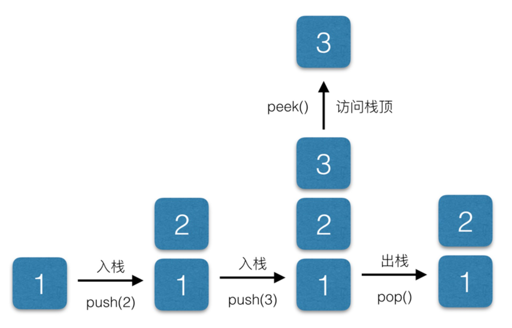
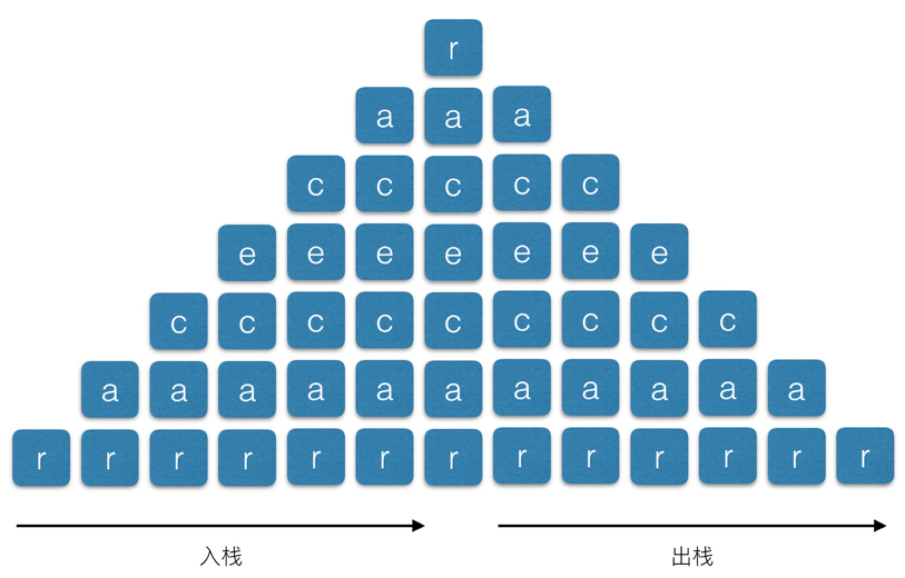

# 再剖析数据结构与算法 javascript 描述--栈（Stack）

### 栈的定义

栈是一种特殊的列表，栈内的元素只能通过列表的一端访问，这一端称为栈顶。栈具有后入先出的特点，所以任何不在栈顶的元素都无法访问。为了得到栈底的元 素，必须先拿掉上面的元素。栈是一种高 效的数据结构，因为数据只能在栈顶添加或删除，所以这样的操作很快，而且容易实现。

栈被称为一种后入先出(LIFO，last-in-first-out)的数据结构。

> 两种操作：将一个元素压入栈(`push()`)和将一个元素弹出栈(`pop()`)

<!-- more -->

### 栈的基本操作

> 上溢：当栈满之后如果再将元素压入栈则会上溢
> 下溢：当栈空之后如果再将元素弹出栈则会下溢

| 属性/方法       |        描述        |
| --------------- | :----------------: |
| dataStore(属性) |    栈的元素个数    |
| top(属性)       |     栈的计数器     |
| length(属性)    | 返回栈中元素的个数 |
| push(方法)      |      入栈方法      |
| pop(方法)       |      出栈方法      |
| peek(方法)      | 查看栈顶部元素方法 |
| clear(方法)     |     清空栈方法     |

基本操作如下图：


### Stack 类实现

主要选用数组来作为存储栈元素的容器，通过数组的原生方法来实现栈的基本操作，基本代码如下：

```javascript
class Stack {
  constructor() {
    this.dataStore = []
    this.top = 0
  }

  // push
  push(elm) {
    this.dataStore[this.top++] = elm
  }

  // pop
  pop() {
    if (this.top === 0) return '站内无元素'
    let popv = this.dataStore[--this.top]
    this.dataStore.pop()
    return popv
  }

  // peek
  peek() {
    return this.dataStore[this.top - 1]
  }

  length() {
    return this.top
  }

  clear() {
    this.top = 0
    this.dataStore = []
  }
}
```

### 实际使用

#### 回文

回文是指这样一种现象:一个单词、短语或数字，从前往后写和从后往前写都是一样的。 比如，单词“dad”、“racecar”就是回文;如果忽略空格和标点符号，下面这个句子也是回 文，“A man, a plan, a canal: Panama”;数字 1001 也是回文。

以 racecar 单词为例子，可以将字符串挨个压入定义好的栈中，然后再挨个从栈中取出元素，最终得到的值和原始值正好相反，如果相等，则是回文，反之则不是，基本图示如下：


demo 代码如下：

```javascript
function isPalindrome(word) {
  let rword = ''
  let s = new Stack()
  for (let i = 0, l = word.length; i < l; i++) {
    s.push(word[i])
  }
  while (s.length() > 0) {
    rword += s.pop()
  }
  if (rword === word) return true
  return false
}
isPalindrome('racecar') // true
isPalindrome('hello') // false
```

#### 计算阶乘

> 避免使用递归的形式

```javascript
function fact(n) {
  let s = new Stack()
  while (n > 1) {
    s.push(n--)
  }
  let product = 1
  while (s.length() > 0) {
    product *= s.pop()
  }
  return product
}
fact(5) // 120
```

#### 佩兹糖果盒问题

要求：想象一下你有一盒佩兹糖果，里面塞满了红 色、黄色和白色的糖果，但是你不喜欢黄色的糖果。使用栈(有可能用到多个栈)写一 段程序，在不改变盒内其他糖果叠放顺序的基础上，将黄色糖果移出。

最终代码如下：

```javascript
let candys = new Stack()
candys.push('red')
candys.push('yellow')
candys.push('white')
candys.push('yellow')
candys.push('white')
candys.push('red')
candys.push('white')
candys.push('red')
candys.push('yellow')

function getColor(elm, stack) {
  let filterCandys = new Stack()
  let newCandys = new Stack()
  for (let v of stack.dataStore) {
    if (v === elm) {
      newCandys.push(v)
    } else {
      filterCandys.push(v)
    }
  }
  stack.clear()

  while (filterCandys.length() > 0) {
    stack.push(filterCandys.pop())
  }
  return newCandys
}
getColor('yellow', candys)
```
