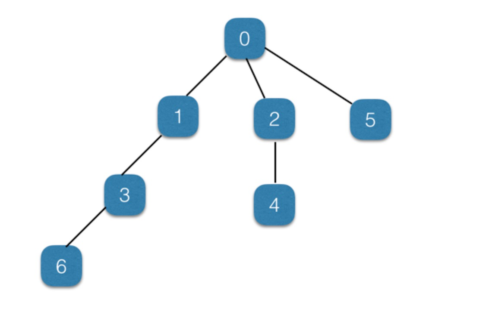
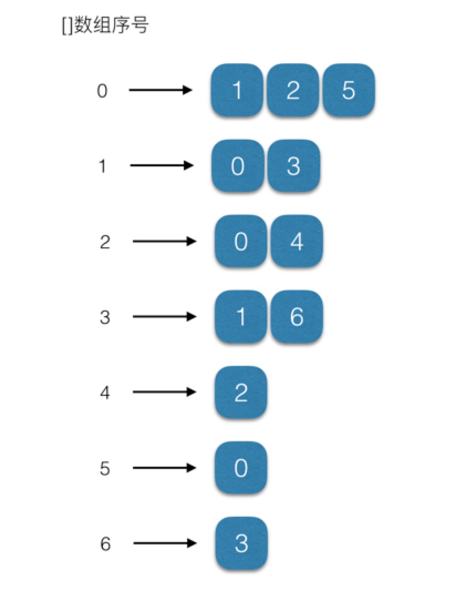
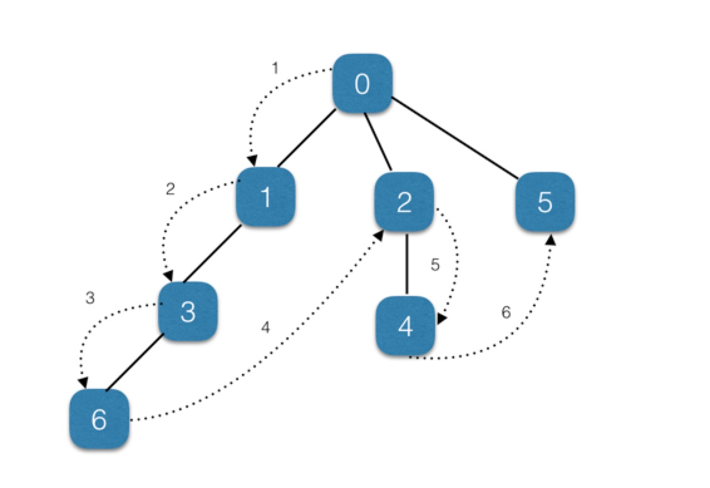
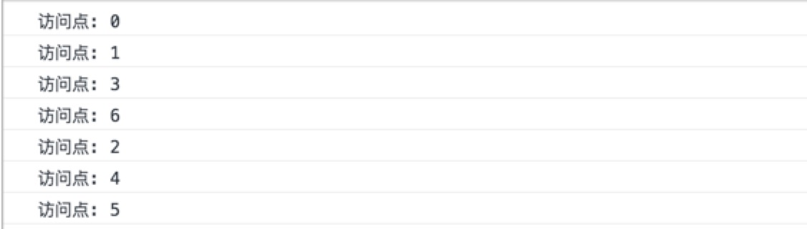
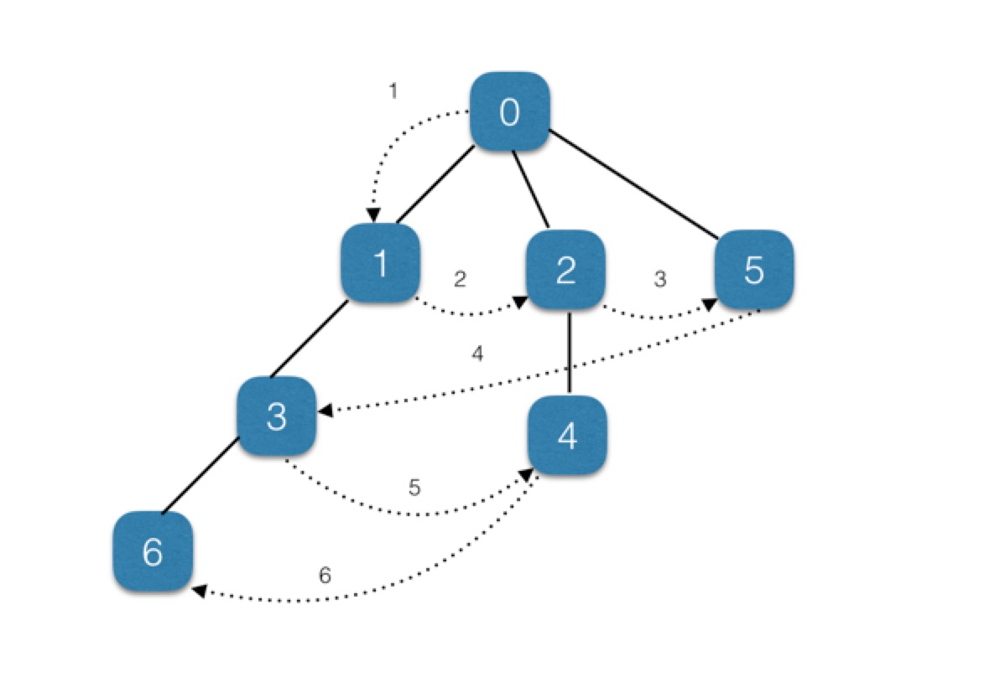
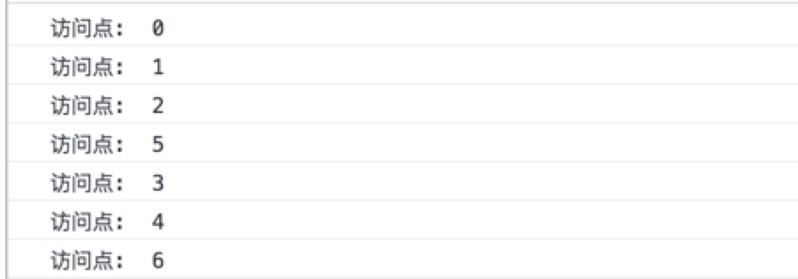
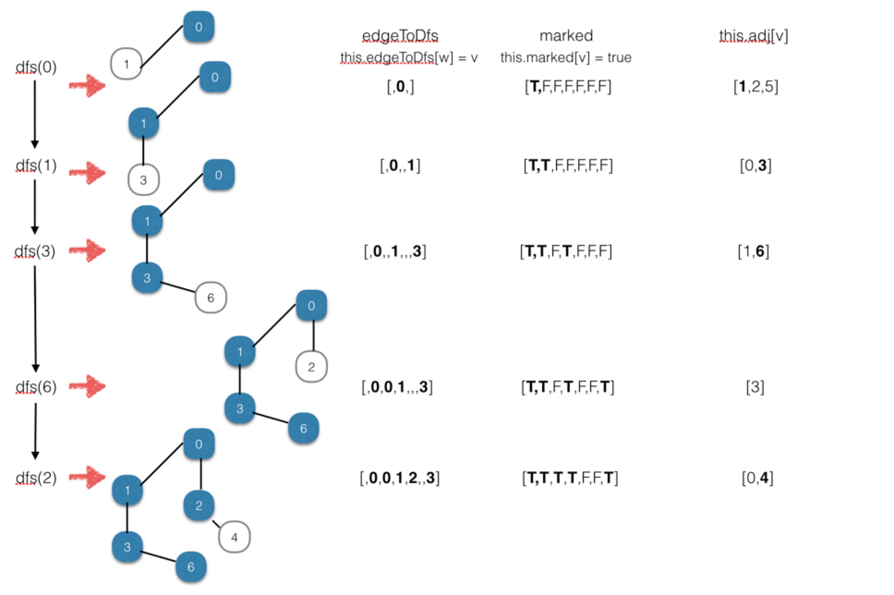
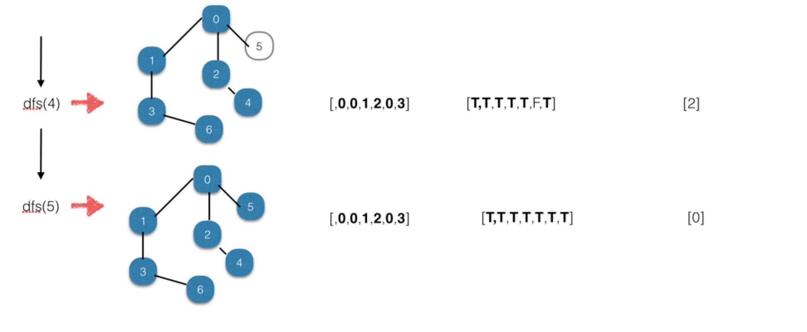
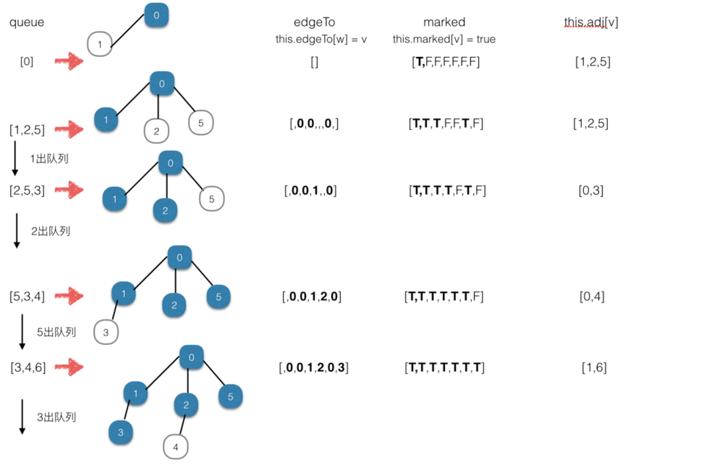
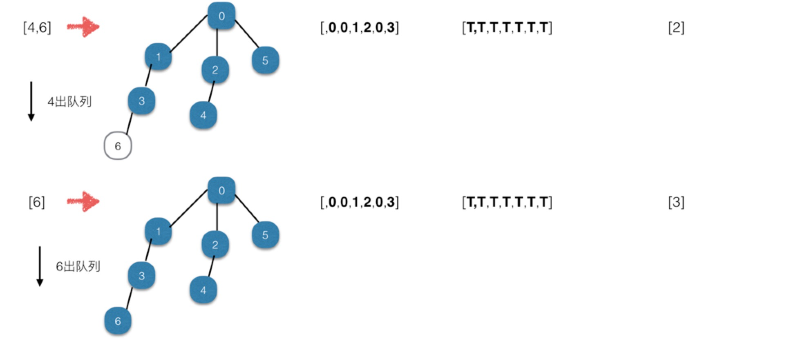

# 剖析使用 javascirpt 实现算法--无向图（Graph）（一）

### 图的定义

图有顶点和边组成的图形，图基本有以下 4 中类型：

- 无向图（简单链接）
- 有向图（链接有方向性）
- 加权图（链接带有权值）
- 加权有向图（连接既有方向又带有权值）

一般创建图有两种方法：邻接链表示法和邻接矩阵表示法

> 示例主要以邻接链表示法来创建图

<!-- more -->

以下是使用邻接链表示法创建的图，基本如下：



通过创建邻接链表，此处主要使用二维数组的方法，序号代表顶点，值代表与该顶点链接的顶点。

> 如果图不复杂的情况下，同样可以使用对象数组结合的形式，但是如果图复杂到一定程度，对象表示的图效率底下，推荐使用数组。



### 无向图

无向图为 4 中类型中最简单形式的图，该种图只是通过边链接相邻的顶点即可，根据邻接链表创建的图的原理，构建基本的图的类，基本代码如下：

```javascript
// 构建图类
class Graph {
  constructor(v) {
    this.vertices = v
    this.vertexList = []
    this.edges = 0
    this.adj = []
    for (let i = 0, l = this.vertices; i < l; i++) {
      this.adj[i] = []
    }
  }

  // 添加顶点
  addEdge(v, w) {
    this.adj[v].push(w)
    this.adj[w].push(v)
    this.edges++
  }

  // 用于显示符号名字而非数字的新函数
  showGraph() {
    for (let i = 0, l = this.vertices; i < l; i++) {
      console.log(i + ' -> ')
      for (let j = 0, k = this.vertices; j < k; j++) {
        if (this.adj[i][j] != undefined) {
          console.log(this.adj[i][j] + ' ')
        }
      }
    }
  }
}

// 测试
let g = new Graph(5)
g.addEdge(0, 1)
g.addEdge(0, 2)
g.addEdge(1, 3)
g.addEdge(2, 4)
g.showGraph()

// 输出结果如下：
// 0 -> 1 2
// 1 -> 0 3
// 2 -> 0 4
// 3 -> 1
// 4 -> 2
```

#### 深度优先搜索

深度优先搜索包括从一条路径的起始顶点开始追溯，直到到达最后一个顶点，然后回溯， 继续追溯下一条路径，直到到达最后的顶点，如此往复，直到没有路径为止。以下为图解。



因此，我们需要定义一个数组记录图中顶点是否被访问过，然后递归的执行遍历顶点的方法即可。改造后的基本代码如下：

```javascript
// 构建图类
class Graph {
  constructor(v) {
    this.vertices = v
    this.vertexList = []
    this.edges = 0
    this.adj = []
    for (let i = 0, l = this.vertices; i < l; i++) {
      this.adj[i] = []
    }
    // 记录已经访问过的顶点，初始化全部未访问
    this.marked = []
    for (let i = 0, l = this.vertices; i < l; i++) {
      this.marked[i] = false
    }
  }

  // 添加顶点
  addEdge(v, w) {
    this.adj[v].push(w)
    this.adj[w].push(v)
    this.edges++
  }

  // 用于显示符号名字而非数字的新函数
  showGraph() {
    for (let i = 0, l = this.vertices; i < l; i++) {
      console.log(i + ' -> ')
      for (let j = 0, k = this.vertices; j < k; j++) {
        if (this.adj[i][j] != undefined) {
          console.log(this.adj[i][j] + ' ')
        }
      }
    }
  }

  dfs(v) {
    this.marked[v] = true
    if (this.adj[v] != undefined) {
      console.log('访问点: ' + v)
    }
    for (let w of this.adj[v]) {
      if (!this.marked[w]) {
        this.dfs(w)
      }
    }
  }
}

let g = new Graph(7)
g.addEdge(0, 1)
g.addEdge(0, 2)
g.addEdge(1, 3)
g.addEdge(2, 4)
g.addEdge(0, 5)
g.addEdge(3, 6)
g.dfs(0)
```

测试结果如下：


#### 广度优先搜索

广度优先搜索通过利用队列的先进先出特性，将即将访问的点挨个进入队列中，然后再挨个取出，并且再将取出的顶点对应的链接点再次进行入队操作，如此反复即可，其保证访问尽可能靠近它的顶点。也就是逐层进行访问。基本图解如下：



基本原理如下：

- (1) 查找与当前顶点相邻的未访问顶点，将其添加到已访问顶点列表及队列中;
- (2) 从图中取出下一个顶点 v，添加到已访问的顶点列表;
- (3) 将所有与 v 相邻的未访问顶点添加到队列。

实现基本代码如下：

```javascript
// 构建图类
class Graph {
  constructor(v) {
    this.vertices = v
    this.vertexList = []
    this.edges = 0
    this.adj = []
    for (let i = 0, l = this.vertices; i < l; i++) {
      this.adj[i] = []
    }
    // 记录已经访问过的顶点，初始化全部未访问
    this.marked = []
    for (let i = 0, l = this.vertices; i < l; i++) {
      this.marked[i] = false
    }
  }

  // 添加顶点
  addEdge(v, w) {
    this.adj[v].push(w)
    this.adj[w].push(v)
    this.edges++
  }

  // 用于显示符号名字而非数字的新函数
  showGraph() {
    for (let i = 0, l = this.vertices; i < l; i++) {
      console.log(i + ' -> ')
      for (let j = 0, k = this.vertices; j < k; j++) {
        if (this.adj[i][j] != undefined) {
          console.log(this.adj[i][j] + ' ')
        }
      }
    }
  }

  // 广度优先算法
  bfs(s) {
    let queue = []
    this.marked[s] = true
    queue.unshift(s)
    while (queue.length > 0) {
      let v = queue.shift()
      if (v !== undefined) {
        console.log('访问点:  ' + v)
      }
      // 获取与该定点相邻的顶点
      let adjacentDot = this.adj[v]
      for (let w of adjacentDot) {
        if (!this.marked[w]) {
          this.marked[w] = true
          queue.push(w)
        }
      }
    }
  }
}

let g = new Graph(7)
g.addEdge(0, 1)
g.addEdge(0, 2)
g.addEdge(1, 3)
g.addEdge(2, 4)
g.addEdge(0, 5)
g.addEdge(3, 6)
g.bfs(0)
```

测试结果如下：


### 查找最短路径问题

图最常见的操作之一就是寻找从一个顶点到另一个顶点的最短路径。因此需要在原有的图类上再定义一个数组，用来记录当前顶点与上一个相连访问过的顶点的集合，这样可以通过数组的下标以及对应的值来计算出最优路径。

#### 使用深度优先搜索

改造后的代码如下：

```javascript
// 构建图类
class Graph {
  constructor(v) {
    this.vertices = v
    this.vertexList = []
    this.edges = 0
    this.adj = []
    for (let i = 0, l = this.vertices; i < l; i++) {
      this.adj[i] = []
      // this.adj[i].push('')
    }
    // 记录已经访问过的顶点，初始化全部未访问
    this.marked = []
    for (let i = 0, l = this.vertices; i < l; i++) {
      this.marked[i] = false
    }

    // 数组序号代表访问的顶点，值代表与当前点链接的点且是上一个访问过的点
    this.edgeTo = []
  }

  // 添加顶点
  addEdge(v, w) {
    this.adj[v].push(w)
    this.adj[w].push(v)
    this.edges++
  }

  // 用于显示符号名字而非数字的新函数
  showGraph() {
    for (let i = 0, l = this.vertices; i < l; i++) {
      console.log(i + ' -> ')
      for (let j = 0, k = this.vertices; j < k; j++) {
        if (this.adj[i][j] != undefined) {
          console.log(this.adj[i][j] + ' ')
        }
      }
    }
  }

  dfs(v) {
    this.marked[v] = true
    if (this.adj[v] != undefined) {
      console.log('访问点: ' + v)
    }
    for (let w of this.adj[v]) {
      if (!this.marked[w]) {
        this.edgeToDfs[w] = v
        this.dfs(w)
      }
    }
  }

  pathToDfs(s, v) {
    if (!this.hashPathTo(v)) {
      return undefined
    }
    let path = []
    // 在相邻边数组中寻找
    while (v !== s) {
      path.push(v)
      v = this.edgeToDfs[v]
    }
    path.push(s) //将起始节点加进最短路径数组
    return path
  }

  hashPathTo(v) {
    return this.marked[v]
  }
}

// 测试代码
let g = new Graph(7)
g.addEdge(0, 1)
g.addEdge(0, 2)
g.addEdge(1, 3)
g.addEdge(2, 4)
g.addEdge(0, 5)
g.addEdge(3, 6)
g.dfs(0)
// 测试最短路径
var paths = g.pathToDfs(0, 4)
while (paths.length > 0) {
  if (paths.length > 1) {
    console.log(paths.pop() + '-')
  } else {
    console.log(paths.pop())
  }
}

// 测试结果 0-2-4
```

基本图解如下：



看似似乎没什么问题，但是如果创建带环的图，测试结果就不是正确的结果，修改测试代码：

```javascript
let g = new Graph(7)
g.addEdge(0, 1)
g.addEdge(0, 2)
g.addEdge(1, 3)
g.addEdge(2, 4)
g.addEdge(0, 5)
g.addEdge(3, 6)
g.addEdge(6, 4)
g.dfs(0)
// 测试最短路径
var paths = g.pathToDfs(0, 4)
while (paths.length > 0) {
  if (paths.length > 1) {
    console.log(paths.pop() + '-')
  } else {
    console.log(paths.pop())
  }
}
// 0-1-3-6-4
```

测试结果是`0-1-3-6-4`而并非是`0-2-4`，这是由于深度优先搜索的原理导致的，它的原理是从一个顶点一直访问到最末节点，然后再回溯，从相邻的顶点继续向下访问。所以在初次遍历的时候，记录的完整访问路径是：`0-1-3-6-4-2-5`，因此深度优先搜索不能完全解决。

#### 使用广度优先搜索

改造后的代码如下：

```javascript
// 构建图类
class Graph {
  constructor(v) {
    this.vertices = v
    this.vertexList = []
    this.edges = 0
    this.adj = []
    for (let i = 0, l = this.vertices; i < l; i++) {
      this.adj[i] = []
      // this.adj[i].push('')
    }
    // 记录已经访问过的顶点，初始化全部未访问
    this.marked = []
    for (let i = 0, l = this.vertices; i < l; i++) {
      this.marked[i] = false
    }

    // 数组序号代表访问的顶点，值代表与当前点链接的点且是上一个访问过的点
    this.edgeTo = []
  }

  // 添加顶点
  addEdge(v, w) {
    this.adj[v].push(w)
    this.adj[w].push(v)
    this.edges++
  }

  // 用于显示符号名字而非数字的新函数
  showGraph() {
    for (let i = 0, l = this.vertices; i < l; i++) {
      console.log(i + ' -> ')
      for (let j = 0, k = this.vertices; j < k; j++) {
        if (this.adj[i][j] != undefined) {
          console.log(this.adj[i][j] + ' ')
        }
      }
    }
  }

  // 广度优先算法
  bfs(s) {
    let queue = []
    this.marked[s] = true
    queue.unshift(s)
    while (queue.length > 0) {
      let v = queue.shift()
      if (v !== undefined) {
        console.log('访问点:  ' + v)
      }
      // 获取与该定点相邻的顶点
      let adjacentDot = this.adj[v]
      for (let w of adjacentDot) {
        if (!this.marked[w]) {
          this.edgeTo[w] = v
          this.marked[w] = true
          queue.push(w)
        }
      }
    }
  }

  // 存储与指定顶点有共同边的所有顶点
  pathTo(s, v) {
    if (!this.hashPathTo(v)) {
      return undefined
    }
    let path = []
    // 在相邻边数组中寻找
    while (v !== s) {
      path.push(v)
      v = this.edgeTo[v]
    }
    path.push(s) //将起始节点加进最短路径数组
    return path
  }

  hashPathTo(v) {
    return this.marked[v]
  }
}

// 测试代码
let g = new Graph(7)
g.addEdge(0, 1)
g.addEdge(0, 2)
g.addEdge(1, 3)
g.addEdge(2, 4)
g.addEdge(0, 5)
g.addEdge(3, 6)
g.bfs(0)
// 测试最短路径
var paths = g.pathTo(0, 4)
while (paths.length > 0) {
  if (paths.length > 1) {
    console.log(paths.pop() + '-')
  } else {
    console.log(paths.pop())
  }
}

// 结果 0-2-4
```

基本图解如下：



我们可以按照测试深度优先搜索的形式更改测试代码，看看结果是否依然正确：

```javascript
let g = new Graph(7)
g.addEdge(0, 1)
g.addEdge(0, 2)
g.addEdge(1, 3)
g.addEdge(2, 4)
g.addEdge(0, 5)
g.addEdge(3, 6)
g.addEdge(6, 4)
g.bfs(0)
// 测试最短路径
var paths = g.pathToDfs(0, 4)
while (paths.length > 0) {
  if (paths.length > 1) {
    console.log(paths.pop() + '-')
  } else {
    console.log(paths.pop())
  }
}
// 0-2-4
```

经过测试发现结果依然是`0-2-4`，说明对于图中是否有环并不会对最短路径搜索造成影响。
