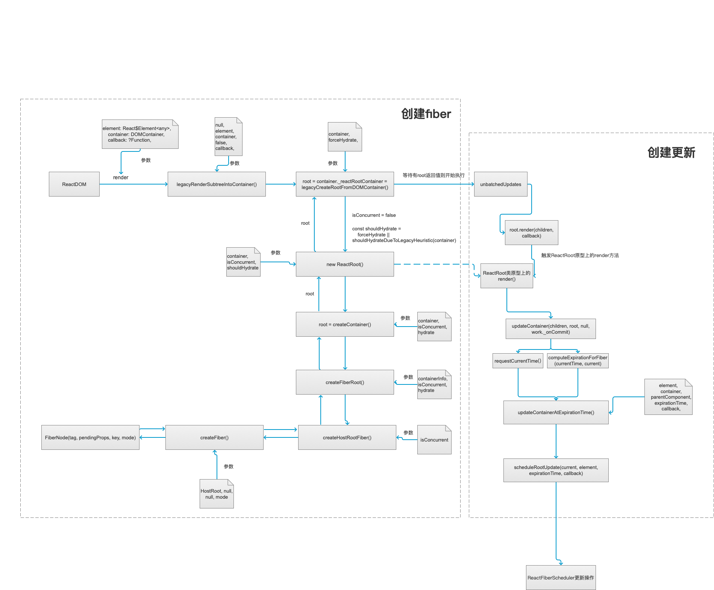

# react 源码分析之 Fiber 对象创建介绍分析（四）

## 回顾 ReactElement 分析

在分析`ReactElement`时，最后遗留的一个问题，就是`ReactCurrentOwner`是什么东西，顺着源码的路径，可以很容易找到，`ReactCurrentOwner.current`对应的就是一个`Fiber`对象，也就是`ReactElement`在被创建的时候，外加了一个`Fiber`对象，那么问题来了，`Fiber`对象到底是干什么的？

`Fiber`是 React 核心算法的持续重新实现，看似 react16+似乎是平滑升级，其实内部算法重新实现了，当然也包括`Hooks`的先关功能。在早期 react 版本中的调度更新逻辑大致是，递归遍历所有的 Virtual DOM 节点，进行 Diff，一旦开始无法中断，要等整棵 Virtual DOM 树计算完成之后，才将任务出栈释放主线程。而浏览器中的渲染引擎是单线程的，除了网络操作，几乎所有的操作都在这个单线程中执行，此时如果主线程上用户交互、动画等周期性任务无法立即得到处理，影响体验。

而`Fiber`改进思路是将调度阶段拆分成一系列小任务，每次加入一个节点至任务中，做完看是否还有时间继续下一个任务，有的话继续，没有的话把自己挂起，主线程不忙的时候再继续。每次只做一小段，做完一段就把时间控制权交还给主线程，而不像之前长时间占用，从而实现对任务的暂停、恢复、复用灵活控制，这样主线程上的用户交互及动画可以快速响应，从而解决卡顿的问题。

前面介绍过，在创建`ReactElement`的时候会外加一个`Fiber`对象，那么，`react`什么时候开始渲染这些创建好的虚拟 dom 呢，在实际项目中，我们往往会在入口文件写类似这样的代码`ReactDOM.render( <Router history={history}> <Routers /> </Router>, document.getElementById('app') )`，这样就很清楚，`ReactElement`负责构建基础的`dom`，`ReactDOM.render`负责开始渲染虚拟`dom`，顺着这个思路，去看`react-dom/src/client/ReactDOM.js`入口文件（client 主要是浏览器端的使用的），经过梳理，大致流程图如下：



> 流程图介绍主要的流程，后续会继续完善

根据总结的，索性把`ReactDOM.render`分成了量大部分，一个是如何创建`Fiber`对象，一个是`创建更新`，最终交给`ReactFiberScheduler去做更新相关操作`，也就是`react`会有单独的`调度器`去管理更新逻辑。

这次先主要分析下创建`Fiber`的相关内容

## 分析

先从`react-dom/src/client/ReactDOM.js`入口文件去看，可以在`648行和672行`左右看见如下代码片段：

```js
hydrate(element: React$Node, container: DOMContainer, callback: ?Function) {
    invariant(
      isValidContainer(container),
      'Target container is not a DOM element.',
    );
    // __DEV__代码省略
    return legacyRenderSubtreeIntoContainer(
      null,
      element,
      container,
      true,
      callback,
    );
  },
render(
    element: React$Element<any>,
    container: DOMContainer,
    callback: ?Function,
  ) {
    invariant(
      isValidContainer(container),
      'Target container is not a DOM element.',
    );
    // __DEV__省略
    return legacyRenderSubtreeIntoContainer(
      null,
      element,
      container,
      false,
      callback,
    );
  },
```

> `ReactDOM`对象上还有其他方法，其他可以[参考官网介绍](https://zh-hans.reactjs.org/docs/react-dom.html)

以上两个方法都是`ReactDOM`对象上的方法，你会发现二者都调用了`legacyRenderSubtreeIntoContainer`函数，唯一不同的是在`hydrate`的时候第四个参数传入的是`true`，`hydrate`主要是用于服务端渲染时候客户端执行的方法，它会判断服务端返回的 html 和客户端是否相同，当然，初次渲染会是相同的，所以会直接使用客户端的 html，这样就不必要再去创建，提高性能。[参考](https://zh-hans.reactjs.org/docs/react-dom.html#hydrate)

顺着这个函数继续往下看，`legacyRenderSubtreeIntoContainer`内部又调用了`legacyCreateRootFromDOMContainer`函数，我们直接先看这个函数，片段代码如下：

```js
const shouldHydrate =
  forceHydrate || shouldHydrateDueToLegacyHeuristic(container)
// First clear any existing content.
if (!shouldHydrate) {
  let warned = false
  let rootSibling
  while ((rootSibling = container.lastChild)) {
    // __DEV__省略
    container.removeChild(rootSibling)
  }
  // __DEV__省略
  const isConcurrent = false
  return new ReactRoot(container, isConcurrent, shouldHydrate)
}
```

首先你会发现，先判断`shouldHydrate`是否存在，这就跟最开始说的`render`和`hydrate`传递参数有关系了，`render`传入的是 false，所以这里会将原本`container`全部删除，再去`new ReactRoot`操作，而使用`hydrate`则不会去删除这些`child`元素，提高性能。

继续看`new ReactRoot`执行操作，片段代码如下：

```js
function ReactRoot(
  container: DOMContainer,
  isConcurrent: boolean,
  hydrate: boolean
) {
  const root = createContainer(container, isConcurrent, hydrate)
  this._internalRoot = root
}

ReactRoot.prototype.render = function(
  children: ReactNodeList,
  callback: ?() => mixed
): Work {
  const root = this._internalRoot
  const work = new ReactWork()
  callback = callback === undefined ? null : callback
  if (__DEV__) {
    warnOnInvalidCallback(callback, 'render')
  }
  if (callback !== null) {
    work.then(callback)
  }
  updateContainer(children, root, null, work._onCommit)
  return work
}
```

这里主要介绍构造函数初始化的时候执行的方法，以及原型链上的`render`方法，因创建好之后，最终会执行这里的`render`方法去创建更新操作，这个内容后面会介绍，先看构造函数中初始化调用了`createContainer`方法，跟着这个函数继续查看源码。

`createContainer`这个方法源码在`react-reconciler/src/ReactFiberReconciler.js`文件下，很简单，就是调用了`createFiberRoot`方法

```js
export function createContainer(
  containerInfo: Container,
  isConcurrent: boolean,
  hydrate: boolean
): OpaqueRoot {
  return createFiberRoot(containerInfo, isConcurrent, hydrate)
}
```

顺着这个继续往下找，`createFiberRoot`(`react-reconciler/src/ReactFiberRoot.js`)，片段源码如下：

```js
export function createFiberRoot(
  containerInfo: any,
  isConcurrent: boolean,
  hydrate: boolean
): FiberRoot {
  const root: FiberRoot = (new FiberRootNode(containerInfo, hydrate): any)
  const uninitializedFiber = createHostRootFiber(isConcurrent)
  root.current = uninitializedFiber
  uninitializedFiber.stateNode = root

  return root
}
```

`createHostRootFiber`这个函数又是`react-reconciler/src/ReactFiber.js`下的一个方法。

其实看到`createFiberRoot`以及`createHostRootFiber`函数内部的调用的方法，其实最终就是返回一个`FiberRoot`对象，并且在这个对象上`current`属性映射的是`FiberNode`。

到这里终于找到了之前的疑问，`Fiber`在哪创建的，首先先介绍的介绍下这两个对象上挂载的属性含义，大体解释如下：

**_`FiberRoot`对象是由两个对象合并而成的，基本如下：_**

```js
type BaseFiberRootProperties = {|
  // ReactDom.render方法传入的第二个参数，需要挂载在哪个节点上
  containerInfo: any,
  // 仅仅在持久更新使用
  pendingChildren: any,
  // 对应的就是FiberNode对象，可以理解是根结点上的子对象
  current: Fiber,

  // 暂时没发现用途
  pingCache:
    | WeakMap<Thenable, Set<ExpirationTime>>
    | Map<Thenable, Set<ExpirationTime>>
    | null,

  // 正在等待提交的任务的expirationTime
  pendingCommitExpirationTime: ExpirationTime,
  // 已经完成的任务的FiberRoot对象，准备去commit
  finishedWork: Fiber | null,
  // 用于任务在被挂起的时候，通过setTimeout设置的返回内容，用来下一次如果有新的任务挂起时清理还没触发的timeout
  timeoutHandle: TimeoutHandle | NoTimeout,
  // 顶层context对象，只有主动调用`renderSubtreeIntoContainer`时才会有用
  context: Object | null,
  pendingContext: Object | null,
  // 初始化渲染是否会直接复用客户端dom结构
  +hydrate: boolean,
  // 顶层批次（批处理任务？）这个变量指明一个commit是否应该被推迟
  // 同时包括完成之后的回调
  firstBatch: Batch | null,
  // Scheduler.scheduleCallback返回的节点
  callbackNode: *,
  // 根据ExpirationTime调用root上的相关联的callback
  callbackExpirationTime: ExpirationTime,
  // DOM树中最早开始等待执行任务的ExpirationTime
  firstPendingTime: ExpirationTime,
  // DOM树中最晚开始等待执行任务的ExpirationTime
  lastPendingTime: ExpirationTime,
  // 暂停组件ping根再次渲染的ExpirationTime
  pingTime: ExpirationTime
|}

type ProfilingOnlyFiberRootProperties = {|
  interactionThreadID: number,
  memoizedInteractions: Set<Interaction>,
  pendingInteractionMap: PendingInteractionMap
|}

export type FiberRoot = {
  ...BaseFiberRootProperties,
  ...ProfilingOnlyFiberRootProperties
}
```

**_`Fiber`对象如下：_**

```js
// react-reconciler/src/ReactFiber.js
export type Fiber = {|
  // 标记不同的组件类型，不同的更新方式
  tag: WorkTag,

  // fiber的唯一标示
  key: null | string,

  // 对应ReactCreateElement传入的类型：组件（原生react全局组件），字符串，标签等
  elementType: any,

  // 异步resolved返回的类型为function或者class的组件
  type: any,

  // 跟当前Fiber相关本地状态.
  stateNode: any,

  // 返回当前节点的父节点的fiber
  return: Fiber | null,

  // 单链表结构
  // 父节点链接的第一个子节点
  child: Fiber | null,
  // 子节点的兄弟节点
  sibling: Fiber | null,
  // 序数
  index: number,

  // ref
  ref: null | (((handle: mixed) => void) & { _stringRef: ?string }) | RefObject,

  pendingProps: any, // 新的props属性参数
  memoizedProps: any, // 完成更新的上一次props属性参数

  // 状态更新回调函数队列
  updateQueue: UpdateQueue<any> | null,

  // 上一次更新的state，新 state 是由 updateQueue 计算出来的然后覆盖这里
  memoizedState: any,

  // fiber的上下文依赖
  contextDependencies: ContextDependencyList | null,

  mode: TypeOfMode,

  // Effect标记
  effectTag: SideEffectTag,

  // 单链列表对应的下一个Effect的fiber
  nextEffect: Fiber | null,

  // 单链列表中第一个fiber
  firstEffect: Fiber | null,
  // 单链列表中最后一个fiber
  lastEffect: Fiber | null,

  // 表示将来完成此任务花的时间.
  // 不包括在其子树中产生的任务.
  expirationTime: ExpirationTime,

  // 用于快速确定子树是否没有等待任务
  childExpirationTime: ExpirationTime,

  // 一个副本的fiber
  alternate: Fiber | null,

  // 为当前更新渲染此fiber以及嵌套的fiber更新所花费的时间
  // 此字段仅在启用enableProfilerTimer标志时设置。
  actualDuration?: number,

  // 记录当前fiber更新的开始时间
  // 此字段仅在启用enableProfilerTimer标志时设置。
  actualStartTime?: number,

  // 记录fiber持续更新的时间
  // 此字段仅在启用enableProfilerTimer标志时设置。
  selfBaseDuration?: number,

  // 记录当前fiber子树上的所以fiber的更新时间
  // 此字段仅在启用enableProfilerTimer标志时设置。
  treeBaseDuration?: number,

  // 以下是dev环境下使用，暂不考虑
  // __DEV__ only
  _debugID?: number,
  _debugSource?: Source | null,
  _debugOwner?: Fiber | null,
  _debugIsCurrentlyTiming?: boolean,
  _debugHookTypes?: Array<HookType> | null
|}
```

## 总结

本文回答了在[`ReactElement分析中的问题`](https://github.com/wqzwh/blog/blob/master/2019/2019-05-16-react-ReactElement.md)

这里只是大致介绍了`FiberRoot`和`Fiber`在哪被创建的，以及这两个对象的对应属性的解释，依然会有很多疑问：

- `Fiber`核心算法到底如何实现的？`FiberRoot`和`Fiber`对象上的属性到底是如何工作的，在哪里被使用了？
- `hydrate`如果后端返回的 html 和前端不一致，该如何融合呢？

## 参考

[Lin Clark - A Cartoon Intro to Fiber - React Conf 2017](https://www.youtube.com/watch?v=ZCuYPiUIONs)
[React Fiber Architecture](https://github.com/acdlite/react-fiber-architecture)
[ReactDOM](https://zh-hans.reactjs.org/docs/react-dom.html)
