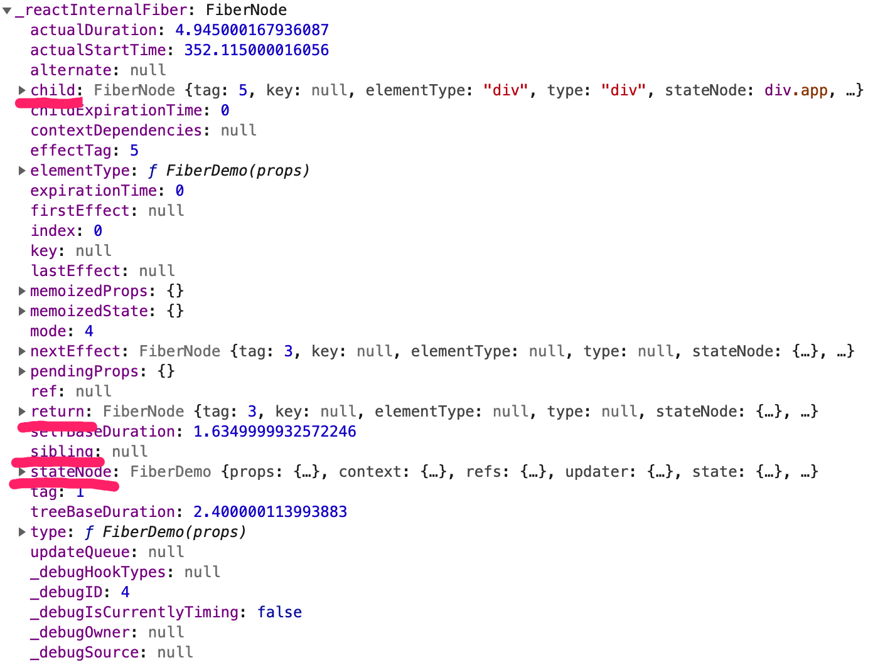
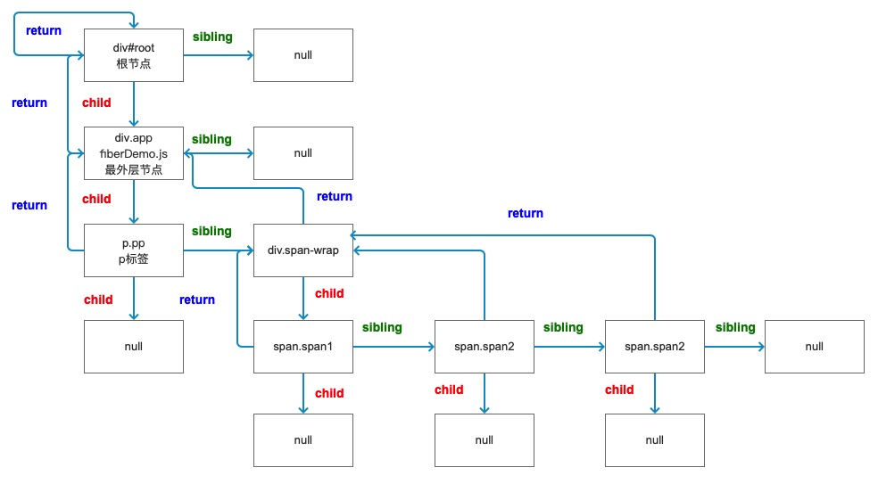

#react 源码分析之 Fiber 渲染结构以及 expirationTime 剖析

## 回顾

上篇介绍的创建 Fiber 对象上的属性的含义，接下来大致介绍下 Fiber 上的各属性到底是如何工作的，分为以下几项：

- FiberNode 节点到底是什么样子的
- 每个 FiberNode 节点如何来判断暂停、恢复、复用

### FiberNode 节点

先根据上篇文章源码分析最开始的一个方法`createContainer`，这个主要是创建`FiberNode`节点，最终返回给定义的变量`root`，多个`FiberNode`节点其实是跟`Virtual Dom`一一对应，以下是一段测试代码，来分析最终生成`FiberNode`结构：

```js
// fiber.js
import React, { Component } from 'react'

class FiberDemo extends Component {
  constructor(props) {
    super(props)
    this.state = {}
  }
  componentDidMount() {
    console.log(this)
  }
  render() {
    return (
      <div className="app">
        <p className="pp">p标签</p>
        <div className="span-wrap">
          {[1, 2, 3].map((item, index) => {
            return (
              <span className={'span' + item} key={index}>
                {item}
              </span>
            )
          })}
        </div>
      </div>
    )
  }
}

export default FiberDemo

// 入口文件
import React from 'react'
import ReactDOM from 'react-dom'
import FiberDemo from './views/fiber/'

ReactDOM.render(<FiberDemo />, document.getElementById('root'))
```

根据上面的测试代码，可以看出生成的节点结构大致如下，主要关注`child`、`return`、`sibling`、`stateNode`这几个属性（在[上篇文章](https://github.com/wqzwh/blog/blob/master/2019/2019-05-26-react-fiber.md)中也介绍过这几个属性的作用，多个`FiberNode`节点连接的重要属性）



首先可以确定`stateNode`其实就是当前节点信息；`sibling`是连接的兄弟节点；`return`返回的是当前节点的父亲节点，如果当前节点是根节点，则返回自己；`child`节点的子节点。根据以上打印结果可以大致画出`FiberNode`结构如下：



根据上图结构，一个完整的`FiberNode`是一个双向链表结构，到这就可以清除的了解到，`FiberNode`节点最终是以这种形式组成一个虚拟 dom 节点的，我们在回到上一篇文章中`ReactRoot`源码：

```js
function ReactRoot(
  container: DOMContainer,
  isConcurrent: boolean,
  hydrate: boolean
) {
  const root = createContainer(container, isConcurrent, hydrate)
  this._internalRoot = root
}

ReactRoot.prototype.render = function(
  children: ReactNodeList,
  callback: ?() => mixed
): Work {
  const root = this._internalRoot
  const work = new ReactWork()
  callback = callback === undefined ? null : callback
  // dev代码省略
  if (callback !== null) {
    work.then(callback)
  }
  updateContainer(children, root, null, work._onCommit)
  return work
}
```

### 开始更新

以及对照上一篇文章的的流程图，最终创建完`root`节点之后，就会触发`render`方法，由上面源码可见，在返回`work`之前先触发`new ReactWork()`操作和`updateContainer`方法，先简要的介绍下`ReactWork`是干什么的，当然这里比较重要的是还是`updateContainer`，它涉及到组件的调度更新。

为了更好的理解`updateContainer`方法参数，所以先说明下`ReactWork`是干什么的，先贴源码：

```js
function ReactWork() {
  this._callbacks = null
  this._didCommit = false
  this._onCommit = this._onCommit.bind(this)
}
ReactWork.prototype.then = function(onCommit: () => mixed): void {
  if (this._didCommit) {
    onCommit()
    return
  }
  let callbacks = this._callbacks
  if (callbacks === null) {
    callbacks = this._callbacks = []
  }
  callbacks.push(onCommit)
}
ReactWork.prototype._onCommit = function(): void {
  if (this._didCommit) {
    return
  }
  this._didCommit = true
  const callbacks = this._callbacks
  if (callbacks === null) {
    return
  }
  for (let i = 0; i < callbacks.length; i++) {
    const callback = callbacks[i]
    // 省略
    callback()
  }
}
```

首先说明下`ReactRoot`原型上的`render`方法的第三个参数就是`ReactDOM.render`的第三个回调函数参数，一般开发不会传递第三个参数，假设传递第三个参数，那么通过`then`方法中定义`this._callbacks`来管理所有的回调函数，然后在`_onCommit`中去执行`this._callbacks`里面所有的回调函数，这里通过一个`this._didCommit`标记来判断是否直接运行，可以来判断回调函数是否需要直接调用或者先入队再被调用，从第一`render`情况来开，是先`push`了，然后在遍历`callbacks`进行执行`callback`。

再讲回到重点`updateContainer`函数到底做了什么，可以找到`react-reconciler/src/ReactFiberReconciler.js`中的`updateContainer`方法，源码基本如下：

```js
export function updateContainer(
  element: ReactNodeList,
  container: OpaqueRoot,
  parentComponent: ?React$Component<any, any>,
  callback: ?Function
): ExpirationTime {
  const current = container.current
  const currentTime = requestCurrentTime()
  const expirationTime = computeExpirationForFiber(currentTime, current)
  return updateContainerAtExpirationTime(
    element,
    container,
    parentComponent,
    expirationTime,
    callback
  )
}
```

这里是从 render 函数中执行过来的，所以先说明下参数的意义，`element`就是`ReactDOM.render`中的渲染入口组件，`container`其实就是一个完整`Fiber`结构，`parentComponent`第一次是 null，`callback`就是`ReactDOM.render`的第三个回调函数参数。

这里会先定义一个`currentTime`变量来接收`requestCurrentTime()`方法的返回值，找到`requestCurrentTime`方法源码，如下：

```js
// msToExpirationTime方法源码
const UNIT_SIZE = 10
const MAGIC_NUMBER_OFFSET = MAX_SIGNED_31_BIT_INT - 1 // MAX_SIGNED_31_BIT_INT（最大31位整数。32位系统的V8中的最大整数大小） = 1073741823

export function msToExpirationTime(ms: number): ExpirationTime {
  // 保证不会与NoWork产生冲突
  return MAGIC_NUMBER_OFFSET - ((ms / UNIT_SIZE) | 0)
}

// requestCurrentTime方法源码
const NotWorking = 0
const RenderPhase = 4
const CommitPhase = 5
let workPhase: WorkPhase = NotWorking
let initialTimeMs: number = now()
let currentEventTime: ExpirationTime = NoWork // 初始值是0

export function requestCurrentTime() {
  if (workPhase === RenderPhase || workPhase === CommitPhase) {
    return msToExpirationTime(now() - initialTimeMs)
  }
  if (currentEventTime !== NoWork) {
    return currentEventTime
  }
  // React的第一次更新，计算新的开始时间
  currentEventTime = msToExpirationTime(now() - initialTimeMs)
  return currentEventTime
}
```

> `now()`是`performance.now()`，这个相对与`Date.now()`精确度更高，但是兼容性支持 ie10+，并且是单调递增的，当前时间与 performance.timing.navigationStart 的时间差，以微秒（百万分之一秒）为单位的时间。

这里有个细节，就是有个判断`currentEventTime !== NoWork`，其实主要作为来缓存`currentEventTime`，不至于每次都进行`msToExpirationTime`计算操作。

在首次渲染会触发`msToExpirationTime`很好理解，当`workPhase`工作阶段处于渲染阶段或者最后的提交阶段会触发`msToExpirationTime`重新计算，很好理解，这个时候涉及到真是 DOM 的构建及渲染，涉及到更新流程，而在`workPhase`开始的阶段是会使用缓存的`currentEventTime`

`currentTime`通过`requestCurrentTime`计算得出当前时间，并且传给`computeExpirationForFiber`这个方法来计算`expirationTime`，先贴出相关源码(`react-reconciler/src/ReactFiberScheduler.js`)：

```js
export function computeExpirationForFiber(
  currentTime: ExpirationTime,
  fiber: Fiber
): ExpirationTime {
  if ((fiber.mode & ConcurrentMode) === NoContext) {
    return Sync
  }

  if (workPhase === RenderPhase) {
    return renderExpirationTime
  }

  let expirationTime
  const priorityLevel = getCurrentPriorityLevel()
  switch (priorityLevel) {
    case ImmediatePriority:
      expirationTime = Sync
      break
    case UserBlockingPriority:
      expirationTime = computeInteractiveExpiration(currentTime)
      break
    case NormalPriority:
    case LowPriority:
      expirationTime = computeAsyncExpiration(currentTime)
      break
    case IdlePriority:
      expirationTime = Never
      break
    default:
      invariant(false, 'Expected a valid priority level')
  }

  if (workInProgressRoot !== null && expirationTime === renderExpirationTime) {
    expirationTime -= 1
  }

  return expirationTime
}
```

从这里可以看出`getCurrentPriorityLevel`方法来定义不同优先级的`expirationTime`类型，先不去关注，继续查看`computeInteractiveExpiration`和`computeAsyncExpiration`方法，打开`react-reconciler/src/ReactFiberExpirationTime.js`查看源码：

```js
export const LOW_PRIORITY_EXPIRATION = 5000
export const LOW_PRIORITY_BATCH_SIZE = 250

export function computeAsyncExpiration(
  currentTime: ExpirationTime
): ExpirationTime {
  return computeExpirationBucket(
    currentTime,
    LOW_PRIORITY_EXPIRATION,
    LOW_PRIORITY_BATCH_SIZE
  )
}

export const HIGH_PRIORITY_EXPIRATION = __DEV__ ? 500 : 150
export const HIGH_PRIORITY_BATCH_SIZE = 100

export function computeInteractiveExpiration(currentTime: ExpirationTime) {
  return computeExpirationBucket(
    currentTime,
    HIGH_PRIORITY_EXPIRATION,
    HIGH_PRIORITY_BATCH_SIZE
  )
}

function ceiling(num: number, precision: number): number {
  return (((num / precision) | 0) + 1) * precision
}

function computeExpirationBucket(
  currentTime,
  expirationInMs,
  bucketSizeMs
): ExpirationTime {
  return (
    MAGIC_NUMBER_OFFSET -
    ceiling(
      MAGIC_NUMBER_OFFSET - currentTime + expirationInMs / UNIT_SIZE,
      bucketSizeMs / UNIT_SIZE
    )
  )
}
```

`computeInteractiveExpiration`和`computeAsyncExpiration`方法都依赖其实最终`computeExpirationBucket`方法，但是根据之前说的`expirationTime`优先级不同会传入外部不同的全局变量，这里我们以`computeExpirationBucket`方法为例，看看`expirationTime`到底是如何计算的，根据上面的代码其实最终计算方法是，`expirationTime = (((((1073741823 - 1) - (1073741823 - 1 - ((performance.now() / 10) | 0)) + 5000 / 10)/ (250 / 10))| 0)+ 1)*(250 / 10)`

- MAGIC_NUMBER_OFFSET = 1073741823（32 位系统的 V8 中的最大整数大小） - 1
- currentTime = (1073741823 - 1) - (1073741823 - 1 - ((performance.now() / 10) | 0))
- LOW_PRIORITY_EXPIRATION = 5000
- LOW_PRIORITY_BATCH_SIZE = 250

> 这里也会有个疑问，为什么会用 32 位系统的 V8 中的最大整数大小作为基数

可以看出`currentTime`是个根据`performance.now()`变化而变化的变量，因为`performance.now()`会得出一个小数，将`performance.now()/10`个人理解是 10 微秒的误差，`(performance.now() / 10) | 0`只是做取整操作，对于`-1`操作可以忽略不计，那么可以使用一个自定义数字代替`currentTime`来做计算，你会发现，当你设置`currentTime=1811925至currentTime=1811949`时，计算结果都是`1812450`，当设置为`currentTime=1811950`时，结果`1812475`。并且再继续设置，会发现这个时以`25`的量级递增，因为这里计算`expirationTime`相对比较独立，具体可以使用剥离出来的[源码](https://github.com/wqzwh/blog/tree/master/demo/expirationTime.js)自己做测试。

以上可以得出一个很重要的结论，如果`React`在计算`expirationTime`的时候会有一个`25ms`的差值，其实就是如果有两个`React`组件在`25ms`内都触发了更新操作，那么`React`不会将更新两次，而是认为他们的`expirationTime`时一样的，当作一次进行更新。其实从上面文章就可以知道，每个组件都是会生成一个`Fiber`对象，而这个对象上有挂载`expirationTime`相关的属性内容，也就是`React`将每个组件都附上这个计算时间属性，从而可以进行最细力度话的来计算那些组件应该要更新。

## 总结

这篇主要介绍了`FiberNode`最终是以什么结构展示，控制每个`FiberNode`更新操作的`expirationTime`的计算内容，同时也遗留了以下几个疑问：

- 上文说的`workPhase`每个工作阶段是在哪执行的？
- 每个`FiberNode`上的`expirationTime`到底是如何控制组件的更新流程的（回答文章最开的是问题）
