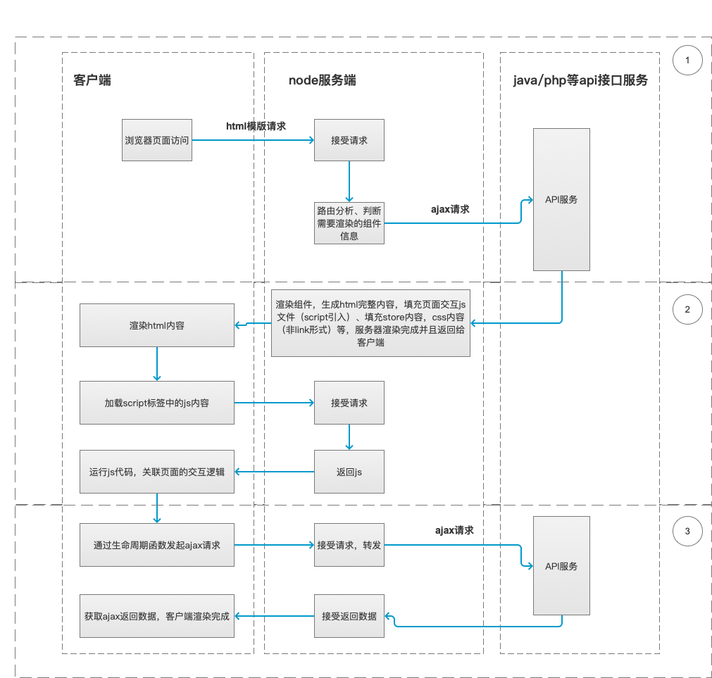

# react 原生构建 SSR 框架及 NSR 实践方案的思考

## 前言

`SSR`技术方案其实已经不算什么新颖的技术了，说的简单点，就是服务端直接返回`html`字符串给浏览器，浏览器直接解析`html`字符串生成`DOM`结构，
不但可以减少首屏渲染的请求数，而且对搜索引擎的蜘蛛抓取很有效果。

这次主要介绍下如何使用`react`原生去实现`SSR`的整个工作流程，当然目前有比较成熟的方案，就是使用`next.js`，其实该框架实现的基本原理是一样的，回到最开始说的，从`html`字符串到网页中的`DOM`结构，经过分析，需要解决以下几个问题：

- 请求的整个流程是怎样的？
- 服务端如何将拼装好的异步数据及同步数据返回给客户端？
- `html`字符串中给标签绑定的方法是如何绑定上的？
- `SSR`场景下如何实现组件的按需加载？

如果你对上几个问题都非常清楚，那么你可以略过以下的内容，尝试去搭建一套属于你自己的`SSR`框架，当然如果有疑问，可以继续阅读，如果想直接查看源码，这里附上[传送门](https://github.com/wqzwh/react-ssr)

## 请求的整个流程是怎样的？

废话不多讲，先附上一张流程图，基本如下：



> 这里需要解释下，上图符合首次渲染的流程，除了首次渲染之外的，你是使用`node`做转发层还是直接调用`java/php`api 完全取决于你的实际场景，本次示例主要是依照这样的流程构建的

大致将流程分为以下三个部分：

### 第一个流程

`node`服务从`java`获取数据，`node`主要通过页面路由来判断需要加载哪个路由的初始化数据，非命中路由不做任何处理，这一阶段的耗时主要取决于`node`服务与`java`服务的通信时间。

### 第二个流程

`node`服务将获取的数据和`html`的基本结构等拼装好返回给客户端进行解析，并且完成`html`字符串中外链`js`资源的加载过程，这个阶段主要做两件事：

- 拼装数据中主要包含：`ajax返回数据`、`html基础结构`、`css初始化数据`、`meta、title等信息内容`
- `html`字符串中标签上的方法绑定和外链 js 代码执行

### 第三个流程

同构代码中`componentDidMount`生命周期触发`ajax`请求，获取服务端数据，这里需要解释下，如果是命中路由的页面，这里可以做一个判断，就是如果本地存在数据，这里可以不发送请求，反之则发送请求。

> 当然这里可能会涉及到数据同步的问题，同样可以设计一个`api`通知页面是否需要重新拉取数据即可。

## 项目目录结构说明

涉及到主要的库有：

> 更多可以查看源码中的[package.json](https://github.com/wqzwh/react-ssr/blob/master/package.json)文件

- react
- react-loadable
- react-router-config
- redux-saga
- axios
- express

```
├── build // 打包目录
│   ├── webpack.base.config.js
│   ├── webpack.client.config.js
│   └── webpack.server.config.js
├── build-client // 客户端打包文件夹
├── build-server // 服务端打包文件夹
├── config // 打包相关配置文件
└── src // 同构代码源码目录
    ├── App.js // 同构代码入口文件
    ├── assets // 需要引入项目中的静态资源
    ├── components // 公共组件文件夹
    ├── components-hoc // 高阶组件文件夹
    ├── entry-client // 客户端入口文件夹
    │   └── index.js
    ├── entry-server // 服务端入口文件夹
    │   ├── index.js
    │   └── renderContent.js
    ├── public // 公共函数方法等
    ├── router // 路由配置文件夹
    ├── static // 直接会打包生成到entry-client文件夹下，不会直接引入项目中
    ├── store // 共享数据store文件夹
    └── views // 不同页面文件夹
```

## 开始搭建

> 项目采用 saga 中间件管理 stroe，所以定义组件的`loadData`以及入口文件导入`store`写法会有所不同，后面会说到。

既然流程清楚了，大致的目录结构也清晰了，那么就可以开始着手搭建属于自己的`SSR`框架了。开启服务端渲染，就必然要理解代码同构的问题，其实就是一套代码既然服务端运行同时也在客户端运行，当然也就会有不同的打包逻辑出现，相应的出现客户端的入口文件以及服务端的入口文件。

### 客户端入口文件

先打开`entry-client/index.js`，基本如下：

```js
import React, { Fragment } from 'react'
import ReactDom from 'react-dom'
import { BrowserRouter } from 'react-router-dom'
import { Provider } from 'react-redux'
import { renderRoutes } from 'react-router-config'
import Loadable from 'react-loadable'
import { configureClientStore } from '../store/index'
import routes from '../router'
import rootSaga from '../store/rootSagas'

const store = configureClientStore()
store.runSaga(rootSaga)

const App = () => {
  return (
    <Provider store={store}>
      <BrowserRouter>
        <Fragment>{renderRoutes(routes)}</Fragment>
      </BrowserRouter>
    </Provider>
  )
}
Loadable.preloadReady().then(() => {
  ReactDom.hydrate(<App />, document.getElementById('root'))
})
```

这里使用的是`react-router-config`中的`renderRoutes`方法来渲染路由对象，因为在定义路由使用的是对象形式定义，片段代码基本如下：

```js
// src/router/index.js
export default [
  {
    path: '/',
    component: App,
    key: 'app',
    routes: [
      {
        path: '/',
        component: Home,
        exact: true,
        loadData: Home.loadData,
        key: 'home'
      },
      {
        component: NotFound,
        key: 'notFound'
      }
    ]
  }
]
```

这里导入的`store`并不是通过`createSagaMiddleware`直接生成的，而是一个函数`configureClientStore`，执行之后上面会携带一个`runSaga`方法，再次执行了`createSagaMiddleware().run`，至于为什么会这样引入，在服务端入口文件会进一步说明。

你会发现，在最终和页面`dom`绑定的使用的是`ReactDom.hydrate`而不是`ReactDom.render`方法，其实你在这使用`render`也不会出问题，只是性能上会有所损耗，其实从`react`源码上看也能得出这个结论，`hydrate`和`render`方法内部都会调用`legacyRenderSubtreeIntoContainer`方法，只是在第四个参数上不同，`hydrate`和`render`分别是`true`和`fasle`，`true`则代表需要复用客户端渲染的`DOM`结构，具体详细可以参考[react 代码分析](https://github.com/wqzwh/blog/blob/master/2019/2019-05-26-react-fiber.md)。

这就是为什么前面会先说同构的概念，既然代码服务端和客户端都渲染一遍，肯定会有性能上的损耗，当然如果使用`ReactDom.hydrate`最起码可以复用客户端的`DOM`结构，也会减少性能损耗。

`Loadable`按需加载的配置会单独说明。

到这里，客户端的入口文件基本说明清楚，其他的配置都比较常规，就不做详细介绍了。

### 服务端入口文件

服务端相对会比客户端复杂点，因为涉及到异步数据的获取以及相关同步数据的获取，并且拼装数据返回给客户端，大致完成这个流程。完整代码如下：

```js
import express from 'express'
import proxy from 'express-http-proxy'
import { matchRoutes } from 'react-router-config'
import { all } from 'redux-saga/effects'
import Loadable from 'react-loadable'
import { renderContent } from './renderContent'
import { configureServerStore } from '../store/'
import routes from '../router'
import C from '../public/conf'

const app = express()

app.use(express.static('build-client'))

app.use(
  '/api',
  proxy(`${C.MOCK_HOST}`, {
    proxyReqPathResolver: req => {
      return `/api/` + req.url
    }
  })
)

app.get('*', (req, res) => {
  const store = configureServerStore()

  const matchedRoutes = matchRoutes(routes, req.path)
  const matchedRoutesSagas = []
  matchedRoutes.forEach(item => {
    if (item.route.loadData) {
      matchedRoutesSagas.push(item.route.loadData({ serverLoad: true, req }))
    }
  })

  store
    .runSaga(function* saga() {
      yield all(matchedRoutesSagas)
    })
    .toPromise()
    .then(() => {
      const context = {
        css: []
      }
      const html = renderContent(req, store, routes, context)

      // 301重定向设置
      if (context.action === 'REPLACE') {
        res.redirect(301, context.url)
      } else if (context.notFound) {
        // 404设置
        res.status(404)
        res.send(html)
      } else {
        res.send(html)
      }
    })
})
Loadable.preloadAll().then(() => {
  app.listen(8000, () => {
    console.log('8000启动')
  })
})
```

命中客户端路由使用的是`app.get('*')`这个很好理解，然后通过`matchRoutes(routes, req.path)`来匹配出当前路由下的所有路由及子路由的信息内容。

```js
matchedRoutes.forEach(item => {
  if (item.route.loadData) {
    matchedRoutesSagas.push(item.route.loadData({ serverLoad: true, req }))
  }
})
```

> `loadData`后面会讲到在哪定义，原则是在`包装后的组件`上自定义给服务端使用的异步获取数据的方法

通过遍历`matchedRoutes`，找出定义在路由上的`loadData`方法，并且使用`matchedRoutesSagas`来收集这些方法，其实这里很好理解，就是将首次渲染涉及到的所有路由上应该要加载的数据方法统一收集，然后再统一调用，最后返回。

在执行`matchedRoutesSagas`这里面的`loadData`就用到了`store.runSaga()`方法，里面传入`Generator function`，这样就能调用在`saga`中定义的`Generator函数`，也就是
`matchedRoutesSagas`集合，同时`store.runSaga()`返回的是一个`task`，该`task`会有一个`toPromise`方法，

之后就很好理解了，就是等待被命中路由上的所有`loadData`方法执行完了，再`then`执行相关的方法，其实在`then`之后，`store`上已经有了异步数据了，接下来就是`res.send()`返回给客户端就行了。

这里是为了更好的代码结构，重新定义了一个`renderContent`文件专门处理拼接字符串使用的，完整代码基本如下：

```js
import React, { Fragment } from 'react'
import { renderToString } from 'react-dom/server'
import { StaticRouter } from 'react-router-dom'
import { Provider } from 'react-redux'
import { renderRoutes } from 'react-router-config'
import { Helmet } from 'react-helmet'
import minify from 'html-minifier'
import Loadable from 'react-loadable'
import { getBundles } from 'react-loadable/webpack'
import stats from '../../build-client/react-loadable.json'

export const renderContent = (req, store, routes, context) => {
  let modules = []
  const content = renderToString(
    <Provider store={store}>
      <StaticRouter location={req.path} context={context}>
        <Loadable.Capture report={moduleName => modules.push(moduleName)}>
          <Fragment>{renderRoutes(routes)}</Fragment>
        </Loadable.Capture>
      </StaticRouter>
    </Provider>
  )
  let bundles = getBundles(stats, modules)
  const helmet = Helmet.renderStatic()
  const cssStr = context.css.length ? context.css.join('\n') : ''
  const minifyStr = minify.minify(
    `
    <!DOCTYPE html>
    <html lang="en">
      <head>
        ${helmet.title.toString()}
        ${helmet.meta.toString()}
        <meta name="viewport" content="width=device-width,initial-scale=1,maximum-scale=1,minimum-scale=1,user-scalable=no">
        <link rel="icon" href="/static/favicon.ico" type="image/x-icon">
        <link href="/static/css/reset.css" rel="stylesheet" />
        <script src="/static/js/rem.js"></script>
        <style>${cssStr}</style>
      </head>
      <body>
        <div id="root">${content}</div>
        <script>
          window.context = {
            state: ${JSON.stringify(store.getState())}
          }
        </script>
        ${bundles
          .map(bundle => {
            return `<script src="/${bundle.file}"></script>`
          })
          .join('\n')}
        <script src='/client-bundle.js'></script>
      </body>
    </html>
  `,
    {
      collapseInlineTagWhitespace: true,
      collapseWhitespace: true,
      processConditionalComments: true,
      removeScriptTypeAttributes: true,
      minifyCSS: true
    }
  )
  return minifyStr
}
```

其实这里最终的要的一个方法就是`renderToString`，将`store`及`routes`转成字符串，并且这里使用的是`StaticRouter`静态路由标签，这也是官网上介绍使用的，毕竟最后输出的是一个字符串，服务端渲染路由也是无状态的，不像上面在介绍客户端入口文件中，使用的是`BrowserRouter`，它是使用`HTML5`提供的`history API (pushState, replaceState 和 popstate 事件)`来保持 `UI` 和 `URL` 的同步。

`StaticRouter`会传递`context`参数，在同构代码中将会以`staticContext`出现在`props`属性上，后面会介绍到。

`context.css.length`是判断是否有样式数据内容

这里在 return 拼装的字符串时，会在`widnow`对象上定义一个`context.state`，并且赋值`JSON.stringify(store.getState())`，主要就是可以在`store`的配置文件中起到合并状态的依据，因为只有合并状态数据，这样`store`上就会有异步数据，这样首次渲染的时候，组件就可以直接使用异步数据渲染。后面还会贴代码说明下。

在字符串中会定义一个`<script src='/client-bundle.js'></script>`这个内容，连接的是客户端打包文件，这里就涉及到最开始流程中的第二个流程，客户端的 js 代码会在浏览器端运行一遍，执行组件的生命周期以及绑定相应的方法等操作。

你会发现这里也会有`Loadable`的相关配置，后面会说下配置`Loadable`需要注意的地方。

### 同构代码内容

介绍了客户端入口文件及服务端入口文件，主要以一个组件为示例介绍下同构代码中需要做相应处理的地方。

打开`src/view/home/index.js`和`src/view/home/head/index.js`，片段源码如下：

```js
// home/index.js
render() {
  const { staticContext } = this.props
  return (
    <Fragment>
      <Header staticContext={staticContext} />
      <Category staticContext={staticContext} />
      <ContentList staticContext={staticContext} />
      <BottomBar staticContext={staticContext} />
    </Fragment>
  )
}


// head/index.js
import InjectionStyle from '../../../components-hoc/injectionStyle'
import styles from './index.scss'

class Header extends Component {
  constructor(props) {
    super(props)
    this.state = {}
  }
  render() {
    const { staticContext } = this.props
    return (
      <div className={styles['header']}>
        <SearchBar staticContext={staticContext} />
        
      </div>
    )
  }
}

Header.propTypes = {
  staticContext: PropTypes.any
}

export default InjectionStyle(Header, styles)
```

如果是嵌套组件则需要将`staticContext`传递下去，否则子组件获取不到`staticContext`的内容，再一个这里的`staticContext`主要是给服务端使用的是，用来收集处理当前组件的样式数据。

根据`Header`组件中`InjectionStyle(Header, styles)`，打开高阶组件源码，基本如下：

```js
import React, { Component } from 'react'
export default (CustomizeComponent, styles) => {
  return class NewComponent extends Component {
    componentWillMount() {
      const { staticContext } = this.props
      if (staticContext) {
        staticContext.css.push(styles._getCss())
      }
    }
    render() {
      return <CustomizeComponent {...this.props} />
    }
  }
}
```

其实很简单，就是包装了下组件，并且将将组件的样式数据`push`到`staticContext.css`中，可能会问，这里的`css`在哪定义的呢，如果能理解最开始流程，会很容易想到，就是在服务端拼装数据之前，将这些变量定义好，然后通过`StaticRouter`的`context`参数，向下传递。具体可以查看服务端入口文件内容。

在同构代码中还有一个比较关键的就是`store`的配置，入口文件源码如下：

```js
import { createStore, applyMiddleware } from 'redux'
import createSagaMiddleware from 'redux-saga'
import reducers from './rootReducers'

const sagaMiddleware = createSagaMiddleware()

export const configureClientStore = () => {
  const defaultState = window.context.state
  return {
    ...createStore(reducers, defaultState, applyMiddleware(sagaMiddleware)),
    runSaga: sagaMiddleware.run
  }
}

export const configureServerStore = () => {
  return {
    ...createStore(reducers, applyMiddleware(sagaMiddleware)),
    runSaga: sagaMiddleware.run
  }
}
```

最终输出的分为两个`configureClientStore`和`configureServerStore`，唯一的区别就是在`configureClientStore`中会有一个合并状态的操作，这就是之前介绍的，服务端在再获取异步数据，并且将异步数据定义在`widnow`对象上，这样在客户端代码再次运行的时候，就会执行这里的方法，从而直接从合并之后的`store`中取数据渲染组件。

### Loadable 配置

主要使用的是`react-loadable`包来实现按需加载，在`SSR`增加这个配置相对比较繁琐，但是官网基本已经给出详细的步骤[详细配置流程](https://github.com/jamiebuilds/react-loadable)，当然本源码中也已经实现，只是在配置的过程中需要注意的一点，任然是`loadData`的定义，之前说过，只有在`包装后的组件`定义`loadData`才会生效，所以我将`loadData`定义在路由的配置文件中，目前只是通过这样实现，个人觉得从文件组织上不是很理想，`src/router/index.js`源码基本如下：

```js
import Loadable from 'react-loadable'
import LoadingComponent from '../components/loading'
import { getInitData } from '../store/home/sagas'

const Home = Loadable({
  loader: () => import('../views/Home'),
  modules: ['../views/Home'],
  webpack: () => [require.resolveWeak('../views/Home')],
  loading: LoadingComponent
})

Home.loadData = serverConfig => {
  const params = {
    page: 1
  }
  return getInitData(serverConfig, params)
}

const NotFound = Loadable({
  loader: () => import('../views/NotFound'),
  modules: ['../views/NotFound'],
  webpack: () => [require.resolveWeak('../views/NotFound')],
  loading: LoadingComponent
})

export default [
  {
    path: '/',
    component: App,
    key: 'app',
    routes: [
      {
        path: '/',
        component: Home,
        exact: true,
        loadData: Home.loadData,
        key: 'home'
      },
      {
        component: NotFound,
        key: 'notFound'
      }
    ]
  }
]
```

如果直接在`Home`上定义`loadData`然后在使用`Loadable`包装之后，`loadData`会不存在，所以暂时是通过以上这样实现的，如果大家有更好的实现方式，也可以留言讨论。

## 总结

感谢@DellLee 老师的分析，在此基础上增加了个人的思想及相关配置。以上就是全部内容，并没有很详细的介绍代码逻辑，只是选了几个比较关键点来描述，其实这些也能回答最开始遗留的 4 个问题。具体详细内容可以[参考源码](https://github.com/wqzwh/react-ssr)进行测试，`SSR`虽然能提高首屏渲染以及提升 SEO 效果，但是同时也增加了服务端的压力。其实也可以尝试使用[预渲染](https://github.com/chrisvfritz/prerender-spa-plugin)方案。

## 后记

之前看了一遍号称[0.3s 完成渲染](https://www.infoq.cn/article/9UKos4Xh_6wL4Fh1FOGL)，提出了一个新的架构`NSR`。下图是优化之前和优化之后的体验效果：


下图是渲染流程设计：


~~通篇看完之后，就是将客户端的`APP`当作一个`SSR`的服务，这个设计有个好处就是点击新闻列表任何一篇文章都会触发`SSR`渲染（以至于我的手机使用 UC 浏览器发热很快，原来是拿我当服务使用），不像我最开始介绍是使用`node`服务做`SSR`渲染，只在首屏渲染触发，文章也说了，`NSR`可以说就是分布式`SSR`。~~

~~其实有一点不解的是，最终还是需要有`ajax`请求存在，无非是`Native`向`API服务`请求数据，但是依然会存在白屏的情况，有请求就会出现白屏。~~

~~除非交互是在渲染 10 条新闻列表时，偷偷的将十条新闻内容发请求获取了，然后再点击文章才不会出现白屏，但是实际这种交互，成本太大，我想应该不会采用。那么只能是用户触发点击后取拉取数据，再到界面显示数据，这个过程感觉必出现白屏。~~

之前理解有错误，实际上就是在你加载新闻列表的同时，将新闻内容统一通过`ajax`获取了，这样其实会有一定流量上的损失，但是如果能加上人物画像，通过人物画像能精准判断哪些文章可以预先加载，哪些不需要加载，这样获取也能在一定程度上增加用户体验。

总的来讲，他的这个思路很不错，值得学习。如果大家对这个`NSR`有更好的理解，欢迎留言讨论。

## 参考

- [react-router-config](https://github.com/ReactTraining/react-router/tree/master/packages/react-router-config)
- [react 源码分析](https://github.com/wqzwh/blog/blob/master/2019/2019-05-26-react-fiber.md)
- [react-loadable](https://github.com/jamiebuilds/react-loadable)
- [预渲染](https://github.com/chrisvfritz/prerender-spa-plugin)
- [0.3s 完成渲染！UC 信息流正文“闪开”优化实践](https://www.infoq.cn/article/9UKos4Xh_6wL4Fh1FOGL)
