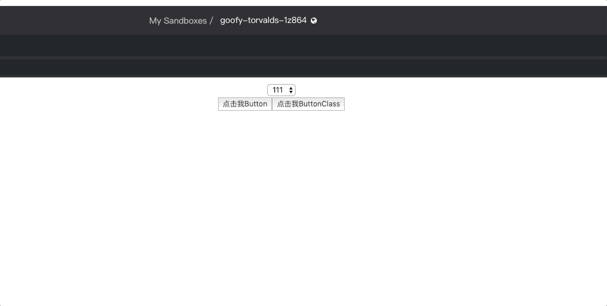

# react 中的函数式组件和类组件的区别

在 react 中，函数式组件可以理解就是一段`function`函数，并且返回值是一段`DOM结构`（jsx 语法），而类组件主要是通过`class`关键字，并且会继承`React.compinent`一种形式。

由于目前浏览器并不支持`class`关键字，在实际开发中会搭配`babel`进行使用，假设都是在`react`环境下开发，那么，函数组件和类组件最后编译结果会存在一定的差异，从形式上看，类组件会产生更多兼容性代码（主要为了适应浏览器），这里写了两个简单的 demo，有兴趣可以看看编译后的结果。（[类组件](https://www.babeljs.cn/repl#?browsers=&build=&builtIns=false&spec=false&loose=false&code_lz=MYGwhgzhAEAiCmBbA9tA3gKAJABNkGVlF4AXACwEsA7AcwAoBKdDaV6LAJ1IFcOroAPDgoA3AHwCA9MPEs2AXwzygA&debug=false&forceAllTransforms=false&shippedProposals=false&circleciRepo=&evaluate=false&fileSize=false&timeTravel=false&sourceType=module&lineWrap=false&presets=es2015%2Creact%2Cstage-2&prettier=false&targets=&version=7.8.4&externalPlugins=),[函数组件](https://www.babeljs.cn/repl#?browsers=&build=&builtIns=false&spec=false&loose=false&code_lz=GYVwdgxgLglg9mABAEQKYFs6IBQEpEDeAUAJCiSwKIAmcAynOqlABYxgDmehRifiJAE7MQgpAB5qMAG4A-cQHopc3vwC-RNUA&debug=false&forceAllTransforms=false&shippedProposals=false&circleciRepo=&evaluate=false&fileSize=false&timeTravel=false&sourceType=module&lineWrap=false&presets=es2015%2Creact%2Cstage-2&prettier=false&targets=&version=7.8.4&externalPlugins=)）
因此可以得出自认为是正确的理论，类组件会产生过多的代码，会增加代码体积大小。

以上内容并不是我们介绍的重点，为了说明这两类组件的区别，我在实际开发中发现奇怪的现象。通过编写示例 demo 来阐述说明。

定义一个带有延迟运行的函数组件：

```jsx
import React from "react";

function ButtonDemo(props) {
  function handleClick() {
    setTimeout(() => {
      alert(props.msg);
    }, 2000);
  }

  return <button onClick={() => handleClick()}>点击我Button</button>;
}

export default ButtonDemo;
```

将此函数组件使用类的形式重构以下，基本如下：

```jsx
import React from "react";

class ButtonClassDemo extends React.Component {
  constructor(props) {
    super(props);
    this.state = {};
    this.handleClick = this.handleClick.bind(this);
  }

  handleClick() {
    setTimeout(() => {
      alert(this.props.msg);
    }, 2000);
  }

  render() {
    return <button onClick={this.handleClick}>点击我ButtonClass</button>;
  }
}

export default ButtonClassDemo;
```

以上代码都是实现点击按钮实现`alert`弹窗，并且将`props`中的`msg`数据显示出来，很难发现以上两种类型的组件会有什么不一样的地方，对照[demo](https://codesandbox.io/s/goofy-torvalds-1z864?fontsize=14&hidenavigation=1&theme=dark)可以进行下面请几步骤操作下：

- 1.点击任意一个按钮按钮
- 2.此时更新`props`的`msg`操作
- 3.查看弹出的信息内容

会出现一个奇怪的现象，当你点击函数式组件的`button`时，并且同时切换`select`值，你会发现弹窗信息任然是上一次的值。当你点击类组件的`button`时，并做同样操作，你会发现弹窗信息是最新的值，基本效果如下图：



单纯从这个示例上看，类组件对外输出的信息是错误的，因为它被其他操作改变了输出值。

因此带着问题再回到类组件源码中查看原因，发现我在`setTimeout`中直接使用了`this.props.msg`来获取父组件传递下来的值，根据[demo](https://codesandbox.io/s/goofy-torvalds-1z864?fontsize=14&hidenavigation=1&theme=dark)中父组件交互逻辑，再改变`select`值的时候会出发`setState`方法，因此出发了组件的`render`方法，那么对应的子组件会重新渲染。

对于类组件部分生命周期会重新执行一遍，可以理解为每重新执行一次，该类组件的`this`实例其实是变化的，不再是上一次`this`实例了，所以对应的`this.props`上的所挂在的属性和方法都会改变，如果子组件直接通过`this.props`方式取值，自然会出现同步更新的效果，也就是这里的[demo](https://codesandbox.io/s/goofy-torvalds-1z864?fontsize=14&hidenavigation=1&theme=dark)中的类组件为什么会出现以上这种情况，那么如何避免呢？

当然可以解决，只要在取值之前保存一份即可，例如修改成如下代码：

```jsx
import React from "react";

class ButtonClassDemo extends React.Component {
  constructor(props) {
    super(props);
    this.state = {};
    this.handleClick = this.handleClick.bind(this);
  }

  handleClick() {
    const { msg } = this.props;
    setTimeout(() => {
      alert(msg);
    }, 2000);
  }

  render() {
    return <button onClick={this.handleClick}>点击我ButtonClass</button>;
  }
}

export default ButtonClassDemo;
```

这种方式虽然能够解决问题，但是依然存在问题，当`setTimeout`中的函数很复杂，出现函数调用函数的逻辑，那么此时的`msg`就要透传下去，很不利于代码的维护。

同样还有一个修改方法，就是将弹窗逻辑写在`render`函数中，当然这种改变依然不利于代码的开发和维护，基本如下：

```jsx
import React from "react";

class ButtonClassDemo extends React.Component {
  constructor(props) {
    super(props);
    this.state = {};
  }

  render() {
    const props = this.props;
    const handleClick = () => {
      const { msg } = props;
      setTimeout(() => {
        alert(msg);
      }, 2000);
    };

    return <button onClick={handleClick}>点击我ButtonClass</button>;
  }
}

export default ButtonClassDemo;
```

> 你会发现，就是不要使用`this`对象上的`handleClick`

上面说明了类组件出现的问题以及修改的方式，但是都不是能很好的解决这个问题，再回过头看看为什么函数式组件能够获取到上一次的值，而不被新改变的`state`所干扰。

首先需要明确的是，函数式组件都是通过`props`的传递来进行通信的，也就是不存在`this`的问题，对于`props`本身来说是不可变的，换句话说，每一次的`props`都是相对当前这次是不可变的。

当用户点击了函数式组件的`button`按钮的时候，此时的`handleClick`点击里面的弹窗信息对应的`msg`是第一次`props`传进来的值，当用户切换`select`值的时候，虽然函数式组件重新渲染了，但是此时的`handleClick`并没有再次执行，也就不存在会弹出最新的`msg`，换句话说，**每次函数执行都是使用当前传递进来的参数进行操作，除非该函数再次运行否则不会因为参数变化影响内部逻辑运算。**

### 小结

现在或许明白了函数式组件和类组件的区别，在没有`Hook`之前，函数式组件只适合渲染简单的组件（不需要通过生命周期来处理逻辑运算），所以函数式组件使用率并不大，大部分还是会使用类组件，但是在编写类组件中会存在很多意想不到的问题，下次将会介绍类组件的弊端，这样你才能了解`Hook`是多么方便。
