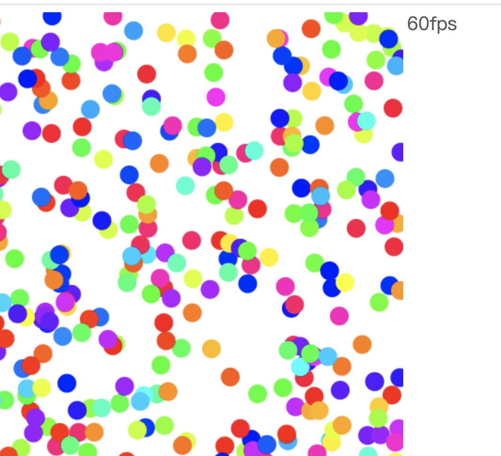
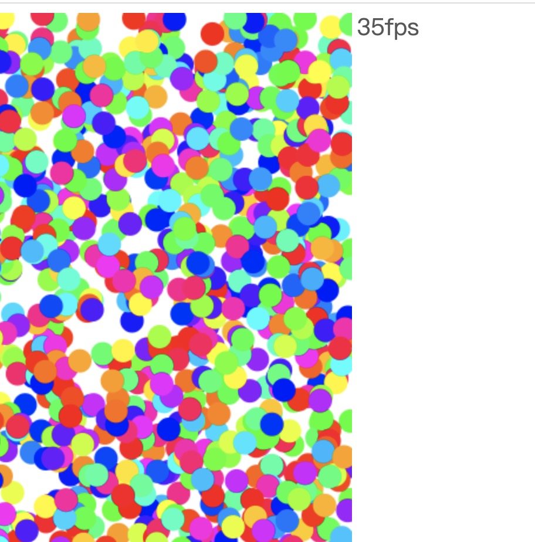
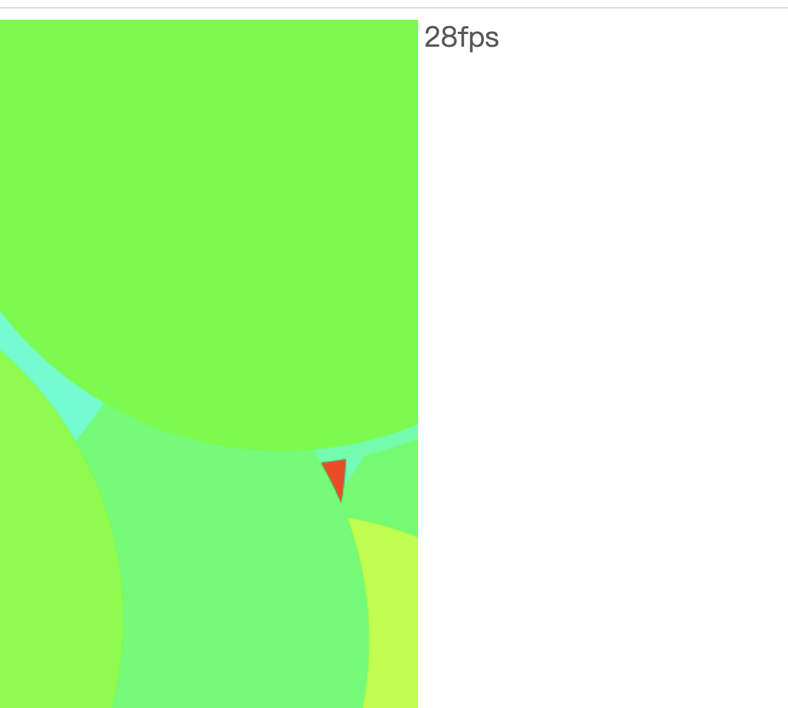
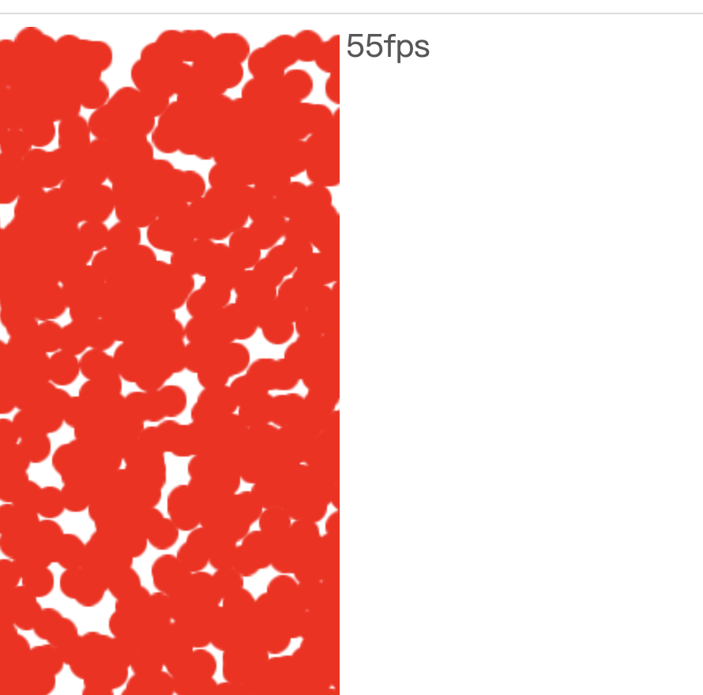
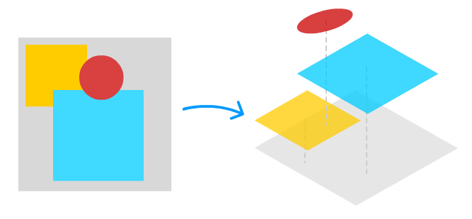
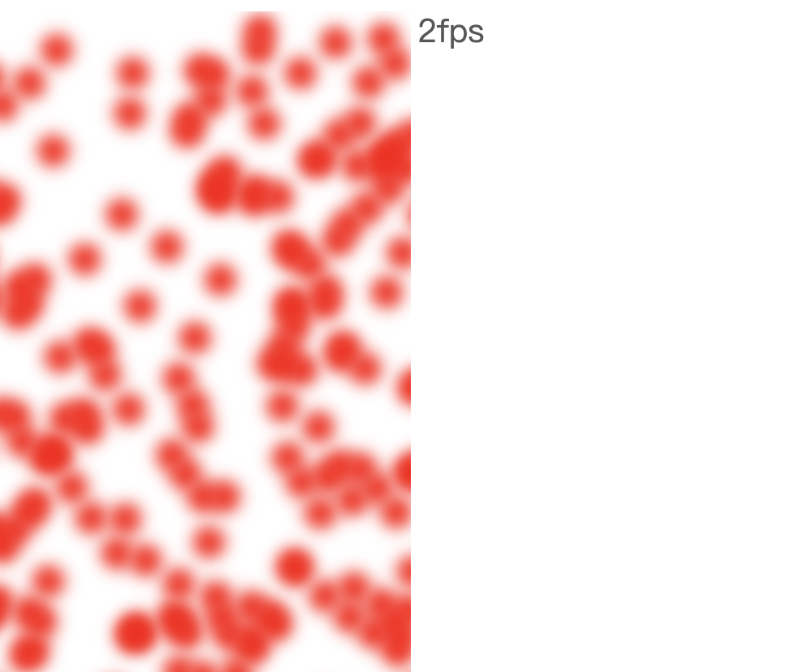
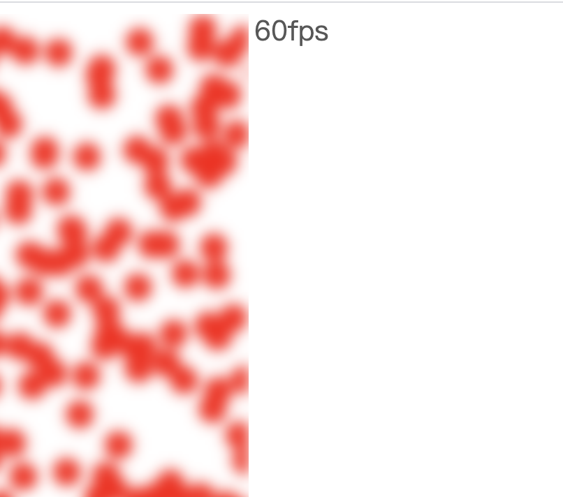

# 如何有效提升 canvas 绘制速度

目前 web 常用的绘图 API 基本有两大类：canvas 和 svg，其实 webgl 也算是一类，但是它最终也是在 canvas 的元素中进行绘制，因此，索性分成两大类，因为 webgl 的绘制方式和 canvas 绘制方式有本质区别，但是所以暂时先不讨论 webgl 的性能提升方式，主要针对 canvas 做性能提升分析。

## 那么 canvas 的绘图性能瓶颈到底有哪些呢？

在浏览器上绘制动画，理想状态下是每一秒钟最高达到 60 帧左右。也就是在 1 秒钟内完成 60 次图像的绘制，那么很容易算出完成一次图像绘制的时间就是 1000/60（1 秒 =1000 毫秒），约等于 16 毫秒。这也就是业界常说的绘制动画达到 60fps 就算是完美的渲染。但是实际场景并不能完美达到，会受到绘制的元素大小、个数、甚至复杂的计算过程等等因素的影响，所以最低人们可接受的是 24fps，也就是大约 42 毫秒内完成一帧图像的绘制。

canvas 是指令式绘图系统，它通过绘图指令来完成图形的绘制，因此绘制的图形越多，就会产生更多的指令，因此就会花费更多的时间，同样绘制的图形越大，绘图指令执行的时间也会增多，因此也会花费更多的时间。我们可以举例来说明这一点。

绘制 1000 个半径为 10 的随机小球：

```js
window.onload = () => {
  const canvas = document.getElementById("canvas");
  const ctx = canvas.getContext("2d");

  const w = canvas.width;
  const h = canvas.height;

  const randomColor = () => {
    return `hsl(${Math.random() * 360}, 100%, 50%)`;
  };

  const drawCircle = (ctx, r) => {
    const x = Math.random() * w;
    const y = Math.random() * h;
    const fillColor = randomColor();
    ctx.fillStyle = fillColor;
    ctx.beginPath();
    ctx.arc(x, y, r, 0, Math.PI * 2);
    ctx.fill(); // 填充绘制
  };

  const draw = (ctx, n = 1000, r = 10) => {
    for (let i = 0; i < n; i++) {
      drawCircle(ctx, r);
    }
  };

  requestAnimationFrame(function update() {
    ctx.clearRect(0, 0, w, h);
    draw(ctx);
    requestAnimationFrame(update);
  });
};
```



由于最新版本谷歌浏览器暂时不提供 fps 显示，所以暂时使用自定义的 fps 计算方式，如上图，当绘制 1000 个半径为 10 的圆，依然保持在 60fps 左右，继续增加至 4000 试试，



可以看出，帧率下降至 35fps 左右，我们可以尝试继续加大至 5000，


帧率基本在 26fps 左右，也就到了人接受的极限，基本可以断定，再继续增大绘制的个数，会出现明显的卡顿，可以自己尝试增加。

换一种方式测试，保持 1000 个绘制个数，增加圆的半径至 300，



帧率基本维持在 28fps 左右，因此可以证明最开始的假设。

**小结：**

- 影响 canvas 性能瓶颈最主要有两点：**1、绘制元素的个数**，**2、绘制元素的大小**
- canvas 是指令绘图，要想提升性能，减少冗余会指令是提高性能的一种方式

## 总结几种优化手段

根据以上得出的结论，可以得出绘图指令越多、执行时间越长，渲染效率就越低，性能也就越差，因此总结以下几种优化手段，分别是：使用缓存、分层渲染、局部重绘和优化滤镜。此外，还有一种手段叫做多线程渲染。

贴出一段需要优化的代码，绘制 5000 个半径为 10 的红色小球，如下代码运行之后，帧率基本在 33fps 左右：

```js
const canvas = document.getElementById("canvas");
const ctx = canvas.getContext("2d");

const w = canvas.width;
const h = canvas.height;

const drawCircle = (ctx, r) => {
  const x = Math.random() * w;
  const y = Math.random() * h;
  ctx.fillStyle = "red";
  ctx.beginPath();
  ctx.arc(x, y, r, 0, Math.PI * 2);
  ctx.fill(); // 填充绘制
};

const draw = (ctx, n = 5000, r = 10) => {
  for (let i = 0; i < n; i++) {
    drawCircle(ctx, r);
  }
};

requestAnimationFrame(function update() {
  ctx.clearRect(0, 0, w, h);
  draw(ctx);
  requestAnimationFrame(update);
});
```

### 1、离屏渲染

主要实现方式就是将 canvas 绘制的图形缓存下来，保存在一个离屏 canvas 中，然后在绘制中使用 drawImage 直接绘制离屏 canvas 图像即可，这样也不需要通过 fill 来进行填充。根据这个思想，可以将待渲染的红色小球离屏缓存起来，基本做如下修改：

```js
// 添加一个缓存代码
function createCache() {
  const ret = [];
  // 创建离屏Canvas缓存图形
  const cacheCanvas = new OffscreenCanvas(20, 20);
  // 将图形绘制到离屏Canvas对象上
  const context = cacheCanvas.getContext("2d");
  context.fillStyle = "red";
  context.beginPath();
  context.arc(10, 10, 10, 0, Math.PI * 2);
  context.fill();
  ret.push(cacheCanvas);
  // 将离屏Canvas数组（缓存对象）返回
  return ret;
}
```

具体使用如下：

```js
const shapes = createCache();

// 将最终的draw代码修改如下：
const draw = (ctx, n = 5000, r = 10) => {
  for (let i = 0; i < n; i++) {
    const shape = shapes[0];
    const x = Math.random() * w;
    const y = Math.random() * h;
    ctx.drawImage(shape, x, y);
  }
};
```

运行之后如下图，基本帧率能够提升至 55fps 左右，相比之前的 33fps 提升了不少。



### 离屏渲染存在局限性

1、缓存也是通过创建离屏幕 canvas 对象，如果绘制的图形状态多，并且各不相同，使用缓存这类场景本身就会存在内存损耗，反而会降低性能。大家可以尝试将上面的代码改成绘制不同图形的示例。

2、缓存主要适合固定的几何图形，因为每次重新绘制只会更新 transform（矩阵），如果需要频繁的更改图形状态，那么缓存就会被一直更新，这样一来，每次重新绘制，缓存也会重新缓存，相当于反而多了一条
drawImage 命令，降低了性能。

但是总体来说，缓存的应用还是非常多的，应该在合适的时候运用缓存来提升 canvas 的渲染性能。

### 2、分层渲染

形象的说就是创建多个 canvas 层，例如下图：



可以将最终呈现的图形分别画在多个 canvas 中，然后将他们重叠在一起，并且将不变的内容或者说不需要在 16ms 内就重绘一次的内容放在一个单独的 canvas 图层中，需要频繁更新的动画放在另一个单独的图层，但是一定要将频繁变化的 canvas 图层设置在最上层。

例如实现以下效果：


核心代码基本如下，具体效果可以参考 demo 文件夹的 canvas/test2 示例：

```js
const randomColor = () => {
  return `hsl(${Math.random() * 360}, 100%, 50%)`;
};

const drawCircle = (ctx, r) => {
  const x = Math.random() * w;
  const y = Math.random() * h;
  const fillColor = randomColor();
  ctx.fillStyle = fillColor;
  ctx.beginPath();
  ctx.arc(x, y, r, 0, Math.PI * 2);
  ctx.fill(); // 填充绘制
};

const draw = (ctx, n = 1000, r = 10) => {
  for (let i = 0; i < n; i++) {
    drawCircle(ctx, r);
  }
};

const canvas = document.getElementById("canvas");
const canvas2 = document.getElementById("canvas2");
const ctx = canvas.getContext("2d");
const ctx2 = canvas2.getContext("2d");

const w = canvas.width;
const h = canvas.height;

// 绘制背景
const backGrund = (ctx) => {
  draw(ctx);
};

function loadImage(src) {
  const img = new Image();
  img.crossOrigin = "anonymous";
  return new Promise((resolve) => {
    img.onload = resolve(img);
    img.src = src;
  });
}

const frontGrund = async (ctx) => {
  const img = await loadImage("http://p3.qhimg.com/t015b85b72445154fe0.png");
  const { width, height } = ctx.canvas;
  function update(t) {
    ctx.clearRect(0, 0, width, height);
    ctx.save();
    ctx.translate(0, 0.5 * height);
    const p = (t % 3000) / 3000;
    const x = width * p;
    const y = 0.1 * height * Math.sin(3 * Math.PI * p);
    ctx.drawImage(img, x, y);
    ctx.restore();
    requestAnimationFrame(update);
  }
  update(0);
};

backGrund(ctx);
frontGrund(ctx2);
```

### 分层渲染局限性

满足分层渲染必须遵守两个原则：1、动静图层分离清晰。2、动静图层的渲染顺序是固定的。如果出现多个图层之间交替渲染顺序，那么就不适合使用分层渲染解决性能问题，可以采用接下来介绍的局部绘制的方式。

### 3、局部绘制

canvas 在每次重新渲染的时候一般会先执行 clearRect()方法（清空整个画布），然后再执行渲染图形逻辑，但是在追求极致性能的场景，很容易就能想到是否可以局部重新绘制，对于局部绘制，需要用到的一个技术点就是**脏区域检测**，也就是如何确定局部重回区域的大小范围，其实 clip 和 clearRect 两个 api 就能实现一个简单局部渲染的功能。

例如我们绘画三个半径为 10 的小球，然后再执行局部渲染其中一个小球，改变其颜色，而其他小球不执行渲染，基本代码如下，具体示例可以查看 demo/text3.html：

```html
<canvas id="canvas" width="800" height="800"></canvas>
<button onclick="localRender()">局部重绘</button>
<script>
  showFPS(true);
  const randomColor = () => {
    return `hsl(${Math.random() * 360}, 100%, 50%)`;
  };

  const drawCircle = (ctx, r, i) => {
    const x = w / 2 + i * 50;
    const y = h / 2 + i * 50;
    const fillColor = randomColor();
    ctx.fillStyle = fillColor;
    ctx.beginPath();
    ctx.arc(x, y, r, 0, Math.PI * 2);
    ctx.fill(); // 填充绘制
  };

  const draw = (ctx, n = 3, r = 10) => {
    for (let i = 0; i < n; i++) {
      drawCircle(ctx, r, i);
    }
  };

  const canvas = document.getElementById("canvas");
  const ctx = canvas.getContext("2d");

  const w = canvas.width;
  const h = canvas.height;

  // 绘制背景
  const backGrund = (ctx) => {
    draw(ctx);
  };
  backGrund(ctx);

  // 创建剪裁区域
  function localRender() {
    ctx.beginPath();
    ctx.arc(w / 2 + 50, h / 2 + 50, 20, 0, Math.PI * 2);
    ctx.clip();
    ctx.fillStyle = "black";
    ctx.fillRect(0, 0, canvas.width, canvas.height);
  }
</script>
```

在执行局部绘制的核心就是三个步骤：

1、确定待渲染的区域
2、创建 clip 区域
3、执行需要渲染的指令

以上这个例子相对比较容易，只是为了能说明局部绘制基本实现思路，但是实际场景中会比这个复杂很多，例如出现图形重合、图形阴影、折线、线段的样式、字体大小等等，最关键就是需要根据实际场景动态计算带待渲染的区域，如果你遇到了问题，可以阅读下蚂蚁金服 AntV 团队的[Canvas 局部渲染优化总结](https://juejin.im/post/6844904103231881229)这篇文章。

### 4、优化滤镜

canvas 的滤镜也会影响重绘性能，在之前离屏渲染的示例的基础上增加滤镜效果，可以看看最终的帧率，帧率直接下降至 2fps 左右



主要原因是将每个小球都做了滤镜，其实完全没有必要，可以将滤镜效果统一在离屏 canvas 上处理，对于小球的绘制就不需要使用滤镜效果，最终将带滤镜效果的 canvas 绘制上即可，基本实现如下：

```js
const canvas = document.getElementById("canvas");
const ctx = canvas.getContext("2d");

const w = canvas.width;
const h = canvas.height;

const randomColor = () => {
  return `hsl(${Math.random() * 360}, 100%, 50%)`;
};

const shapes = createCache();

const drawArc = (cctx, n = 1000) => {
  for (let i = 0; i < n; i++) {
    const shape = shapes[0];
    const x = Math.random() * canvas.width;
    const y = Math.random() * canvas.height;
    cctx.drawImage(shape, x, y);
  }
};

ctx.filter = "blur(5px)";

// 创建离屏的 Canvas
const cCanvas = new OffscreenCanvas(w, h);
const cCtx = cCanvas.getContext("2d");
function draw() {
  ctx.clearRect(0, 0, w, h);
  cCtx.clearRect(0, 0, w, h);
  drawArc(cCtx);
  // 再将离屏Canvas图像绘制到画布上，这一次绘制采用了滤镜
  ctx.drawImage(cCanvas, 0, 0);
  requestAnimationFrame(draw);
}

draw()

function createCache() {
  const shapes = [];
  // 创建离屏Canvas缓存图形
  const cacheCanvas = new OffscreenCanvas(20, 20);
  const context = cacheCanvas.getContext("2d");
  context.fillStyle = "red";
  context.beginPath();
  context.arc(10, 10, 10, 0, Math.PI * 2);
  context.fill();
  shapes.push(cacheCanvas);
  // 将离屏Canvas数组（缓存对象）返回
  return shapes;
}
```



按照以上思路优化，帧率基本维持在60fps左右，总之，将公共滤镜效果提升到全局处理，避免对每个图形做滤镜。

### 5、开启多线程渲染

canvas也是属于javascript语言，由于js是单线程，早起基本无法开启新的线程处理复杂计算，但是现在浏览器提供了一个WebWorker的方式可以使得js开启多线程进行处理复杂计算，同样也是支持在canvas使用，因此，我们可以利用这个特性。其实也很简单，在浏览器主线程中创建 Worker，然后将 Canvas 对象通过 transferControlToOffscreen 转成离屏 Canvas 对象发送给 Worker 线程去处理。大致如下：

```js

const canvas = document.getElementById('canvas');
const worker = new Worker('./random_shapes_worker.js');
const canvas = canvas.transferControlToOffscreen();
worker.postMessage({
  canvas: canvas,
  type: 'init',
}, [canvas]);
```
这样，无论在 Worker 线程中还是在主线程中操作都没有太大的区别，还能不阻塞浏览器主线程的任何操作。

## 总结

canvas性能优化常见的方式基本以上几种，可以根据不同的业务场景进行使用。

## 参考资料

- [跟月影学可视化](https://time.geekbang.org/column/intro/320)
- [Canvas 局部渲染优化总结](https://juejin.im/post/6844904103231881229)