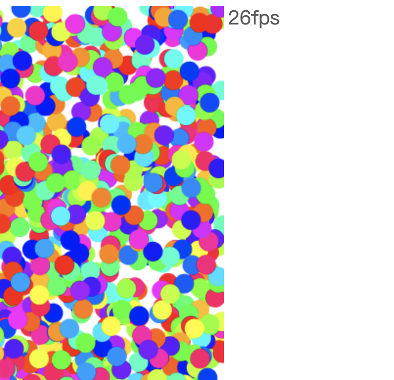

# 如何有效提升canvas绘制速度

目前web常用的绘图API基本有两大类：canvas和svg，其实webgl也算是一类，但是它最终也是在canvas的元素中进行绘制，因此，索性分成两大类，因为webgl的绘制方式和canvas绘制方式有本质区别，但是所以暂时先不讨论webgl的性能提升方式，主要针对canvas做性能提升分析。

## 那么canvas的绘图性能瓶颈到底有哪些呢？

在浏览器上绘制动画，理想状态下是每一秒钟最高达到 60 帧左右。也就是在 1 秒钟内完成 60 次图像的绘制，那么很容易算出完成一次图像绘制的时间就是 1000/60（1 秒 =1000 毫秒），约等于 16 毫秒。这也就是业界常说的绘制动画达到60fps就算是完美的渲染。但是实际场景并不能完美达到，会受到绘制的元素大小、个数、甚至复杂的计算过程等等因素的影响，所以最低人们可接受的是24fps，也就是大约 42 毫秒内完成一帧图像的绘制。

canvas 是指令式绘图系统，它通过绘图指令来完成图形的绘制，因此绘制的图形越多，就会产生更多的指令，因此就会花费更多的时间，同样绘制的图形越大，绘图指令执行的时间也会增多，因此也会花费更多的时间。我们可以举例来说明这一点。

绘制1000个半径为10的随机小球：

```js
window.onload = () => {
    const canvas = document.getElementById('canvas')
    const ctx = canvas.getContext('2d')

    const w = canvas.width
    const h = canvas.height

    const randomColor = () => {
      return `hsl(${Math.random() * 360}, 100%, 50%)`
    }

    const drawCircle = (ctx, r) => {
      const x = Math.random() * w
      const y = Math.random() * h
      const fillColor = randomColor()
      ctx.fillStyle = fillColor
      ctx.beginPath()
      ctx.arc(x, y, r, 0, Math.PI * 2)
      ctx.fill() // 填充绘制
    }

    const draw = (ctx, n = 1000, r = 10) => {
      for (let i = 0; i < n; i++) {
        drawCircle(ctx, r)
      }
    }

    requestAnimationFrame(function update() {
      ctx.clearRect(0, 0, w, h)
      draw(ctx)
      requestAnimationFrame(update)
    })
  }
```


由于最新版本谷歌浏览器暂时不提供fps显示，所以暂时使用自定义的fps计算方式，如上图，当绘制1000个半径为10的圆，依然保持在60fps左右，继续增加至4000试试，


可以看出，帧率下降至35fps左右，我们可以尝试继续加大至5000，



帧率基本在26fps左右，也就到了人接受的极限，基本可以断定，再继续增大绘制的个数，会出现明显的卡顿，可以自己尝试增加。

换一种方式测试，保持1000个绘制个数，增加圆的半径至300，


帧率基本维持在28fps左右，因此可以证明最开始的假设。

**小结：**

* 影响canvas性能瓶颈最主要有两点：**1、绘制元素的个数**，**2、绘制元素的大小**
* canvas是指令绘图，要想提升性能，减少冗余会指令是提高性能的一种方式

## 总结几种优化手段

根据以上得出的结论，可以得出绘图指令越多、执行时间越长，渲染效率就越低，性能也就越差，因此总结以下几种优化手段，分别是：使用缓存、分层渲染、局部重绘和优化滤镜。此外，还有一种手段叫做多线程渲染。

贴出一段需要优化的代码，绘制5000个半径为10的红色小球，如下代码运行之后，帧率基本在33fps左右：

```js
const canvas = document.getElementById("canvas");
const ctx = canvas.getContext("2d");

const w = canvas.width;
const h = canvas.height;

const drawCircle = (ctx, r) => {
  const x = Math.random() * w;
  const y = Math.random() * h;
  ctx.fillStyle = 'red';
  ctx.beginPath();
  ctx.arc(x, y, r, 0, Math.PI * 2);
  ctx.fill(); // 填充绘制
};

const draw = (ctx, n = 5000, r = 10) => {
  for (let i = 0; i < n; i++) {
    drawCircle(ctx, r);
  }
};

requestAnimationFrame(function update() {
  ctx.clearRect(0, 0, w, h)
  draw(ctx)
  requestAnimationFrame(update);
});
```

### 使用缓存

主要实现方式就是将canvas绘制的图形缓存下来，保存在一个离屏canvas中，然后在绘制中使用drawImage直接绘制离屏canvas图像即可，这样也不需要通过fill来进行填充。根据这个思想，可以将待渲染的红色小球离屏缓存起来，基本做如下修改：

```js
// 添加一个缓存代码
function createCache() {
  const ret = []
  // 创建离屏Canvas缓存图形
  const cacheCanvas = new OffscreenCanvas(20, 20)
  // 将图形绘制到离屏Canvas对象上
  const context = cacheCanvas.getContext("2d")
  context.fillStyle = 'red'
  context.beginPath()
  context.arc(10, 10, 10, 0, Math.PI * 2)
  context.fill()
  ret.push(cacheCanvas)
  // 将离屏Canvas数组（缓存对象）返回
  return ret
}
```
具体使用如下：

```js
const shapes = createCache()

// 将最终的draw代码修改如下：
const draw = (ctx, n = 5000, r = 10) => {
  for (let i = 0; i < n; i++) {
    const shape = shapes[0];
    const x = Math.random() * w; 
    const y = Math.random() * h;
    ctx.drawImage(shape, x, y)
  }
};
```

运行之后如下图，基本帧率能够提升至55fps左右，相比之前的33fps提升了不少。


### 离屏渲染存在局限性

1、缓存也是通过创建离屏幕canvas对象，如果绘制的图形状态多，并且各不相同，使用缓存这类场景本身就会存在内存损耗，反而会降低性能。大家可以尝试将上面的代码改成绘制不同图形的示例。

2、缓存主要适合固定的几何图形，因为每次重新绘制只会更新transform（矩阵），如果需要频繁的更改图形状态，那么缓存就会被一直更新，这样一来，每次重新绘制，缓存也会重新缓存，相当于反而多了一条
drawImage命令，降低了性能。


但是总体来说，缓存的应用还是非常多的，应该在合适的时候运用缓存来提升 canvas 的渲染性能。

### 分层渲染

未完待续......


