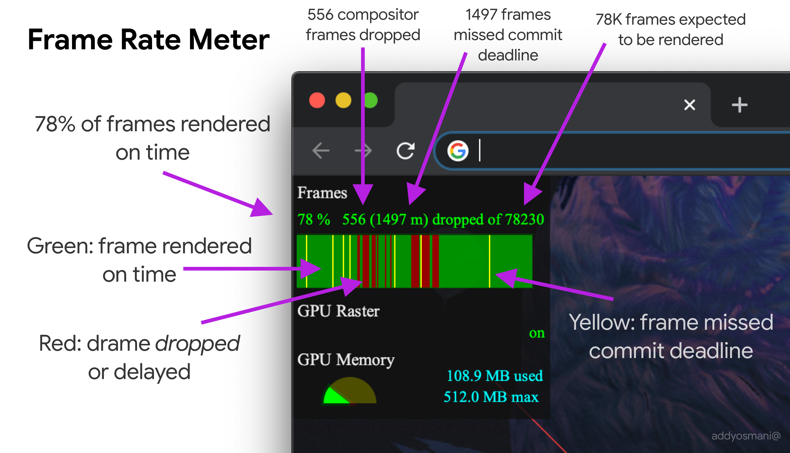

# 最新版谷歌浏览器Frame Rate Meter说明

* 556个合成器帧丢失 (556 compositor frames dropped)
* 1497帧错过提交期限 (1497 frames missed commit deadline)
* 需要渲染的78k帧 (78k frames espected to be rendered)
* 78%的帧按时渲染 (78% of frames rendered on time)
* 按时渲染帧 (frame rendered on time)
* 帧丢失或延迟 (frame dropped or delayed)
* 帧错过提交期限 (frame missed commit deadline)

## 参考资料

- [推特推文](https://twitter.com/addyosmani/status/1281483292026400768)
