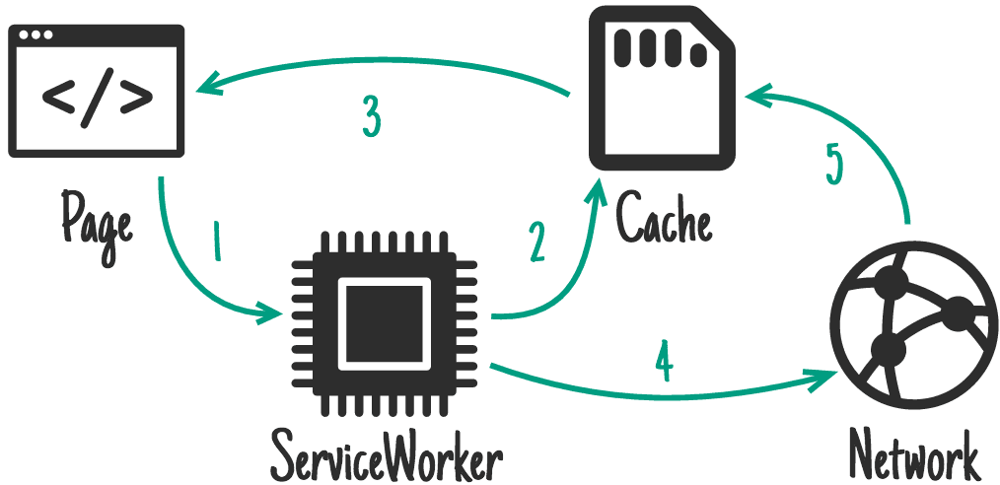

# 前端性能优化之传输加载优化

## 1、Gzip开启

以nginx为例：

```nginx
http {
  # 开启gzip
  gzip on;

  # 启用gzip压缩的最小文件；小于设置值的文件将不会被压缩
  gzip_min_length 1k;

  # gzip 压缩级别 1-10 
  gzip_comp_level 2;

  # 进行压缩的文件类型。
  gzip_types text/plain application/javascript application/x-javascript text/css application/xml text/javascript application/x-httpd-php image/jpeg image/gif image/png;

  # 是否在http header中添加Vary: Accept-Encoding，建议开启
  gzip_vary on;
}
```

其实在前端webpack构建的同时，可以先将资源生成响应的gzip的文件，主要是通过`compression-webpack-plugin`插件生成。

## 2、HTTP缓存

目前大部分前端项目都会采用单页面技术，因此对于项目而言，只需要一个html模版文件、每个页面对应的js文件以及css文件，所以在具体使用http缓存过程中，html的缓存方式和js、css肯定会有一定差别，以下是针对nginx如何合理的设置不同资源的缓存策略。

### 资源缓存策略

```nginx
location / {
    alias /opt/app/dist/; # 静态资源根目录
    index index.htm index.html;
    try_files $uri $uri/ /index.html;

    # html 缓存方式
    if ($request_filename ~* .*\.(?:htm|html)$)
    {
        add_header Cache-Control "no-cache, must-revalidate"; # 需要和服务端通信，确定缓存是否过期，重新获取并重新验证
​	       add_header "Pragma" "no-cache"; # http1.0的浏览器的兼容性
​        add_header "Expires" "0"; # http1.0的浏览器的兼容性
    }

    # js/css
    if($request_filename ~* .*\.(?:js|css)$) 
    {
    ​	  expires   7d; // 缓存7天有效
    }

    # 图片
    if($request_filename ~* .*\.(?:jpg|jpeg|gif)$)
    {
    ​	  expires   7d; // 缓存7天有效
    }

}
```

**说明：**

* js、css、img可以根据实际的业务场景设置，一般通过webpack生成不同的hash值，就可以避免用户长时间访问旧资源，这里的设置方式也可以根据自己项目的迭代周期设置。
* nginx默认开启Etag功能

### no-cache

依然会与服务端进行通信，服务器端会验证请求中所描述的缓存是否过期，若未过期就返回304状态，告诉客户端使用缓存即可。那么服务端是通过什么来判断资源未发生变化的呢？

这里主要是通过If-None-Match/Etag来实现的，具体内容大致如下：

每次客户端在向服务端请求资源的时候，通过If-None-Match请求头带上了之前服务端返回的Etag的值，服务端收到第二次请求的时候，发现携带了If-None-Match字段，就重新计算服务器对应资源的Etag，如果二者匹配了，就认为资源没有发生变化，直接给客户端相应304，让客户端读取缓存中的数据。

### must-revalidate

那就意味着缓存在考虑使用一个陈旧的资源时，必须先验证它的状态，已过期的缓存将不被使用。

### Pragma

Pragma 是HTTP/1.0标准中定义的一个header属性，请求中包含Pragma的效果跟在头信息中定义Cache-Control: no-cache相同，但是HTTP的响应头没有明确定义这个属性，所以它不能拿来完全替代HTTP/1.1中定义的Cache-control头。通常定义Pragma以向后兼容基于HTTP/1.0的客户端。

### Expires

主要是实现用户访问过后多长时间失效，按照上面设置，代表即访问即失效。

### Last-Modified/If-Modified-Since 

其实不建议使用这种方式来缓存资源，因为它依赖时间准确性，但是很难保证服务端的时间和客户端的时间一致，因此这种缓存方式是弱缓存，建议开始开启强缓存Etag功能。

## 3、service workers

一个服务器与浏览器之间的中间人角色，如果网站中注册了service worker那么它可以拦截当前网站所有的请求，进行判断（需要编写相应的判断程序），如果需要向服务器发起请求的就转给服务器，如果可以直接使用缓存的就直接返回缓存不再转给服务器。从而大大提高浏览体验。

### 使用

1、注册

```js
/* 判断当前浏览器是否支持serviceWorker */
if ('serviceWorker' in navigator) {
    /* 当页面加载完成就创建一个serviceWorker */
    window.addEventListener('load', function () {
        /* 创建并指定对应的执行内容 */
        /* scope 参数是可选的，可以用来指定你想让 service worker 控制的内容的子目录。 在这个例子里，我们指定了 '/'，表示 根网域下的所有内容。这也是默认值。 */
        navigator.serviceWorker.register('./serviceWorker.js', {scope: './'})
            .then(function (registration) {

                console.log('ServiceWorker registration successful with scope: ', registration.scope);
            })
            .catch(function (err) {

                console.log('ServiceWorker registration failed: ', err);
            });
    });
}
```

2、安装worker

```js
var cacheStorageKey = 'cachesName';
var cacheList = [
  // 注册成功后要立即缓存的资源列表
]

// 当浏览器解析完 SW 文件时触发 install 事件
this.addEventListener('install', function(e) {
  // install 事件中一般会将 cacheList 中要换存的内容通过 addAll 方法，请求一遍放入 caches 中
  e.waitUntil(
    caches.open(cacheStorageKey).then(function(cache) {
      return cache.addAll(cacheList)
    })
  );
});
```

3、fetch

```js
this.addEventListener('fetch', function(e) {
  // 在此编写缓存策略
  e.respondWith(
    // 可以通过匹配缓存中的资源返回
    caches.match(e.request)
    // 也可以从远端拉取
    fetch(e.request.url)
    // 也可以自己造
    new Response('自己造')
    // 也可以通过吧 fetch 拿到的响应通过 caches.put 方法放进 caches
  );
});
```

4、更新

只需要修改Service Worker 文件就可以更新它。

```js
// 激活时触发 activate 事件
this.addEventListener('activate', function(e) {
  // active 事件中通常做一些过期资源释放的工作，匹配到就从 caches 中删除
  var cacheDeletePromises = caches.keys().then(cacheNames => {
    return Promise.all(cacheNames.map(name => {
      if (name !== cacheStorageKey) {
        return caches.delete(name);
      } else {
        return Promise.resolve();
      }
    }));
  });

  e.waitUntil(
    Promise.all([cacheDeletePromises])
  );
});


```

### 小结

基本逻辑很简单，就是在注册的时候，将需要缓存的资源缓存在`cacheList`中，主要是`fetch`方法，如何去判断资源需要从远端获取还是缓存获取，需要根据自己的业务场景编写一套缓存策略。

### 注意事项

当然在使用service workers时候需要注意以下事项：

* Service worker运行在worker上下文 --> 不能访问DOM
* 它设计为完全异步，同步API（如XHR和localStorage）不能在service worker中使用
* 出于安全考量，Service workers只能由HTTPS承载或者localhost
* 在Firefox浏览器的用户隐私模式，Service Worker不可用
* 其生命周期与页面无关（关联页面未关闭时，它也可以退出，没有关联页面时，它也可以启动）

### 配合插件使用

如何需要自己编写具体了sw文件，很多问题其实并没有考虑的很周全，例如文件更新，如何修改文件名称；所以常常会配合插件完成这些工作，这里主要介绍`workbox-webpack-plugin`插件，使用也非常简单：

```js
const { GenerateSW } = require('workbox-webpack-plugin');
plugins:[new GenerateSW ({
  clientsClaim: true,
  skipWaiting: true
})]
```

### Workbox 3

Workbox 3其实是谷歌团队维护的，具体可以参考淘宝前端团队对Workbox 3的分析，这里我就直接引用他们给的经验结论：

**Stale-While-Revalidate**



**Cache First**


**Network First**


**Network Only**


**Cache Only**


* HTML，如果你想让页面离线可以访问，使用 NetworkFirst，如果不需要离线访问，使用 NetworkOnly，其他策略均不建议对 HTML 使用。
* CSS 和 JS，情况比较复杂，因为一般站点的 CSS，JS 都在 CDN 上，SW 并没有办法判断从 CDN 上请求下来的资源是否正确（HTTP 200），如果缓存了失败的结果，问题就大了。这种我建议使用 Stale-While-Revalidate 策略，既保证了页面速度，即便失败，用户刷新一下就更新了。
* 如果你的 CSS，JS 与站点在同一个域下，并且文件名中带了 Hash 版本号，那可以直接使用 Cache First 策略。
* 图片建议使用 Cache First，并设置一定的失效事件，请求一次就不会再变动了。
* 对于不在同一域下的任何资源，绝对不能使用 Cache only 和 Cache first

## 4、HTTP2

主要的三个特点就是二进制传输、多路复用、server push。

### 二进制传输

HTTP/2传输数据量的大幅减少,主要有两个原因:以二进制方式传输和Header 压缩。HTTP/2 采用二进制格式传输数据，而非HTTP/1.x 里纯文本形式的报文 ，二进制协议解析起来更高效。 HTTP/2 将请求和响应数据分割为更小的帧，并且它们采用二进制编码。

HTTP/2并没有使用传统的压缩算法，而是开发了专门的"HPACK”算法，在客户端和服务器两端建立“字典”，用索引号表示重复的字符串，还采用哈夫曼编码来压缩整数和字符串，可以达到50%~90%的高压缩率。

### 多路复用

在 HTTP/2 中引入了多路复用的技术。多路复用很好的解决了浏览器限制同一个域名下的请求数量的问题，同时也接更容易实现全速传输，毕竟新开一个 TCP 连接都需要慢慢提升传输速度。

通过 [该链接](https://http2.akamai.com/demo) 直观感受下 HTTP/2 比 HTTP/1 到底快了多少。

* 同个域名只需要占用一个 TCP 连接，使用一个连接并行发送多个请求和响应,消除了因多个 TCP 连接而带来的延时和内存消耗。
* 并行交错地发送多个请求，请求之间互不影响。
* 并行交错地发送多个响应，响应之间互不干扰。
* 在HTTP/2中，每个请求都可以带一个31bit的优先值，0表示最高优先级， 数值越大优先级越低。有了这个优先值，客户端和服务器就可以在处理不同的流时采取不同的策略，以最优的方式发送流、消息和帧。

### server push

HTTP2还在一定程度上改变了传统的“请求-应答”工作模式，服务器不再是完全被动地响应请求，也可以新建“流”主动向客户端发送消息。比如，在浏览器刚请求HTML的时候就提前把可能会用到的JS、CSS文件发给客户端，减少等待的延迟，这被称为"服务器推送"（ Server Push，也叫 Cache push）。


## 参考资料

- [HTTP caching](https://developer.mozilla.org/en-US/docs/Web/HTTP/Caching)
- [Workbox3：Service Worker 可以如此简单](https://zhuanlan.zhihu.com/p/41652314)
- [workbox-webpack-plugin](https://developers.google.com/web/tools/workbox/modules/workbox-webpack-plugin)
- [详解HTTP2四大核心特性](https://developer.51cto.com/art/201910/604255.htm)
