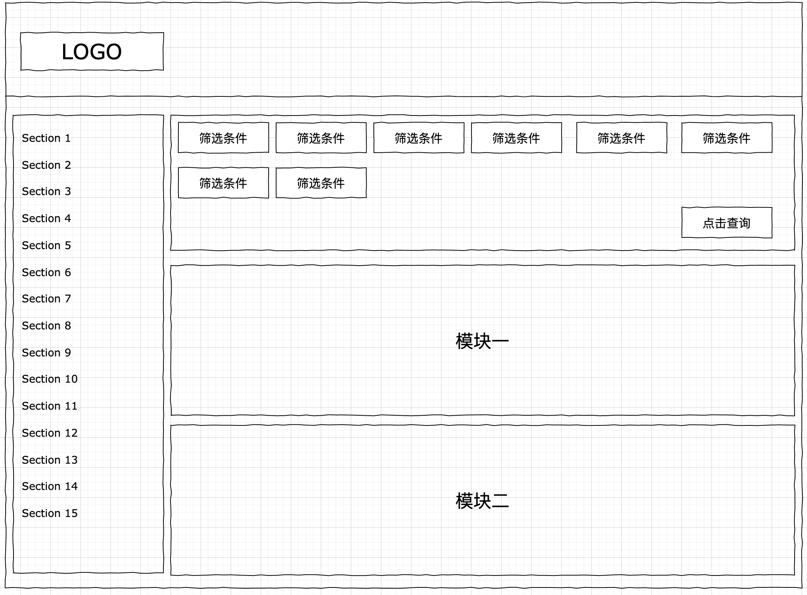

# 如何更加合理的使用store开发高性能的react组件

## 简要说明

在控制数据流过程中，store是必定会使用到的，它可以解决兄弟组件、过深的子组件等能共享一份数据，这个理念肯定没错的，网上也有很多类似的文章介绍怎么在项目中配置store，同时也会搭配redux相关的中间件，例如redux-saga，redux-thunk等等，也会有很多文章介绍什么数据放在store上，什么数据通过内部定义的state保存，最终大部分都是一样的结论：凡事需要共享的数据就放在store，反之则不需要。但是对于store如何更加合理的使用，似乎并没有结合实际场景做介绍。本文主要针对实际场景中，**教你如何使用store开发高性能的react组件。**

## 哪些操作会导致react更新

### class类组件

类组件主要有以下几种形式可以触发组件执行render方法：

* 1、forceUpdate
* 2、props变化
* 3、setState执行
* 4、connect被关联的store变化

其中forceUpdate是react的原生API，可以强制组件更新，并且跳过shouldComponentUpdate控制。而后三项可以通过shouldComponentUpdate这个生命周期来进行判断，是否组件需要执行更新操作。

### 函数组件

函数组件主要有以下几种形式可以触发组件执行render方法：

* 1、props改变，引用被改变也会触发
* 2、setState执行，主要是通过useState定义的执行更新的方法
* 3、useSelector

函数组件中没有生命周期的概念，因此对于控制组件重新执行render方法需要特殊处理，一般都会使用useCallback，useMemo，react.memo对组件和定义的函数做特殊处理，具体可以参考[如何正确的使用React Hook相关API](https://github.com/wqzwh/blog/blob/master/2020/2020-10-07.md)这篇文章。

## 如何合理使用store，避免重复执行render方法

在了解导致组件更新的方法之后，只要合理的控制这些方法的执行就可以避免组件冗余的执行，这里主要介绍connect和useSelector如何合理使用。



面对以上这个简单的页面，你会怎么管理你的数据流，更好的方便页面的扩展。

首先可能会想到以下两种形式：

* 1、将筛选条件所有的数据作为store存储起来，模块中的数据作为内部state来管理，模块通过监听store的变化触发模块组件的更新。
* 2、将筛选条件、模块数据都存在store上，这样，模块只需要通过执行相应的action便可轻松的执行更新逻辑。

其实这两种本质上都没有太大的问题，只是如果全部的数据都存在store上，在开发过程中你就会有类似以下的代码，这里分别以函数组件和类组件作为示例：

**类组件**

```js
import React, { Component } from 'react'
import { connect } from 'react-redux'

class ModuleOne extends Component {
  constructor(props) {
    super(props)
    this.state = {}
  }
  componentWillReceiveProps(nextProps) {
    // 监听store上的数据变化，后该执行的逻辑
  }
  shouldComponentUpdate(nextProps, nextState) {
    // 判断属性是否应该需要执行更新
    return !isEqual(nextProps, this.props) || !isEqual(nextState, this.state)
  }
  componentWillUnmount() {
    // 卸载组件的逻辑
  }
  render() {
    return (
      <div>
        // 各种复杂的dom结构
      </div>
    )
  }
}

ModuleOne.propTypes = {
  dispatch: PropTypes.func,
  query1: PropTypes.object,
  query2: PropTypes.array,
  query3: PropTypes.number,
  query4: PropTypes.string,
}
// 关联store上的筛选条件数据
export default connect(state => {
  return {
    query1: state.ModuleOne.query1,
    query2: state.ModuleOne.query2,
    query3: state.ModuleOne.query3,
    query4: state.ModuleOne.query4,
  }
})(ModuleOne)
```

**函数组件**

```js
import React, {
  useEffect,
} from 'react'
import { useSelector } from 'react-redux'

const ModuleOne = () => {
  const query1 = useSelector(query1)
  const query2 = useSelector(query2)
  const query3 = useSelector(query3)
  const query4 = useSelector(query4)

  useEffect(() => {
    // 当所有条件准备好了开始执行逻辑
  }, [query1, query2, query3, query4])

  return (
    <div>
      // 各种复杂的dom结构
    </div>
  )
}

export default Trend
```

以上只是两段不同类型组件的示例代码，但是有一个共同的特点，就是都直接关联了store上的多个属性，其实这种结构存在一个问题，就是如果这里定义的query都是异步获取的数据，也就是每次异步获取的数据都会去更新store上的值，但是这样就会造成，被关联的组件也会触发重新渲染，但是其实这个时候可能所有的query并没有完全准备好，其实没必要modelOne组件执行的，当然，react内部对这种情况的diff对比也是很快的，因为虚拟dom并没有变化，只是被执行了一次，但是追求性能项目，还是需要避免中情况发生，那么如何使用store才算合理呢？

**频繁的操作store是昂贵了，尽可能的少操作store**，对于以上这种场景其实可以这样解决，将所有的query都准备好了之后，在去更新到store上，这样，被关联的组件只会触发一次更新，而这次更新也正是组件应该要执行更新的时候，因为query都准备好了，可以执行相应的业务逻辑了。

## 小结

实验证明，以上的这种思路是可行的，也是可以避免类似moduleOne这样的组件被频繁的更新。现在可以回到到底如何使用store了，除了在共享数据的场景下使用，而且必须要注意，使用的时候，**必须尽可能的少操作store**，因为一旦组件之间使用了store进行桥接，那么store的更新就会导致被桥接的组件也触发更新操作，而往往很多类似这样的更新操作都是冗余的。