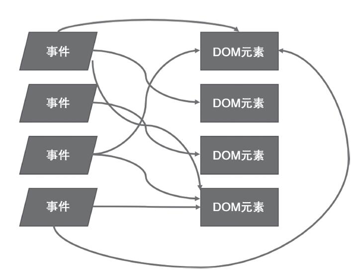

### jQuery如何工作

在讲解React的工作方式之前，先了解下jQuery的工作方式，我们使用jQuery给网页添加一个onclick事件基本写发如下：
``` html
<div>
  <button type="btn" id="btn">点击我</button>
</div> 
<script>
  $(function(){
    $("#btn").click(fucntion(){
      // do some things
    })
  })
</script>
```
在jQuery的解决方案中，首先根据css规则找到id为btn的按钮，挂上一个匿名事件处理函数，在事件处理函数中，选中那个需要被修改的DOM元素，读取其中的文本值，加以修改，然后修改这个DOM元素。

但是对于庞大的项目，这种模式会造成代码结构复杂，难易维护，每个jQuery的使用者都会有这种体会。

<!-- more -->

### React的理念

react给dom添加事件并不是通过选择器选中某个dom，然后添加相应的事件，使用react开发，开发者不需要关心dom的组成结构，只需关注数据从哪里来，该去哪个组件中显示，也就是关心整个数据流的走向，通过render函数将相应的数据显示在界面上，如果需要更新界面，只需要找到相应的数据data更新即可，用户界面自然会做出响应，所以说react也是响应式编程。

### Virtual DOM

对于改变普通的html中的DOM会造成页面的重排和重绘，这也是前端性能优化主要的方面，就是尽量减少对DOM的操作。其实虚拟DOM说的简单点就是js动态生成的html标签在js内存中存储，并没有实际插入到页面当中。例如使用createElement（'Button'）和DocumentFragment创建虚拟的标签。简单的虚拟DOM代码示例如下，主要是方面从简单的层面理解虚拟DOM：

``` javascript
var frag=document.createDocumentFragment();
for(var i=0;i<10;i++){
   var l=document.createElement("li");
   l.innerHTML="ss";
   frag.appendChild(l);
}
document.getElementById("list").appendChild(frag);
```

当然React中的虚拟DOM并没有像以上的例子这么简单，但是核心思想是这样的，相比直接操作DOM而言，通过操作js生成的DOM数结构改变映射到页面上的内容能提高不少性能。虚拟DOM就是对DOM树的抽象，仅仅是存在与javascript空间的树形结构，例如最简单的形式如下：
``` javascript
var a = {
  type: 'a',
  props: {
    children: 'React',
    className: 'link',
    href: 'facebook/react · GitHub'
  },
  _isReactElement: true
}

React.render(a, document.body)
```

虚拟DOM中有个核心算法就是diff算法，主要实现以下三个步骤：
* 步骤一：用JS对象模拟DOM树
* 步骤二：比较两棵虚拟DOM树的差异
* 步骤三：把差异应用到真正的DOM树上
react会根据diff算法计算出需要更新改变虚拟DOM，从而只更新页面中映射的那一小块DOM。对于diff算法以及react性能优化后期会单独用一节分析。

### React工作方式的优点

传统化的jquery的方式直观易懂，但是随着项目变得庞大时，用jquery写出的代码往往相互纠缠，难以维护。



使用react的方式，可以避免构建这样复杂的程序结构，无论何种事件，引发的都是react组件的重新渲染，至于如何只修改必要的DOM部分，则完全交给React去操作，开发这不需要关心。react利用函数式编程的思想来解决用户界面渲染问题，最大的优势能够提高开发效率，代码可维护性和可阅读性增强。


react会强制所有组件都按照这种由数据驱动渲染的模式来工作，无论应用多大，都让程序处于可控范围内。下一篇将为大家介绍如何设计高质量的React组件。


