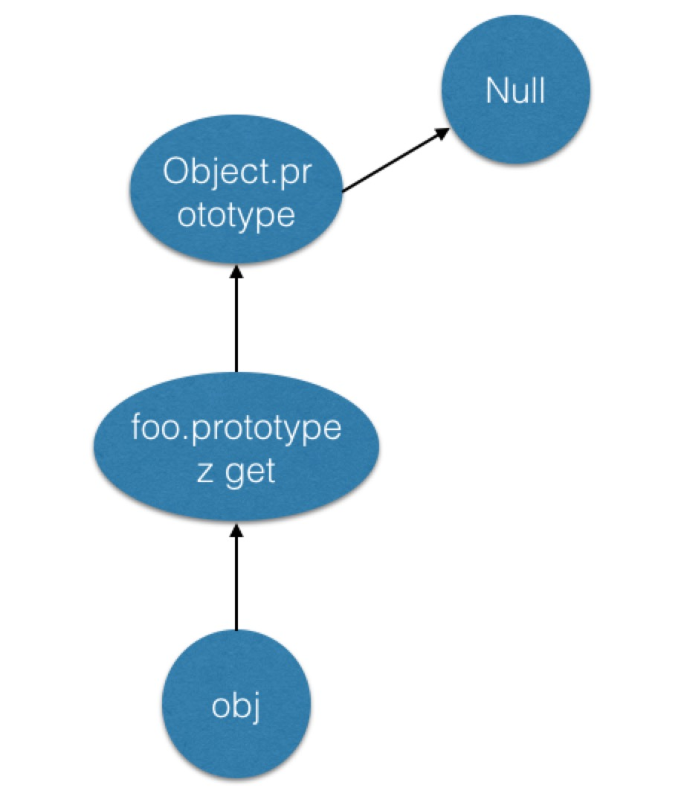
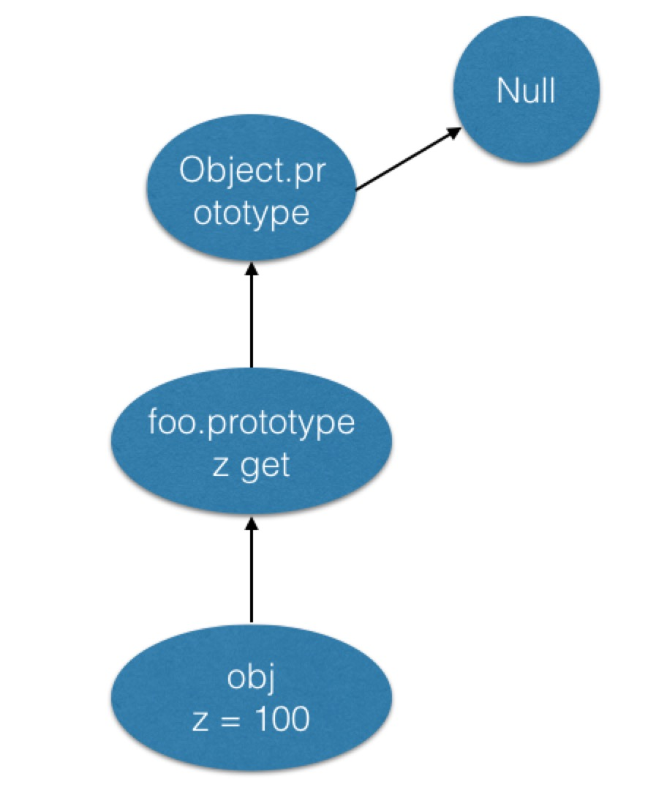
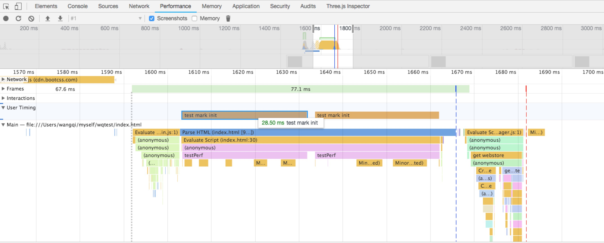

## 前言

  vue目前是前端使用频率较高的一套前端mvvm框架之一，提供了数据的响应式、`watch`、`computed`等极为方便的功能及api，那么，vue到底是如何实现这些功能的呢？在探究vue源码之前，必须了解以下几点javascript的基本内容，通过了解这些内容，你可以更加轻松的阅读vue源码。

## flow 类型检测

  Flow就是JavaScript的静态类型检查工具，由Facebook团队于2014年的Scale Conference上首次提出。该库的目标在于检查JavaScript中的类型错误，开发者通常不需要修改代码即可使用，故使用成本很低。同时，它也提供额外语法支持，使得开发者能更大程度地发挥Flow的作用。总结一句话：将javascript从弱类型语言变成了强类型语言。

  <!-- more -->	

### 基础检测类型

  Flow支持原始数据类型，其中void对应js中的undefined，基本有如下几种：
  ```
    boolean
    number
    string
    null
    void
  ```
  在定义变量的同时，只需要在关键的地方声明想要的类型，基本使用如下：
  ```js
  let str:number = 1;
  let str1:string = 'a';

  // 重新赋值
  str = 'd' // error
  str1 = 3  // error
  ```

### 复杂类型检测

  Flow支持复杂类型检测，基本有如下几种：
  ```
    Object
    Array
    Function
    自定义Class
  ```
  基本使用如下示例代码：
  ```js
  // Object 定义
  let o:Object = {
    key: 123
  }
  //声明了Object的key
  let o2:{key:string} = {
    key: '111'
  }

  // Array 定义
  //基于基本类似的数组，数组内都是相同类型
  let numberArr:number[] = [12,3,4,5,2];
  //另一个写法
  let numberAr2r:Array<number> = [12,3,2,3];

  let stringArr:string[] = ['12','a','cc'];
  let booleanArr:boolean[] = [true,true,false];
  let nullArr:null[] = [null,null,null];
  let voidArr:void[] = [ , , undefined,void(0)];

  //数组内包含各个不同的类型数据
  //第4个原素没有声明，则可以是任意类型
  let arr:[number,string,boolean] = [1,'a',true,function(){},];
  ```

  Function定义写法如下，vue源码中出现频率最多的：
  ```js
  /**
   * 声明带类型的函数
   * 这里是声明一个函数fn，规定了自己需要的参数类型和返回值类型。
   */
  function fn(arg:number,arg2:string):Object{
    return {
      arg,
      arg2
    }
  }

  /**
   * vue源码片段
   * src/core/instance/lifecycle.js
   */
  export function mountComponent (
    vm: Component,
    el: ?Element,
    hydrating?: boolean
  ): Component {
    // 省略
  }
  ```

  自定义的class，声明一个自定义类，然后用法如同基本类型，基本代码如下：
  ```js
  /**
   * vue源码片段
   * src/core/observer/index.js 
  */
  export class Observer {
    value: any;
    dep: Dep;
    vmCount: number;
    constructor (value: any) {
      // 省略
    }
  }  
  ```

  直接使用flow.js，javascript是无法在浏览器端运行的，必须借助babel插件，vue源码中使用的是babel-preset-flow-vue这个插件，并且在babelrc进行配置，片段代码如下：
  ```json
  // package.json 文件
  
  // 省略
  "devDependencies": {
    "@types/node": "^8.0.33",
    "@types/webpack": "^3.0.13",
    "acorn": "^5.2.1",
    "babel-core": "^6.25.0",
    "babel-eslint": "^8.0.3",
    "babel-helper-vue-jsx-merge-props": "^2.0.2",
    "babel-loader": "^7.0.0",
    "babel-plugin-istanbul": "^4.1.4",
    "babel-plugin-syntax-dynamic-import": "^6.18.0",
    "babel-plugin-syntax-jsx": "^6.18.0",
    "babel-plugin-transform-vue-jsx": "^3.4.3",
    "babel-preset-es2015": "^6.24.1",
    "babel-preset-flow-vue": "^1.0.0"
  }  
  // 省略

  // babelrc 文件
  {
    "presets": ["es2015", "flow-vue"],
    "plugins": ["transform-vue-jsx", "syntax-dynamic-import"],
    "ignore": [
      "dist/*.js",
      "packages/**/*.js"
    ]
  }
  ```

  ## 对象

  这里只对对象的创建、对象上的属性操作相关、getter/setter方法、对象标签等进行再分析，对于原型链以及原型继承原理不是本文的重要内容。

  ### 创建对象

  一般创建对象有以下三种写法，基本代码如下：
  ```js
    // 第一种 最简单的写法
    let obj = { a: 1 }
    obj.a // 1
    typeof obj.toString // 'function'

    // 第二种
    let obj2 = Object.create({ a: 1 })
    obj2.a // 1
    typeof obj2.toString // 'function'

    // 第三种
    let obj3 = Object.create(null)
    typeof obj3.toString // 'undefined'
  ```
  
  图解基本如下：

  

  Object.create可以理解为继承一个对象，它是ES5的一个新特性，对于旧版浏览器需要做兼容，基本代码如下（vue使用ie9+浏览器，所以不需要做兼容处理）：
  ```js
    if (!Object.create) {
      Object.create = function (o) {
        function F() {}  //定义了一个隐式的构造函数
        F.prototype = o;
        return new F();  //其实还是通过new来实现的
      };
    }
  ```
  
  其中，在vue源码中会看见使用`Object.create(null)`来创建一个空对象，其好处不用考虑会和原型链上的属性重名问题，vue代码片段如下：
  ```js
  // src/core/global-api/index.js
  // 再Vue上定义静态属性options并且赋值位空对象，ASSET_TYPES是在vue上定义的'component','directive','filter'等属性
    Vue.options = Object.create(null)
    ASSET_TYPES.forEach(type => {
      Vue.options[type + 's'] = Object.create(null)
    })
  ```

### 属性操作相关

  其实在创建对象的同时，对象上会默认设置当前对象的枚举类型值，如果不设置，默认所有枚举类型均为false，那么如何定义对象并且设置枚举类型值呢？主要使用到的是ES5的新特性`Object.defineProperty`。
  
  `Object.defineProperty(obj,prop,descriptor)`中的`descriptor`有如下几种参数：
  
  * configurable 当且仅当该属性的 configurable 为 true 时，该属性描述符才能够被改变，同时该属性也能从对应的对象上被删除。默认为 false
  * enumerable 当且仅当该属性的enumerable为true时，该属性才能够出现在对象的枚举属性中。默认为 false
  * value 该属性对应的值。可以是任何有效的 JavaScript 值（数值，对象，函数等）。默认为 undefined。
  * writable 当且仅当该属性的writable为true时，value才能被赋值运算符改变。默认为 false。
  * get 一个给属性提供 getter 的方法，如果没有 getter 则为 undefined。当访问该属性时，该方法会被执行，方法执行时没有参数传入，但是会传入this对象（由于继承关系，这里的this并不一定是定义该属性的对象）。默认为 undefined。
  * set 一个给属性提供 setter 的方法，如果没有 setter 则为 undefined。当属性值修改时，触发执行该方法。该方法将接受唯一参数，即该属性新的参数值。默认为 undefined

  > 注意：在 descriptor 中不能同时设置访问器 (get 和 set) 和 value。

  完整示例代码如下：
  ```js
    Object.defineProperty(obj,prop,
      configurable: true,
      enumerable: true,
      writable: true,
      value: '',
      get: function() {

      },
      set: function() {
        
      }
    )
  ```
  
  通过使用`Object.getOwnPropertyDescriptor`来查看对象上属性的枚举类型值，具体使用相关示例代码如下：
  ```js
    // 如果不设置枚举类型，默认都是false
    let obj = {}
    Object.defineProperty(obj, 'name', {
      value : "wqzwh"
    })
    Object.getOwnPropertyDescriptor(obj, 'name')
    // {value: "wqzwh", writable: false, enumerable: false, configurable: false}

    let obj2 = {}
    Object.defineProperty(obj2, 'name', {
      enumerable: true,
      writable: true,
      value : "wqzwh"
    })
    Object.getOwnPropertyDescriptor(obj2, 'name')
    // {value: "wqzwh", writable: true, enumerable: true, configurable: false}
  ```

  通过`Object.keys()`来获取对象的key，必须将`enumerable`设置为true才能获取，否则返回是空数组，代码如下：
  ```js
    let obj = {}
    Object.defineProperty(obj, 'name', {
      enumerable: true,
      value : "wqzwh"
    })
    Object.keys(obj) // ['name']
  ```

  通过`propertyIsEnumerable`可以判断定义的对象是否可枚举，代码如下：
  ```js
    let obj = {}
    Object.defineProperty(obj, 'name', {
      value : "wqzwh"
    })
    obj.propertyIsEnumerable('name') // false

    let obj = {}
    Object.defineProperty(obj, 'name', {
      enumerable: true,
      value : "wqzwh"
    })
    obj.propertyIsEnumerable('name') // true
  ```

  通过`hasOwnProperty`来检测一个对象是否含有特定的自身属性；和 in 运算符不同，该方法会忽略掉那些从原型链上继承到的属性。代码如下：
  ```js
    // 使用Object.defineProperty创建对象属性
    let obj = {}
    Object.defineProperty(obj, 'name', {
      value : "wqzwh",
      enumerable: true
    })
    let obj2 = Object.create(obj)
    obj2.age = 20
    for (key in obj2) {
      console.log(key); // age, name
    }
    for (key in obj2) {
      if (obj2.hasOwnProperty(key)) {
        console.log(key); // age
      }
    }
    
    // 普通创建属性
    let obj = {}
    obj.name = 'wqzwh'
    let obj2 = Object.create(obj)
    obj2.age = 20
    for (key in obj2) {
      console.log(key); // age, name
    }
    for (key in obj2) {
      if (obj2.hasOwnProperty(key)) {
        console.log(key); // age
      }
    }
  ```

  > 注意：如果继承的对象属性是通过`Object.defineProperty`创建的，并且`enumerable`未设置成`true`，那么`for in`依然不能枚举出原型上的属性。

### getter/setter方法

  通过`get/set`方法来检测属性变化，基本代码如下：
  ```js
    function foo() {}
    Object.defineProperty(foo.prototype, 'z', 
      {
        get: function(){
          return 1
        }
      }
    )
    let obj = new foo();
    console.log(obj.z) // 1
    obj.z = 10
    console.log(obj.z) // 1
  ```
  这个是`z`属性是`foo.prototype`上的属性并且有`get`方法，对于第二次通过`obj.z = 10`并不会在`obj`本身创建`z`属性，而是直接原型触发上的`get`方法。

  图解基本如下：
  

  如果在创建当前对象上定义`z`属性，并且设置`writable`和`configurable`为`true`，那么就可以改变`z`属性的值，并且删除`z`属性后再次访问`obj.z`仍然是1，测试代码如下：
  ```js
    function foo() {}
    Object.defineProperty(foo.prototype, 'z', 
      {
        get: function(){
          return 1
        }
      }
    )
    let obj = new foo();
    console.log(obj.z) // 1
    Object.defineProperty(obj, 'z', 
      {
        value: 100,
        writable: true,
        configurable: true
      }
    )
    console.log(obj.z) // 100
    obj.z = 300
    console.log(obj.z) // 300
    delete obj.z
    console.log(obj.z) // 1
  ```

  图解基本如下：
  
  
  `Object.defineProperty`中的`configurable`、`enumerable`、`writable`、`value`、`get`、`set`几个参数相互之间的关系到底如何呢？可以用一张图来清晰说明：
  

### 对象标签

  其实创建对象的同时都会附带一个`__proto__`的原型标签，除了使用`Object.create(null)`建立对象以外，代码如下：
  ```js
    let obj = {x: 1, y: 2}
    obj.__proto__.z = 3
    console.log(obj.z) // 3
  ```
  

  `Object.preventExtensions`方法用于锁住对象属性，使其不能够拓展，也就是不能增加新的属性，但是属性的值仍然可以更改，也可以把属性删除，`Object.isExtensible`用于判断对象是否可以被拓展，基本代码如下：
  ```js
    let obj = {x : 1, y : 2};
    Object.isExtensible(obj); // true
    Object.preventExtensions(obj);
    Object.isExtensible(obj); // false
    obj.z = 1;
    obj.z; // undefined, add new property failed
    Object.getOwnPropertyDescriptor(obj, 'x');
    // Object {value: 1, writable: true, enumerable: true, configurable: true}
  ```

  `Object.seal`方法用于把对象密封，也就是让对象既不可以拓展也不可以删除属性（把每个属性的configurable设为false）,单数属性值仍然可以修改，`Object.isSealed`由于判断对象是否被密封，基本代码如下：
  ```js
    let obj = {x : 1, y : 2};
    Object.seal(obj);
    Object.getOwnPropertyDescriptor(obj, 'x');
    // Object {value: 1, writable: true, enumerable: true, configurable: false}
    Object.isSealed(obj); // true
  ```

  `Object.freeze`完全冻结对象，在seal的基础上，属性值也不可以修改（每个属性的wirtable也被设为false），`Object.isFrozen`判断对象是否被冻结，基本代码如下：
  ```js
    let obj = {x : 1, y : 2};
    Object.freeze(obj);
    Object.getOwnPropertyDescriptor(obj, 'x');
    // Object {value: 1, writable: false, enumerable: true, configurable: false}
    Object.isFrozen(obj); // true
  ```

## DOM自定义事件

  在介绍这个命题之前，先看一段vue源码中的model的指令，打开`platforms/web/runtime/directives/model.js`，片段代码如下：
  ```js
    /* istanbul ignore if */
    if (isIE9) {
      // http://www.matts411.com/post/internet-explorer-9-oninput/
      document.addEventListener('selectionchange', () => {
        const el = document.activeElement
        if (el && el.vmodel) {
          trigger(el, 'input')
        }
      })
    }

    // 省略
    function trigger (el, type) {
      const e = document.createEvent('HTMLEvents')
      e.initEvent(type, true, true)
      el.dispatchEvent(e)
    }
  ```

  其中`document.activeElement`是当前获得焦点的元素，可以使用`document.hasFocus()`方法来查看当前元素是否获取焦点。

  对于标准浏览器，其提供了可供元素触发的方法：element.dispatchEvent(). 不过，在使用该方法之前，我们还需要做其他两件事，及创建和初始化。因此，总结说来就是：
  ```js
    document.createEvent()
    event.initEvent()
    element.dispatchEvent()
  ```

  `createEvent()`方法返回新创建的`Event`对象，支持一个参数，表示事件类型，具体见下表：
  ```
    参数	        事件接口	        初始化方法
    HTMLEvents	HTMLEvent	  initEvent()
    MouseEvents	MouseEvent	  initMouseEvent()
    UIEvents	  UIEvent	  initUIEvent()
  ```
  `initEvent()`方法用于初始化通过`DocumentEvent`接口创建的`Event`的值。支持三个参数：`initEvent(eventName, canBubble, preventDefault)`. 分别表示事件名称，是否可以冒泡，是否阻止事件的默认操作。

  `dispatchEvent()`就是触发执行了，上文vue源码中的`el.dispatchEvent(e)`, 参数e表示事件对象，是`createEvent()`方法返回的创建的`Event`对象。

  那么这个东东具体该怎么使用呢？例如自定一个`click`方法，代码如下：
  ```js
    // 创建事件.
    let event = document.createEvent('HTMLEvents');
    // 初始化一个点击事件，可以冒泡，无法被取消
    event.initEvent('click', true, false);
    let elm = document.getElementById('wq')
    // 设置事件监听.
    elm.addEventListener('click', (e) => {
      console.log(e)
    }, false);
    // 触发事件监听
    elm.dispatchEvent(event);
  ```

## 数组扩展方法

  ### every方法/some方法

  接受两个参数，第一个是函数（接受三个参数：`数组当前项的值、当前项在数组中的索引、数组对象本身`），第二个参数是执行第一个函数参数的作用域对象，也就是上面说的函数中this所指向的值，如果不设置默认是undefined。

  > 这两种方法都不会改变原数组

  * every()： 该方法对数组中的每一项运行给定函数，如果该函数对每一项都返回 true，则返回true。
  * some()： 该方法对数组中的每一项运行给定函数，如果该函数对任何一项返回 true，则返回true。

  示例代码如下：
  ```js
  let arr = [ 1, 2, 3, 4, 5, 6 ];  
  console.log( arr.some( function( item, index, array ){  
    console.log( 'item=' + item + ',index='+index+',array='+array );  
    return item > 3;  
  }));  
  console.log( arr.every( function( item, index, array ){  
    console.log( 'item=' + item + ',index='+index+',array='+array );  
    return item > 3;  
  }));  
  ```
  some方法是碰到一个返回true的值时候就返回了，并没有继续往下运行，而every也一样，第一个值就是一个false,所以后面也没有进行下去的必要了，就直接返回结果了。

## getBoundingClientRect

  该方法返回一个矩形对象，其中四个属性：`left、top、right、bottom`，分别表示元素各边与页面上边和左边的距离，`x、y`表示左上角定点的坐标位置。

  

  通过这个方法计算得出的`left、top、right、bottom、x、y`会随着视口区域内滚动操作而发生变化，如果你需要获得相对于整个网页左上角定位的属性值，那么只要给top、left属性值加上当前的滚动位置。

  > 为了跨浏览器兼容，请使用 window.pageXOffset 和 window.pageYOffset 代替 window.scrollX 和 window.scrollY。不能访问这些属性的脚本可以使用下面的代码：
  
  ```js
  // For scrollX
  (((t = document.documentElement) || (t = document.body.parentNode))
    && typeof t.scrollLeft == 'number' ? t : document.body).scrollLeft
  // For scrollY
  (((t = document.documentElement) || (t = document.body.parentNode))
    && typeof t.scrollTop == 'number' ? t : document.body).scrollTop
  ```

  在IE中，默认坐标从(2,2)开始计算，导致最终距离比其他浏览器多出两个像素，代码如下：
  ```js
    document.documentElement.clientTop;  // 非IE为0，IE为2
    document.documentElement.clientLeft; // 非IE为0，IE为2

    // 所以为了保持所有浏览器一致，需要做如下操作
    functiongGetRect (element) {
      let rect = element.getBoundingClientRect();
      let top = document.documentElement.clientTop;
      let left= document.documentElement.clientLeft;
      return{
        top: rect.top - top,
        bottom: rect.bottom - top,
        left: rect.left - left,
        right: rect.right - left
      }
    }
  ```

## performance
  
  vue中片段源码如下：
  ```js
    if (process.env.NODE_ENV !== 'production') {
      const perf = inBrowser && window.performance
      /* istanbul ignore if */
      if (
        perf &&
        perf.mark &&
        perf.measure &&
        perf.clearMarks &&
        perf.clearMeasures
      ) {
        mark = tag => perf.mark(tag)
        measure = (name, startTag, endTag) => {
          perf.measure(name, startTag, endTag)
          perf.clearMarks(startTag)
          perf.clearMarks(endTag)
          perf.clearMeasures(name)
        }
      }
    }
  ```
  `performance.mark`方法在浏览器的性能条目缓冲区中创建一个具有给定名称的缓冲区，`performance.measure`在浏览器的两个指定标记（分别称为起始标记和结束标记）之间的性能条目缓冲区中创建一个命名，测试代码如下：
  ```js
    let _uid = 0
    const perf = window.performance
    function testPerf() {
      _uid++
      let startTag = `test-mark-start:${_uid}`
      let endTag = `test-mark-end:${_uid}`

      // 执行mark函数做标记
      perf.mark(startTag)

      for(let i = 0; i < 100000; i++) {
        
      }

      // 执行mark函数做标记
      perf.mark(endTag)
      perf.measure(`test mark init`, startTag, endTag)
    }
  ```
  测试结果可以在谷歌浏览器中的`Performance`中监测到，效果图如下：
  

  浏览器中`performance`处理模型基本如下（[更多具体参数说明](https://www.w3.org/TR/navigation-timing/)）：
  
  

## Proxy相关

  ### get方法
  
  `get`方法用于拦截某个属性的读取操作，可以接受三个参数，依次为目标对象、属性名和 proxy 实例本身（严格地说，是操作行为所针对的对象），其中最后一个参数可选。
  > 拦截对象属性的读取，比如proxy.foo和proxy['foo']

  基本使用如下：
  ```js
    let person = {
      name: "张三"
    };

    let proxy = new Proxy(person, {
      get: (target, property) => {
        if (property in target) {
          return target[property];
        } else {
          throw new ReferenceError("Property \"" + property + "\" does not exist.");
        }
      }
    });

    proxy.name // "张三"
    proxy.age // 抛出一个错误
  ```

  如果一个属性不可配置（configurable）且不可写（writable），则 Proxy 不能修改该属性，否则通过 Proxy 对象访问该属性会报错。示例代码如下：
  ```js
    const target = Object.defineProperties({}, {
      foo: {
        value: 123,
        writable: false,
        configurable: false
      },
    });
    const handler = {
      get(target, propKey) {
        return 'abc';
      }
    };
    const proxy = new Proxy(target, handler);
    proxy.foo // TypeError: Invariant check failed
  ```

  ### has方法

  此方法可以接受两个参数，分别是目标对象、需查询的属性名，主要拦截如下几种操作：

  * 属性查询: foo in proxy
  * 继承属性查询: foo in Object.create(proxy)
  * with 检查: with(proxy) { (foo); }
  * Reflect.has()

  如果原对象不可配置或者禁止扩展，这时has拦截会报错。基本示例代码如下：
  ```js
    let obj = { a: 10 };
    Object.preventExtensions(obj);
    let p = new Proxy(obj, {
      has: function(target, prop) {
        return false;
      }
    });
    'a' in p // TypeError is thrown
  ```

  `has`拦截只对`in`运算符生效，对`for...in`循环不生效。基本示例代码如下：
  ```js
    let stu1 = {name: '张三', score: 59};
    let stu2 = {name: '李四', score: 99};
    let handler = {
      has(target, prop) {
        if (prop === 'score' && target[prop] < 60) {
          console.log(`${target.name} 不及格`);
          return false;
        }
        return prop in target;
      }
    }
    let oproxy1 = new Proxy(stu1, handler);
    let oproxy2 = new Proxy(stu2, handler);
    'score' in oproxy1
    // 张三 不及格
    // false
    'score' in oproxy2
    // true
    for (let a in oproxy1) {
      console.log(oproxy1[a]);
    }
    // 张三
    // 59
    for (let b in oproxy2) {
      console.log(oproxy2[b]);
    }
    // 李四
    // 99
  ```
  
  使用`with`关键字的目的是为了简化多次编写访问同一对象的工作，基本写法如下：
  ```js
    let qs = location.search.substring(1);
    let hostName = location.hostname;
    let url = location.href;

    with (location){
      let qs = search.substring(1);
      let hostName = hostname;
      let url = href;
    }
  ```

  使用`with`关键字会导致代码性能降低，使用`let`定义变量相比使用`var`定义变量能提高一部分性能，示例代码如下：
  ```js
    // 不使用with
    function func() {
      console.time("func");
      let obj = {
        a: [1, 2, 3]
      };
      for (let i = 0; i < 100000; i++) {
        let v = obj.a[0];
      }
      console.timeEnd("func");// 1.310302734375ms
    }
    func();

    // 使用with并且使用let定义变量
    function funcWith() {
      console.time("funcWith");
      const obj = {
        a: [1, 2, 3]
      };
      with (obj) {
        let a = obj.a
        for (let i = 0; i < 100000; i++) {
          let v = a[0];
        }
      }
      console.timeEnd("funcWith");// 14.533935546875ms
    }
    funcWith();

    // 使用with
    function funcWith() {
      console.time("funcWith");
      var obj = {
        a: [1, 2, 3]
      };
      with (obj) {
        for (var i = 0; i < 100000; i++) {
          var v = a[0];
        }
      }
      console.timeEnd("funcWith");// 52.078857421875ms
    }
    funcWith();
  ```
  js引擎在代码执行之前有一个编译阶段，在不使用`with`关键字的时候，js引擎知道a是obj上的一个属性，它就可以静态分析代码来增强标识符的解析，从而优化了代码，因此代码执行的效率就提高了。使用了`with`关键字后，js引擎无法分辨出a变量是局部变量还是obj的一个属性，因此，js引擎在遇到with关键字后，它就会对这段代码放弃优化，所以执行效率就降低了。

  使用`has`方法拦截`with`关键字，示例代码如下：
  ```js
    let stu1 = {name: '张三', score: 59};
    let handler = {
      has(target, prop) {
        if (prop === 'score' && target[prop] < 60) {
          console.log(`${target.name} 不及格`);
          return false;
        }
        return prop in target;
      }
    }
    let oproxy1 = new Proxy(stu1, handler);

    function test() {
      let score
      with(oproxy1) {
        return score
      }
    }
    test() // 张三 不及格
  ```

  在使用`with`关键字时候，主要是因为js引擎在解析代码块中变量的作用域造成的性能损失，那么我们可以通过定义局部变量来提高其性能。修改示例代码如下：
  ```js
    // 修改后
    function funcWith() {
      console.time("funcWith");
      const obj = {
        a: [1, 2, 3]
      };
      with (obj) {
        let a = obj.a
        for (let i = 0; i < 100000; i++) {
          let v = a[0];
        }
      }
      console.timeEnd("funcWith");// 1.7109375ms
    }
    funcWith();
  ```

  但是在实际使用的时候在`with`代码块中定义局部变量不是很可行，那么删除频繁查找作用域的功能应该可以提高代码部分性能，经测试运行时间几乎相同，修改代码如下：
  ```js
    function func() {
      console.time("func");
      let obj = {
        a: [1, 2, 3]
      };
      let v = obj.a[0];
      console.timeEnd("func");// 0.01904296875ms
    }
    func();

    // 修改后
    function funcWith() {
      console.time("funcWith");
      const obj = {
        a: [1, 2, 3]
      };
      with (obj) {
        let v = a[0];
      }
      console.timeEnd("funcWith");// 0.028076171875ms
    }
    funcWith();
  ```

  配上`has`函数后执行效果如何呢，片段代码如下：
  ```js
    // 第一段代码其实has方法没用，只是为了对比使用
    console.time("测试");
    let stu1 = {name: '张三', score: 59};
    let handler = {
      has(target, prop) {
        if (prop === 'score' && target[prop] < 60) {
          console.log(`${target.name} 不及格`);
          return false;
        }
        return prop in target;
      }
    }
    let oproxy1 = new Proxy(stu1, handler);

    function test(oproxy1) {
      return {
        render: () => {
          return oproxy1.score
        }
      }
    }
    console.log(test(oproxy1).render()) // 张三 不及格
    console.timeEnd("测试"); // 0.719970703125ms


    console.time("测试");
    let stu1 = {name: '张三', score: 59};
    let handler = {
      has(target, prop) {
        if (prop === 'score' && target[prop] < 60) {
          console.log(`${target.name} 不及格`);
          return false;
        }
        return prop in target;
      }
    }
    let oproxy1 = new Proxy(stu1, handler);

    function test(oproxy1) {
      let score
      return {
        render: () => {
          with(oproxy1) {
            return score
          }
        }
      }
    }
    console.log(test(oproxy1).render()) // 张三 不及格
    console.timeEnd("测试"); // 0.760009765625ms
  ```

  vue中使用`with`关键字的片段代码如下，主要通过`proxy`来拦截`AST`语言树中涉及到的变量以及方法，并且判断是否`AST`语言树中是否存在为定义的变量及方法，至于为什么`vue`会使用`with`关键字，具体可以[点击查看](https://github.com/vuejs/vue/issues/3923)
  ```js
    export function generate (
      ast: ASTElement | void,
      options: CompilerOptions
    ): CodegenResult {
      const state = new CodegenState(options)
      const code = ast ? genElement(ast, state) : '_c("div")'
      return {
        render: `with(this){return ${code}}`,
        staticRenderFns: state.staticRenderFns
      }
    }
  ```

## outerHTML

  打开`platforms/web/entry-runtime-width-compile.js`，查看`getOuterHTML`方法，片段代码如下：
  ```js
    function getOuterHTML (el: Element): string {
      if (el.outerHTML) {
        return el.outerHTML
      } else {
        const container = document.createElement('div')
        container.appendChild(el.cloneNode(true))
        return container.innerHTML
      }
    }
  ```
  由于在IE9-11中`SVG`标签元素是没有`innerHTML`和`outerHTML`这两个属性，所以会有`else`之后的语句

## 总结
以上主要是在阅读源码时，发现不是很明白的`api`以及一些方法，每个人可以根据自己的实际情况选择性阅读，以上就是全部内容，如果有什么不对的地方，欢迎提[issues](https://github.com/wqzwh/blog/blob/master/source/_posts/2018-06-30-vue.md)