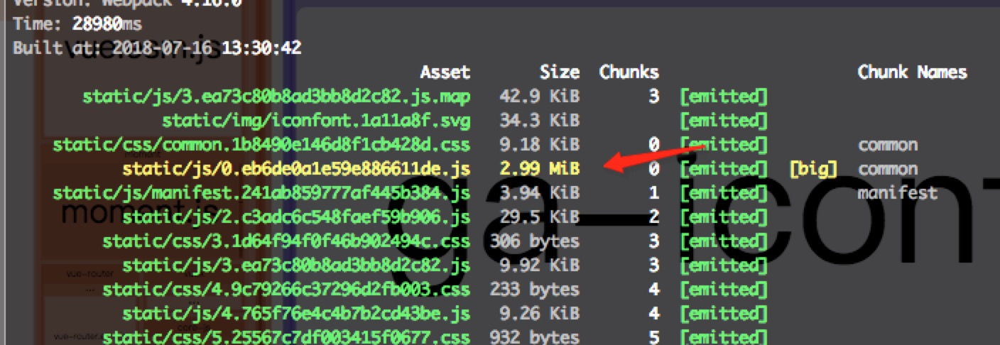
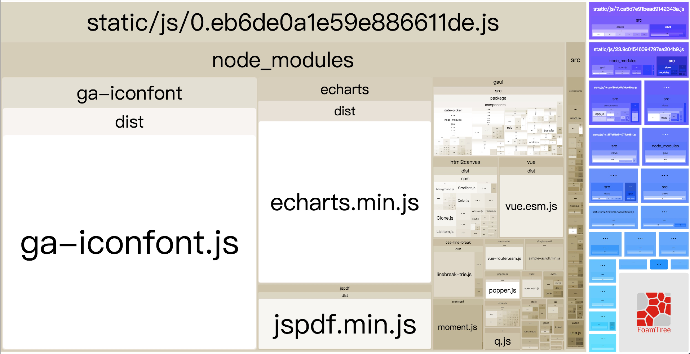
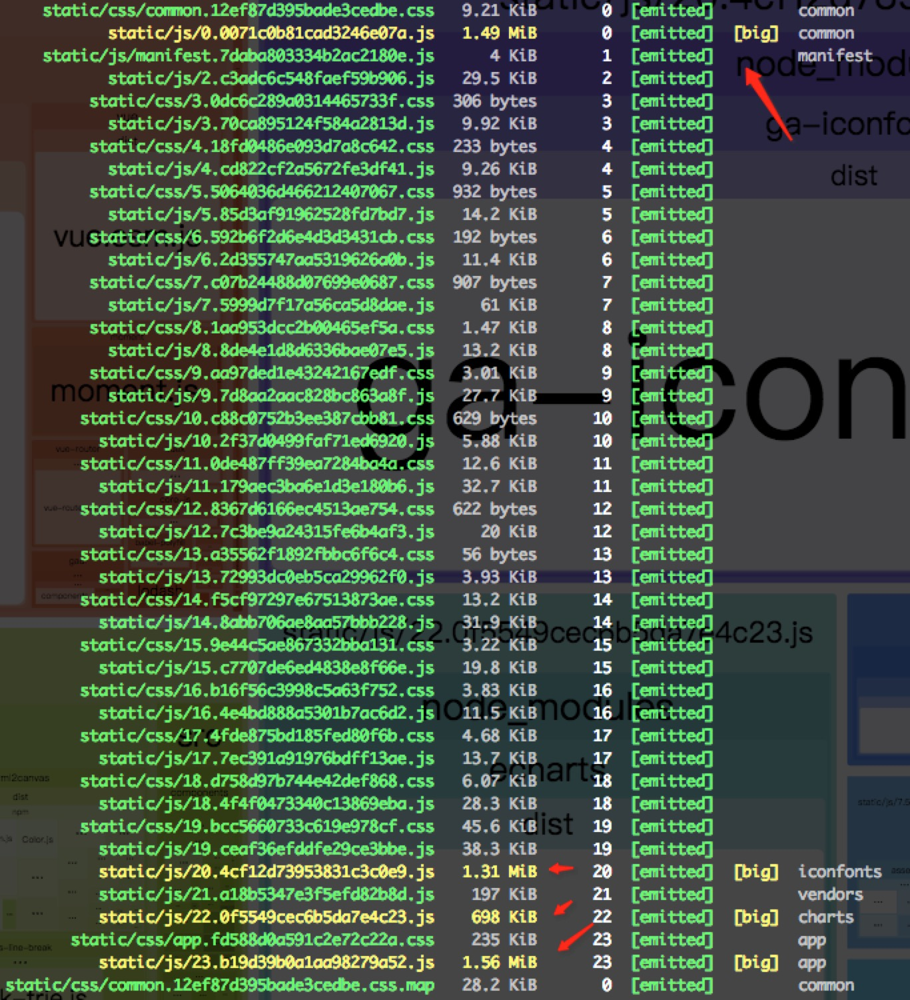
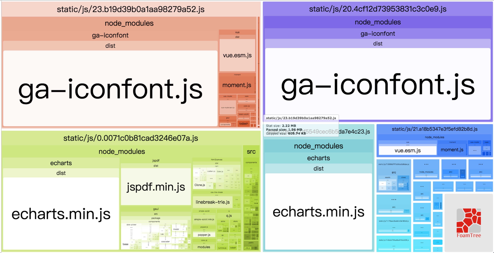
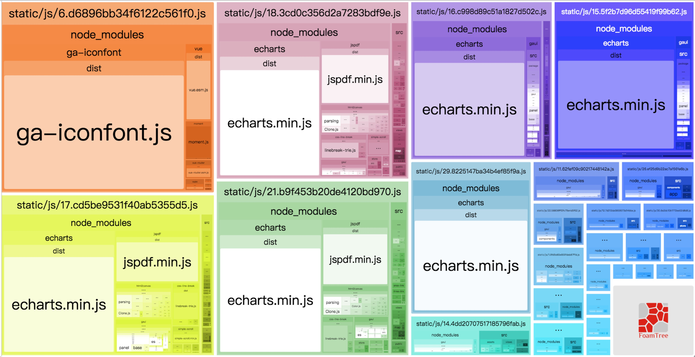
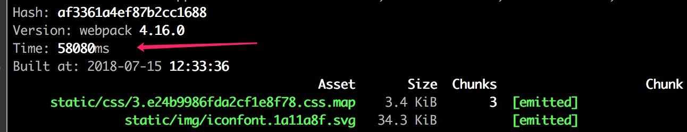
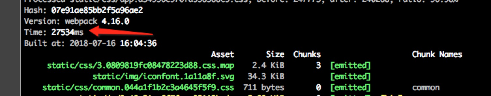

## 基础介绍

`Webpack`也在不断的优化迭代；截至目前，已经更新至 v4.16.0；在`Webpack4`这个版本，它在原有基础上，做了很多优化，也引入了颇多的新特性。在新的版本中，将获得更多模块类型及对`.mjs`的支持，更好的默认值、更为简洁的模式设置、更加智能的来分割`Chunk`，还新增的`splitChunks`来自定义分割代码块，诸此等等。在升级至新版`Webpack`的项目中，在包的`构建速度`、`代码块体积&数量`、以及`运行效率`，都会有一个质的飞跃。

因此面对`Webpack4`优越的功能，将本地项目中从原先的`2.7.0`一步到位升级至`4.16.0`，并且相关依赖包以及配置文件需要做相应的修改。
  <!-- more -->	

## webpack4.0升级流程

### node环境

不再支持`Node4`，建议使用高版本`node`，以下做升级使用的是的`node v8.11.1`和`npm v5.6.0`

### 模块类型

webpack 4之前，js 是 webpack 中的唯一模块类型，因而不能有效地打包其它类型的文件。而 webpack 4 则提供了 5 种模块类型：

* javascript/auto: (webpack 3中的默认类型)支持所有的JS模块系统：CommonJS、AMD、ESM
* javascript/esm: EcmaScript 模块，在其他的模块系统中不可用（默认 .mjs 文件）
* javascript/dynamic: 仅支持 CommonJS & AMD，EcmaScript 模块不可用
* json: 可通过 require 和 import 导入的 JSON 格式的数据(默认为 .json 的文件)
* webassembly/experimental: WebAssembly 模块(处于试验阶段，默认为 .wasm 的文件)

此外，webpack 4 中会默认解析 .wasm, .mjs, .js 和 .json 为后缀的文件。

### webpack-cli

升级完`webpack4`然后直接运行项目打包命令`npm run build`，会提示你需要安装`webpack-cli/webpack-command`，可以根据自己的需要选择安装，本人选择的是`webpack-cli`。

### 配置更新

#### mode添加

`webpack4`默认是通过`mode`来设置是`生产环境`还是`开发环境`，所以需要在`webpack.dev.conf.js`和`webpack.prod.conf.js`增加相应的`mode`配置项，并且删除之前设置环境变量的代码`process.env.NODE_ENV = 'production'`以及插件配置中设置环境变量的方法，片段代码如下：
```js
// webpack.dev.conf.js
module.exports = merge(baseWebpackConfig, {
  mode: 'development',
  // 省略
  plugins: [
    new webpack.DefinePlugin({
        'process.env': config.dev.env
    }),
  ]
} 

// webpack.prod.conf.js
var webpackConfig = merge(baseWebpackConfig, {
  mode: 'production',
  // 省略
  plugins: [
    new webpack.DefinePlugin({
      'process.env': env
    }),
  ]  
}  
```
> 注意：new webpack.DefinePlugin是保证浏览器脚本中能够访问`process.env`变量，以便做相应的逻辑操作

**development 模式：**
* 1.主要优化了增量构建速度和开发体验
* 2.process.env.NODE_ENV 的值不需要再定义，默认是 development
* 3.开发模式下支持注释和提示，并且支持 eval 下的 source maps

**production 模式：**
* 1.生产环境默认开启了很多代码优化（minify，splite等）
* 2.开发时开启注视和验证，并且自动加上了eval devtool
* 3.生产环境不支持watching，开发环境优化了重新打包的速度
* 4.默认开启了Scope hoisting和Tree-shaking（原ModuleConcatenationPlugin）
* 5.自动设置process.env.NODE_ENV到不同环境，也就是不需要DefinePlugin来做这个了
* 6.如果你给mode设置为none，所有默认配置都去掉了
* 7.如果不加这个配置webpack会出现提醒，所以还是加上吧


#### mini-css-extract-plugin使用

因为`extract-text-webpack-plugin`的最新正式版还没有对webpack4.x进行支持，即使是使用`extract-text-webpack-plugin@next`版本依然会出现报`contenthash`错误，所以还是建议使用`mini-css-extract-plugin`，当然这也是官方推荐的。

主要需要修改`webpack.prod.conf.js`中的插件配置以及`loaders`加载的工具函数`utils.js`，修改片段代码如下：
```js
// webpack.dev.conf.js
module.exports = merge(baseWebpackConfig, {
  // 省略
  plugins: [
    new MiniCssExtractPlugin({
      filename: utils.assetsPath('css/[name].[contenthash].css')
    }),
  ]
} 

// utils.js
if (options.extract) {
return [
  {
    loader: MiniCssExtractPlugin.loader,
    options: {
      publicPath: '../../'
    }
  }
  ].concat(loaders)
} else {
  return ['vue-style-loader'].concat(loaders)
}
```
> 注意：其中`utils.js`中配置`publicPath`主要解决css中引用图片出现路径错误问题。

#### optimization配置项
再次运行相关打包命令你会发现有如下提示错误，片段代码如下：
```js
Error: webpack.optimize.CommonsChunkPlugin has been removed, please use config.optimization.splitChunks instead.
    at Object.get [as CommonsChunkPlugin] (/data/test/node_modules/webpack/lib/webpack.js:159:10)
```

主要是因为`webpack4`中删除了`webpack.optimize.CommonsChunkPlugin`，并且使用`optimization`中的`splitChunk`来替代

主要需要修改`webpack.prod.conf.js`文件，并且删除所有`webpack.optimize.CommonsChunkPlugin`相关代码，片段代码如下：
```js
var webpackConfig = merge(baseWebpackConfig, {
  mode: 'production',
  entry: {
    charts: ['echarts'],
    vendors: ['vue', 'vuex', 'vue-router', 'moment'],
    iconfonts: ['ga-iconfont']
  },
  // 省略
  optimization: {
    // minimizer: true, // [new UglifyJsPlugin({...})]
    providedExports: true,
    usedExports: true,
    //识别package.json中的sideEffects以剔除无用的模块，用来做tree-shake
    //依赖于optimization.providedExports和optimization.usedExports
    sideEffects: true,
    //取代 new webpack.optimize.ModuleConcatenationPlugin()
    concatenateModules: true,
    //取代 new webpack.NoEmitOnErrorsPlugin()，编译错误时不打印输出资源。
    noEmitOnErrors: true,
    splitChunks: {
      // maxAsyncRequests: 1,                     // 最大异步请求数， 默认1
      // maxInitialRequests: 1,                   // 最大初始化请求数，默认1
      cacheGroups: {
        // 抽离第三方插件
        commons: {
          // test: path.resolve(__dirname, '../node_modules'),
          chunks: 'all',
          minChunks: 2,
          maxInitialRequests: 5, // The default limit is too small to showcase the effect
          minSize: 0, // This is example is too small to create commons chunks
          name: 'common'
        }
      }
    },
}    
```

`test`主要是通过正则来匹配`entry`中配置第三方库，当然这里也可以写成`path.resolve(__dirname, '../node_modules')`来匹配项目中`node_modules`引入的库文件。

`chunks`形式有三种取值（如果配置了`entry`，那么默认从入口文件中抽离，如果没有配置`entry`配置了`test`，默认按照`test`中的正则去匹配）个人比较推荐使用`all`或者`async`：

  * 当取值`all`的时候，效果是不管是异步还是同步，都会将入口`entry`配置的包公共部分抽离出来，好处就是其他文件很小，公共文件会只加载一次，不优雅的就是如果`enrty`配置的包过多会导致一个文件很大。效果基本如下：
 
  

  * 当取值`async`的时候，效果是将入口`entry`配置的包抽离异步的公共部分，主要是看`entry`中包的引入方式是不是异步的。效果基本如下：
 
  

  * 当取值`initial`的时候，其实效果不如`all`和`async`，就是在初始化的时候，将每个页面涉及到的包从各自页面中的js中抽离出来。效果基本如下：
 

`sideEffects`开启时可以剔除无用的模块，用来做`tree-shake`。当模块的`package.json`中添加该字段时，表明该模块没有副作用，也就意味着`webpack`可以安全地清除被用于重复导出(re-exports)的代码。

`concatenateModules`取代了`webpack.optimize.ModuleConcatenationPlugin()`插件

`noEmitOnErrors`取代了`new webpack.NoEmitOnErrorsPlugin()`插件。

`minChunks`是`split`前，有共享模块的`chunks`的最小数目 ，默认值是1，但示例里的代码在`default`里把它重写成2了，从常理上讲，`minChunks = 2`应该是一个比较合理的选择吧

> 注意：`webpack.optimize.UglifyJsPlugin`现在也不需要了，只需要使用`optimization.minimize`为`true`就行，`production mode`下面自动为`true`，当然如果想使用第三方的压缩插件也可以在`optimization.minimizer`的数组列表中进行配置

#### html-webpack-plugin升级

建议升级至最新版本`@4.0.0-alpha`，这里需要把默认的`chunksSortMode: dependency`删除，主要是因为`webpack4`已经删除相关的`CommonsChunkPlugin`API了。

#### vue-loader升级

其实这个可以不需要升级，但是如果升级至15.x版本以上，在使用中需要执行`VueLoaderPlugin`插件方法，其他用法跟之前保持一致，片段代码如下：
```js
// webpack.prod.conf.js
const { VueLoaderPlugin } = require('vue-loader')
// 省略
plugins: [
    new VueLoaderPlugin(),
]    
```

#### 需要开启sourceMap

`webpack4`会默认提示需要开启`sourceMap`，因此只要在相关`loader`配置中的`options`配置`sourceMap：true`即可。

#### 其他相关包升级

建议把相关loader统一做一次升级，基本升级如下：
* babel-loader 7.1.5
* css-loader 1.0.0
* file-loader 1.1.11
* less-loader 4.1.0
* url-loader 1.0.1
* vue-style-loader 4.1.0
* vue-template-compiler 2.5.16

## 完整配置

### webpack.dev.conf.js
```js
const utils = require('./utils')
const webpack = require('webpack')
const config = require('../config')
const merge = require('webpack-merge')
const baseWebpackConfig = require('./webpack.base.conf')
const HtmlWebpackPlugin = require('html-webpack-plugin')
const FriendlyErrorsPlugin = require('friendly-errors-webpack-plugin')
const { VueLoaderPlugin } = require('vue-loader')

// add hot-reload related code to entry chunks
Object.keys(baseWebpackConfig.entry).forEach(function (name) {
  baseWebpackConfig.entry[name] = ['./build/dev-client'].concat(baseWebpackConfig.entry[name])
})

baseWebpackConfig.output.chunkFilename = '[name].[chunkhash].js';            // 路由js命名 这个拆分路由 模块依赖脚本文件

module.exports = merge(baseWebpackConfig, {
  mode: 'development',
  module: {
    rules: utils.styleLoaders({ sourceMap: config.dev.cssSourceMap })
  },
  devtool: '#cheap-module-eval-source-map',
  optimization: {
    // minimizer: true,
    providedExports: true,
    usedExports: true,
    //识别package.json中的sideEffects以剔除无用的模块，用来做tree-shake
    //依赖于optimization.providedExports和optimization.usedExports
    sideEffects: true,
    //取代 new webpack.optimize.ModuleConcatenationPlugin()
    concatenateModules: true,
    //取代 new webpack.NoEmitOnErrorsPlugin()，编译错误时不打印输出资源。
    noEmitOnErrors: true,
    splitChunks: {
      chunks: 'initial', //'all'|'async'|'initial'(全部|按需加载|初始加载)的chunks
    },
    //提取webpack运行时的代码
    runtimeChunk: {
      name: 'manifest'
    }
  },
  plugins: [
    new VueLoaderPlugin(),
    new webpack.HotModuleReplacementPlugin(),
    new HtmlWebpackPlugin({
      filename: 'index.html',
      template: 'index.html',
      inject: true
    }),
    new FriendlyErrorsPlugin()
  ]
})
```

### webpack.prod.conf.js
```js
const path = require('path')
const utils = require('./utils')
const webpack = require('webpack')
const config = require('../config')
const merge = require('webpack-merge')
const baseWebpackConfig = require('./webpack.base.conf')
const CopyWebpackPlugin = require('copy-webpack-plugin')
const HtmlWebpackPlugin = require('html-webpack-plugin')
const MiniCssExtractPlugin = require('mini-css-extract-plugin')
const OptimizeCSSPlugin = require('optimize-css-assets-webpack-plugin')
const { VueLoaderPlugin } = require('vue-loader')

var webpackConfig = merge(baseWebpackConfig, {
  mode: 'production',
  entry: {
    charts: ['echarts'],
    vendors: ['vue', 'vuex', 'vue-router', 'moment'],
    iconfonts: ['ga-iconfont']
  },
  module: {
    rules: utils.styleLoaders({
      sourceMap: config.build.productionSourceMap,
      extract: true
    })
  },
  devtool: config.build.productionSourceMap ? '#source-map' : false,
  output: {
    path: config.build.assetsRoot,
    filename: utils.assetsPath('js/[name].[chunkhash].js'),
    chunkFilename: utils.assetsPath('js/[id].[chunkhash].js'),
    publicPath: './'
  },
  optimization: {
    // minimizer: true,
    providedExports: true,
    usedExports: true,
    //识别package.json中的sideEffects以剔除无用的模块，用来做tree-shake
    //依赖于optimization.providedExports和optimization.usedExports
    sideEffects: true,
    //取代 new webpack.optimize.ModuleConcatenationPlugin()
    concatenateModules: true,
    //取代 new webpack.NoEmitOnErrorsPlugin()，编译错误时不打印输出资源。
    noEmitOnErrors: true,
    splitChunks: {
      // maxAsyncRequests: 1,                     // 最大异步请求数， 默认1
      // maxInitialRequests: 1,                   // 最大初始化请求书，默认1
      cacheGroups: {
        // test: path.resolve(__dirname, '../node_modules'),
        commons: {
          chunks: 'all',
          minChunks: 2,
          maxInitialRequests: 5, // The default limit is too small to showcase the effect
          minSize: 0, // This is example is too small to create commons chunks
          name: 'common'
        }
      }
    },
    //提取webpack运行时的代码
    runtimeChunk: {
      name: 'manifest'
    }
  },
  plugins: [
    new VueLoaderPlugin(),
    // 解决moment语言包问题
    new webpack.ContextReplacementPlugin(
      /moment[\\\/]locale$/,
      /^\.\/(zh-cn)$/
    ),

    new MiniCssExtractPlugin({
      filename: utils.assetsPath('css/[name].[contenthash].css')
    }),
    new OptimizeCSSPlugin({
      cssProcessorOptions: {
        safe: true,
        discardComments: { removeAll: true }
      }
    }),

    new HtmlWebpackPlugin({
      filename: config.build.index,
      template: 'index.html',
      inject: true,
      hash:true,// 防止缓存
      minify: {
        removeComments: true,
        collapseWhitespace: true,
        removeAttributeQuotes: true
      }
    }),
    new webpack.HashedModuleIdsPlugin(),

    new CopyWebpackPlugin([{
      from: path.resolve(__dirname, '../static'),
      to: config.build.assetsSubDirectory,
      ignore: ['.*']
    }])
  ]
})

if (config.build.productionGzip) {
  var CompressionWebpackPlugin = require('compression-webpack-plugin')

  webpackConfig.plugins.push(
    new CompressionWebpackPlugin({
      asset: '[path].gz[query]',
      algorithm: 'gzip',
      test: new RegExp(
        '\\.(' +
        config.build.productionGzipExtensions.join('|') +
        ')$'
      ),
      threshold: 10240,
      minRatio: 0.8
    })
  )
}

if (config.build.bundleAnalyzerReport) {
  var BundleAnalyzerPlugin = require('webpack-bundle-analyzer').BundleAnalyzerPlugin
  webpackConfig.plugins.push(new BundleAnalyzerPlugin())
}

module.exports = webpackConfig
```

## 注意事项

### preload插件报错

如果在项目中使用了`preload-webpack-plugin`插件，必须升级至`3.0.0-beta.1`版本，可以运行以下命令：
```
npm i preload-webpack-plugin@next -D
```

同时需要把`html-webpack-plugin`插件版本回退到`3.2.0`才行，然后在配置文件按照以下先后顺序添加，片段代码如下：
```js
// 省略
plugins: [
  new HtmlWebpackPlugin({
    filename: config.build.index,
    template: 'index.html',
    inject: true,
    minify: {
      removeComments: true,
      collapseWhitespace: true,
      removeAttributeQuotes: true
    },
  }),
  new PreloadWebpackPlugin({
    rel: 'prefetch',
  }),
  new PreloadWebpackPlugin({
    rel: 'preload'
  }),
  // 省略
]
```

### html-webpack-plugin-after-emit

升级`webpack4`之后，在`dev`环境下，你会发现修改任何代码会导致整个网页刷新，而且会报`cb is not a function`，造成这个原因是`html-webpack-plugin-after-emit`插件针对高版本的`webpack4`和`html-webpack-plugin3.2.0`已经被弃用了，暂时没找到替代的插件，可以暂时先注释掉这段代码，代码在`build/dev-server.js`中，片段代码如下：
```js
compiler.plugin('compilation', function(compilation) {
    compilation.plugin('html-webpack-plugin-after-emit', function(data, cb) {
        hotMiddleware.publish({ action: 'reload' })
        cb()
    })
})
```

## 总结

按照以上修改基本可以完成`webpack4`的升级，升级完之后，个人感觉配置更加简单，删除了以前很多繁琐的插件配置，很多功能`webpack4`默认就是自带，经过测试打包速度有了50%多的提升，修改之前打包时间为`143894ms`左右，升级完之后，用时基本在`58080ms`左右，效果基本如下：
 

 再次打包的话，用时基本在`27534ms`左右，效果基本如下：
 

以上就是全部内容，如果有什么不对的地方，欢迎提[issues](https://github.com/wqzwh/blog/blob/master/source/_posts/2018-07-14-wpk.md)


