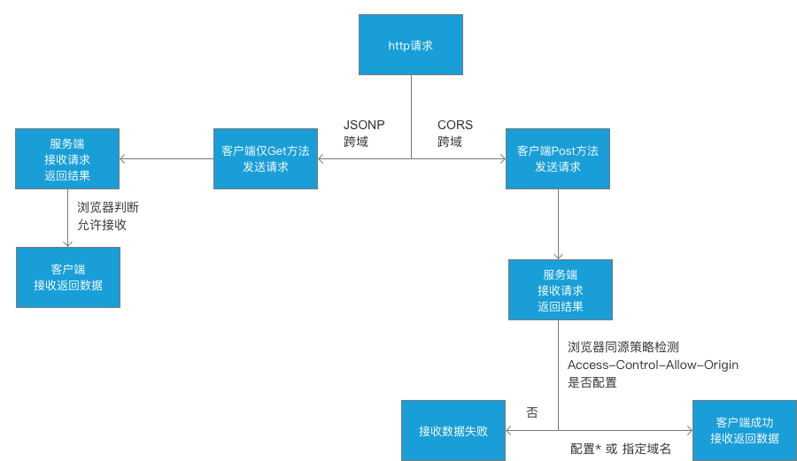
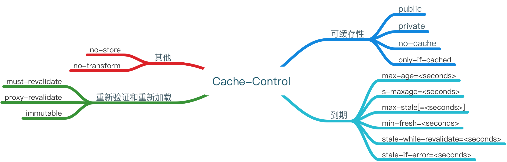

## 前言

官方解释，HTTP是一个应用层协议，由请求和响应构成，是一个标准的客户端服务器模型。HTTP是一个无状态的协议。通俗来说，就是规定服务端和客户端通信的一种规则。更多的是基于浏览器环境下使用，那么从你浏览器输入地址开始到最终页面的呈现，到底经过了哪些过程呢？废话不多说，先贴一张图，如下：


如上图，就是http请求发起到返回的完证过程，本以为自己对`http`的了解还算可以，但是乍一看图还是很蒙的，比如说如果让你优化http过程，你该从何下手呢？我想大部分还是比较关心`request`和`response`，以及数据返回之后的`DOMContentLoad`和`load`，至于`http`中的一些配置并不是很清楚，其实通过优化配置，同样能够加速网页的打开速度，因此，我大致总结一些关于`http`中会经常使用的配置项，以及这些使用一般会在哪些场景中使用到。

<!-- more -->

> 注意：上图中的`domContentLoadedEventEnd`代表DOMContentLoaded事件完成的时间节点，也就是jQuery中的domready时间。`load`代表的是`onload`事件触发和结束的时间节点。

## HTTP之跨域相关内容

### 基本内容

这里主要介绍`JSONP`和`CORS`跨域，现实场景中，以上两种使用居多，所以其他跨域方案不做详细介绍。造成跨域的主要原因主要是浏览器本身的`同源策略`引起的。

`JSONP`能够实现跨域主要是因为`浏览器上允许标签上通过src/href加载外链路径`，但是`JSONP`只支持`GET`请求，同时因为浏览器中`url`长度的限制，因此`JSONP`能传输的数据大小也有一定的限制。

`CORS`跨域能够支持的所有ajax的方法，当然，目前是支持ie9+，低版本暂时不支持，随时互联网的发展，相信低版本的浏览器会逐渐被淘汰。在只用`CORS`只需要服务端能够开启允许跨域的头设置即可，也就是`Access-Control-Allow-Origin`。

跨域大致的流程图如下：



> 注意：`JSONP`中的数据限制并不是`GET`请求本身的限制，而是浏览器中`url`本身有长度限制，`GET`方法是没有任何长度限制的；不管是`JSONP`还是`CORS`跨域，其实服务器都可以接收来自客户端的数据请求，并且也都成功返回了，只是浏览器本身有`同源策略`的限制，才会进一步判断返回的数据是否符合浏览器的限制。

这里有个题外话，`Access-Control-Allow-Origin`这个配置项默认支持配置单个域名或者*，为了安全起见，不建议配置`*`，那么如何配置才能支持多个域名跨域呢？有一个简易的方法可以解决，主要思路是通过服务端定义可支持的跨域域名集合，通过循环判断当前请求是否支持即可，片段代码如下：
```js
// 服务端代码，以下是node服务做测试
const http = require('http')
const allowDomains = [
    'http://www.a.com',
    'http://www.b.com',
    'http://www.c.com'
]
const server = http.createServer((req, res) => {
    let acao = ''
    for(let i = 0, l = allowDomains.length; i < l; i++) {
        if(allowDomains[i].indexOf(req.headers.host) > -1) {
            acao = allowDomains[i]
            break
        }
    }
    res.writeHead(200, 
        {
            'Access-Control-Allow-Origin': acao
        }
    )
    res.end('Hello World\n')
}).listen(3001)
console.log('server listen 3001')
```

### CORS跨域限制

* 默认允许的方法有`GET`、`HEAD`、`POST`。
* 默认允许的Content-Type有`text/plain`、`multipart/form-data`、`application/x-www-form-urlencoded`。
* HTTP的头信息包含`Accept`、`Accept-Language`、`Content-Language`、`Last-Event-ID`。

在请求包含以上内容的时候，其实就是简单请求，在跨域的情况下，浏览器默认是直接通过的，其余剩下的称之为复杂请求，浏览器会默认发送一次预请求作为验证，如果验证通过则代表请求成功。

因此需要对上图增加限制的修改，最终如下：


其实就是对于`复杂请求`做了一次校验，大致可以这样解释，如果在发送请求时，例如额外带了`headers`的配置项，如果需要验证通过就必须在服务端也要配置允许该`headers`的返回，这样预请求的验证才会通过。也可以通过代码做一下验证，基本如下：

```js
// 后端服务代码
const http = require('http')
const server = http.createServer((req, res) => {
    res.writeHead(200, 
        {
            'Access-Control-Allow-Origin': '*',
            'Access-Control-Allow-Headers': 'aa' // 通过设置了这个，才能使得预请求验证通过
        }
    )
    res.end('Hello World\n')
}).listen(3001)
console.log('server listen 3001')

// 前端服务代码
const http = require('http')
const fs = require('fs')
const server = http.createServer((req, res) => {
const html = fs.readFileSync('index.html', 'utf8')
    res.writeHead(200, 
        {
            'Content-Type': 'text/html' 
        }
    )
    res.end(html)
}).listen(3000)
console.log('server listen 3000')

// index.html主要代码如下
fetch('http://localhost:3001', {
    method: 'post',
    headers: {
        aa:'123'
    }
}) 
```

以上测试代码主要是在发起`post`请求的时候额外携带了一个`headers`参数，只有在服务端配置了允许该`headers`传输才能使得浏览器预请求验证通过，反之则会失败。大家可以根据以上测试代码在自己的本机测试就能明白了。

> 注意：通过设置`Access-Control-Request-Method`可以配置其他的方法，例如`PUT`、`DELETE`等。 

细心的同学可能会发现，根据以上代码的确可以通过预请求，但是如果再次刷新网页，会发现仍然还会存在预请求，对于第一次预请求已经通过了，为什么同样的请求还会再发送一次呢？其实这里可以做一个优化，减少预请求的发送。

通过设置`Access-Control-Max-Age`来确定预请求的有效时间，只要在有效时间内，就不会再次发送预请求了。

## HTTP之Cache-Control

`Cache-Control`包含很多特性，其中`no-cache`这个配置项肯定最熟悉，官方解释是在释放缓存副本之前，强制高速缓存将请求提交给原始服务器进行验证，其实就是代表没有缓存。但是其实它依然有很多特性，经过资料查询，大致分为以下几类，



介绍下一般常用的配置参数的文字解释：

* `public`代表http从请求到返回的整个路径上的都可以被缓存，例如客户端浏览器，经过的代理服务器等等。
* `private`指发起的浏览器这一端才能进行缓存，也就是代理服务器是不能缓存的。
* `no-cache` 是否使用缓存需要通过服务器验证后才能判断。


* `max-age=<seconds>` 最大能缓存多少秒，过期之后，请求会再次发送到服务端，对于返回的数据会再次被缓存。
* `s-maxage=<seconds>` 会覆盖`max-age`或者`Expires`头，仅仅在代理服务器生效，客户端不生效。
* `max-stale[=<seconds>]` 表明客户端愿意接收一个已经过期的资源。即使`max-age`已经过期，同样会使用本地的过期缓存。


* `must-revalidate` 如果`max-age`过期，必须通过服务端来验证返回的数据是否真的过期。
* `proxy-revalidate` 主要使用在代理服务器端，对于过期的数据必须向服务端重新请求一遍。


* `no-store` 本地和代理服务器都不允许存缓存。
* `no-transform` 不得对资源进行转换或转变，主要使用在代理服务器上。

具体每个配置的官方解释参考[具体说明](https://developer.mozilla.org/zh-CN/docs/Web/HTTP/Headers/Cache-Control)

## 未完待续...
