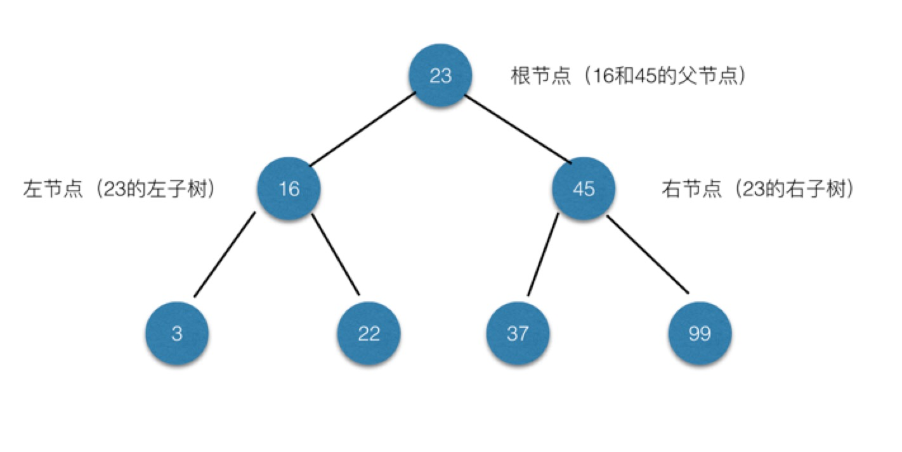
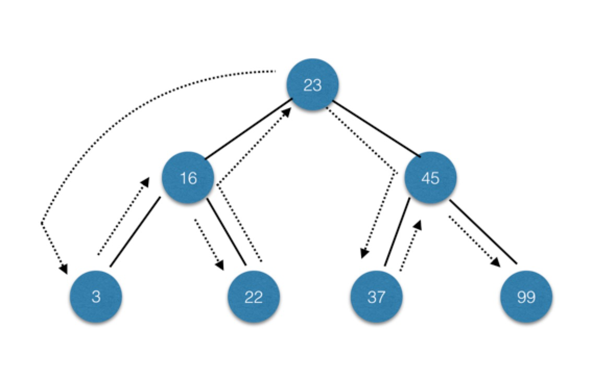
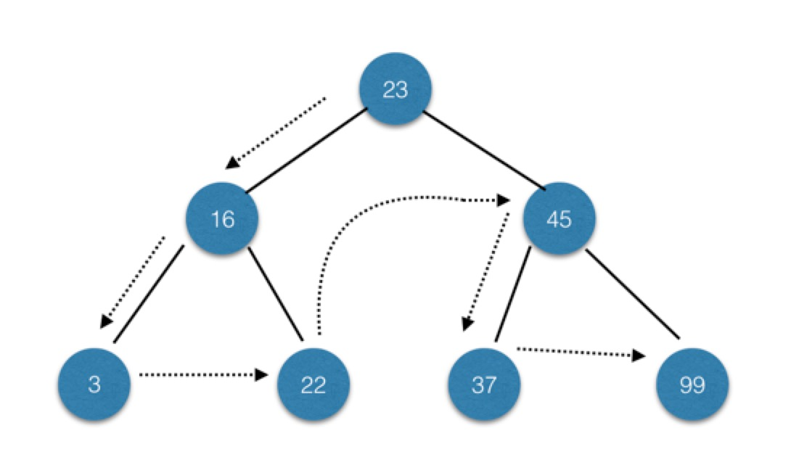
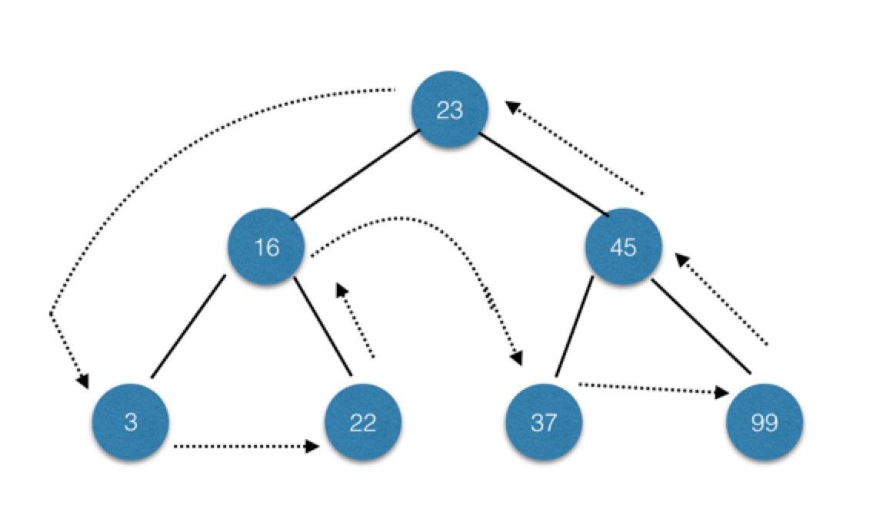
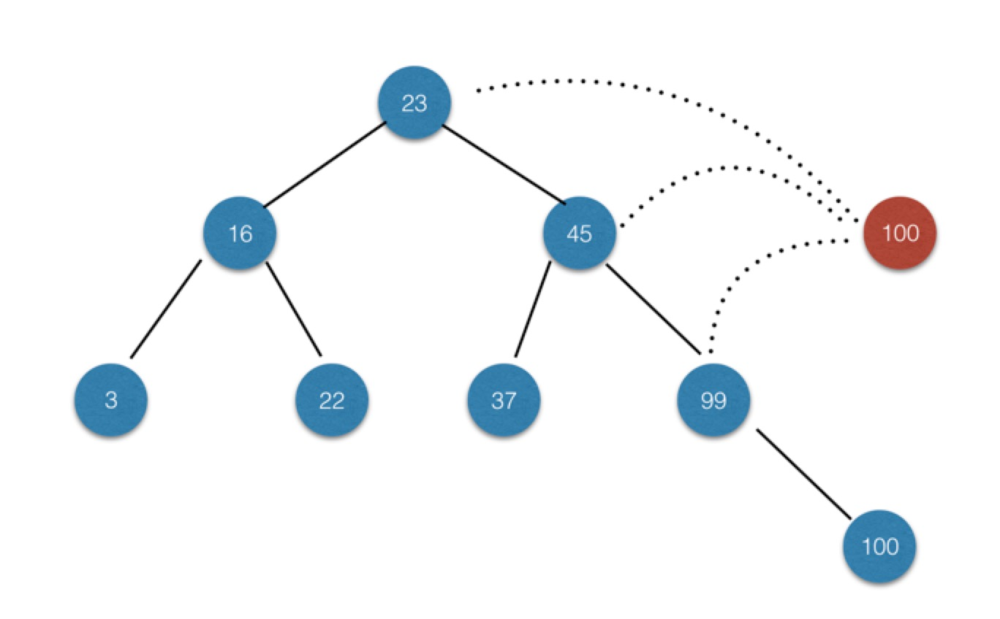
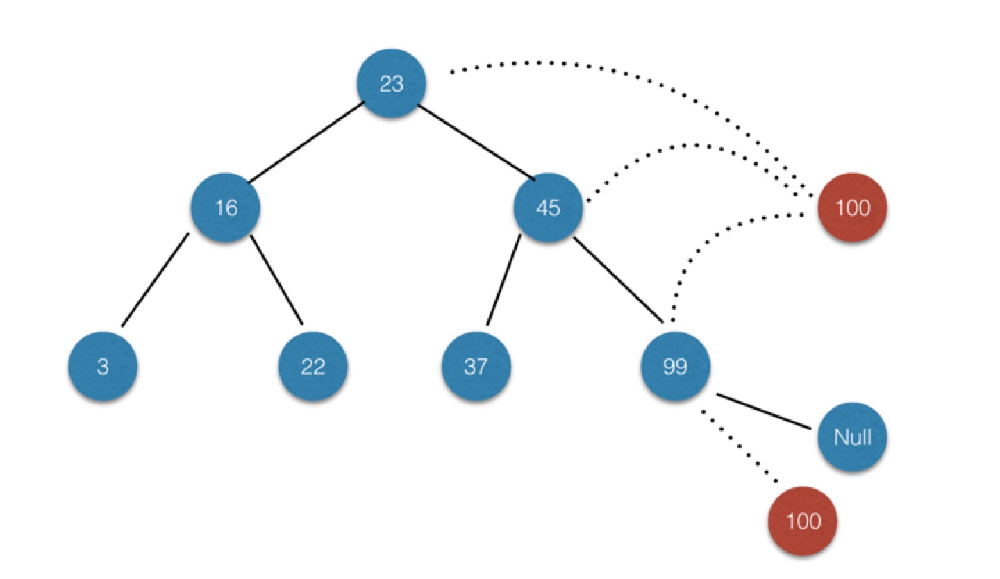

### 二叉树和二叉查找树的定义

二叉树每个节点的子节点不允许超过两个。通过将子节点的个数限定为2，可以写出高效的程序在树中插入、查找和删除数据

二叉查找树是一种特殊的二叉树，相对较小的值保存在左节点中，较大的值保存在右节点中。这一特性使得 查找的效率很高。如下图就是一个二叉树：



<!-- more -->

### 遍历二叉树的类型

#### 中序

中序遍历按照节点上的键值，从一个树中的最小的节点开始，直至最大的数为止排序，升序访问树中所有节点。基本节点访问路径如下图（3 16 22 23 37 45 99）：



#### 先序

先序遍历先访问根节点，然后以同样方式访问左子树和右子树。基本节点访问路径如下图（23 16 3 22 45 37 99）：



#### 后序

后序 遍历先访问叶子节点，从左子树到右子树，再到根节点。基本节点访问路径如下图（3 22 16 37 99 45 23）：



### 实现二叉查找树类

根据以上基本内容，实现二叉查找树基本类，其中包含`inOrder`中序遍历方法，`preOrder`先序遍历方法，`postOrder`后序遍历方法。

定义Node类保存树节点信息，基本代码如下：
``` javascript
class Node {
  constructor(data, left, right) {
    this.data = data
    this.left = left
    this.right = right
  }

  show() {
    return this.data
  }
}
```

定义BST树类，基本代码如下：
``` javascript
class BST {
  constructor() {
    this.root = null
  }

  // 中序遍历方法
  inOrder(node) {
    if (!(node === null)) {
      this.inOrder(node.left)
      console.log(node.show() + '')
      this.inOrder(node.right)
    }
  }

  // 先序遍历方法
  // 先序遍历先访问根节点，然后以同样方式访问左子树和右子树
  preOrder(node) {
    if (!(node === null)) {
      console.log(node.show() + '')
      this.preOrder(node.left)
      this.preOrder(node.right)
    }
  }

  // 后序遍历方法
  postOrder(node) {
    if (!(node === null)) {
      this.postOrder(node.left)
      this.postOrder(node.right)
      console.log(node.show() + '')
    }
  }
}  
```

#### insert插入方法

插入节点相对比较复杂，基本步骤如下：

1、对于空树而言，插入节点即为根节点。
2、如果待插入节点保存的数据小于当前节点，则设新的当前节点为原节点的左节点;反之，执行第4步。
3、如果当前节点的左节点为null，就将新的节点插入这个位置，退出循环;反之，继续执行下一次循环。
4、设新的当前节点为原节点的右节点。
5、如果当前节点的右节点为null，就将新的节点插入这个位置，退出循环;反之，继续执行下一次循环。



基本代码如下：
``` javascript
// 向树中插入新节点
  insert(data) {
    let n = new Node(data, null, null)
    if (this.root === null) {
      this.root = n
    } else {
      let current = this.root
      let parent
      while (true) {
        parent = current
        if (data < current.data) {
          current = current.left
          if (current === null) {
            parent.left = n
            break
          }
        } else {
          current = current.right
          if (current === null) {
            parent.right = n
            break
          }
        }
      }
    }
  }
```

#### 查找最小值，最大值，查找定植

在BST的基础上，再定义`getMin`,`getMax`,`find`方法，基本代码如下：

> 最小值，树的左节点肯定比右节点的元素值小，所以只要遍历左节点直至最后即可
> 最大值，树的右节点肯定比左节点的元素值大，所以只要遍历右节点直至最后即可
> 找定值，遍历树节点，如果发现相等及返回当前节点，如果发现小于当前节点，则在左子树上继续查找，否则在右子树上查找

``` javascript
// 查找最小值
  getMin() {
    let current = this.root
    while (!(current.left === null)) {
      current = current.left
    }
    return current.data
  }

  // 查找最大值
  getMax() {
    let current = this.root
    while (!(current.right === null)) {
      current = current.right
    }
    return current.data
  }

  // 查找给定值
  find(data) {
    let current = this.root
    while (current !== null) {
      if (current.data === data) {
        return current
      } else if (data < current.data) {
        current = current.left
      } else {
        current = current.right
      }
    }
    return null
  }
```

#### 删除节点

删除节点基本步骤如下：

1、判断当前节点是否包含待删除的数据，如果包含，则删除该节点；
2、如果不包含，则比较当前节点上的数据和待删除的数据。如果待删除数据小于当前节点上的数据，则移至当前节点的左子节点继续比较;
3、如果删除数据大于当前节点上的数据，则移至当前节点的右子节点继续比较；
4、如果待删除节点是叶子节点(没有子节点的节点)，那么只需要将从父节点指向它的链接 指向 null。
5、如果待删除节点只包含一个子节点，那么原本指向它的节点指向它的子节点。
6、如果待删除节点包含两个子节点，正确的做法有两种:要么查找待删除节点左子树上的最大值，要么查找其右子树上的最小值。



基本实现代码如下：
``` javascript
// 删除节点方法
  remove(data) {
    let root = this.removeNode(this.root, data)
    return root
  }

  removeNode(node, data) {
    if (node === null) {
      return null
    }
    if (data === node.data) {
      // 没有子节点的节点
      if (node.left === null && node.right === null) {
        return null
      }
      // 没有左子节点的节点
      if (node.left === null) {
        return node.right
      }
      // 没有右子节点的节点
      if (node.right === null) {
        return node.left
      }
      let tempNode = this.getSmallest(node.right);
      node.data = tempNode.data;
      node.right = this.removeNode(node.right, tempNode.data);
      return node;
    } else if (data < node.data) {
      node.left = this.removeNode(node.left, data);
      return node;
    } else {
      node.right = this.removeNode(node.right, data);
      return node;
    }
  }
```

完整代码如下：
``` javascript
class Node {
  constructor(data, left, right) {
    this.data = data
    this.left = left
    this.right = right
  }

  show() {
    return this.data
  }
}

class BST {
  constructor() {
    this.root = null
  }

  // 向树中插入新节点
  insert(data) {
    let n = new Node(data, null, null)
    if (this.root === null) {
      this.root = n
    } else {
      let current = this.root
      let parent
      while (true) {
        parent = current
        if (data < current.data) {
          current = current.left
          if (current === null) {
            parent.left = n
            break
          }
        } else {
          current = current.right
          if (current === null) {
            parent.right = n
            break
          }
        }
      }
    }
  }

  // 中序遍历方法
  inOrder(node) {
    if (!(node === null)) {
      this.inOrder(node.left)
      console.log(node.show() + '')
      this.inOrder(node.right)
    }
  }

  // 先序遍历方法
  // 先序遍历先访问根节点，然后以同样方式访问左子树和右子树
  preOrder(node) {
    if (!(node === null)) {
      console.log(node.show() + '')
      this.preOrder(node.left)
      this.preOrder(node.right)
    }
  }

  // 后序遍历方法
  postOrder(node) {
    if (!(node === null)) {
      this.postOrder(node.left)
      this.postOrder(node.right)
      console.log(node.show() + '')
    }
  }

  // 查找最小值
  getMin() {
    let current = this.root
    while (!(current.left === null)) {
      current = current.left
    }
    return current.data
  }

  // 查找最大值
  getMax() {
    let current = this.root
    while (!(current.right === null)) {
      current = current.right
    }
    return current.data
  }

  // 查找给定值
  find(data) {
    let current = this.root
    while (current !== null) {
      if (current.data === data) {
        return current
      } else if (data < current.data) {
        current = current.left
      } else {
        current = current.right
      }
    }
    return null
  }

  // 删除节点方法
  remove(data) {
    let root = this.removeNode(this.root, data)
    return root
  }

  removeNode(node, data) {
    if (node === null) {
      return null
    }
    if (data === node.data) {
      // 没有子节点的节点
      if (node.left === null && node.right === null) {
        return null
      }
      // 没有左子节点的节点
      if (node.left === null) {
        return node.right
      }
      // 没有右子节点的节点
      if (node.right === null) {
        return node.left
      }
      let tempNode = this.getSmallest(node.right);
      node.data = tempNode.data;
      node.right = this.removeNode(node.right, tempNode.data);
      return node;
    } else if (data < node.data) {
      node.left = this.removeNode(node.left, data);
      return node;
    } else {
      node.right = this.removeNode(node.right, data);
      return node;
    }
  }
}
var nums = new BST();
nums.insert(23);
nums.insert(45);
nums.insert(16);
nums.insert(37);
nums.insert(3);
nums.insert(99);
nums.insert(22);
```


