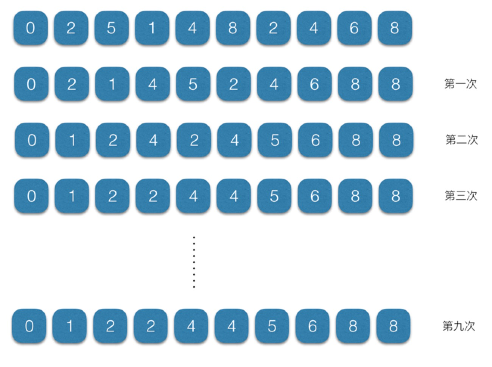
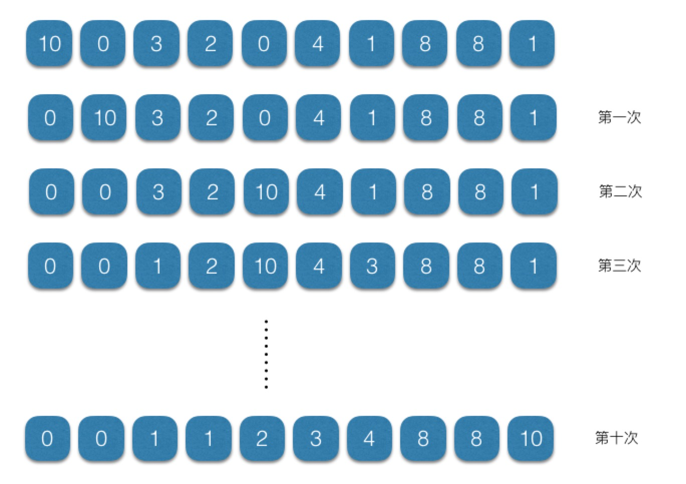
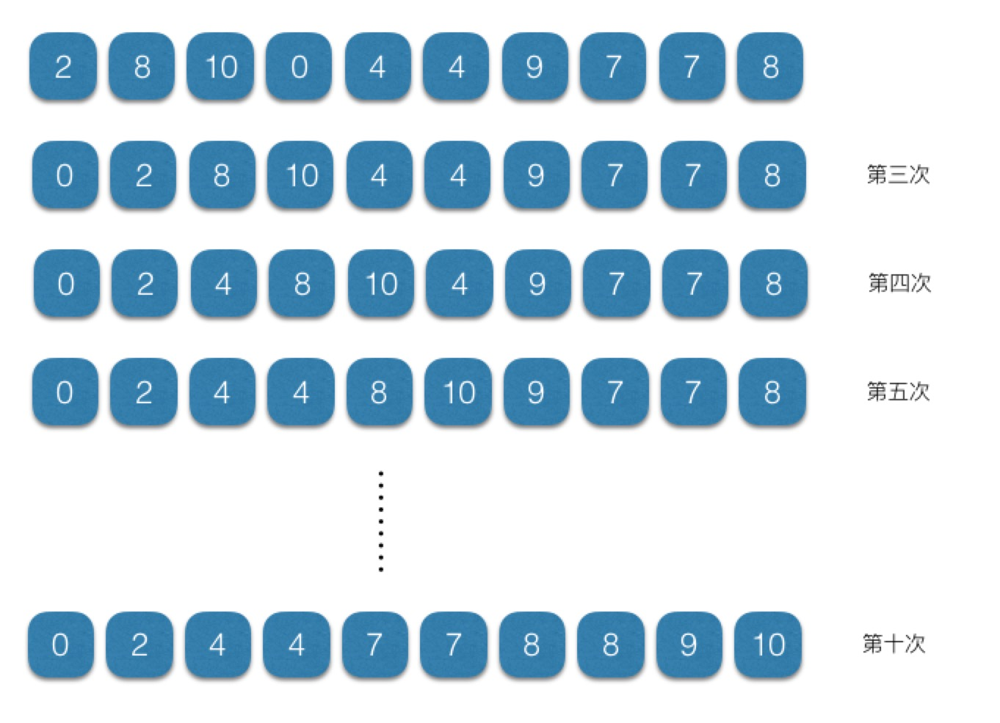
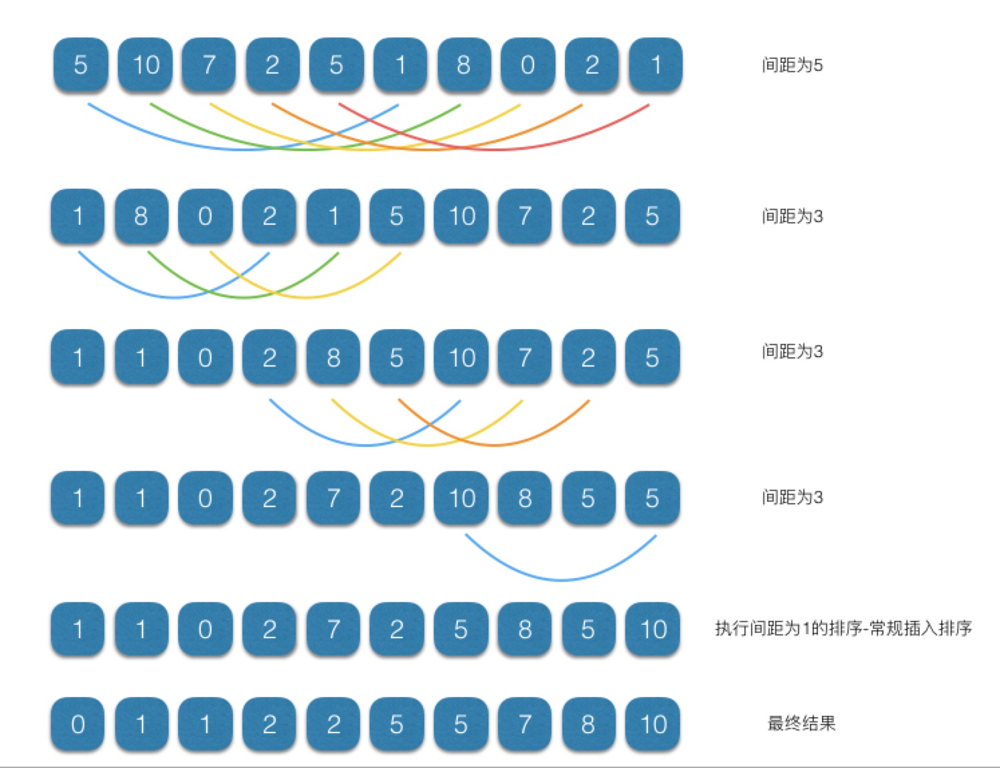
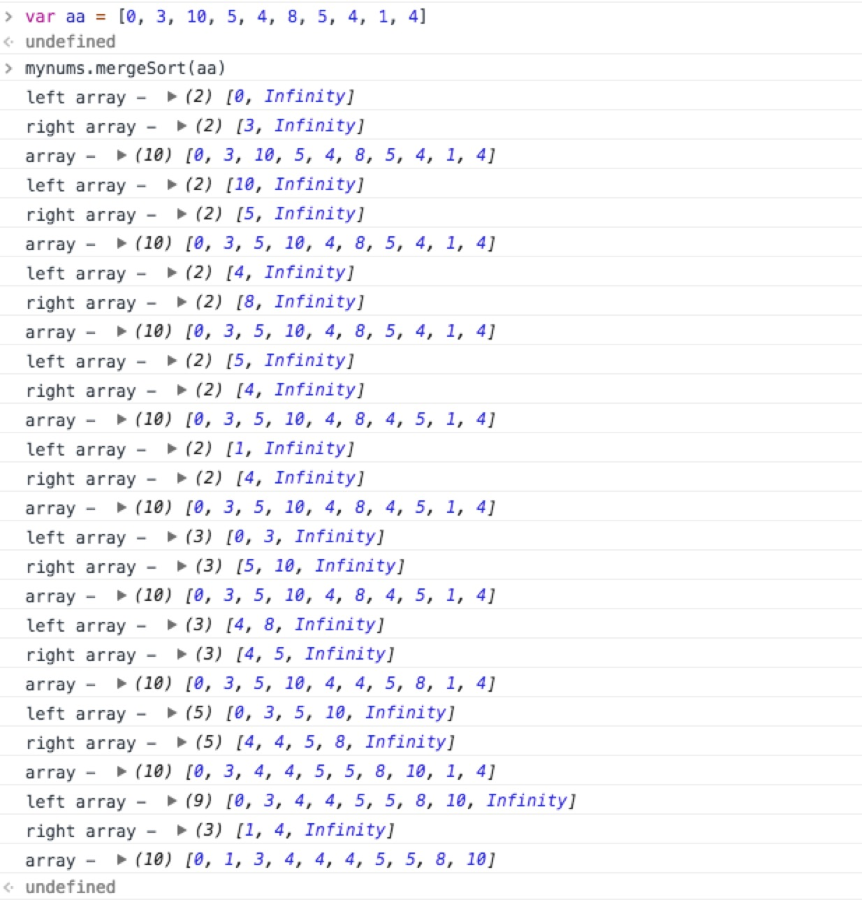

### 基本排序算法

#### 冒泡排序

它是最慢的排序算法之一，但也是一种最容易实现的排
序算法。数据值会像气泡一样从数组的一端漂 浮到另一端。假设正在将一组数字按照升序排列，较大的值会浮动到数组的右侧，而较小 的值则会浮动到数组的左侧。之所以会产生这种现象是因为算法会多次在数组中移动，比 较相邻的数据，当左侧值大于右侧值时将它们进行互换。
<!-- more -->

根据规则实现片段代码如下：
``` javascript
// 冒泡排序
bubbleSort() {
  let numElements = this.dataStore.length
  for (let outer = numElements; outer >= 2; --outer) {
    for (let inner = 0; inner <= outer - 1; inner++) {
      if (this.dataStore[inner] > this.dataStore[inner + 1]) {
        this.swap(this.dataStore, inner, inner + 1)
      }
    }
  }
}
```

运行效果图如下：


通过运行图，发现冒泡排序算法会产生多余的循环排序过程，因此可以通过定义一个`flag`变量来判断是否已经排序完成从而跳出循环，提交性能，优化后代码如下：
``` javascript
// 冒泡排序优化
bubbleSort2() {
  let flag
  let numElements = this.dataStore.length
  for (let outer = numElements; outer >= 2; --outer) {
    flag = true
    for (let inner = 0; inner <= outer - 1; inner++) {
      if (this.dataStore[inner] > this.dataStore[inner + 1]) {
        flag = false
        this.swap(this.dataStore, inner, inner + 1)
      }
    }
    if(flag) break
  }
}
```

#### 选择排序

选择排序从数组的开头开始，将第一个元素和其他元素进行比较。检查完所有元素后，最小的元素会被放到数组的第一个位置，然后算法会从第二个位置继续。这个过程一直进行，当进行到数组的倒数第二个位置时，所有的数据便 完成了排序。

根据规则实现片段代码如下：
``` javascript
// 选择排序
selectionSort() {
  let min, l = this.dataStore.length
  for (let outer = 0; outer <= l - 1; outer++) {
    min = outer
    for (let inner = outer + 1; inner <= l; inner++) {
      if (this.dataStore[inner] < this.dataStore[min]) {
        min = inner
      }
    }
    this.swap(this.dataStore, outer, min)
  }
}
```

运行效果图如下：


#### 插入排序

插入排序有两个循环。外循环将数组元素挨个移动，而内循环则对外循环中选中的元素及它后面的那个元素进行比较。如果外循环中选中的元素比内循环中选中的元素小，那么数组元素会向右移动，为内循环中的这个元素腾出位置。

根据规则实现片段代码如下：
``` javascript
// 插入排序
insertionSort() {
  let temp, inner, l = this.dataStore.length
  for (let outer = 1; outer <= l - 1; outer++) {
    temp = this.dataStore[outer];
    inner = outer;
    while (inner > 0 && (this.dataStore[inner - 1] >= temp)) {
      this.dataStore[inner] = this.dataStore[inner - 1];
      --inner;
    }
    this.dataStore[inner] = temp;
  }
}
```

运行效果图如下：


#### 基本排序耗时比较

测试片段代码如下：
``` javascript
var start = new Date().getTime();
mynums.bubbleSort2();
var stop = new Date().getTime();
console.log('冒泡',stop - start)
var start = new Date().getTime();
mynums.selectionSort();
var stop = new Date().getTime();
console.log('选择',stop - start)
var start = new Date().getTime();
mynums.insertionSort();
var stop = new Date().getTime();
console.log('插入',stop - start)
```

经过测试，当初始定义的数据达到1000个的时候，选择排序和插入排序要比冒泡 排序快，插入排序是这三种算法中最快的。

### 高级排序

#### 希尔排序

希尔排序的核心理念与插入排序 不同，它会首先比较距离较远的元素，而非相邻的元素。和简单地比较相邻元素相比，使 用这种方案可以使离正确位置很远的元素更快地回到合适的位置。当开始用这个算法遍历 数据集时，所有元素之间的距离会不断减小，直到处理到数据集的末尾，这时算法比较的 就是相邻元素了。

原理：通过定义一个间隔序列来表示在排序过程中进行比较的元素之 间有多远的间隔。

根据规则实现片段代码如下：
``` javascript
// 希尔排序算法
shellsort() {
  let j
  for (let g = 0; g < this.gaps.length; g++) {
    for (let i = this.gaps[g]; i < this.dataStore.length; i++) {
      let temp = this.dataStore[i];
      for (j = i; j >= this.gaps[g] &&
        this.dataStore[j - this.gaps[g]] > temp; j -= this.gaps[g]) {
        this.dataStore[j] = this.dataStore[j - this.gaps[g]];
      }
      if(JSON.stringify(this.dataStore[j]) !== JSON.stringify(temp)) this.dataStore[j] = temp;
    }
  }
}
// 希尔排序算法设置间隔序列定义的方法
setGaps(arr) {
  this.gaps = arr;
}
```

运行效果图如下：


以上片段代码是通过先执行`setGaps`方法来确定间隔数，也可以根据本身数组的长度来动态定义间隔，基本片段代码如下：
``` javascript
// 动态计算间隔序列
shellsort1() {
  let N = this.dataStore.length;
  let h = 1;
  while (h < N / 3) {
    h = 3 * h + 1;
  }
  while (h >= 1) {
    for (let i = h; i < N; i++) {
      for (let j = i; j >= h && this.dataStore[j] < this.dataStore[j - h]; j -= h) {
        this.swap(this.dataStore, j, j - h);
      }
    }
    h = (h - 1) / 3;
  }
}
```

#### 归并排序

把一系列排好序的子序列合并成一个大的完整有序序 列。

以下是采用非递归的模式自底向上的归并排序片段代码：
``` javascript
// 归并排序 自底向上的归并排序算法 非递归
mergeSort(arr) {
  if (arr.length < 2) {
    return;
  }
  let step = 1;
  let left, right;
  while (step < arr.length) {
    left = 0;
    right = step;
    while (right + step <= arr.length) {
      this.mergeArrays(arr, left, left + step, right, right + step);
      left = right + step;
      right = left + step;
    }
    if (right < arr.length) {
      this.mergeArrays(arr, left, left + step, right, arr.length);
    }
    step *= 2;
  }
}

mergeArrays(arr, startLeft, stopLeft, startRight, stopRight) {
  let rightArr = new Array(stopRight - startRight + 1);
  let leftArr = new Array(stopLeft - startLeft + 1);
  let k = startRight;
  for (let i = 0; i < (rightArr.length - 1); ++i) {
    rightArr[i] = arr[k];
    ++k;
  }
  k = startLeft;
  for (let i = 0; i < (leftArr.length - 1); ++i) {
    leftArr[i] = arr[k];
    ++k;
  }
  rightArr[rightArr.length - 1] = Infinity; // 哨兵值 
  leftArr[leftArr.length - 1] = Infinity; // 哨兵值 
  let m = 0;
  let n = 0;
  for (let k = startLeft; k < stopRight; ++k) {
    if (leftArr[m] <= rightArr[n]) {
      arr[k] = leftArr[m];
      m++;
    } else {
      arr[k] = rightArr[n];
      n++;
    }
  }
  console.log("left array - ", leftArr);
  console.log("right array - ", rightArr);
  console.log("array - ", arr);
}
```

运行效果图如下：


#### 快速排序

快速排序是处理大数据集最快的排序算法之一。它是一种分而治之的算法，通过递归的方式将数据依次分解为包含较小元素和较大元素的不同子序列。该算法不断重复这个步骤直到所有数据都是有序的。

这个算法首先要在列表中选择一个元素作为基准值(pivot)。数据排序围绕基准值进行， 将列表中小于基准值的元素移到数组的底部，将大于基准值的元素移到数组的顶部。

>实现基本步骤如下：
* (1) 选择一个基准元素，将列表分隔成两个子序列;
* (2) 对列表重新排序，将所有小于基准值的元素放在基准值的前面，所有大于基准值的元素放在基准值的后面;
* (3) 分别对较小元素的子序列和较大元素的子序列重复步骤 1 和 2。

根据规则实现的片段代码如下：
``` javascript
// 快速排序
qSort(arr) {
  if (arr.length == 0) {
    return [];
  }
  let left = [];
  let right = [];
  let pivot = arr[0];
  for (let i = 1; i < arr.length; i++) {
    if (arr[i] < pivot) {
      left.push(arr[i]);
    } else {
      right.push(arr[i]);
    }
  }
  return this.qSort(left).concat(pivot, this.qSort(right));
}
```
最终完整代码如下：
``` javascript
class CArray {
  constructor(numElements) {
    this.dataStore = []
    this.pos = 0
    this.numElements = numElements

    for (let i = 0; i < numElements; i++) {
      this.dataStore[i] = i;
    }

    this.gaps = []
  }

  setData() {
    for (let i = 0; i < this.numElements; i++) {
      this.dataStore[i] = Math.floor(Math.random() * (this.numElements + 1));
    }
  }

  clear() {
    for (let i = 0; i < this.dataStore.length; i++) {
      this.dataStore[i] = 0;
    }
  }

  insert(element) {
    this.dataStore[this.pos++] = element;
  }

  toString() {
    let retstr = "";
    for (let i = 0; i < this.dataStore.length; i++) {
      retstr += this.dataStore[i] + " ";
      if (i > 0 & i % 10 == 0) {
        retstr += "\n";
      }
    }
    return retstr;
  }

  swap(arr, index1, index2) {
    let temp = arr[index1];
    arr[index1] = arr[index2];
    arr[index2] = temp;
  }

  // 冒泡排序
  bubbleSort() {
    let numElements = this.dataStore.length
    for (let outer = numElements; outer >= 2; --outer) {
      for (let inner = 0; inner <= outer - 1; inner++) {
        if (this.dataStore[inner] > this.dataStore[inner + 1]) {
          this.swap(this.dataStore, inner, inner + 1)
        }
      }
    }
  }

  // 冒泡排序优化
  bubbleSort2() {
    let flag
    let numElements = this.dataStore.length
    for (let outer = numElements; outer >= 2; --outer) {
      flag = true
      for (let inner = 0; inner <= outer - 1; inner++) {
        if (this.dataStore[inner] > this.dataStore[inner + 1]) {
          flag = false
          this.swap(this.dataStore, inner, inner + 1)
        }
      }
      if(flag) break
    }
  }

  // 选择排序
  selectionSort() {
    let min, l = this.dataStore.length
    for (let outer = 0; outer <= l - 1; outer++) {
      min = outer
      for (let inner = outer + 1; inner <= l; inner++) {
        if (this.dataStore[inner] < this.dataStore[min]) {
          min = inner
        }
      }
      this.swap(this.dataStore, outer, min)
    }
  }

  // 插入排序
  insertionSort() {
    let temp, inner, l = this.dataStore.length
    for (let outer = 1; outer <= l - 1; outer++) {
      temp = this.dataStore[outer];
      inner = outer;
      while (inner > 0 && (this.dataStore[inner - 1] >= temp)) {
        this.dataStore[inner] = this.dataStore[inner - 1];
        --inner;
      }
      this.dataStore[inner] = temp;
    }
  }

  // 希尔排序算法
  shellsort() {
    let j
    for (let g = 0; g < this.gaps.length; g++) {
      for (let i = this.gaps[g]; i < this.dataStore.length; i++) {
        let temp = this.dataStore[i];
        for (j = i; j >= this.gaps[g] &&
          this.dataStore[j - this.gaps[g]] > temp; j -= this.gaps[g]) {
          this.dataStore[j] = this.dataStore[j - this.gaps[g]];
        }
        if(JSON.stringify(this.dataStore[j]) !== JSON.stringify(temp)) this.dataStore[j] = temp;
      }
    }
  }
  // 希尔排序算法设置间隔序列定义的方法
  setGaps(arr) {
    this.gaps = arr;
  }

  // 动态计算间隔序列
  shellsort1() {
    let N = this.dataStore.length;
    let h = 1;
    while (h < N / 3) {
      h = 3 * h + 1;
    }
    while (h >= 1) {
      for (let i = h; i < N; i++) {
        for (let j = i; j >= h && this.dataStore[j] < this.dataStore[j - h]; j -= h) {
          this.swap(this.dataStore, j, j - h);
        }
      }
      h = (h - 1) / 3;
    }
  }

  // 归并排序 自底向上的归并排序算法 非递归
  mergeSort(arr) {
    if (arr.length < 2) {
      return;
    }
    let step = 1;
    let left, right;
    while (step < arr.length) {
      left = 0;
      right = step;
      while (right + step <= arr.length) {
        this.mergeArrays(arr, left, left + step, right, right + step);
        left = right + step;
        right = left + step;
      }
      if (right < arr.length) {
        this.mergeArrays(arr, left, left + step, right, arr.length);
      }
      step *= 2;
    }
  }

  mergeArrays(arr, startLeft, stopLeft, startRight, stopRight) {
    let rightArr = new Array(stopRight - startRight + 1);
    let leftArr = new Array(stopLeft - startLeft + 1);
    let k = startRight;
    for (let i = 0; i < (rightArr.length - 1); ++i) {
      rightArr[i] = arr[k];
      ++k;
    }
    k = startLeft;
    for (let i = 0; i < (leftArr.length - 1); ++i) {
      leftArr[i] = arr[k];
      ++k;
    }
    rightArr[rightArr.length - 1] = Infinity; // 哨兵值 
    leftArr[leftArr.length - 1] = Infinity; // 哨兵值 
    let m = 0;
    let n = 0;
    for (let k = startLeft; k < stopRight; ++k) {
      if (leftArr[m] <= rightArr[n]) {
        arr[k] = leftArr[m];
        m++;
      } else {
        arr[k] = rightArr[n];
        n++;
      }
    }
  }

  // 快速排序
  qSort(arr) {
    if (arr.length == 0) {
      return [];
    }
    let left = [];
    let right = [];
    let pivot = arr[0];
    for (let i = 1; i < arr.length; i++) {
      if (arr[i] < pivot) {
        left.push(arr[i]);
      } else {
        right.push(arr[i]);
      }
    }
    return this.qSort(left).concat(pivot, this.qSort(right));
  }
}
```