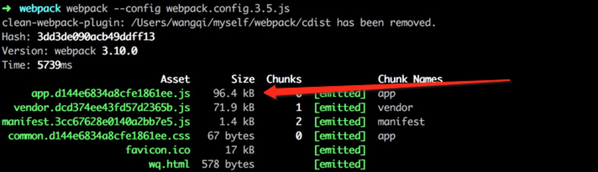
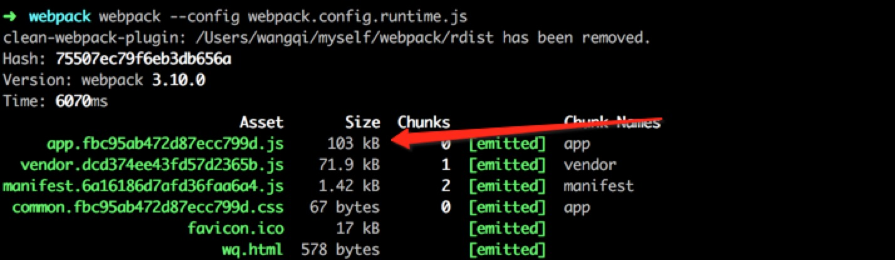

## 什么是Babel

官方解释,是下一代JavaScript 语法的编译器。

既然是下一代Javascript的标准，浏览器因版本的不同对此会有兼容性问题，JavaScript的新的方法都不能使用，但是目前我们在项目开发一直提倡使用最新的语法糖编写，不但能减少代码量，而且async,await等新特性还解决了回调的编写机制，减轻了代码维护成本。

Babel就因此而生，它可以让你放心使用大部分的JavaScript的新的标准的方法，然后编译成兼容绝大多数的主流浏览器的代码。在项目工程脚手架中，一般会使用.babelrc文件，通过配置一些参数配合webpack进行打包压缩。也通过网上了解，写法各有不同，参数也大不相同，因此，我重新整理一份资料，详细的介绍下各个配置项的意义所在，以便清晰了解如果使用。

> 以下配置主要正对webpack3+写法。

<!-- more -->

### Babel转译器

在.babelrc配置文件中，主要是对预设（presets）和插件（plugins）进行配置，因此不同的转译器作用不同的配置项，大致可分为以下三项：

> 1.语法转义器。主要对javascript最新的语法糖进行编译，并不负责转译javascript新增的api和全局对象。例如let/const就可以被编译，而includes/Object.assign等并不能被编译。常用到的转译器包有，babel-preset-env、babel-preset-es2015、babel-preset-es2016、babel-preset-es2017、babel-preset-latest等。<font color="red">在实际开发中可以只选用babel-preset-env来代替余下的，但是还需要配上javascirpt的制作规范一起使用，同时也是官方推荐</font>

``` javascript
{
  "presets": ["env", {
      "modules": false
    }],
    "stage-2"
}
```

> 2.补丁转义器。主要负责转译javascript新增的api和全局对象，例如babel-plugin-transform-runtime这个插件能够编译Object.assign,同时也可以引入babel-polyfill进一步对includes这类用法保证在浏览器的兼容性。Object.assign 会被编译成以下代码：

``` javascript
__WEBPACK_IMPORTED_MODULE_1_babel_runtime_core_js_object_assign___default()
```

> 3.jsx和flow插件，这类转译器用来转译JSX语法和移除类型声明的，使用Rect的时候你将用到它，转译器名称为babel-preset-react

### 创建预设(presets)

主要通过npm安装babel-preset-xx插件来配合使用，例如通过 npm install babel-preset-stage-2 babel-preset-env --save-dev 安装，会有相应如下配置。

``` javascript
{
  "presets": [
    ["env", options],
    "stage-2"
  ]
}
```

##### stage-2配置
babel主要提供以下几种转义器包,括号里面是对应配置文件的配置项
    babel-preset-stage-0(stage-0) 
    babel-preset-stage-1(stage-1) 
    babel-preset-stage-2(stage-2) 
    babel-preset-stage-3(stage-3)
不同阶段的转译器之间是包含的关系，preset-stage-0转译器除了包含了preset-stage-1的所有功能还增加了transform-do-expressions插件和transform-function-bind插件，同样preset-stage-1转译器除了包含preset-stage-2的全部功能外还增加了一些额外的功能。

##### options配置介绍
官方推荐使用babel-preset-env来替代一些插件包的安装（es2015-arrow-functions，es2015-block-scoped-functions等等），并且有如下几种配置信息,介绍几个常用的，更多配置可以参考官网https://babeljs.io/docs/plugins/preset-env/
``` javascript
{
    "targets": {
        "chrome": 52,
        "browsers": ["last 2 versions", "safari 7"],
        "node":"6.10"
    }
    "modules": false
}
```

targets可以制定兼容浏览器版本，如果设置了browsers，那么就会覆盖targets原本对浏览器的限制配置。

targets.node正对node版本进行编译

modules通常都会设置为false，因为默认都是支持CommonJS规范，同时还有其他配置参数："amd" | "umd" | "systemjs" | "commonjs"，systemjs我还不知道规范写法是什么，amd和umd以及commonjs相对比较熟悉，下面简要列举下书写规范。

> amd代码规范，在ng1中会用到比较多，主要用于依赖注入：
``` javascript
define(['jquery'], function ($) {
    //    方法
    function myFunc(){};
 
    //    暴露公共方法
    return myFunc;
})
```
> commonjs规范，也是node环境中尊崇的一种规范：
``` javascript
var $ = require('jquery');
//    方法
function myFunc(){};
 
//    暴露公共方法（一个）
module.exports = myFunc;
```
>umd规范，兼容amd以及commonjs规范，目前在第三方插件编写使用比较多：
``` javascript
(function (root, factory) {
    if (typeof define === 'function' && define.amd) {
        // AMD
        define(['jquery'], factory);
    } else if (typeof exports === 'object') {
        // Node, CommonJS之类的
        module.exports = factory(require('jquery'));
    } else {
        // 浏览器全局变量(root 即 window)
        root.returnExports = factory(root.jQuery);
    }
}(this, function ($) {
    //    方法
    function myFunc(){};
 
    //    暴露公共方法
    return myFunc;
}));
```

### 插件（plugins）

插件配置项同预设配置项一样，需要搭配babel相应的插件进行配置，可以选择配置插件来满足单个需求，例如早期我们会有如下配置：
``` javascript
{
  "plugins": [
    "check-es2015-constants",
    "es2015-arrow-functions",
    "es2015-block-scoped-functions",
    // ...
  ]
}
```

但是这些插件从维护到书写极为麻烦，后来官方统一推荐使用env，全部替代了这些单一的插件功能，可以简化配置如下，也就是我前面提到了babel-preset-env：
``` javascript
{
  "presets": [
    "es2015"
  ]
}
```

这里主要介绍两款常用插件，分别是babel-plugin-transform-runtime，babel-plugin-syntax-dynamic-import。

基本配置代码如下：
``` javascript
{
  "plugins": [
    "syntax-dynamic-import",["transform-runtime"]
  ]
}
```

##### transform-runtime

为了解决这种全局对象或者全局对象方法编译不足的情况，才出现了transform-runtime这个插件，但是它只会对es6的语法进行转换，而不会对新api进行转换。如果需要转换新api，也可以通过使用babel-polyfill来规避兼容性问题。

对Object.assign进行编译，配置与未配置经过webpack编译后的代码片段如下：

``` javascript
// 未设置代码片段：
__webpack_require__("ez/6");
var aaa = 1;

function fna() {
  var dd = 33333;
  var cc = Object.assign({ key: 2 });
  var xx = String.prototype.repeat.call('b', 3);
  if ("foobar".String.prototype.includes("foo")) {
    var vv = 1;
  }

  return dd;
}
```

``` javascript
// 设置代码片段：
/* harmony import */ var __WEBPACK_IMPORTED_MODULE_1_babel_runtime_core_js_object_assign___default = __webpack_require__.n(__WEBPACK_IMPORTED_MODULE_1_babel_runtime_core_js_object_assign__);

__webpack_require__("ez/6");
var aaa = 1;

function fna() {
  var dd = 33333;
  var cc = __WEBPACK_IMPORTED_MODULE_1_babel_runtime_core_js_object_assign___default()({ key: 2 });
  var xx = String.prototype.repeat.call('b', 3);
  if ("foobar".String.prototype.includes("foo")) {
    var vv = 1;
  }

  return dd;
}
```

对class定义类会进行编译，配置与未配置经过webpack编译后的代码片段如下：

``` javascript
// 未设置代码片段：
function _classCallCheck(instance, Constructor) { if (!(instance instanceof Constructor)) { throw new TypeError("Cannot call a class as a function"); } }

var Canvas = function Canvas(height, width) {
  _classCallCheck(this, Canvas);

  this.height = height;
  this.width = width;
};

var Canvas2 = function Canvas2(height, width) {
  _classCallCheck(this, Canvas2);

  this.height = height;
  this.width = width;
};
```

``` javascript
// 设置代码片段：
/* harmony import */ var __WEBPACK_IMPORTED_MODULE_0_babel_runtime_helpers_classCallCheck___default = __webpack_require__.n(__WEBPACK_IMPORTED_MODULE_0_babel_runtime_helpers_classCallCheck__);

var Canvas = function Canvas(height, width) {
  __WEBPACK_IMPORTED_MODULE_0_babel_runtime_helpers_classCallCheck___default()(this, Canvas);

  this.height = height;
  this.width = width;
};

var Canvas2 = function Canvas2(height, width) {
  __WEBPACK_IMPORTED_MODULE_0_babel_runtime_helpers_classCallCheck___default()(this, Canvas2);

  this.height = height;
  this.width = width;
};
```

对Generator函数也有同上的编译效果，目前项目中使用该函数较小，一般使用promise替代，以及async await所以未对该函数做测试。

> 官方说对promise也会产生编译，但是实际测试结果却没有效果

经过webpack打包最终测试，引入transform-runtime该配置项后，打包入口js文件大小会略微增大，并不像官方说的能够缩小文件体积

未配置的最终打包效果：



配置后的最终打包效果：



虽然文件大小会有所增大，但是解决一些兼容性的问题，同时，从以上给出的测试代码例子来看，使用transform-runtime后，可以减少内部全局函数的定义，从结构上看尊崇了webpack的模块化思想，所以还是建议使用该插件。

##### syntax-dynamic-import

这个插件主要解决动态引入模块的问题
``` javascript
function nDate() {
  import('moment').then(function(moment) {
    console.log(moment.default().format());
  }).catch(function(err) {
    console.log('Failed to load moment', err);
  });
}

nDate();
```

> 如果.babelrc配置项中使用了"stage-2"，也可以不实用该插件，同样支持动态模块引入。

不然就会报以下错误：

* Module build failed: SyntaxError: 'import' and 'export' may only appear at the top level, or (import 和 export只能在最外层，也就是不能用在函数或者块中)

* Module build failed: SyntaxError: Unexpected token, expected {

### 其他配置项

##### ignore

主要作用就是可以指定不编译那些代码
``` javascript
{
  "ignore":["./module/a.js"]
}
```

let,Object.assign,class定义都未编译，编译效果如下：
``` javascript
__webpack_require__("ez/6");
const aaa = 1;

function fna () {
  let dd = 33333
  let cc = Object.assign({key:2})
  let xx = String.prototype.repeat.call('b', 3)
  if ("foobar".String.prototype.includes("foo")) {
    let vv = 1
  }

  return dd
}

function fna2 () {
  return fna() + aaa + __WEBPACK_IMPORTED_MODULE_0__b__["a" /* default */]
}

class Canvas {
  constructor(height, width) {
    this.height = height;
    this.width = width;
  }
}

class Canvas2 {
  constructor(height, width) {
    this.height = height;
    this.width = width;
  }
}
```

##### minified

主要设置编译后是否是压缩，boolean类型，如果使用babel-cli进行打包编译文件这个配置项能够起到作用，但是目前大部分还是会依赖第三方打包工具，例如webpack，所以这个配置参数一般不用设置，webpack插件中的UglifyJsPlugin做了压缩的工作。

##### comments

在生成的文件中，不产生注释，boolean类型，webpack插件中的UglifyJsPlugin也同样集成了这个功能。

##### env

基本配置如下：

``` javascript
{
  "env": {
    // test 是提前设置的环境变量，如果没有设置BABEL_ENV则使用NODE_ENV，如果都没有设置默认就是development
    "test": {
      "presets": ["env", "stage-2"],
      // instanbul是一个用来测试转码后代码的工具
      "plugins": ["istanbul"]
    }
  }
}
```

### 再谈兼容性问题

Babel默认只转换新的JavaScript语法，而不转换新的API，比如Iterator、Generator、Set、Maps、Promise等等全局对象，以及一些定义在全局对象上的方法（比如Object.assign）都不会转码，具体的可以参考babel-plugin-transform-runtime模块的<a href="https://github.com/babel/babel/blob/master/packages/babel-plugin-transform-runtime/src/definitions.js" target="_blank">definitions.js</a>文件。

这里主要涉及到babel编译后依然会存在浏览器兼容性问题，一般会使用transform-runtime和babel-polyfill配合使用，对于后者只需要在项目入口文件require引入即可。

当然在使用类似Object.assign函数功能时，可以使用lodash库来替代，promise可以使用Q.js替代等等方案，这样依赖可以不需要引入以上插件，具体可以根据项目具体安排

### 总结

.babelrc配置文件主要还是以presets和plugins组成，通过和webpack配合进行使用，分享下我们在项目中常用的配置。以上都是通过学习总结出来的，有什么不对的地方希望指出。

vue项目开发使用的配置如下：
``` javascript
{
  "presets": [
    ["env", {
      "modules": false
    }],
    "stage-2"
  ],
  // 下面指的是在生成的文件中，不产生注释
  "comments": false,
  "plugins": ["transform-runtime","syntax-dynamic-import"],
  "env": {
    // test 是提前设置的环境变量，如果没有设置BABEL_ENV则使用NODE_ENV，如果都没有设置默认就是development
    "test": {
      "presets": ["env", "stage-2"],
      // instanbul是一个用来测试转码后代码的工具
      "plugins": ["istanbul"]
    }
  }
}
```

react项目开发使用的配置如下：
``` javascript
{
  "presets": [
    ["env", { "modules": false }],
    "stage-2",
    "react"
  ],
  "plugins": ["transform-runtime"],
  "comments": false,
  "env": {
    "test": {
      "presets": ["env", "stage-2"],
      "plugins": [ "istanbul" ]
    }
  }
}
```

### 2018-11-18 关于stage-x介绍的补充
stage-3包括以下插件：
  transform-async-to-generator  支持async/await
  transform-exponentiation-operator 支持幂运算符语法糖


stage-2包括stage-3的所有插件，额外还包括以下插件：
  syntax-trailing-function-commas 支持尾逗号函数，额...很鸡肋
  transform-object-reset-spread 支持对象的解构赋值


stage-1包括stage-2所有插件，额外还包括以下插件：
  transform-class-constructor-call 支持class的构造函数
  transform-class-properties 支持class的static属性
  transform-decorators  支持es7的装饰者模式即@，这其实是很有用的特性，对于HOC来说这是一个不错的语法糖
  transform-export-extensions 支持export方法


stage-0包括stage-1所有插件，额外还包括以下插件：
  transform-do-expressions 支持在jsx中书写if/else
  transform-function-bind 支持::操作符来切换上下文，类似于es5的bind

### 2018-12-10 关于babel-plugin-syntax-dynamic-import 使用补充

感谢@丹哥一号同学提出问题，经过测试当使用webpack版本4.20.2及以上的时候(4以上的其他版本暂时没测)，不需要这个插件，同时也不需要stage-2的配置，同样可以支持import以及动态import，基本用法根参考以下示例：
```js
function nDate() {
  import('moment').then(function(moment) {
    console.log(moment.default().format());
  }).catch(function(err) {
    console.log('Failed to load moment', err);
  });
}

nDate();
```