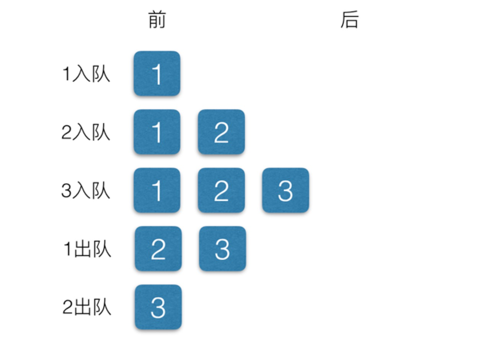

### 队列的定义

队列是一种列表，不同的是队列只能在队尾插入元素，在队首删除元素。队列用于存储按 顺序排列的数据，先进先出。

### 队列的操作

* 入队：向队列中插入新元素，入队操作在队尾插入新元素
* 出队：删除队列中的元素，出队操作删除队头的元素

<!-- more -->

属性/方法 | 描述 
- | :-: 
dataStore(属性) | 队列的元素个数
count(方法) | 返回队列中元素的个数
enqueue(方法) | 入队操作
front(方法) | 读取队首元素
back(方法) | 读取队尾元素
toString(方法) | 显示队内所有元素
empty(方法) | 判断队列是否为空

基本操作如下图：


### Queue类实现
通过数组来实现队列操作，其中数组的`push()`方法和`shift()`方法很好的实现了入队和出队的操作，实现类的代码如下：
``` javascript
class Queue {
  constructor() {
    this.dataStore = []
  }

  // 队尾添加一个元素
  enqueue(element) {
    this.dataStore.push(element)
  }

  // 删除队首的元素
  dequeue() {
    return this.dataStore.shift()
  }

  // 读取队首和队尾的元素
  front() {
    return this.dataStore[0]
  }

  back() {
    return this.dataStore[this.dataStore.length - 1]
  }

  // 显示队列内的所有元素
  toString() {
    let retStr = "";
    for (let i = 0; i < this.dataStore.length; ++i) {
      retStr += this.dataStore[i] + "\n"
    }
    return retStr;
  }

  // 判断队列是否为空
  empty() {
    if (this.dataStore.length == 0) {
      return true
    } else {
      return false
    }
  }

  // 显示数量
  count() {
    return this.dataStore.length
  }
}
```

### 实际使用

#### 方块舞的舞伴分配问题

当男男女女来到舞池，他们按照自己的性别排成两队。当舞池中有地方空出来时，选两个队 列中的第一个人组成舞伴。他们身后的人各自向前移动一位，变成新的队首。当一对舞伴 迈入舞池时，主持人会大声喊出他们的名字。当一对舞伴走出舞池，且两排队伍中有任意 一队没人时，主持人也会把这个情况告诉大家。

定义一个类保存舞者信息，基本代码如下：
``` javascript
let dancerArray = [
  'F Allison',
  'M Frank',
  'M Mason',
  'M Clayton',
  'F Cheryl',
  'M Raymond',
  'F Jennifer',
  'M Bryan',
  'M David',
  'M Danny',
  'F Aurora'
]

class Dancer {
  constructor(name, sex) {
    this.name = name
    this.sex = sex
  }
}
```

定义区分舞者的方法和舞伴宣布结果方法，基本代码如下：
``` javascript
// 区分男女跳舞者
function getDancers(m, f) {
  for (let v of dancerArray) {
    let dancer = v.split(' ')
    let sex = dancer[0]
    let name = `${dancer[1]} ${dance[2]}`
    if (sex === 'F') {
      f.enqueue(new Dancer(name, sex))
    } else {
      m.enqueue(new Dancer(name, sex))
    }
  }
}
// 舞伴宣布结果
function dance(m, f) {
  let person
  while (!f.empty() && !m.empty()) {
    person = f.dequeue();
    console.log("Female dancer is: " + person.name);
    person = m.dequeue();
    console.log(" and the male dancer is: " + person.name);
  }
}
```

运行测试代码如下：
``` javascript
// 测试程序
let maleDancers = new Queue();
let femaleDancers = new Queue();
getDancers(maleDancers, femaleDancers);
dance(maleDancers, femaleDancers);
```

#### 优先队列问题

从优先队列中删除元素时，需要考虑优先权的限制。比如医院急诊科(Emergency Department)的候诊室，就是一个采取优先队列的例子。假定code越小，优先级越高。

由于需要根据队列中元素的权重值的大小来判断是否出队，所以需要修改下`dequeue()`方法，z最终显示的`toString()`方法，基本修改代码如下：
``` javascript
// 修改出队方法
dequeue() {
  let priority = this.dataStore[0].code
  for(let i = 0, l = this.dataStore.length; i < l; i++) {
    if(this.dataStore[i].code <= priority) {
      priority = i
    }
  }
  return this.dataStore.splice(priority,1)
}
// 显示队列内的所有元素
toString() {
  let retStr = "";
  for (let i = 0; i < this.dataStore.length; ++i) {
    retStr += this.dataStore[i].name + " code: "
              + this.dataStore[i].code + "\n"
  }
  return retStr
}
```

定义一个类来存储队列元素，基本代码如下：
``` javascript
class Patient {
  constructor(name, code) {
    this.name = name
    this.code = code
  }
}
```

最终完整代码如下：
``` javascript
class Queue {
  constructor() {
    this.dataStore = []
  }

  // 队尾添加一个元素
  enqueue(element) {
    this.dataStore.push(element)
  }

  // 修改出队方法
  dequeue() {
    let priority = this.dataStore[0].code
    for(let i = 0, l = this.dataStore.length; i < l; i++) {
      if(this.dataStore[i].code <= priority) {
        priority = i
      }
    }
    return this.dataStore.splice(priority,1)
  }
  // 显示队列内的所有元素
  toString() {
    let retStr = "";
    for (let i = 0; i < this.dataStore.length; ++i) {
      retStr += this.dataStore[i].name + " code: "
                + this.dataStore[i].code + "\n"
    }
    return retStr
  }

  // 读取队首和队尾的元素
  front() {
    return this.dataStore[0]
  }

  back() {
    return this.dataStore[this.dataStore.length - 1]
  }

  // 判断队列是否为空
  empty() {
    if (this.dataStore.length == 0) {
      return true
    } else {
      return false
    }
  }

  // 显示数量
  count() {
    return this.dataStore.length
  }
}

class Patient {
  constructor(name, code) {
    this.name = name
    this.code = code
  }
}

let p = new Patient("Smith",5)
let ed = new Queue()
ed.enqueue(p)
p = new Patient("Jones", 4)
ed.enqueue(p)
p = new Patient("Fehrenbach", 6)
ed.enqueue(p)
ed.dequeue() // [{"name":"Jones","code":4}]
```

在上个示例基础上增加三种状态方法，分别是患者进入候诊室，患者就诊，显示等待就诊患者名单，基本片段代码如下：
``` javascript
class Queue {
  constructor() {
    this.flag = true // 区分患者是否正在就诊,false不能就诊，true可以就诊
    this.person = [] // 储存候诊室人信息
    this.seePerson = null // 正在看就诊人信息
  }
  // 患者进入候诊室
  enterWaitingRoom() {
    let per = this.dequeue()[0]
    this.person.unshift({
      name: per.name,
      code: per.code
    })
    return this.person
  }
  // 患者就诊
  seeDoctor() {
    if(this.person.length) {
      this.seePerson = this.person.shift()
      return this.seePerson
    } else {
      return '候诊室正在候诊请先排队'
    } 
  }
  // 显示等待就诊患者名单
  waitingPerson() {
    if(!this.person.length) return '请先进入候诊室'
    for(let v of this.person) {
      if(this.seePerson && (this.seePerson.name === v.name)) {
        return this.seePerson.name
      } else {
        return this.person[0]
      }
    }
  }
}
```