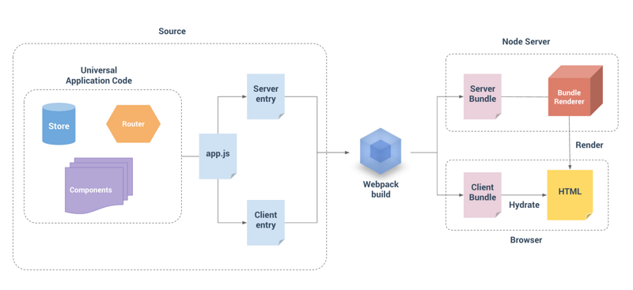

### 1、前言

服务端渲染实现原理机制：在服务端拿数据进行解析渲染，直接生成html片段返回给前端。然后前端可以通过解析后端返回的html片段到前端页面，大致有以下两种形式：

1、服务器通过模版引擎直接渲染整个页面，例如java后端的vm模版引擎，php后端的smarty模版引擎。
2、服务渲染生成html代码块, 前端通过AJAX获取然后使用js动态添加。
	
<!-- more -->	
	

### 2、服务端渲染的优劣

服务端渲染能够解决两大问题：

1、seo问题，有利于搜索引擎蜘蛛抓取网站内容，利于网站的收录和排名。
2、首屏加载过慢问题，例如现在成熟的SPA项目中，打开首页需要加载很多资源，通过服务端渲染可以加速首屏渲染。
	
同样服务端渲染也会有弊端，主要是根据自己的业务场景来选择适合方式，由于服务端渲染前端页面，必将会给服务器增加压力。

### 3、SSR的实现原理

客户端请求服务器，服务器根据请求地址获得匹配的组件，在调用匹配到的组件返回 Promise (官方是preFetch方法)来将需要的数据拿到。最后再通过



 

将其写入网页，最后将服务端渲染好的网页返回回去。

接下来客户端会将vuex将写入的 __initial_state__ 替换为当前的全局状态树，再用这个状态树去检查服务端渲染好的数据有没有问题。遇到没被服务端渲染的组件，再去发异步请求拿数据。说白了就是一个类似React的 shouldComponentUpdate 的Diff操作。

Vue2使用的是单向数据流，用了它，就可以通过 SSR 返回唯一一个全局状态， 并确认某个组件是否已经SSR过了。

### 4、vue后端渲染主要插件：vue-server-renderer

由于virtual dom的引入，使得vue的服务端渲染成为了可能，下面是官方 vue-server-renderer提供的渲染流程图:

可以看出vue的后端渲染分三个部分组成：页面的源码（source），node层的渲染部分和浏览器端的渲染部分。

source分为两种entry point,一个是前端页面的入口client entry,主要是实例化Vue对象，将其挂载到页面中；另外一个是后端渲染服务入口server entry,主要是控服务端渲染模块回调，返回一个Promise对象，最终返回一个Vue对象（经过测试，直接返回Vue对象也是可以的）;

前面的source部分就是业务开发的代码，开发完成之后通过 webpack 进行构建，生成对应的bundle，这里不再赘述client bundle,就是一个可在浏览器端执行的打包文件；这里说下server bundle, vue2提供 vue-server-renderer模块，模块可以提供两种render: rendererer/bundleRenderer ,下面分别介绍下这两种render。

renderer接收一个vue对象 ，然后进行渲染，这种对于简单的vue对象,可以这么去做，但是对于复杂的项目，如果使用这种直接require一个vue对象，这个对于服务端代码的结构和逻辑都不太友好，首先模块的状态会一直延续在每个请求渲染请求，我们需要去管理和避免这次渲染请求的状态影响到后面的请求,因此vue-server-renderer提供了另外一种渲染模式，通过一个 bundleRenderer去做渲染。

bundleRenderer是较为复杂项目进行服务端渲染官方推荐的方式，通过webpack以server entry按照一定的要求打包生成一个 server-bundle,它相当于一个可以给服务端用的app的打包压缩文件，每一次调用都会重新初始化 vue对象，保证了每次请求都是独立的，对于开发者来说，只需要专注于当前业务就可以，不用为服务端渲染开发更多的逻辑代码。
renderer生成完成之后，都存在两个接口，分别是renderToString和renderToStream，一个是一次性将页面渲染成字符串文件，另外一个是流式渲染，适用于支持流的web服务器，可以是请求服务的速度更快。

### 5、项目基本结构如下

> 如何从零开始搭建适合自己的vue后端渲染框架？