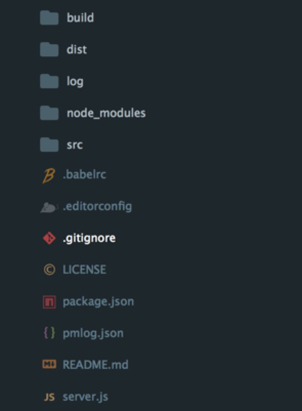
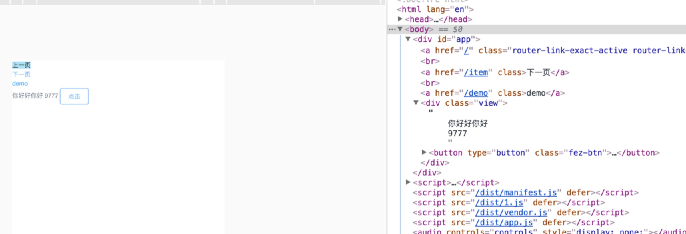

### 1、前言

上一节我们大致讲了为什么需要使用vue后端渲染，以及vue后端渲染的基本原理，这节内容我们将从零开始搭建属于自己的vue后端渲染脚手架，当然不能不参考官方页面响应的实例vue-hackernews-2.0，从零开始搭建项目,源码在将在下节与大家共享。

### 2、前期准备

基本环境要求：node版本6.10.1以上，npm版本3.10.10以上，本机环境是这样的，建议升级到官方最新版本。

使用的技术栈：

<!-- more -->

1、vue 2.4.2
2、vuex 2.3.1
3、vue-router 2.7.0
4、vue-server-renderer 2.4.2
5、express 4.15.4
6、axios 0.16.2
7、qs 6.5.0
8、q https://github.com/kriskowal/q.git
9、webpack 3.5.0
10、mockjs 1.0.1-beta3
11、babel 相关插件

以上是主要是用的技术栈，在构建过程中会是用相应的插件依赖包来配合进行压缩打包，以下是npm init后package.json文件所要添加的依赖包。


"dependencies": {
    "axios": "^0.16.2",
    "es6-promise": "^4.1.1",
    "express": "^4.15.4",
    "lodash": "^4.17.4",
    "q": "git+https://github.com/kriskowal/q.git",
    "qs": "^6.5.0",
    "vue": "^2.4.2",
    "vue-router": "^2.7.0",
    "vue-server-renderer": "^2.4.2",
    "vuex": "^2.3.1"
  },
  "devDependencies": {
    "autoprefixer": "^7.1.2",
    "babel-core": "^6.25.0",
    "babel-loader": "^7.1.1",
    "babel-plugin-syntax-dynamic-import": "^6.18.0",
    "babel-plugin-transform-runtime": "^6.22.0",
    "babel-preset-env": "^1.6.0",
    "babel-preset-stage-2": "^6.22.0",
    "compression": "^1.7.1",
    "cross-env": "^5.0.5",
    "css-loader": "^0.28.4",
    "extract-text-webpack-plugin": "^3.0.0",
    "file-loader": "^0.11.2",
    "friendly-errors-webpack-plugin": "^1.6.1",
    "glob": "^7.1.2",
    "less": "^2.7.2",
    "less-loader": "^2.2.3",
    "lru-cache": "^4.1.1",
    "mockjs": "^1.0.1-beta3",
    "style-loader": "^0.19.0",
    "sw-precache-webpack-plugin": "^0.11.4",
    "url-loader": "^0.5.9",
    "vue-loader": "^13.0.4",
    "vue-style-loader": "^3.0.3",
    "vue-template-compiler": "^2.4.2",
    "vuex-router-sync": "^4.2.0",
    "webpack": "^3.5.0",
    "webpack-dev-middleware": "^1.12.0",
    "webpack-hot-middleware": "^2.18.2",
    "webpack-merge": "^4.1.0",
    "webpack-node-externals": "^1.6.0"
  }	


### 3、项目主目录搭建

基本目录结构如下：

├── LICENSE
├── README.md
├── build
│   ├── setup-dev-server.js
│   ├── vue-loader.config.js
│   ├── webpack.base.config.js
│   ├── webpack.client.config.js
│   └── webpack.server.config.js
├── log
│   ├── err.log
│   └── out.log
├── package.json
├── pmlog.json
├── server.js
└── src
    ├── App.vue
    ├── app.js
    ├── assets
    │   ├── images
    │   ├── style
    │   │   └── css.less
    │   └── views
    │       └── index.css
    ├── components
    │   ├── Banner.vue
    │   ├── BottomNav.vue
    │   ├── FloorOne.vue
    │   └── Header.vue
    ├── entry-client.js
    ├── entry-server.js
    ├── index.template.html
    ├── public
    │   ├── conf.js
    │   └── utils
    │       ├── api.js
    │       └── confUtils.js
    ├── router
    │   └── index.js
    ├── static
    │   ├── img
    │   │   └── favicon.ico
    │   └── js
    │       └── flexible.js
    ├── store
    │   ├── actions.js
    │   ├── getters.js
    │   ├── index.js
    │   ├── modules
    │   │   └── Home.js
    │   ├── mutationtypes.js
    │   └── state.js
    └── views
        └── index
            ├── conf.js
            ├── index.vue
            ├── mock.js
            └── service.js  

> 文件目录基本介绍：
	
- views文件夹下分模块文件，模块文件下下又分模块本身的.vue文件（模版文件），index.js文件（后台数据交互文件），mock.js（本模块的mock假数据），conf.js（配置本模块一些参数，请求路径，模块名称等信息）
- components 公共组件文件夹
- router 主要存放前端路由配置文件，写法规范按照vue-router官方例子即可。
- store 主要是存放共享状态文件，里面包含action.js,getter.js,mutationtype.js等，后期会根据模块再细分这些。
- public 主要存放公共组件代码和项目使用的公共文件代码，例如后期我们将axios封装成公共的api库文件等等
- static文件夹代表静态文件，不会被webpack打包的
- app.js 是项目入口文件
- App.vue 是项目入口文件
- entry-client和entry-server分别是客户端入口文件和服务端的入口文件
- index.template.html是整个项目的模版文件

#### 开始编写app.js项目入口代码

使用vue开发项目入口文件一般都会如下写法：

import Vue from 'vue';
import App from './index.vue';
import router from './router'
import store from './store';

new Vue({
	el: '#app',
	store,
	router,
	render: (h) => h(App)
});
 

这种写法是程序共享一个vue实例，但是在后端渲染中很容易导致交叉请求状态污染，导致数据流被污染了。

> 所以，避免状态单例,我们不应该直接创建一个应用程序实例，而是应该暴露一个可以重复执行的工厂函数，为每个请求创建新的应用程序实例，同样router和store入口文件也需要重新创建一个实例。

为了配合webpack动态加载路由配置，这里会改写常规路由引入写法，这样可以根据路由路径来判断加载相应的组件代码：


import Home from '../views/index/index.vue'
// 改写成
component: () => ('../views/index/index.vue')
 

以下是路由的基本写法router，对外会抛出一个createRouter方法来创建一个新的路由实例：


import Vue from 'vue'
import Router from 'vue-router';
Vue.use(Router)
export function createRouter() {
    return new Router({
        mode: 'history',
        routes: [{
            name:'Home',
            path: '/',
            component: () =>
                import ('../views/index/index.vue')
        }]
    })
}
 

以下是store状态管理的基本写法，对外暴露了一个createStore方法，方便每次访问创建一个新的实例：


// store.js
import Vue from 'vue'
import Vuex from 'vuex'
import * as actions from './actions'
import getters from './getters'
import modules from './modules/index'
Vue.use(Vuex)
export function createStore() {
  return new Vuex.Store({
    actions,
    getters,
    modules,
    strict: false
  })
}

 

结合写好的router和store入口文件代码来编写整个项目的入口文件app.js代码内容，同样最终也会对外暴露一个createApp方法，在每次创建app的时候保证router，store，app都是新创建的实例，这里还引入了一个vue路由插件vuex-router-sync，主要作用是同步路由状态(route state)到 store，以下是app.js完整代码：


import Vue from 'vue'
import App from './App.vue'
import { createRouter } from './router'
import { createStore } from './store'
import { sync } from 'vuex-router-sync'
require('./assets/style/css.less');
export function createApp () {
  // 创建 router 和 store 实例
  const router = createRouter()
  const store = createStore()
  // 同步路由状态(route state)到 store
  sync(store, router)
  // 创建应用程序实例，将 router 和 store 注入
  const app = new Vue({
    router,
    store,
    render: h => h(App)
  })
  // 暴露 app, router 和 store。
  return { app, router, store }
}
 

#### entry-client.js代码编写：

首页引入从app文件中暴露出来的createApp方法，在每次调用客户端的时候，重新创建一个新的app，router，store，部分代码如下：


import { createApp } from './app'
const { app, router, store } = createApp()


这里我们会使用到onReady方法，此方法通常用于等待异步的导航钩子完成，比如在进行服务端渲染的时候，例子代码如下：


import { createApp } from './app'
const { app, router, store } = createApp()
router.onReady(() => {
  app.$mount('#app')
})


我们会调用一个新方法beforeResolve，只有在router2.5.0以上的版本才会有的方法，注册一个类似于全局路由保护router.beforeEach()，除了在导航确认之后，在所有其他保护和异步组件已解决之后调用。基本写法如下：


router.beforeResolve((to, from, next) => {
	// to 和 from 都是 路由信息对象
	// 返回目标位置或是当前路由匹配的组件数组（是数组的定义/构造类，不是实例）。通常在服务端渲染的数据预加载时时候。
	const matched = router.getMatchedComponents(to)
    const prevMatched = router.getMatchedComponents(from)
})


服务端把要给客户端的 state 放在了 window.__INITIAL_STATE__ 这个全局变量上面。前后端的 HTML 结构应该是一致的。然后要把 store 的状态树写入一个全局变量（__INITIAL_STATE__），这样客户端初始化 render 的时候能够校验服务器生成的 HTML 结构，并且同步到初始化状态，然后整个页面被客户端接管。基本代码如下：

// 将服务端渲染时候的状态写入vuex中
if (window.__INITIAL_STATE__) {
  store.replaceState(window.__INITIAL_STATE__)
}


接下来贴出来完整的客户端代码，这里的Q也可以不用引入，直接使用babel就能编译es6自带的Promise，因为本人使用习惯了，这里可以根据自身的需求是否安装：

import { createApp } from './app'
import Q from 'q'
import Vue from 'vue'

Vue.mixin({
  beforeRouteUpdate (to, from, next) {
    const { asyncData } = this.$options
    if (asyncData) {
      asyncData({
        store: this.$store,
        route: to
      }).then(next).catch(next)
    } else {
      next()
    }
  }
})

const { app, router, store } = createApp()

// 将服务端渲染时候的状态写入vuex中
if (window.__INITIAL_STATE__) {
  store.replaceState(window.__INITIAL_STATE__)
}

router.onReady(() => {
  router.beforeResolve((to, from, next) => {
      const matched = router.getMatchedComponents(to)
      const prevMatched = router.getMatchedComponents(from)
      // 我们只关心之前没有渲染的组件
      // 所以我们对比它们，找出两个匹配列表的差异组件
      let diffed = false
      const activated = matched.filter((c, i) => {
        return diffed || (diffed = (prevMatched[i] !== c))
      })
      if (!activated.length) {
        return next()
      }
      // 这里如果有加载指示器(loading indicator)，就触发
      Q.all(activated.map(c => {
        if (c.asyncData) {
          return c.asyncData({ store, route: to })
        }
      })).then(() => {
        // 停止加载指示器(loading indicator)
        next()
      }).catch(next)
    })
    app.$mount('#app')
})



#### entry-server.js代码编写：

基本编写和客户端的差不多，因为这是服务端渲染，涉及到与后端数据交互定义的问题，我们需要在这里定义好各组件与后端交互使用的方法名称，这样方便在组件内部直接使用，这里根我们常规在组件直接使用ajax获取数据有些不一样，代码片段如下：

//直接定义组件内部asyncData方法来触发相应的ajax获取数据
if (Component.asyncData) {
  return Component.asyncData({
    store,
    route: router.currentRoute
  })
}


以下是完整的服务端代码：

import { createApp } from './app'
import Q from 'q'
export default context => {
  return new Q.Promise((resolve, reject) => {
    const { app, router, store } = createApp()
    router.push(context.url)
    router.onReady(() => {
      const matchedComponents = router.getMatchedComponents()
      if (!matchedComponents.length) {
        return reject({ code: 404 })
      }
      // 对所有匹配的路由组件调用 `asyncData()`
      Q.all(matchedComponents.map(Component => {
        if (Component.asyncData) {
          return Component.asyncData({
            store,
            route: router.currentRoute
          })
        }
      })).then(() => {
        // 在所有预取钩子(preFetch hook) resolve 后，
        // 我们的 store 现在已经填充入渲染应用程序所需的状态。
        // 当我们将状态附加到上下文，
        // 并且 `template` 选项用于 renderer 时，
        // 状态将自动序列化为 `window.__INITIAL_STATE__`，并注入 HTML。
        context.state = store.state
        resolve(app)
      }).catch(reject)
    }, reject)
  })
}


### 4、脚手架其他目录介绍：

到这里src下面主要的几个文件代码已经编写完成，接下里介绍下整个项目的目录结构如下：

主要几个文件介绍如下：
- build 主要存放webpack打包配置文件
- dist webpack打包后生成的目录
- log 使用pm2监控进程存放的日志文件目录
- server.js node服务器启动文件
- pmlog.json pm2配置文件

#### server.js入口文件编写

我们还需要编写在服务端启动服务的代码server.js，我们会使用到部分node原生提供的api，片段代码如下：

const Vue = require('vue')
const express = require('express')
const path = require('path')
const LRU = require('lru-cache')
const { createBundleRenderer } = require('vue-server-renderer')
const fs = require('fs')
const net = require('net')


大致思路是，引入前端模版页面index.template.html，使用express启动服务，引入webpack打包项目代码的dist文件，引入缓存模块（这里不做深入介绍，后期会单独详细介绍），判断端口是否被占用，自动启动其他接口服务。

引入前端模版文件并且设置环境变量为production，片段代码如下：

const template = fs.readFileSync('./src/index.template.html', 'utf-8')
const isProd = process.env.NODE_ENV === 'production'


vue-server-renderer插件的具体使用，通过读取dist文件夹下的目录文件，来创建createBundleRenderer函数，并且使用LRU来设置缓存的时间，通过判断是生产环境还是开发环境，调用不同的方法，代码片段如下：

const resolve = file => path.resolve(__dirname, file)
function createRenderer (bundle, options) {
  return createBundleRenderer(bundle, Object.assign(options, {
    template,
    cache: LRU({
      max: 1000,
      maxAge: 1000 * 60 * 15
    }),
    basedir: resolve('./dist'),
    runInNewContext: false
  }))
}
let renderer;
let readyPromise
if (isProd) {
  const bundle = require('./dist/vue-ssr-server-bundle.json')
  const clientManifest = require('./dist/vue-ssr-client-manifest.json')
  renderer = createRenderer(bundle, {
    clientManifest
  })
} else {
  readyPromise = require('./build/setup-dev-server')(server, (bundle, options) => {
    renderer = createRenderer(bundle, options)
  })
}


使用express启动服务，代码片段如下：

const server = express()；

//定义在启动服务钱先判断中间件中的缓存是否过期，是否直接调用dist文件。
const serve = (path, cache) => express.static(resolve(path), {
  maxAge: cache && isProd ? 1000 * 60 * 60 * 24 * 30 : 0
})
server.use('/dist', serve('./dist', true))
server.get('*', (req, res) => {
  const context = {
    title: 'hello',
    url: req.url
  }
  renderer.renderToString(context, (err, html) => {
    if (err) {
      res.status(500).end('Internal Server Error')
      return
    }
    res.end(html)
  })
})


判断端口是否被占用，片段代码如下：

function probe(port, callback) {
    let servers = net.createServer().listen(port)
    let calledOnce = false
    let timeoutRef = setTimeout(function() {
        calledOnce = true
        callback(false, port)
    }, 2000)
    timeoutRef.unref()
    let connected = false
    servers.on('listening', function() {
        clearTimeout(timeoutRef)

        if (servers)
            servers.close()

        if (!calledOnce) {
            calledOnce = true
            callback(true, port)
        }
    })
    servers.on('error', function(err) {
        clearTimeout(timeoutRef)

        let result = true
        if (err.code === 'EADDRINUSE')
            result = false

        if (!calledOnce) {
            calledOnce = true
            callback(result, port)
        }
    })
}
const checkPortPromise = new Promise((resolve) => {
    (function serverport(_port) {
        let pt = _port || 8080;
        probe(pt, function(bl, _pt) {
            // 端口被占用 bl 返回false
            // _pt：传入的端口号
            if (bl === true) {
                // console.log("\n  Static file server running at" + "\n\n=> http://localhost:" + _pt + '\n');
                resolve(_pt);
            } else {
                serverport(_pt + 1)
            }
        })
    })()

})
checkPortPromise.then(data => {
    uri = 'http://localhost:' + data;
    console.log('启动服务路径'+uri)
    server.listen(data);
});


到这里，基本的代码已经编写完成，webpack打包配置文件基本和官方保持不变，接下来可以尝试启动本地的项目服务，这里简要的使用网易严选首页作为demo示例，结果如下：

>下节，我将介绍下mockjs，axios怎么封装成公共函数便于使用
	
