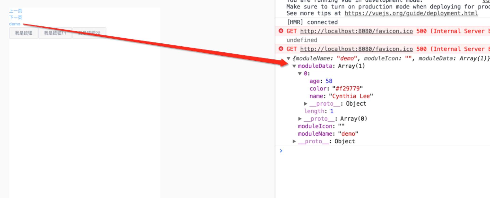

### 1、前言

上一节大致介绍了服务端和客户端入口文件代码内容，现在已经可以正常运行你的后端渲染脚手架了，这一节，跟大家分享下如何使用axios做ajax请求，如何使用mockjs做本地假数据，跑通本地基本逻辑，为以后前后端连调做准备。

### 2、前期准备

需要用npm安装axios，mockjs依赖包,由于mockjs只是代码开发的辅助工具，所以安装的时候我会加--save-dev来区分，具体可以根据自己的需求来定，当然，如果有mock服务平台的话，可以直接走mock平台造假数据，本地直接访问mock平台的接口，例如可以使用阿里的Rap平台管理工具生成。


npm install axios --save
npm install mockjs --save-dev
 

<!-- more -->

### 3、简要介绍axios

>其他请求方式，代码示例如下：


axios.request(config);
axios.get(url[,config]);
axios.delete(url[,config]);
axios.head(url[,config]);
axios.post(url[,data[,config]]);
axios.put(url[,data[,config]])
axios.patch(url[,data[,config]])
 

>具体详细可以点击查看<a href="/2017-05-02/" target="_blank" >axios基本使用介绍</a>

api.js完整代码如下：


function ajax(url, type, options) {
    return Q.Promise((resolve, reject) => {
        axios({
            method : type,
            url : url,
            // responseType:'stream',
            data : options
        })
        .then((result) => {
            if (result && result.status === 401) {
                location.href = '/views/401.html'
            }
            if (result && result.status === 200) {
                resolve(result.data);
            } else {
                reject({
                    errno: result.errno,
                    msg: result.msg
                });
            }
        })
        .catch(function(error) {
            console.log(error,url);
        });
    })
}

const config = {
    get(url, options) {
        const _self = this;
        return Q.Promise((resolve, reject) => {
            ajax(url, 'get', options)
            .then((data) => {
                resolve(data);
            }, (error) => {
                reject(error);
            });
        })
    },

    post(url, options) {
        const _self = this;
        return Q.Promise((resolve, reject) => {
            ajax(url, 'post', options)
            .then((data) => {
                resolve(data);
            }, (error) => {
                reject(error);
            });
        })
    },

    put(url, options) {
        const _self = this;
        return Q.Promise((resolve, reject) => {
            ajax(url, 'put', options)
            .then((data) => {
                resolve(data);
            }, (error) => {
                reject(error);
            });
        })
    },

    delete(url, options) {
        const _self = this;
        return Q.Promise((resolve, reject) => {
            ajax(url, 'delete', options)
            .then((data) => {
                resolve(data);
            }, (error) => {
                reject(error);
            });
        })
    },

    jsonp(url, options) {
        const _self = this;
        return Q.Promise((resolve, reject) => {
            ajax(url, 'jsonp', options)
            .then((data) => {
                resolve(data);
            }, (error) => {
                reject(error);
            });
        })
    }
};

export default config;


>mockjs项目基本配置如下：

1、在public下新建conf.js全局定义请求url地址，代码如下：

module.exports = {
    HOST: "http://www.xxx.com",
    DEBUGMOCK: true
};


2、在component根目录下新建conf.js，定义组件mock的请求路径，并且定义是否开始单个组件使用mock数据还是线上接口数据，代码如下：

const PUBCONF = require('../public/conf.js');

export const DEMO = {
  DEBUGMOCK : PUBCONF.DEBUGMOCK,

  INDEX_URL : PUBCONF.HOST + '/demo',
  INDEX_URL_MOCK : true && PUBCONF.DEBUGMOCK
}

export const ANOTHER_DEMO = {

}
export default {
    DEMO,
    ANOTHER_DEMO
}


3、在组件内部定义conf.js文件，主要编写单个组件的基本配置信息，请求路径，mock数据对应的url地址，代码如下：

import {DEMO} from '../conf.js';
const MODULECONF = {
  'demo': {
    NAME: 'demo',
    ICON: '',
    MOCK: DEMO.INDEX_URL_MOCK,
    API: {
      GET: DEMO.INDEX_URL,
    }
  },
};
export default MODULECONF;


4、在组件内部定义mockjs来编写mock假数据，代码如下：

import Mock from 'mockjs';
export default Mock.mock('http://www.xxx.com/demo', {
    errno: 0,
    msg: "成功",
    data: [{
        'name': '@name',
        'age|1-100': 100,
        'color': '@color'
    }]
});


>查看数据返回效果，数据在控制台打印出来

以上就是基本的流程，如果有更好更灵活的使用方案，希望能够参与沟通并且分享，这里会有个问题，就是目前mockjs未能跟业务代码隔离，webpack如果单纯加上externals配置，项目打包后,直接本地运行会报错，找不到mockjs，不知道是不是自己配置的原因，但是基本的思想就是最终上线代码不要把工具类的函数打包进去。项目脚手架已经在github上分享，<a href="https://github.com/wqzwh/wq-vue-ssr" target="_blank">点击查看详情</a>
