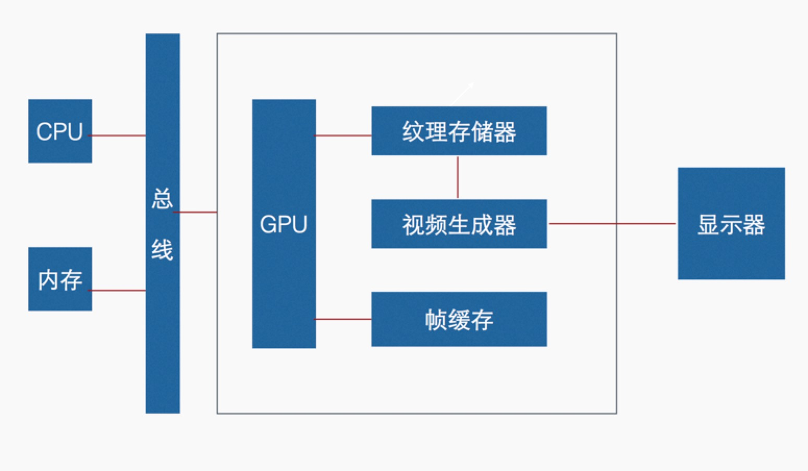
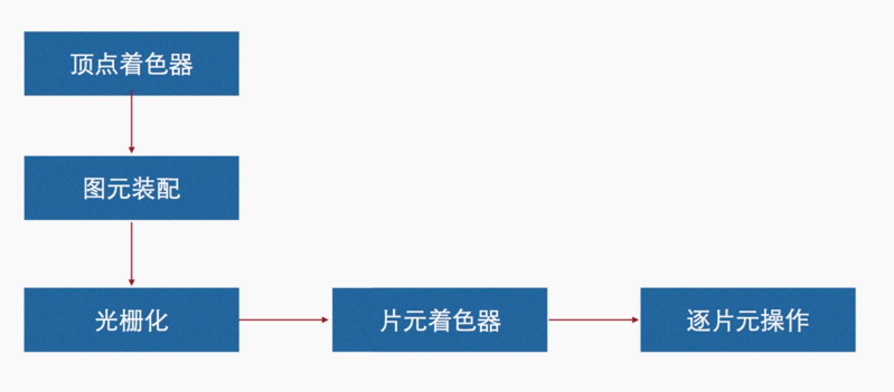

### WebGL是什么
在浏览器绘制3D图形的的一门技术，是内嵌在浏览器中，目前支持高版本浏览器，因此不需要安装任何插件，同样也支持多平台运行，它是基于OpenGL ES 2.0技术。

#### 优势

* 快速传播
* 维护简单
* 跨平台性
* 开放的标准
* 硬件加速
* 无需安装插件
* 充分利用浏览器功能

<!-- more -->

#### 图形API模式

即时模式，每一帧的场景不管是否发生了变化，都需要重新绘制，提供API的图形库并没有保存需要绘图场景的内部模型，但是应用程序需要在内存中用自己的方式表示场景，这种设计模式大大提高了应用程序的灵活性和控制的能力，但是需要应用程序执行更多的操作，如跟踪场景的模型，应用初始化等等，包括清除操作。webGL采用的是即时模式，非常灵活，但是相对而言手工代码会多一点。

保留模式，它的API保留了所有图形库的模型和场景，但应用程序调用保留模式API时需要更新内部的模型，图形库决定在什么时候执行实际的绘制方法，这意味着不需要为每一帧场景重新绘制命令，因此保留模式API似乎更容易使用。

### 图像硬件介绍



### WebGL程序执行原理

#### 图形流水线



通过顶点来确定图形，具备形状之后内部时空的，通过光栅化进行“面积”的填充，然后进入片元着色器，进入“绘图”过程，类似上色过程，再次进逐片元操作

#### 定点着色器

* 顶点着色器源代码，javascript字符串形式表示出来
* 内置变量，名字不可辨，区分大小写
* 自定义 Attribute 变量，表示每一个点的数据，可以定义多个
* 自定义 Uniform 变量，表示一个常量，是个恒定的，所有点的数据都是一样的
* 自定义 Varying 变量，定点着色器和片着色器传导数据用的
                                                                
#### 片元着色器

* 片元着色器源代码，javascript字符串形式表示出来
* 内置变量，名字不可辨，区分大小写
* Uniform 和 Samplers，Samplers用来储存纹理
* 自定义 Varying 变量，定点着色器和片着色器传导数据用的

### WebGL和HTML5及Javascript的关系

* 需要 HTML5 Canvas 元素，webgl和canvas画图都需要canvas这个api
* 用 Javascript 处理逻辑
* 可利用支持 HTML5 浏览器的一切功能
* 用 Javascript 字符串形式编写着色器源代码

基本示例代码如下：
``` html
<body onload="main()">
    <canvas id="webgl" width="500" height="400"></canvas>
    <script src="../lib/webgl-utils.js"></script>
    <script src="../lib/webgl-debug.js"></script>
    <script src="../lib/cuon-utils.js"></script>

    <script>
        // 顶点着色器程序
        const VSHADER_SOURCE =
            `void main() {
          gl_Position = vec4(1.0,0.0,0.0,1.0);
          gl_PointSize = 30.0;
        }`
        
        // 片元着色器程序
        const FSHADER_SOURCE =
            `void main() {
          gl_FragColor = vec4(1.0,1.0,0.0,1.0);
          }`

        function main() {
            // 获取canvan元素
            var canvas = document.getElementById("webgl");

            // 获取webgl绘图上下文
            var gl = getWebGLContext(canvas, true);
            if (!gl) {
                console.log('error');
                return;
            }

            // 初始化着色器
            if (!initShaders(gl, VSHADER_SOURCE, FSHADER_SOURCE)) {
                console.log('error');
                return;
            }


            // 制定清空canvas的颜色
            gl.clearColor(0.0, 0.0, 0.0, 1.0);
            // 清空canvas
            gl.clear(gl.COLOR_BUFFER_BIT);

            // 绘制一个点
            gl.drawArrays(gl.POINTS, 0, 1);
        }
    </script>
</body>
```

源码链接请访问 https://github.com/wqzwh/webgl-code/tree/master/02