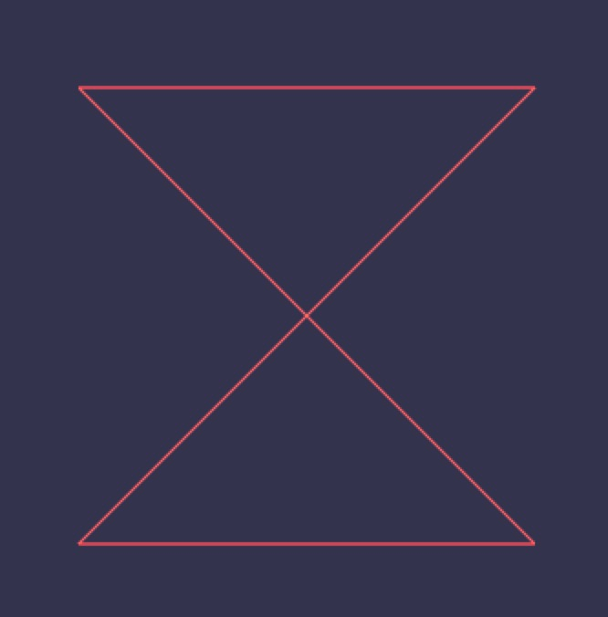
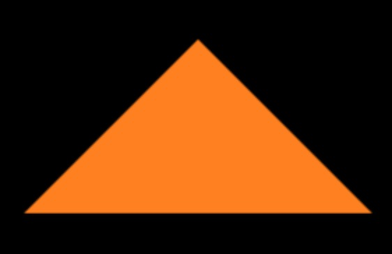
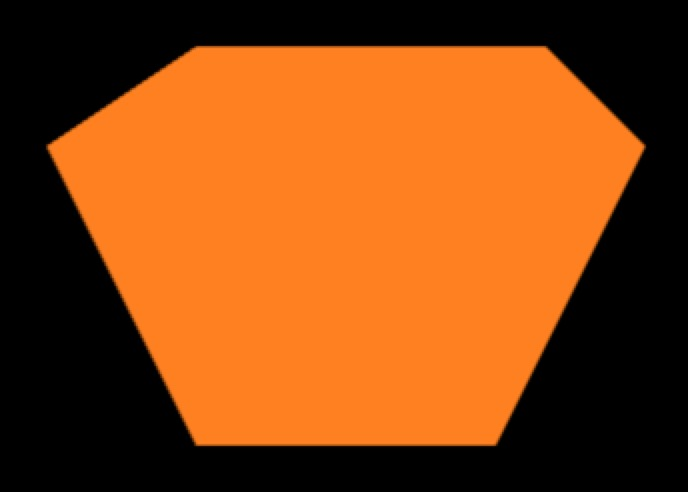

### 点的绘制

#### 单点绘制

* gl.drawArrays( gl.POINTS, start , count )
* gl.POINTS，标示绘制点的
* start 起始位置
* count 绘制数量，绘制点的个数不能超过在buffer中存在点的个数

#### 多点绘制

* 采用 javascript 循环，实现多点绘制
* 采用 WebGL 缓冲区对象，实现多点绘制

上一节代码示例中分别采用了循环绘制点和使用缓冲区对象绘制点，详细请查看上一节内容。

<!-- more -->

### 线段绘制

#### 绘制单线段

* gl.drawArray( gl.LINES , start , count )
* gl.LINES，可以绘制一条线，也可以绘制多条线
* 绘制一条线
* 绘制多条线

最重要的画线代码如下：


cxt.drawArrays(cxt.LINES,0,4);


####  绘制多线段

* gl.drawArray( gl.LINE_STRIP , start , count )
* gl.LINE_STRIP 绘制线段带
* 例如绘制一个矩形框需要定义五个点才能绘制出来，线段带是没有绘路的概念

绘制一个矩形重要的相关代码如下：


//类型化数组定义五个点
var data = new Float32Array([
    -.5,.5,
    .5,.5 ,
    .5, -.5,
    -.5, -.5,
    -.5,.5
]);

// 最终绘制也是绘制5个点
cxt.drawArrays(cxt.LINE_STRIP,0,5);


#### 绘制回路线段

* gl.drawArray( gl.LINE_LOOP , start , count )
* gl.LINE_LOOP 自动闭合线段，例如绘制矩形只需要4个点即可，默认会将最后一个点和第一个开始的点连接起来

绘制一个矩形重要的相关代码如下：


//类型化数组定义4个点
var data = new Float32Array([
    -.5,.5,
    .5,.5 ,
    .5, -.5,
    -.5, -.5,
    -.5,.5
]);

// 最终绘制也是绘制5个点
cxt.drawArrays(cxt.LINE_LOOP,0,4);


使用gl.LINE_LOOP绘制一个领结形状的图形，其实只是利用了LINE_LOOP自动闭合线段绘制出来的，核心片段代码如下：

//类型化数组定义4个点
var data = new Float32Array([
    -.5, .5,
    .5, .5,
    -.5, -.5,
    .5, -.5
]);

// 最终绘制也是绘制5个点
cxt.drawArrays(cxt.LINE_LOOP,0,4);


运行效果图如下：

### 多边形绘制

#### 绘制三角形

* gl.drawArray( gl.TRIANGLES , start , count )
* gl. TRIANGLES

核心代码片段如下：

var data = new Float32Array([
    0,0,
    -.5,-.5 ,
    .5, -.5
]);

cxt.drawArrays(cxt.TRIANGLES,0,3);


运行效果图如下：

#### 绘制三角带

* gl.drawArray( gl.TRIANGLE_STRIP , start , count )
* gl.TRIANGLE_STRIP

绘制一个平行四边形的核心代码如下：

var data = new Float32Array([
        -.3,.3,
        .5,.3,
    -.5, -.3,
        .3, -.3
    ]);

cxt.drawArrays(cxt.TRIANGLE_STRIP,0,4);


运行效果图如下：

#### 绘制三角扇

* gl.drawArray( gl.TRIANGLE_FAN , start , count )
* gl.TRIANGLE_FAN

绘制一个六边形的核心代码如下：

var data = new Float32Array([
      .0,0,
      -.3,.5,
      -.6,.3,
      -.3, -.3,
      .3, -.3,
      .6, .3,
          .4,.5,
      -.3,.5
    ]);

cxt.drawArrays(cxt.TRIANGLE_FAN,0,8);


运行效果图如下：

源码链接请访问 https://github.com/wqzwh/webgl-code/tree/master/04
