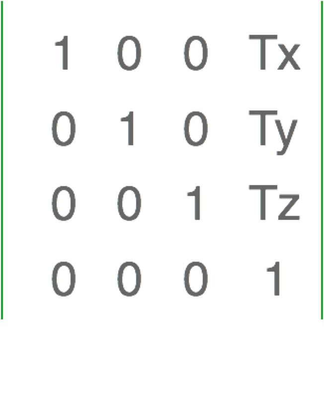
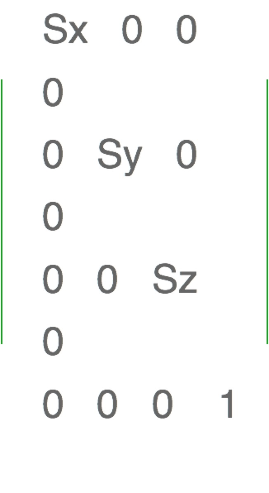
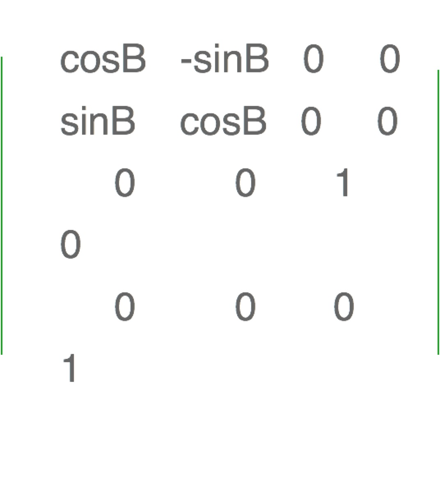
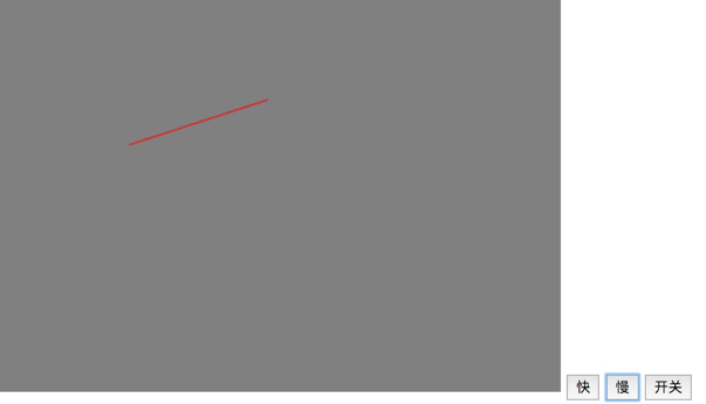

### 图形的移动

#### 原理

* 图形的移动，实际上就是定量改变顶点的位置。
* 在顶点着色器中，顶点修改是逐个进行的，且偏移值一致。

可以使用setTimeout定时执行画点的方法，来逐一改变点的位置实现图形的移动。

<!-- more -->

先编写顶点着色器，需要单独定义a，b来分别改变点的x方向和y方向，基本代码如下：

const vertexShaderSource =
    `
    attribute vec4 pos;
    uniform float a;
    uniform float b;
    void main() {
      gl_Position.x = pos.x + a;
      gl_Position.y = pos.y + b;
      gl_Position.z = .0;
      gl_PointSize = 10.0;
}`


片元着色器代码和之前写法基本一致，基本代码如下：

const fragmentShaderSource =
    `void main() {
      gl_FragColor = vec4(1.0,0.5,0.0,1.0);
  }`


给顶点着色器中的变量定义响应的location，基本代码如下：

var posLocation = cxt.getAttribLocation(program, 'pos');
var aLocation = cxt.getUniformLocation(program, 'a');
var bLocation = cxt.getUniformLocation(program, 'b');


使用setTimeOut函数定义简单的平移效果，基本代码如下：

run();
    function run() {
        cxt.uniform1f(aLocation, a);
        cxt.uniform1f(bLocation, b);
        cxt.clearColor(0.0, 0.0, 0.0, 1.0);
        cxt.clear(cxt.COLOR_BUFFER_BIT);

        cxt.drawArrays(cxt.TRIANGLES, 0, 3);

        a += .05;
        b += .05;

        setTimeout(run, 500)
    }


### 图形的缩放

#### 原理

* 基于原点，基于定义的某一个点进行缩小和放大(其实还做了平移操作)
* 在着色器中，逐顶点乘以缩放的倍数，对x轴和y轴同时进行缩放

 编写顶点着色器,定义一个cj变量，通过x轴和y轴同时乘以cj这个变量，来实现逐顶点缩放，基本代码如下：
 
 const vertexShaderSource =
        `
    attribute vec4 pos;
    uniform float cj;
    void main() {
      gl_Position.x = pos.x * cj;
      gl_Position.y = pos.y * cj;
      gl_Position.z = .0;
      gl_Position.w = 1.0;
      gl_PointSize = 10.0;
}`


定义cjLocation，代码如下：

var cjLocation = cxt.getUniformLocation(program, 'cj');


定义基本渲染函数render，再单独定义放大缩小函数，基本代码如下：

var cj = 1.0;	
    render();
    function render() {
        cxt.clearColor(0.0, 0.0, 0.0, 1.0);
        cxt.clear(cxt.COLOR_BUFFER_BIT);
        cxt.uniform1f(cjLocation, cj);
        cxt.drawArrays(cxt.TRIANGLES, 0, 3);
    }
    function fangda() {
        cj += .05;
        render()
    }

    function suoxiao() {
        cj -= .05;
        render()
    }


#### 利用w快速缩放

修改着色器代码，将vec4改成vec2，基本意思就是pos存在x和y两个点，基本修改后如下：
 
 const vertexShaderSource =
        `
    attribute vec2 pos;
    uniform float w;
    void main() {
      gl_Position = vec4(pos,0.0,w);
}`


该方法实现效果刚好和vec4的时候相反，基本原因是vec4(x/w,y/w,z/w,w),所以w越大，其实x和y轴会越小，所以最终放大效果和之前是相反的。

### 图形的旋转

#### 原理

* 基于原点，以一定的角度旋转
* 在顶点着色器中，更改gl.Position.x和gl.Position.y的值

#### 旋转方程

* x = r.cos(a)
* y = r.sin(a)
* x1 = r.cos(a+b)
* y1 = r.sin(a+b)
* x1 = x.cos(b) - y.sin(b)
* y1 = x.sin(b) + y.cos(b)
* z1 = z = 0.0

顶点着色器代码基本写法如下：
 
const vertexShaderSource =
        `
    attribute vec4 pos;
    uniform float cosB;
    uniform float sinB;
    void main() {
      gl_Position.x = pos.x * cosB - pos.y * sinB;
      gl_Position.y = pos.x * sinB + pos.y * cosB;
      gl_Position.z = .0;
      gl_Position.w = 1.0;
}`


实现简单动画基本如下：
 
var angle = 10.0;
    function render() {
        var t = Math.PI * angle / 180;
        var cosB = Math.sin(t);
        var sinB = Math.cos(t);
        cxt.clearColor(0.0, 0.0, 0.0, 1.0);
        cxt.clear(cxt.COLOR_BUFFER_BIT);
        cxt.uniform1f(cosBLocation, cosB);
        cxt.uniform1f(sinBLocation, sinB);
        cxt.drawArrays(cxt.TRIANGLES, 0, 3);
    }

    setInterval(() => {
        angle += 1.0;
        render();
    }, 1000)


### 矩阵变换实现图形的移动

#### 原理

* 图形的移动，实际上就是定量改变顶点的位置。
* 在顶点着色器中，顶点修改是逐个进行的，且偏移值一致。

只要改变Tx,Ty,就能分别改变图形的x方向和y方向

在顶点着色器中定义一个xf举证变量，基本代码如下：
 
const vertexShaderSource =
        `
    attribute vec4 pos;
    uniform mat4 xf;
    void main() {
      gl_Position = xf * pos;
}`


定义一个矩阵代码：
 
var xf = new Float32Array([
                    1.0, 0.0, 0.0, 0.0,
                    0.0, 1.0, 0.0, 0.0,
                    0.0, 0.0, 1.0, 0.0,
                    Tx, Ty, 0.0, 1.0
                ]);


只需要通过改变Tx，Ty就能实现改变图形的移动，并不需要改变着色器代码，这样效率会很高，render函数基本如下：

var Tx = 1.0, Ty = 0.0;

    function render() {
      var xf = new Float32Array([
                    1.0, 0.0, 0.0, 0.0,
                    0.0, 1.0, 0.0, 0.0,
                    0.0, 0.0, 1.0, 0.0,
                    Tx, Ty, 0.0, 1.0
                ]);
        
        cxt.clearColor(0.0, 0.0, 0.0, 1.0);
        cxt.clear(cxt.COLOR_BUFFER_BIT);
        cxt.uniformMatrix4fv(xfLocation,false,xf);
        cxt.drawArrays(cxt.TRIANGLES, 0, 3);
    }
    render()


### 矩阵变换实现图形的缩放

#### 原理

* 基于原点。
* 在着色器中，逐顶点乘以缩放倍数

Sx,Sy改变就会使得图形成比例的缩放

主要是矩阵函数不一样，其他基本一样，代码基本如下：

var sx = 1.0,
        sy = 1.0;

    function render() {
        var xf = new Float32Array([
            sx, 0.0, 0.0, 0.0,
            0.0, sy, 0.0, 0.0,
            0.0, 0.0, 1.0, 0.0,
            0.0, 0.0, 0.0, 1.0
        ]);

        cxt.clearColor(0.0, 0.0, 0.0, 1.0);
        cxt.clear(cxt.COLOR_BUFFER_BIT);
        cxt.uniformMatrix4fv(xfLocation, false, xf);
        cxt.drawArrays(cxt.TRIANGLES, 0, 3);
    }

    render()


### 矩阵变换实现图形的旋转

#### 原理

* 基于原点，以一定的角度旋转。
* 在顶点着色器中，更改 gl_Position.x 和 gl_Position.y 值。

实现一个时钟指针的旋转，并且控制其速度和开关。

定义一个顶点着色器和片元着色器，基本代码如下：

// 顶点着色器程序
    const vertexShaderSource =
        `
    attribute vec4 pos;
    uniform mat4 xf;
    void main() {
      gl_Position = xf * pos;
}`

    // 片元着色器程序
    const fragmentShaderSource =
        `void main() {
      gl_FragColor = vec4(1.0,.0,.0,1.0);
  }`


最终render函数基本如下：

var time;

    function render() {
        angle += zl;

        t = Math.PI * angle / 180;
        sinB = Math.sin(t);
        cosB = Math.cos(t);
        var xf = new Float32Array([
            cosB, sinB, 0.0, 0.0, -sinB, cosB, 0.0, .0,
            0.0, .0, 1.0, .0,
            0.0, .0, .0, 1.0
        ]);
        cxt.uniformMatrix4fv(xfLocation, false, xf);

        cxt.clearColor(.5, .5, .5, 1.0);
        cxt.clear(cxt.COLOR_BUFFER_BIT);

        cxt.drawArrays(cxt.LINES, 0, 2);
        time = setTimeout(render, 500);

        if (!isOpen) {
            clearTimeout(time);
        }
    }

    render()


最终效果如下图：

源码链接请访问 https://github.com/wqzwh/webgl-code/tree/master/05