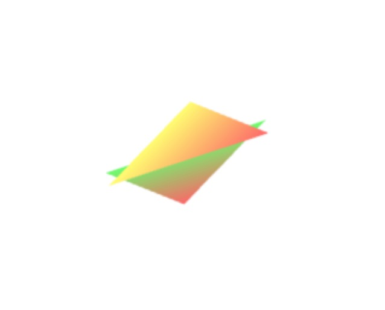

### 视点、目标点和上方向

* 视点：观察者所在的三维世界中的位置。
* 目标点：被观察的目标所在的位置。
* 上方向：相机正上方的方向。

#### 试图矩阵

* 默认情况下，视点位于坐标系原点
* lookAt(out, eye, center, up)
* eye 指定视点
* center  指定观察点
* up  指定向上方向

<!-- more -->

定义顶点着色器和片元着色器代码，在定义着色器代码中，需要定义点的坐标，点的颜色，矩阵，和片元着色器通信的颜色变量

// 顶点着色器程序
    const vertexShaderSource =
        `
    attribute vec4 a_Position;
    attribute vec4 a_Color;
    uniform mat4 u_vmatrix;
    varying vec4 v_Color;
    void main() {
      gl_Position = u_vmatrix * a_Position;
      v_Color = a_Color;
}`

    // 片元着色器程序
    const fragmentShaderSource =
        `
        precision lowp float;
        varying vec4 v_Color;
        void main() {
      gl_FragColor = v_Color;
  }`


定义几个公共工具类函数，基本代码如下：

function normalize(v){
        var sum = 0;
        for (var i=0;i< v.length;i++){
            sum += v[i] * v[i];
        }
        var result = Math.sqrt(sum);
        for(var j=0;j< v.length; j++){
            v[i] = v[i] / result;
        }
    }

    function cross(a,b){
        var nX = a[1] * b[2] - a[2] * b[1];
        var nY = a[2] * b[0] -a[0] * b[2];
        var nZ = a[0] * b[1] - a[1] * b[0];

        return new Float32Array([nX,nY,nZ]);
    }

    function dot(a,b){
        return a[0] * b[0] + a[1] * b[1] + a[2] * b[2];
    }

    function minus(a , b){
        return new Float32Array([a[0] - b[0], a[1] - b[1] , a[2] - b[2]]);
    }


通过工具类函数创建一个新的视图矩阵，基本代码如下：

function getVMatrix(){

        var eye = new Float32Array([0.4,0.0,0.26]);
        var lookat = new Float32Array([0.0,0.0,0.0]);
        var up = new Float32Array([0,1,1]);

        var zA = minus(eye , lookat);
        normalize(zA);

        normalize(up);
        var xA = cross(up, zA);

        var yA = cross(zA,xA);

        return new Float32Array([
                xA[0],yA[0],zA[0], 0,
                xA[1],yA[1],zA[1], 0,
                xA[2],yA[2],zA[2], 0,
                - dot(xA,eye), -dot(yA,eye),-dot(zA,eye),1

        ])

    }


创建三角形类型化数组，基本代码如下：


var data = new Float32Array([
        0.0, 0.5, -0.4, 0.4, 1.0, 0.4,
        -0.5, -0.5, -0.4, 0.4, 1.0, 0.4,
        0.5, -0.5, -0.4, 1.0, 0.4, 0.4,

        0.5, 0.4, -0.2, 1.0, 0.4, 0.4,
        -0.5, 0.4, -0.2, 1.0, 1.0, 0.4,
        0.0, -0.6, -0.2, 1.0, 1.0, 0.4
    ]);


视图矩阵数据添加，基本代码如下：


var u_vmatrixLocation = cxt.getUniformLocation(program,'u_vmatrix');

var mx = getVMatrix(); // 视图矩阵

cxt.uniformMatrix4fv(u_vmatrixLocation,false,mx);


最终效果如下：

### 视点控制

* 旋转后顶点坐标 ＝ 旋转矩阵 * 原始顶点坐标
* （从观点观察的）旋转后顶点坐标 ＝ 视图矩阵 * 旋转后顶点坐标
* （从观点观察的）旋转后顶点坐标 ＝ 视图矩阵 * 旋转矩阵 * 原始顶点坐标
* 视图矩阵 * 模型矩阵 * 原始顶点坐标

添加键盘控制视点位置，基本代码如下：


var eyeX = 0.25;

    function draw(eyeX){

        var mx = getVMatrix(eyeX); // 视图矩阵

        cxt.uniformMatrix4fv(u_vmatrixLocation,false,mx);

        cxt.clearColor(1.0,1.0,1.0,1.0);
        cxt.clear(cxt.COLOR_BUFFER_BIT);

        cxt.drawArrays(cxt.TRIANGLES,0,6);

    }

    document.addEventListener('keydown', function (event) {
        switch (event.keyCode){
            case 37:
                eyeX += .01;
                break;
            case 39:
                eyeX -= .01;
                break;
        }
        draw(eyeX);

    });

    draw(eyeX);


源码链接请访问 https://github.com/wqzwh/webgl-code/tree/master/09