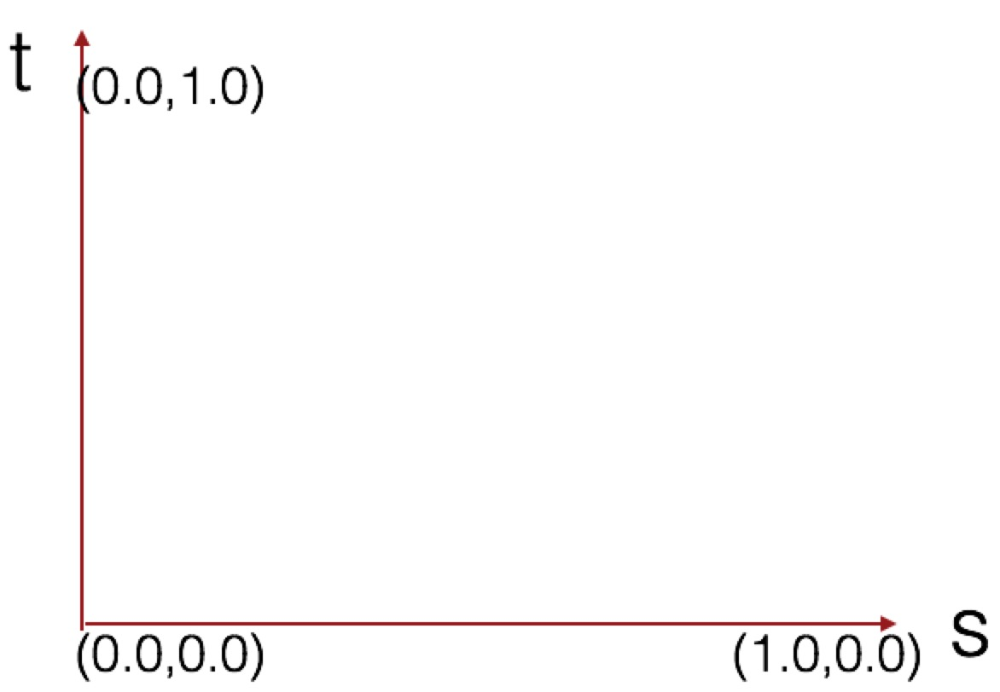
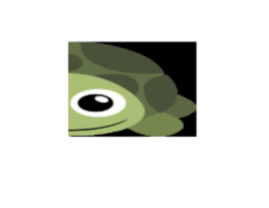

### 贴图概述

#### 图片类别


* JPG 格式，24位的颜色储存单个的绘图，是有损的压缩，牺牲图像质量可以控制文件大小
* GIF 格式，压缩比例能够达到40%到50%，无损压缩技术（必须保证256颜色的）
* PNG 格式，无损压缩

#### 贴图开发流程

* 准备纹理图像
* 配置图像映射方式
* 加载纹理图像
* 纹理贴图

<!-- more -->


### 贴图核心技术

#### 纹理坐标

* st坐标系



#### 纹理对象

* createTexture 创建纹理
* deleteTexture(tex) 删除纹理

#### 图片加载

* 确定图片加载后调用的函数
* 图片开始加载
* 向服务器请求图片
* 服务器查找图片
* 服务器返回图片数据
* 浏览器收到图片数据
* 调用回调函数

#### 配置纹理

* Y 轴反转
* 开启纹理单元
* 绑定纹理对象
* 配置纹理参数
* 配置纹理图形
* 将纹理传递给着色器

编写着色器代码，在片元着色器中定义贴图，基本如下

``` javascript
// 顶点着色器程序
    const vertexShaderSource =
        `
	    attribute vec4 pos;
	    attribute vec2 texPos;
	    varying vec2 v_texPos;
	    void main() {
	      gl_Position = pos;
	      v_texPos = texPos;
	}`

	    // 片元着色器程序
	    const fragmentShaderSource =
	        `
	        precision lowp float;
	        uniform sampler2D ss;
	        varying vec2 v_texPos;
	        void main() {
	      gl_FragColor = texture2D(ss,v_texPos);
	  }`   
```

将加载的图片画在canvas上面，基本代码如下：
``` javascript

function loadImg(url,callback){
        var img = new Image;
        img.src = url;
        img.onload = function () {
            callback(img);
        }
    }


    loadImg('./img.png', function (img) {
        var texture = cxt.createTexture();
        cxt.pixelStorei(cxt.UNPACK_FLIP_Y_WEBGL,1);
        cxt.activeTexture(cxt.TEXTURE0);
        cxt.bindTexture(cxt.TEXTURE_2D,texture);

        cxt.texParameteri(cxt.TEXTURE_2D,cxt.TEXTURE_MIN_FILTER,cxt.LINEAR);
        cxt.texImage2D(cxt.TEXTURE_2D,0,cxt.RGB,cxt.RGB,cxt.UNSIGNED_BYTE,img);
        cxt.uniform1i(texLocation,0);
        cxt.drawArrays(cxt.TRIANGLE_STRIP,0,4);

    });
```

最终效果如下：


源码链接请访问 https://github.com/wqzwh/webgl-code/tree/master/10