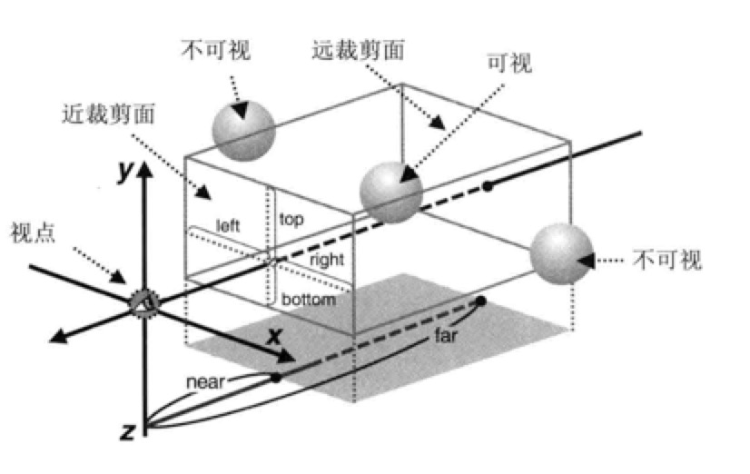
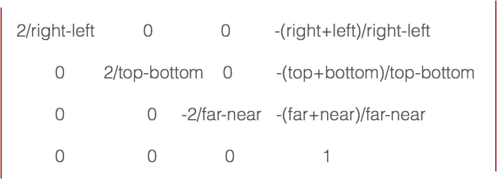
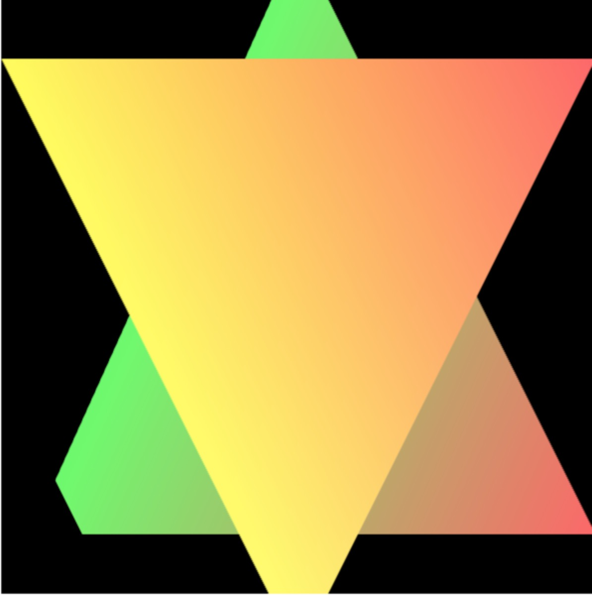
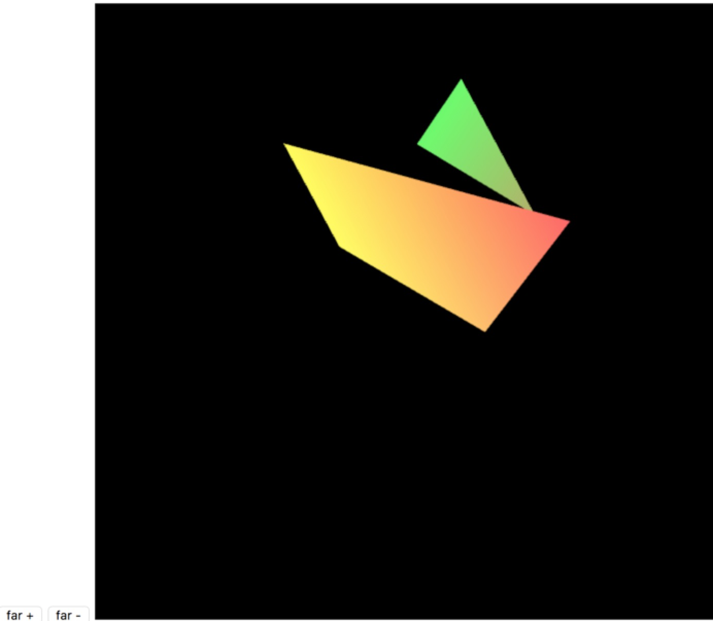
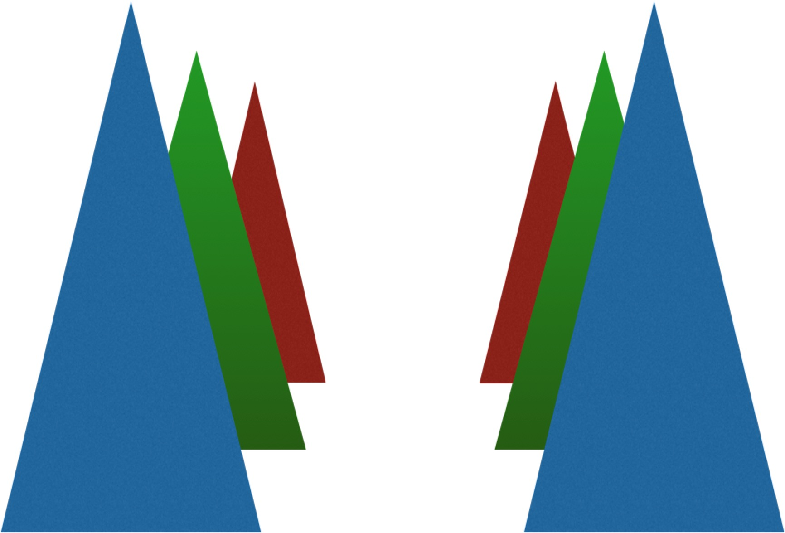
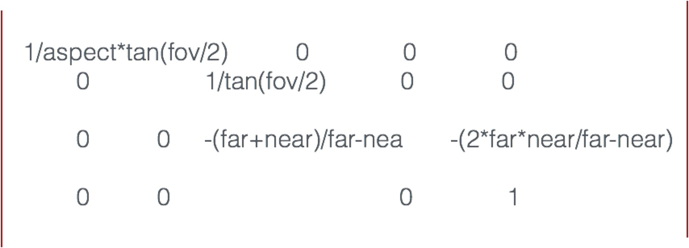
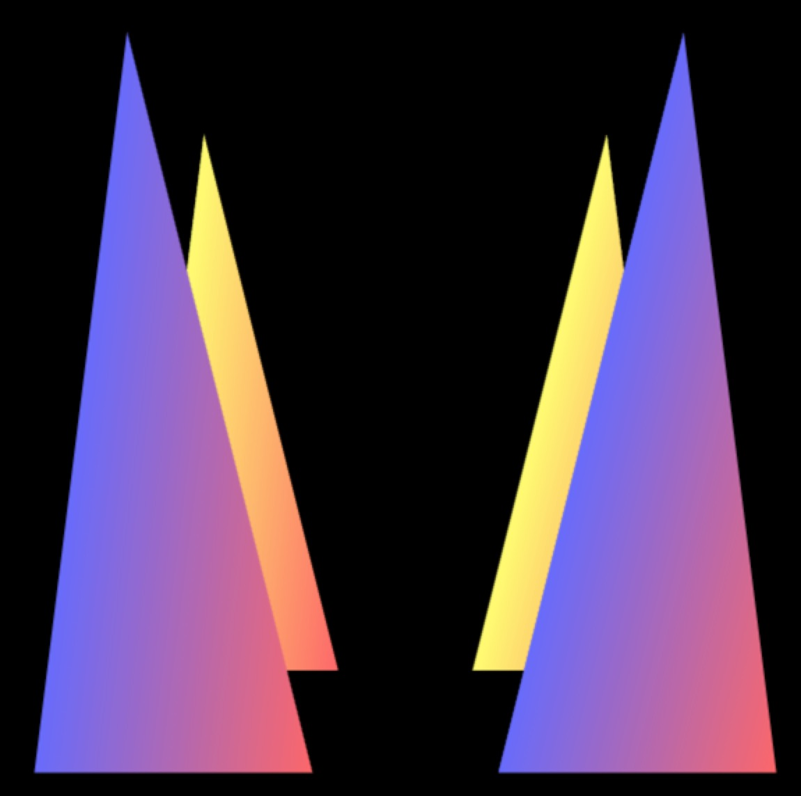
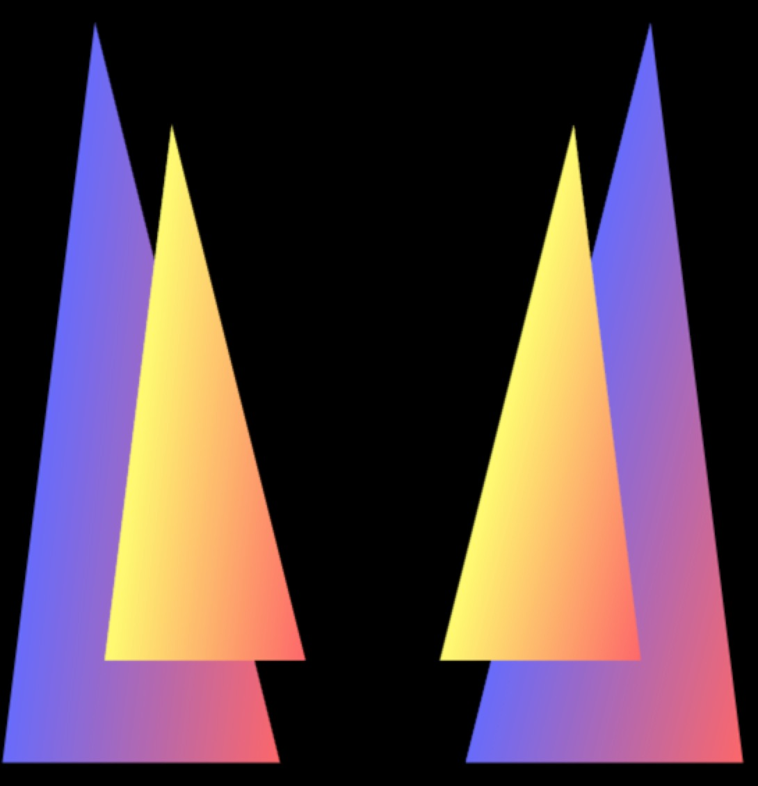

### 可视范围基础

#### 盒状空间

* 长方体可是空间，也叫盒状空间，是由正射投影产生。
* 可视锥体空间，由透视投影产生。

在透视投影下，产生的三维场景看上去更是有深度感，更加自然，因为我们平时观察真实世界用的也是透视投影。在大多数情况下，比如三维射击类游戏中，我们都应该采用透视投影。相比之下，正射投影的好处是用户可以方便的比较场景中物体的大小，这是因为物体看上去的大小与其所在的位置没有关系。在建筑平面图等技术绘图的相关场合，应当使用这种投影。

<!-- more -->

#### 盒状空间的工作原理

盒状可视空间的由前后两个矩形表面确定，分别称近裁剪面和远裁剪面，前者的四个顶点为（right,top,-near）,(-left,top,-near),(-left,-bottom,-near),(right,-bottom,-near),而后者的四个顶点为(right,top,far),(-left,top,far),(-left,-bottom,far),(right,-bottom,far).

<canvas>上显示的就是可视空间中物体在近裁剪面上的投。如果裁剪面的高宽比和<canvas>不一样，那么画面就会被按照<canvas>的高宽比进行压缩，物体会被扭曲。近裁剪面与远裁剪面之间的盒形空间就是可是空间，只有在此空间内的物体会被显示出来。如果某个物体一部分在可视空间内，一部分在其外，那就只显示可视空间内的部分。

### 正射投影矩阵

#### 函数

* setOrtho(left , right , bottom , top , near , far)
* left / right / bottom / top 参数含义：定位范围。
* near  参数含义：近裁切面。
* far  参数含义：远裁切面。

基本方程式如下：

写一个正射投影实例代码，核心代码如下：

编写顶点着色器和片元着色器代码，定义一个uniform矩阵变量。

var vertexShaderSource = `
    attribute vec4 pos;
    uniform mat4 u_mx;
    attribute vec4 a_Color;
    varying vec4 v_Color;

    void main(){
        gl_Position = u_mx * pos;
        v_Color = a_Color;
    }
`

var fragmentShaderSource = `
    precision lowp float;
    varying vec4 v_Color;
    void main(){
        gl_FragColor = v_Color;
    }
`  


定义一个正射矩阵的方法

function getOMX(left,right,bottom,top,near,far){

    return new Float32Array([
        2 / (right - left), 0, 0, 0,
        0, 2 / (top - bottom), 0, 0,
        0, 0, -2 / (far - near), 0,
        -(right + left) / (right - left),
        -(top + bottom) / (top - bottom),
        -(far + near) / (far - near),
        1
    ]);

}
var near = 0.0;
var far = .5;

var omx = getOMX(-.5,.5, -.5,.5, near , far);    


定义数据data类型化数组

var data = new Float32Array([
    0.0, 0.6, -.4, 0.4, 1.0, 0.4,
    -.45, -.4, -.51, .4, 1.0, .4,
    0.5, -.4, -.4, 1.0, .4, .4,

    .5, .4, -.2, 1.0, .4, .4,
    -.5, .4, -.2, 1.0, 1.0, .3,
    .0, -.6, -.2, 1.0, 1.0, .4
]);   


由于定义的far为.5,而data类型化数组数据一个三角形的坐标为-.51，实际效果会产生一个缺角，可以根据改变三角形的顶点来看不同的效果，最终效果如下图：

### 缺角的修补

* 将远裁面移到距离视点更远的地方。
* <正射投影矩阵> * <视图矩阵> * <顶点坐标>

代码效果如下：

### 透视投影

#### 基础

* 透视投影和正射投影基本一致，但存在一些参数差异。使得远处的物体看起来比较小，一般在游戏开发会用的比较多。
* 可视空间顶面和底面的夹角必须大于0。
* 指定近裁面的宽高比例。

后面的三角形会根据与视点的距离做相应的缩放，并且做相应的平移。

#### 透视投影矩阵

### 矩阵公式

通过一个示例来解释透视投影具体的效果。

定义着色器代码：


var vertexShaderSource = `
    attribute vec4 pos;
    uniform mat4 u_mx;
    attribute vec4 a_Color;
    varying vec4 v_Color;

    void main(){
        gl_Position = u_mx * pos;
        v_Color = a_Color;
    }
`

var fragmentShaderSource = `
    precision lowp float;
    varying vec4 v_Color;
    void main(){
        gl_FragColor = v_Color;
    }
`   


创建program代码：


var gl = canvas.getContext('webgl');

var program = initShader(gl,vertexShaderSource,fragmentShaderSource); 


定义创建透视投影矩阵函数方法：


/**
 * 创建透视投影矩阵
 * fov 指定垂直视角
 * aspect 宽度 ／ 高度
 * near  近裁切面
 * far  远裁切面
 */
function getTS(fov,aspect,near,far){
    fov = fov * Math.PI / 180; // 弧度
    return new Float32Array([
        1 / (aspect * Math.tan(fov / 2)), 0, 0, 0,
        0, 1 / Math.tan(fov / 2), 0, 0,
        0, 0, -(far + near) / (far - near), -1,
        0, 0, -2 * (far * near) / (far - near), 0
    ]);
}


创建ata，并且将data绑定到创建的buffer上：


// 四个三角形
var buffer_data = new Float32Array([

    0.75, 1.0, -.8, 1.0, 1.0, .4,
    .25, -1.0, -.8, 1.0, 1.0, .4,
    1.0, -1.0, -.8, 1.0, .4, .4,

    .75, 1.0, 0.8, .4, .4, 1.0,
    .25, -1.0, .8, .4, .4, 1.0,
    1.0, -1.0, .8, 1.0, .4, .4,

    // 第一个三角形
    -.75, 1.0, -.8, 1.0, 1.0, .4,
    -1.0, -1.0, -.8, 1.0, 1.0, 0.4,
    -0.25, -1.0, -.8, 1.0, .4, .4,

    -.75, 1.0, .8, .4, .4, 1.0,
    -1.0, -1.0, .8, .4, .4, 1.0,
    -.25, -1.0, .8, 1.0, .4, .4

]);

var buffer = gl.createBuffer();
gl.bindBuffer(gl.ARRAY_BUFFER, buffer);
gl.bufferData(gl.ARRAY_BUFFER, buffer_data, gl.STATIC_DRAW);


得到Location，并且给其赋值：


var posLocation = gl.getAttribLocation(program, 'pos');
var aColorLocation = gl.getAttribLocation(program, 'a_Color');
var uMXLocation = gl.getUniformLocation(program, 'u_mx');

var BYTES_SIZE = buffer_data.BYTES_PER_ELEMENT;

gl.vertexAttribPointer(posLocation, 3, gl.FLOAT, false, BYTES_SIZE * 6, 0);
gl.vertexAttribPointer(aColorLocation, 3, gl.FLOAT, false, BYTES_SIZE * 6, BYTES_SIZE * 3);
gl.enableVertexAttribArray(posLocation);
gl.enableVertexAttribArray(aColorLocation);


定义一个绘图函数方法，并且执行，其中getVMatrix和multiplyMatrix是lib库中的函数：


function draw() {

    gl.clearColor(0.0, 0.0, 0.0, 1.0);

    gl.clear(gl.COLOR_BUFFER_BIT);

    var mx = getTS(30, canvas.width / canvas.height, 1, 100);
    var vmx = getVMatrix(0,0,5,0,0,-100);
    gl.uniformMatrix4fv(uMXLocation,false,multiplyMatrix(mx,vmx));

    gl.drawArrays(gl.TRIANGLES, 0, 12);
}

draw();


最终运行结果如下：

#### 物体前后关系

* 默认情况下，WebGL 是按照顶点在缓冲区中的顺序绘制的。
* 后绘制的会遮挡先绘制的图形。

例如将上面的示例中的data数据顺序该下，就会出现以下的效果：


// 四个三角形
var buffer_data = new Float32Array([

    .75, 1.0, 0.8, .4, .4, 1.0,
    .25, -1.0, .8, .4, .4, 1.0,
    1.0, -1.0, .8, 1.0, .4, .4,

    0.75, 1.0, -.8, 1.0, 1.0, .4,
    .25, -1.0, -.8, 1.0, 1.0, .4,
    1.0, -1.0, -.8, 1.0, .4, .4,

    -.75, 1.0, .8, .4, .4, 1.0,
    -1.0, -1.0, .8, .4, .4, 1.0,
    -.25, -1.0, .8, 1.0, .4, .4,

    -.75, 1.0, -.8, 1.0, 1.0, .4,
    -1.0, -1.0, -.8, 1.0, 1.0, 0.4,
    -0.25, -1.0, -.8, 1.0, .4, .4,

]);


但是实际情况中，可能很多图像并不知道出现的顺序，webgl提供了两个方法来解决这类问题。

#### 解决方法

* 启动隐藏面消除
* 启动多边形偏移

核心代码如下：


gl.enable(gl.DEPTH_TEST);
gl.clear(gl.COLOR_BUFFER_BIT | gl.DEPTH_BUFFER_BIT);


这样做之后，离视点远的对象会在后面展示。

#### 深度冲突

隐藏面消除是WebGL的一项复杂而又强大的特效，在绝大多数情况下，它都能很好地完成任务。然而，当几何图形或物体的两个表面极为接近时，就会出现新的问题，使得表面看上去斑斑驳驳的，这种现象被称为深度冲突（Z fighting）

当所有的三角形一起绘画的时候，似乎不会出现这种情况，但是如果分开画三角形，可能会出现深度冲突的问题，通过以下代码可以解决：


gl.enable(gl.POLYGON_OFFSET_FILL);
gl.drawArrays(gl.TRIANGLES, 0, 3);
gl.polygonOffset(1.0, 1.0);   
gl.drawArrays(gl.TRIANGLES, 3, 3);


源码链接请访问 https://github.com/wqzwh/webgl-code/tree/master/11