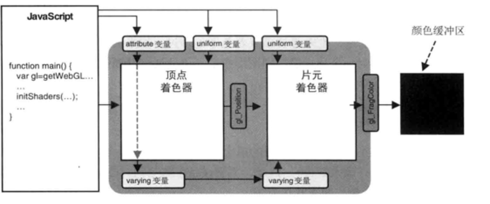

### 概述

* 运行在建立在OpenGL基础上，删除和简化了一部分形成的。
* 运行在小型设备
* 与 C 语言语法类似

#### 执行顺序

* 从main主方法
* void关键字
* void main(){...}，没有函数返回值

基本写法如下：
``` javascript
void main(){
   ...
}
```

<!-- more -->

#### 基本类型

* 数值类型
* 布尔值类型

``` javascript
bool a;
init b;
float c;
void main(){
   ...
}
```

#### 变量

* a-z , A-Z , 0-9 , _
* 首字母不能为数字
* 不能用关键字和保留字作变量名
* 不能以 gl_  , _webgl_ 开头


#### 基本运算符

* - * / +
* + -
* ++ —
* =
* += -= *= /=
* < > <= >=
* ==  != 
* !   &&  ||  ^^  三元运算

``` javascript
float a;
float b;

float c = a + b;
++a/a++

true ^^ true // false
false ^^ false // false
false ^^ true // true
```

### 复杂类型

#### 结构体

struct bright{
   vec4 color;
   vec3 position;
}

在赋值过程中必须按照保证类型一样，因为着色器语言是强类型。

``` javascript

struct user {
	float gezi;
	vec3 book;
}

user wq;
float a = 12.0;
vec3 b = vec3(1.2,3.3,5.0);
wq = user(a,b)
wq = user(12.0,vec3(2.1,3.3,5.0));

```

#### 数组

* 只支持一维数组
* 长度必须大于 0 的整型常量表达式
* 不可用 const 修饰数组
* float floatArr[4];

#### 取样器

* 通过取样器类型访问纹理
* sampler2D
* 只能是 uniform 变量
* 纹理单元编号，至少支持8个单元变量

### 程序流程控制

#### 判断语句

if (条件表达式1){
 如果条件语句为 true，执行这里。
}else if(条件表达式1){
 如果条件语句1为 false，并且条件语句2为 true，执行这里。
}else{
   如果条件语句1和2都为 false ， 执行这里。
}

``` javascript

varying vec4 vpos;

if(vpos.x >= 0.0 && vpos.y >= 0.0){
	gl_FragColor = vec4(1.0,0.0,0.0,1.0); //红色
}else if(vpos.x >= 0.0 && vpos.y < 0.0){
	gl_FragColor = vec4(0.0,1.0,0.0,1.0); //绿色
}else if(vpos.x < 0.0 && vpos.y >= 0.0){
	gl_FragColor = vec4(0.0,0.0,1.0,1.0); //蓝色
}else{
	gl_FragColor = vec4(1.0,1.0,0.0,1.0); //黄色
}

```

#### 循环语句

for ( 初始化表达式 ; 条件表达式 ; 循环步进表达式 ) {
 反复执行这里
}

``` javascript

init sum = 0;
for(init i = 0; i<10;i++){
	sum += 1;
}
// sum = 10;

float sum = 0.0;
for(init i = 0; i<10;i++){
	sum += float(i);
}
```

### 函数

#### 格式

返回类型函数名 (type0 arg0 , type1 arg1 , …) {
   函数运算
   return  返回值;
}
``` javascript

init sum(int a,int b){
	return a + b;
}
```

#### 声明

* float bright();  // 必须提前声明
* void main(){ bright(); }
* float bright(){ … }   

#### 内置函数

* 三角函数
* 指数函数
* 通用函数
* 几何函数
* 矩阵函数
* 矢量函数
* 纹理查询函数

``` javascript

//三角函数
radians(float d);
radians(vec2 d);
radians(vec3 d);
radians(vec4 d);

degrees(float d);
degrees(vec2 d);
degrees(vec3 d);
degrees(vec4 d);

// cos tan ...
sin(float d);
sin(vec2 d);
sin(vec3 d);
sin(vec4 d);

// 指数函数

pow(float x,float y)
pow(vec2 x,vec2 y)
pow(vec3 x,vec3 y)
pow(vec4 x,vec4 y)

// 通用函数

abc(float x);
abc(vec2 x);
abc(vec3 x);
abc(vec4 x);

floor(float x);
floor(vec2 x);
floor(vec3 x);
floor(vec4 x);

max(float x,float y);

// 几何函数
// 返回x轴的长度
length(float x) // vec2 ,vec3, vec4
...
```


### 限定字

####  存储限定字



* const 不可变的量
* attribute 顶点着色器中使用
* uniform 只读，必须是全局变量。
* varying 顶点和片元着色器通信使用的，顶点着色器中赋给varying变量的值并不是直接传给了片元着色器的varying变量，这其中发生了光删化的过程，根据绘制的图形，对前者进行内插，然后再传递给后者。

#### 精度限定字

* highp   最高精度
* mediump   中等精度
* lowp   低精度
* precision lowp float； //  定义精度

