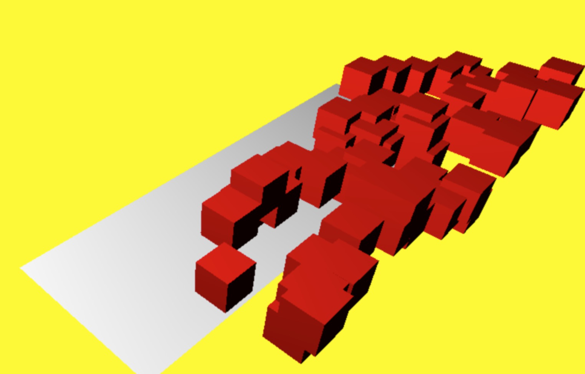
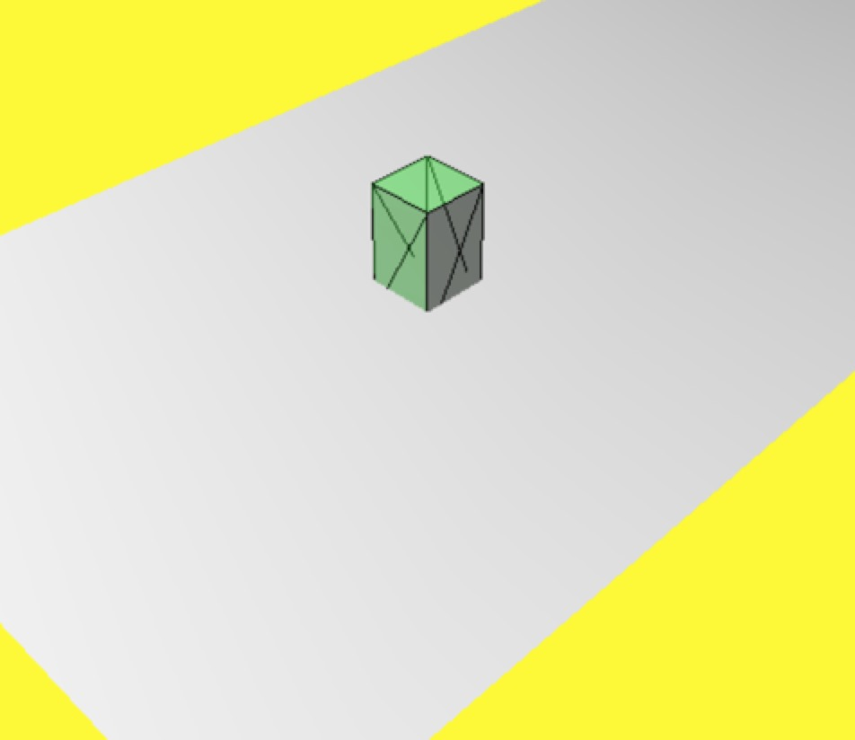
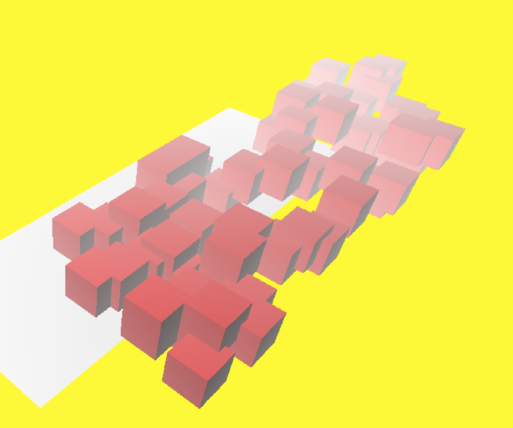
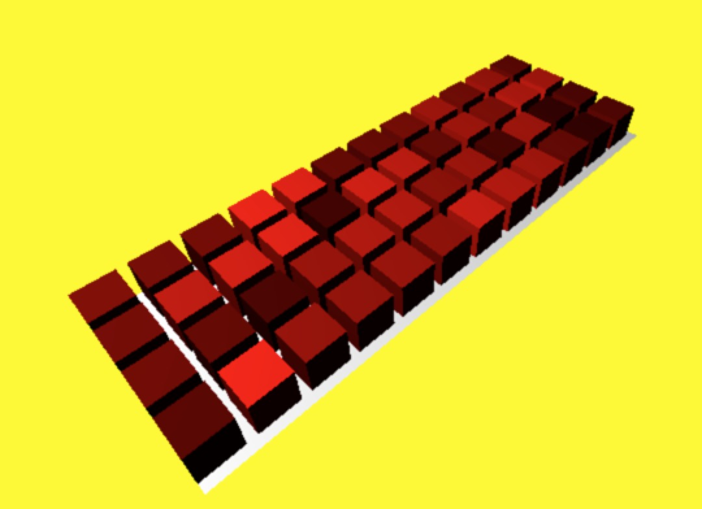

### 场景

#### 必备组件

* 相机：决定哪些东西将被显示在屏幕上。
* 光源：生成阴影与改变物体表面显示效果。
* 物体：相机透视图里主要的渲染对象。

#### 基本功能

* scene.add()  在场景中添加物体。
* scene.remove()  从场景中移除物体。
* scene.getChildByName()  获得场景中所有对象的列表。

#### 属性

* fog  通过该属性可以设置场景的雾化效果。
* overrideMaterial  通过这个属性可以让场景中的所有物体都使用相同材质。
* children 返回所有对象的列表，包括相机和光源对象。

<!-- more -->

创建场景，相机，绘制函数等对象，设置画布背景，开启阴影模式：

``` javascript
// 创建场景
var scene = new THREE.Scene();

// 创建相机
var camera = new THREE.PerspectiveCamera(60, window.innerWidth / window.innerHeight, .1, 1000);

// 创建渲染器
var renderer = new THREE.WebGLRenderer();

renderer.setClearColor(new THREE.Color(0xEEEEEE, 1.0));

renderer.setSize(window.innerWidth, window.innerHeight);

// 开启阴影效果
renderer.shadowMapEnabled = true;
```

创建一个舞台，承载绘制的物体，并且将舞台加载到场景中：

``` javascript
// 顶点着色器
var planeGeometry = new THREE.PlaneGeometry(60, 20, 1, 1);

// 材质
var planeMaterial = new THREE.MeshLambertMaterial({ color: 0xffffff });
var plane = new THREE.Mesh(planeGeometry, planeMaterial);

plane.receiveShadow = true;

plane.rotation.x = -.5 * Math.PI;
plane.position.x = 16;
plane.position.y = 0;
plane.position.z = 0;

scene.add(plane);
```

定义一个相机的位置
``` javascript
camera.position.x = -30;
camera.position.y = 40;
camera.position.z = 30;
camera.lookAt(scene.position);
```

添加环境光和电光源：

``` javascript
// 创建环境光源
var ambientLight = new THREE.AmbientLight(0x0c0c0c);
scene.add(ambientLight);

var spotLight = new THREE.SpotLight(0xffffff);
spotLight.position.set(-40, 60, -10);
spotLight.castShadow = true;
scene.add(spotLight);
```

创建节点，并且渲染场景：

``` javascript
document.body.appendChild(renderer.domElement);

renderer.render(scene, camera);
```

创建添加立方体的方法：

``` javascript
function addCube() {

  // 创建立方体
  var cubeGeometry = new THREE.BoxGeometry(4, 4, 4);
  var cubeMaterial = new THREE.MeshLambertMaterial({ color: 0xff0000 });
  var cube = new THREE.Mesh(cubeGeometry, cubeMaterial);

  // cube.castShadow = true;

  cube.position.x = -4 + Math.round(Math.random() * planeGeometry.parameters.width);
  cube.position.y = 3 + Math.round(Math.random() * 5);
  cube.position.z = 0 + Math.round(Math.random() * planeGeometry.parameters.height);

  scene.add(cube);
}
```

最终效果如下图：



### 几何与网络对象

#### 几何对象的属性和函数

* THREE.Geometry 是所有几何对象的基类（ 我们简称 geom ）。
* geom.vertices 表示几何体的顶点，是一个数组。
* geom.faces 表示几何体的侧面。

#### 网格对象的属性和函数

* position 决定该对象相对于父对象的位置。
* rotation 设置对象绕任何一个轴的旋转弧度。
* scale 沿 x , y和 z 轴缩放对象。
* translateX x 轴平移。
* translateY y 轴平移。
* translateZ z 轴平移。

通过顶点和面来创建一个几何体，，创建场景、相机、渲染器等基本组件和之前保持一致，核心代码如下：

``` javascript
// 绘制顶点

var vertices = [
  new THREE.Vector3(1, 3, 1),
  new THREE.Vector3(1, 3, -1),
  new THREE.Vector3(1, -1, 1),
  new THREE.Vector3(1, -1, -1),
  new THREE.Vector3(-1, 3, -1),
  new THREE.Vector3(-1, 3, 1),
  new THREE.Vector3(-1, -1, -1),
  new THREE.Vector3(-1, -1, 1)
];

// 绘制面

var faces = [

  new THREE.Face3(0, 2, 1),
  new THREE.Face3(2, 3, 1),

  new THREE.Face3(4, 6, 5),
  new THREE.Face3(6, 7, 5),

  new THREE.Face3(4, 5, 1),
  new THREE.Face3(5, 0, 1),

  new THREE.Face3(7, 6, 2),
  new THREE.Face3(6, 3, 2),

  new THREE.Face3(5, 7, 0),
  new THREE.Face3(7, 2, 0),

  new THREE.Face3(1, 3, 4),
  new THREE.Face3(3, 6, 4)
];

var geom = new THREE.Geometry();
geom.vertices = vertices;
geom.faces = faces;
geom.computeFaceNormals();

var materials = [
  new THREE.MeshLambertMaterial({
    opacity: 0.5,
    color: 0x44ff44,
    transparent: true
  }),
  new THREE.MeshBasicMaterial({ color: 0x000000, wireframe: true })
];

var mesh = THREE.SceneUtils.createMultiMaterialObject(geom, materials);
mesh.children.forEach(function(e) {
  e.castShadow = true;
});
scene.add(mesh);

document.body.appendChild(renderer.domElement);
renderer.render(scene, camera);
```

最终效果如下图：



### 相机

#### 透视相机（PerspectiveCamera）

* fov 视野宽度 。
* aspect  长宽比，推荐使用 window.innerWidth / window.innerHeight 。
* near 近裁面，推荐值 0.1 。
* far 远裁面，推荐值 1000 ， 值太大会影响性能，值太小场景显示不全。

#### 正射投影相机（OrthographicCamera）

* left 左边界。
* right 右边界。
* top 上边界。
* bottom 下边界。
* near 近裁面。
* far 远裁面。
* camera.lookAt  设置目标点。

增加雾化效果的核心代码：

``` javascript

// 增加雾化处理
scene.fog = new THREE.Fog( 0xffffff, .005, 100 );

```

最终结果如下图：



示例代码来区分透视投影和正射投影的区别：

``` javascript
var cubeGeometry = new THREE.BoxGeometry(4, 4, 4);
for (var j = 0; j < planeGeometry.parameters.height / 5; j++) {
  for (var i = 0; i < planeGeometry.parameters.width / 5; i++) {
    var rnd = Math.random() * 0.75 + 0.25;
    var cubeMaterial = new THREE.MeshLambertMaterial();
    cubeMaterial.color = new THREE.Color(rnd, 0, 0);
    var cube = new THREE.Mesh(cubeGeometry, cubeMaterial);
    cube.position.z = -(planeGeometry.parameters.height / 2) + 2 + (j * 5);
    cube.position.x = -(planeGeometry.parameters.width / 2) + 2 + (i * 5);
    cube.position.y = 2;
    scene.add(cube);
  }
}

// 定义相机切换的方法

var controls = new function() {
  this.perspective = 'Perspective';
  this.switchCamera = function() {
    if (camera instanceof THREE.PerspectiveCamera) {
      camera = new THREE.OrthographicCamera(
        window.innerWidth / -16,
        window.innerWidth / 16,
        window.innerHeight / 16,
        window.innerHeight / -16, -200, 500
      );
      camera.position.x = -20;
      camera.position.y = 60;
      camera.position.z = 50;
      camera.lookAt(scene.position);
      this.perspective = 'Orthographic';
    } else {
      this.perspective = 'Perspective';
      camera = new THREE.PerspectiveCamera(45, window.innerWidth / window.innerHeight, 0.1, 1000);
      camera.position.x = -20;
      camera.position.y = 60;
      camera.position.z = 50;
      camera.lookAt(scene.position);
    }
  }
};

setInterval(function(){controls.switchCamera();},2000)

function render() {
  renderer.render(scene, camera);
}

render();
```

最终效果如下图：



源码链接请访问 https://github.com/wqzwh/webgl-code/tree/master/13