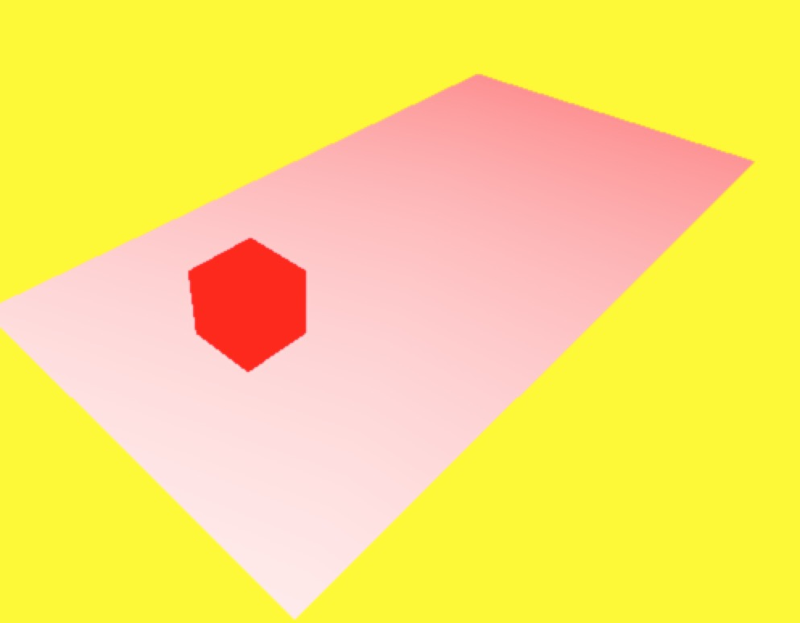
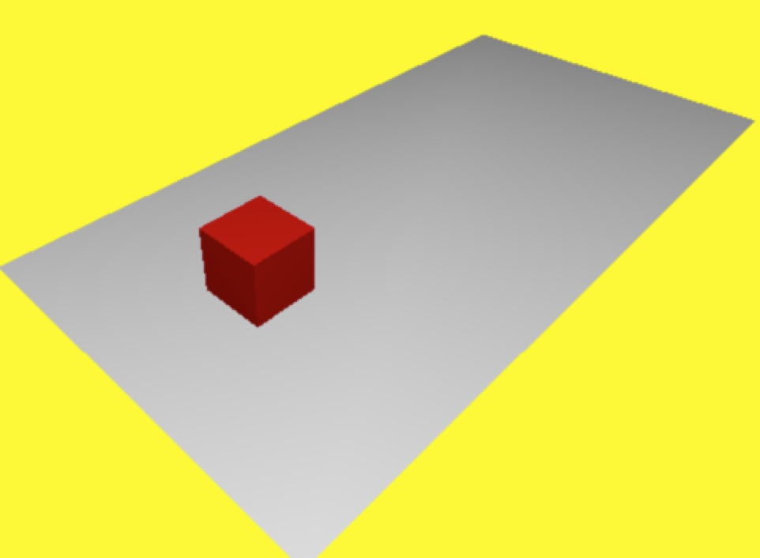
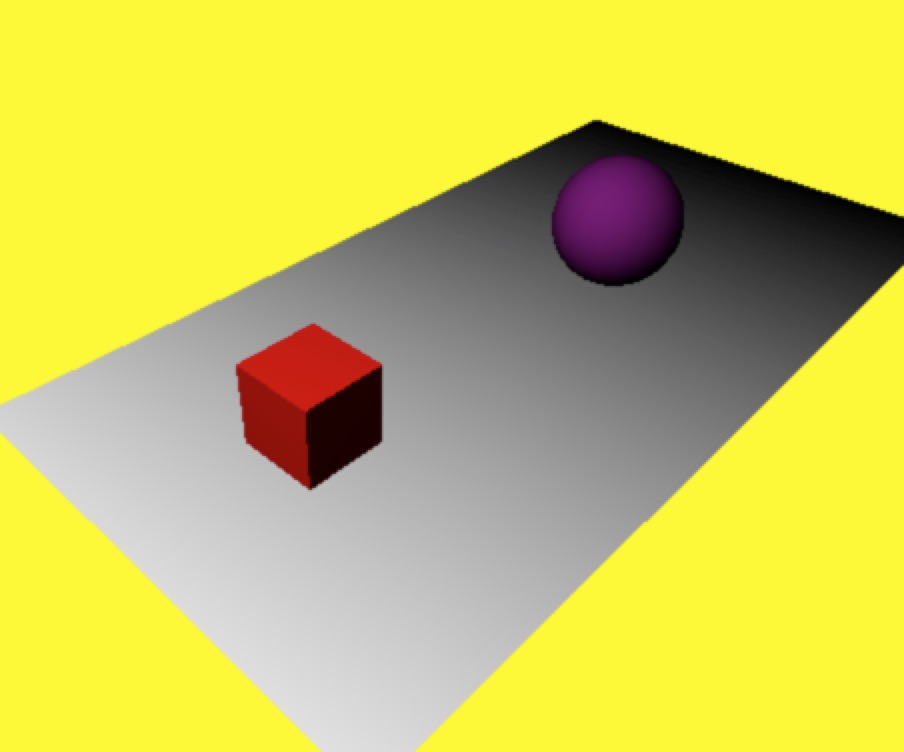
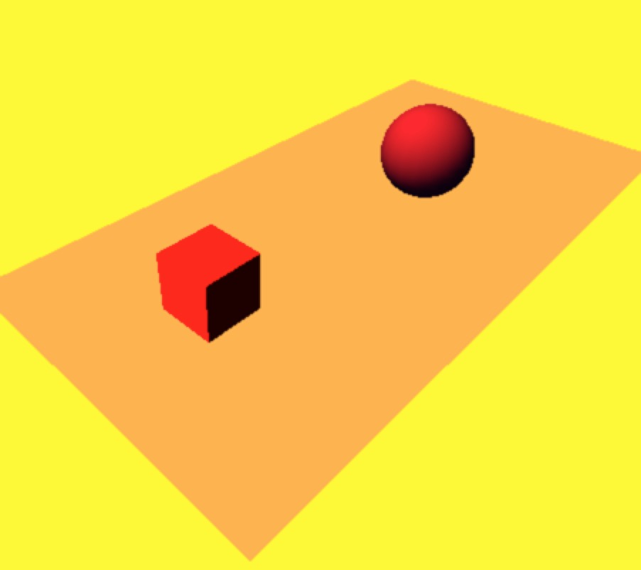

### 概述

#### 光源分类

* AmbientLight 环境光源 
* PointLight 点光源
* SpotLight 聚光灯光源
* DirectionalLight 方向光
* HemisphereLight 半球光
* AreaLight 面光源
* LensFlare 镜头眩光

<!-- more -->

### 影响整个场景的光源

* 影响整个场景的光源，也叫 AmbientLight 环境光。
* 没有特定来源，不会影响阴影的产生。
* 不能将环境光作为场景中唯一的光源。

#### three.color 函数

* add(color)  添加到当前颜色上。
* clone() 复制当前颜色。

示例核心代码如下：


// 加入环境光
shareObj.scene.add(new THREE.AmbientLight('#f00'))


最终效果如下图，环境光会作用在所有的几何图形上：

### 照射所有方向的光源

* 照射所有方向的光源，也叫 PointLight 点光源。
* 点光源是单点发光方式。
* 点光源不会产生阴影，是为了减少 GPU 的负担。

#### 属性

* color 光源颜色。
* intensity 光照强度。
* distance 光源照射的距离。
* position 光源所在的位置。

示例核心代码如下：


// 加入点光源

var pointLight = new THREE.PointLight(0xffffff);
pointLight.position.set(-40,60,10);

shareObj.scene.add(pointLight);

document.body.appendChild(shareObj.renderer.domElement);

render();

function render(){
  requestAnimationFrame(render);
  pointLight.position.z += 0.2;
  shareObj.renderer.render(shareObj.scene,shareObj.camera);

}


最终效果如下图，点光源离物体越来越远：

### 锥形效果光源

* 具有锥形效果的光源，也叫做 SpotLight 。
* 最常用到的光源，它可以产生阴影。
* 锥形效果，类似电筒光照效果。

#### 属性

* castShadow 如果设置为 true ， 这个光源就会生成阴影。
* target 决定光照的方向。
* angle 光照的角度。

示例核心代码如下：


var spotLight = new THREE.SpotLight(0xffffff);
spotLight.position.set(-40, 60, 10);
spotLight.castShadow = true;

spotLight.target = cube;
spotLight.angle = Math.PI / 10;

shareObj.scene.add(spotLight);

document.body.appendChild(shareObj.renderer.domElement);

var angleNUM = 3;

document.onkeydown = function(event) {
  console.log(event.keyCode);
  switch (event.keyCode) {
    case 38:
      angleNUM += 1;
      break;
    case 40:
      angleNUM -= 1;
      if (angleNUM < 1) {
        angleNUM = 1;
      }
      break;

    case 37:
      spotLight.position.x += 0.2;
      break;
    case 39:
      spotLight.position.x -= 0.2;

      break;
  }
};

function render() {

  spotLight.angle = Math.PI / angleNUM;
  requestAnimationFrame(render);

  shareObj.renderer.render(shareObj.scene, shareObj.camera);

}
render();


最终效果如下图：

### 太阳的光源

* 模拟远处太阳的光源，也叫做 DirectinalLight 方向光。
* 方向光是一种平行光。

#### 属性

* 它和平行光源的属性一样，常用的属性castShadow、target 和 angle 。
* 不常用的属性有 shadowCameraVisible 、shadowDarkness、shadowMapWidth 和 shadowMapHeight 等，这些属性很少会被用到。

示例核心代码如下：


var ambiLight = new THREE.AmbientLight('#1c1c1c');
shareObj.scene.add(ambiLight);

var target = new THREE.Object3D();
target.position.set(5, 0, 0);

var directionalLight = new THREE.DirectionalLight('#ff5818');
directionalLight.position.set(-40, 60, -11);
directionalLight.castShadow = true;

directionalLight.shadowCameraFar = 200;
directionalLight.shadowCameraNear = 3;

directionalLight.intensity = 0.5;

directionalLight.shadowMapWidth = 1000;
directionalLight.shadowMapHeight = 2000;
directionalLight.target = target;

document.body.appendChild(shareObj.renderer.domElement);
shareObj.scene.add(directionalLight);

document.onkeydown = function(event) {
  switch (event.keyCode) {
    case 37:
      directionalLight.intensity += .1;
      break;
    case 39:
      directionalLight.intensity -= .1;
      if (directionalLight.intensity > 0) {
        directionalLight.intensity = .1;
      }

      break;
  }
};

render();

function render() {
  shareObj.renderer.render(shareObj.scene, shareObj.camera);
  requestAnimationFrame(render);
}



最终效果如下图：

源码链接请访问 https://github.com/wqzwh/webgl-code/tree/master/14