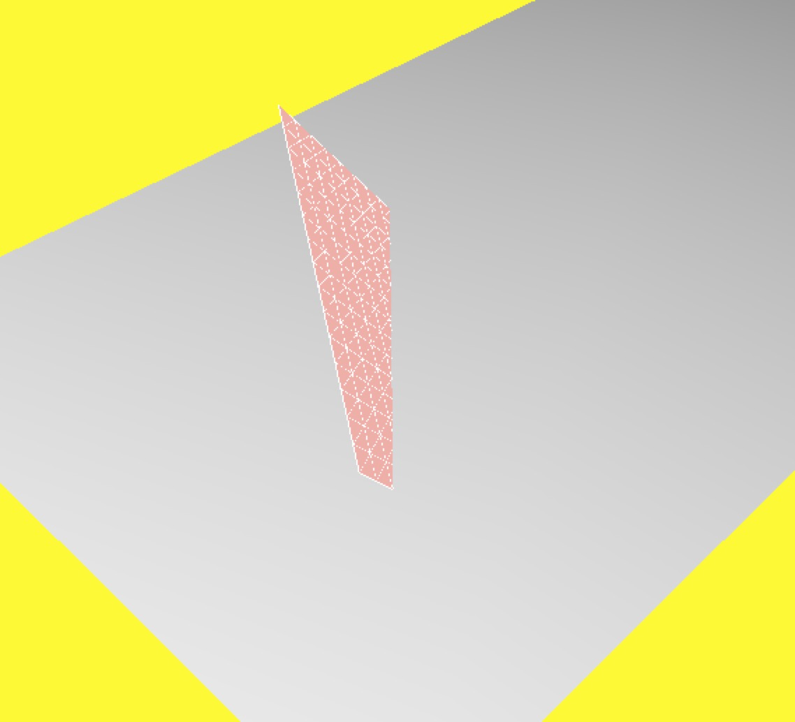
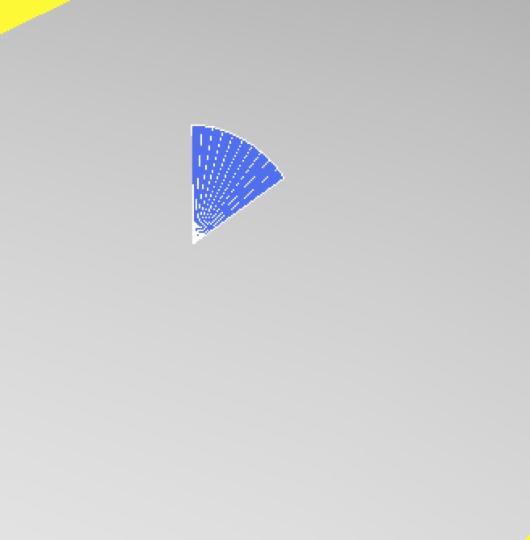
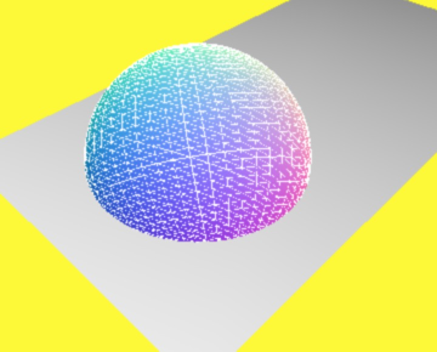
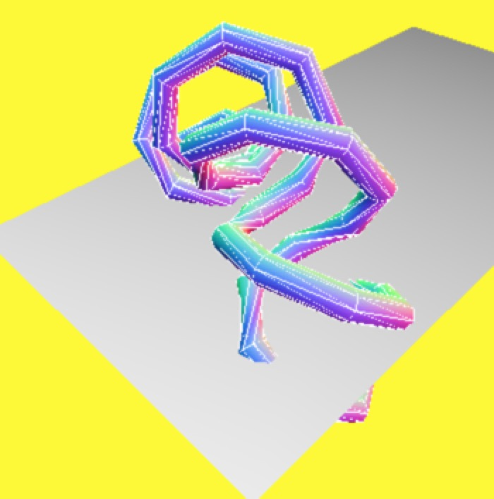
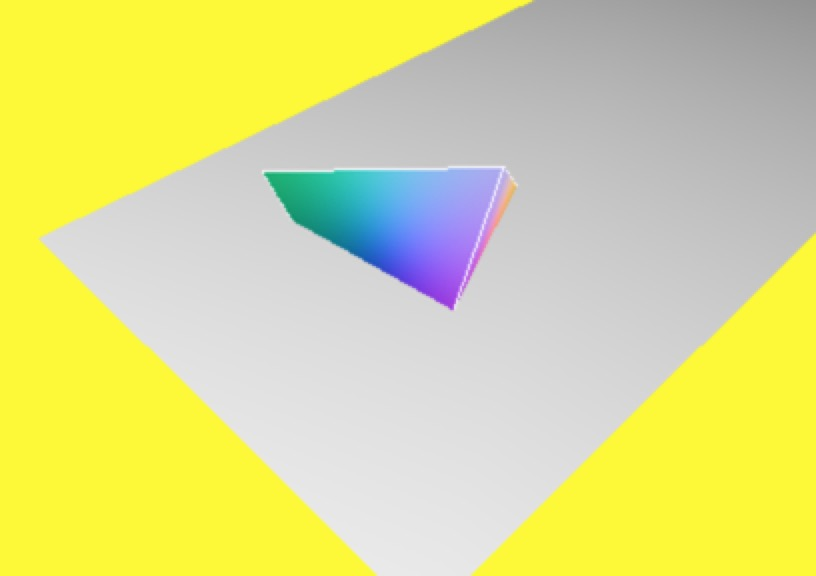
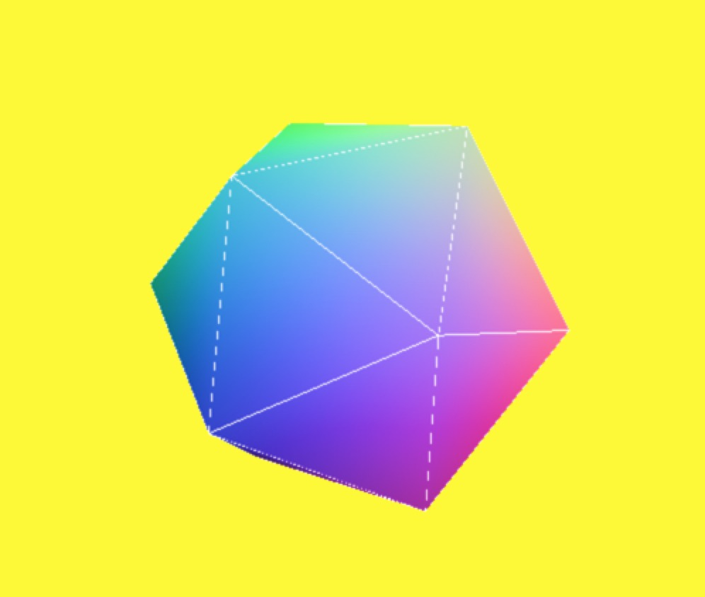

### 二位几何体

#### 二维矩形的属性 PlaneGeometry

* width 宽度
* height 高度
* wSegments 宽度段数
* hSegments 高度段数

完整示例代码如下：

<!-- more -->


var shareObj = share();

shareObj.camera.position.set(-25, 30, 25);

shareObj.camera.lookAt(shareObj.scene.position);

// 创建网格对象的方法
function createMesh(geom) {
  var meshMaterial = new THREE.MeshNormalMaterial();
  var wireFrameMaterial = new THREE.MeshBasicMaterial();
  wireFrameMaterial.wireframe = true;
  return THREE.SceneUtils.createMultiMaterialObject(geom, [meshMaterial, wireFrameMaterial]);
}
var plane = createMesh(new THREE.PlaneGeometry(12, 15, 10, 15));
shareObj.scene.add(plane);

var spotLight = new THREE.SpotLight(0xffffff);
spotLight.position.set(-40, 60, 10);
spotLight.castShadow = true;

shareObj.scene.add(spotLight);

document.body.appendChild(shareObj.renderer.domElement);

render();

function render() {
  plane.rotation.x += 0.01;
  plane.rotation.z += 0.01;
  plane.rotation.y += 0.01;
  requestAnimationFrame(render);
  shareObj.renderer.render(shareObj.scene, shareObj.camera);

}


最终效果如下图：

#### 二维圆的属性 CircleGeometry

* radius 圆半径
* segments 所用面的数量
* start 画圆起始位置
* length 定义圆要画多大

完整示例代码如下：


var shareObj = share();

shareObj.camera.position.set(-25, 30, 25);

shareObj.camera.lookAt(shareObj.scene.position);

// 创建网格对象的方法
function createMesh(geom) {
  var meshMaterial = new THREE.MeshNormalMaterial();
  var wireFrameMaterial = new THREE.MeshBasicMaterial();
  wireFrameMaterial.wireframe = true;
  return THREE.SceneUtils.createMultiMaterialObject(geom, [meshMaterial, wireFrameMaterial]);
}
var circle = createMesh(new THREE.CircleGeometry(4,10,0.3 * Math.PI, 0.3 * Math.PI));
shareObj.scene.add(circle);

var spotLight = new THREE.SpotLight(0xffffff);
spotLight.position.set(-40, 60, 10);
spotLight.castShadow = true;

shareObj.scene.add(spotLight);

document.body.appendChild(shareObj.renderer.domElement);

render();

function render() {
  circle.rotation.x += 0.01;
  circle.rotation.z += 0.01;
  circle.rotation.y += 0.01;
  requestAnimationFrame(render);
  shareObj.renderer.render(shareObj.scene, shareObj.camera);

}


最终效果如下图：

### 球面几何体

#### 三维球体的属性 SphereGeometry

* radius 球体的半径
* widthSegments 垂直方向上的分段数
* heightSegments 水平方向上的分段数
* phistart 定义 x 轴的绘制位置
* thetaStart 定义 y 轴的绘制位置
* theLength 定义绘制多大

完整示例代码如下：


var shareObj = share();
shareObj.camera.position.set(-25, 30, 25);

shareObj.camera.lookAt(shareObj.scene.position);

// 创建网格对象的方法
function createMesh(geom) {
  var meshMaterial = new THREE.MeshNormalMaterial();
  var wireFrameMaterial = new THREE.MeshBasicMaterial();
  wireFrameMaterial.wireframe = true;
  return THREE.SceneUtils.createMultiMaterialObject(geom, [meshMaterial, wireFrameMaterial]);
}

// 定义一个球面体
var sphere = createMesh(new THREE.SphereGeometry(10,50,50,0,2 * Math.PI));
shareObj.scene.add(sphere);

var spotLight = new THREE.SpotLight(0xffffff);
spotLight.position.set(-40, 60, 10);
spotLight.castShadow = true;

shareObj.scene.add(spotLight);

document.body.appendChild(shareObj.renderer.domElement);

render();

function render() {
  sphere.rotation.x += 0.01;
  sphere.rotation.z += 0.01;
  sphere.rotation.y += 0.01;
  requestAnimationFrame(render);
  shareObj.renderer.render(shareObj.scene, shareObj.camera);

}


最终效果如下图：

#### 圆柱体的属性 CylinderGeometry

* radiusTop 顶部尺寸
* radiusBottom 底部尺寸
* height 高度
* segmentsX 指定 x 轴分段数
* segmentsY 指定 y 轴分段数
* segmentsZ 指定 z 轴分段数
* openEnded 指定网格顶部和底部是否封闭

####  TorusGeometry 的属性

* radius 圆环的尺寸
* tube 半径
* radialSegments 长度分段数
* tubularSegments 宽度分段数
* arc 控制绘制的长度

#### 环面纽结的属性 TorusKnotGeometry

* radius 圆环的尺寸
* tube 半径
* radialSegments 长度分段数
* tubularSegments 宽度分段数
* detail 为环面增加额外细节

完整示例代码如下：


var shareObj = share();

shareObj.camera.position.set(-25, 30, 25);

shareObj.camera.lookAt(shareObj.scene.position);

// 创建网格对象的方法
function createMesh(geom) {
  var meshMaterial = new THREE.MeshNormalMaterial();
  var wireFrameMaterial = new THREE.MeshBasicMaterial();
  wireFrameMaterial.wireframe = true;
  return THREE.SceneUtils.createMultiMaterialObject(geom, [meshMaterial, wireFrameMaterial]);
}

var mesh;
var sphere = createMesh(new THREE.SphereGeometry(10,50,50,0, 2 * Math.PI));
var cylinder = createMesh(new THREE.CylinderGeometry(20,20,20,20,100))
var torus = createMesh(new THREE.TorusGeometry(10,2,20,10,Math.PI * 2));
var knot = createMesh(new THREE.TorusKnotGeometry(10,1,64,8,2,9,1))

mesh = sphere;

$('#sphere').click(function(){
    shareObj.scene.remove(mesh);
    mesh = sphere;
    shareObj.scene.add(mesh);

});

$('#cylinder').click(function(){
    shareObj.scene.remove(mesh);

    mesh = cylinder;
    shareObj.scene.add(mesh);

});

$('#torus').click(function(){
    shareObj.scene.remove(mesh);

    mesh = torus;
    shareObj.scene.add(mesh);

});

$('#knot').click(function(){
    shareObj.scene.remove(mesh);

    mesh = knot;
    shareObj.scene.add(mesh);

});

shareObj.scene.add(mesh);

var spotLight = new THREE.SpotLight(0xffffff);
spotLight.position.set(-40, 60, 10);
spotLight.castShadow = true;

shareObj.scene.add(spotLight);

$("#webgl-scene").append(shareObj.renderer.domElement)

render();

function render() {
  sphere.rotation.y += 0.01;

  cylinder.rotation.y += 0.01;

  torus.rotation.y += 0.01;

  knot.rotation.y += 0.01;

  requestAnimationFrame(render);
  shareObj.renderer.render(shareObj.scene, shareObj.camera);

}


通过按钮切换不同的形状，最终效果如下图：

### 多面几何体

#### 多面体的属性 PolyhedronGeometry

* vertices 多面体的顶点
* faces 多面体的面
* radius 多面体的大小
* detail 为多面体添加额外细节

完整示例代码如下：


var shareObj = share();

shareObj.camera.position.set(-25, 30, 25);

shareObj.camera.lookAt(shareObj.scene.position);

// 创建网格对象的方法
function createMesh(geom) {
  var meshMaterial = new THREE.MeshNormalMaterial();
  var wireFrameMaterial = new THREE.MeshBasicMaterial();
  wireFrameMaterial.wireframe = true;
  return THREE.SceneUtils.createMultiMaterialObject(geom, [meshMaterial, wireFrameMaterial]);
}

var vertices = [
    1, 1, 1,
    -1, -1, 1,
    -1, 1, -1,
    1, -1, -1
];

var faces = [
    2, 1, 0,
    0, 3, 2,
    1, 3, 0,
    2, 3, 1
];

// 定义一个球面体
var polyhedron = createMesh(new THREE.PolyhedronGeometry(vertices,faces,10));
shareObj.scene.add(polyhedron);

var spotLight = new THREE.SpotLight(0xffffff);
spotLight.position.set(-40, 60, 10);
spotLight.castShadow = true;

shareObj.scene.add(spotLight);

document.body.appendChild(shareObj.renderer.domElement);

render();

function render() {
  polyhedron.rotation.x += 0.01;
  polyhedron.rotation.z += 0.01;
  polyhedron.rotation.y += 0.01;
  requestAnimationFrame(render);
  shareObj.renderer.render(shareObj.scene, shareObj.camera);

}


通过按钮切换不同的形状，最终效果如下图：

#### 其他多面体

* IcosahedronGeometry 正二十面体
* TetrahedronGeometry 正四面体
* Octahedron 正八面体

完整示例代码如下：


var shareObj = share(false);

shareObj.camera.position.set(-25, 30, 25);

shareObj.camera.lookAt(shareObj.scene.position);

// 创建网格对象的方法
function createMesh(geom) {
  var meshMaterial = new THREE.MeshNormalMaterial();
  var wireFrameMaterial = new THREE.MeshBasicMaterial();
  wireFrameMaterial.wireframe = true;
  return THREE.SceneUtils.createMultiMaterialObject(geom, [meshMaterial, wireFrameMaterial]);
}

var mesh = null;
var size = 10;
var z20 = createMesh(new THREE.IcosahedronGeometry(size));
var z4 = createMesh(new THREE.TetrahedronGeometry(size));
var z8 = createMesh(new THREE.OctahedronGeometry(size));
mesh = z20;

$("#z4").click(function(e){
    shareObj.scene.remove(mesh);
    mesh = z4;
    shareObj.scene.add(mesh);
})

$("#z8").click(function(e){
    shareObj.scene.remove(mesh);
    mesh = z8;
    shareObj.scene.add(mesh);
})

$("#z20").click(function(e){
    shareObj.scene.remove(mesh);
    mesh = z20;
    shareObj.scene.add(mesh);
})
shareObj.scene.add(mesh);

var spotLight = new THREE.SpotLight(0xffffff);
spotLight.position.set(-40, 60, 10);
spotLight.castShadow = true;

shareObj.scene.add(spotLight);

$("#webgl-scene").append(shareObj.renderer.domElement);

render();

function render() {

  z4.rotation.y += 0.01;
  z8.rotation.y += 0.01;
  z20.rotation.y += 0.01;
  requestAnimationFrame(render);
  shareObj.renderer.render(shareObj.scene, shareObj.camera);

}



通过按钮切换不同的形状，最终效果如下图：

源码链接请访问 https://github.com/wqzwh/webgl-code/tree/master/16
