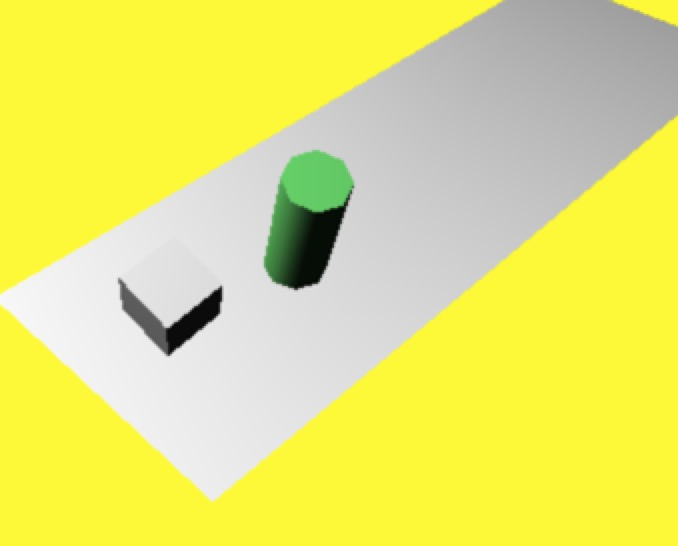
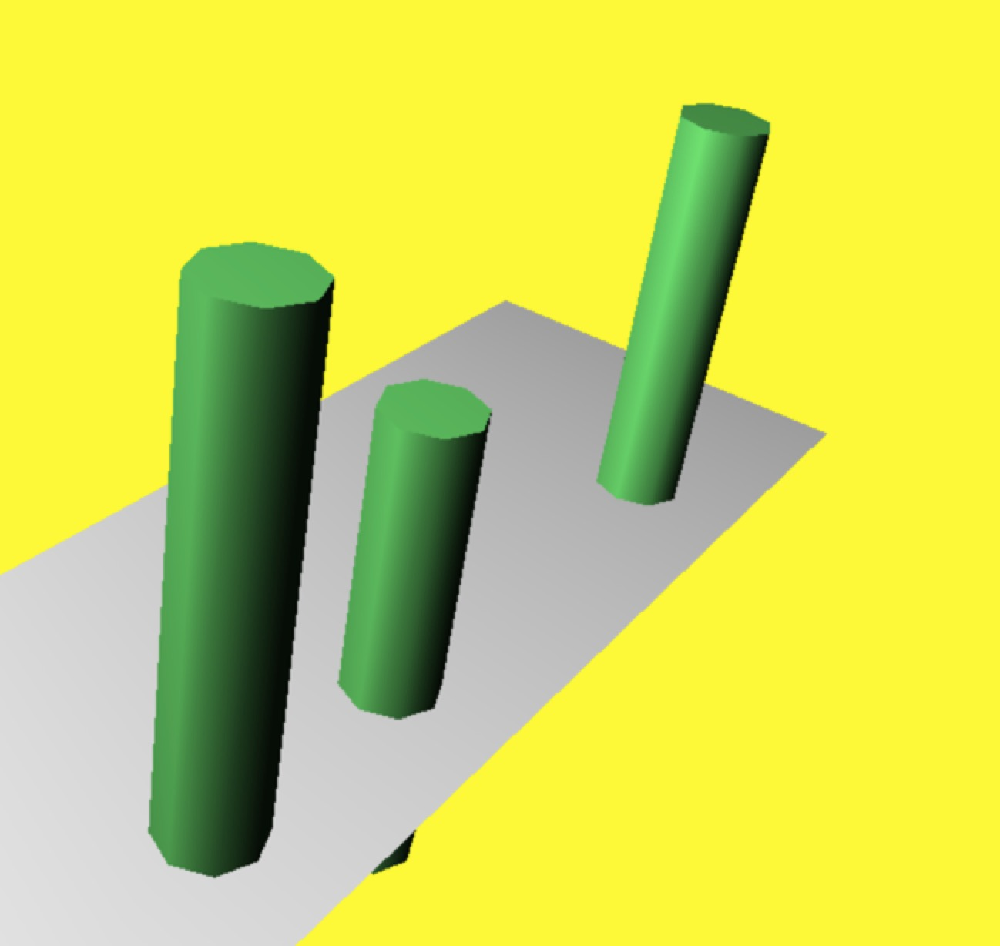
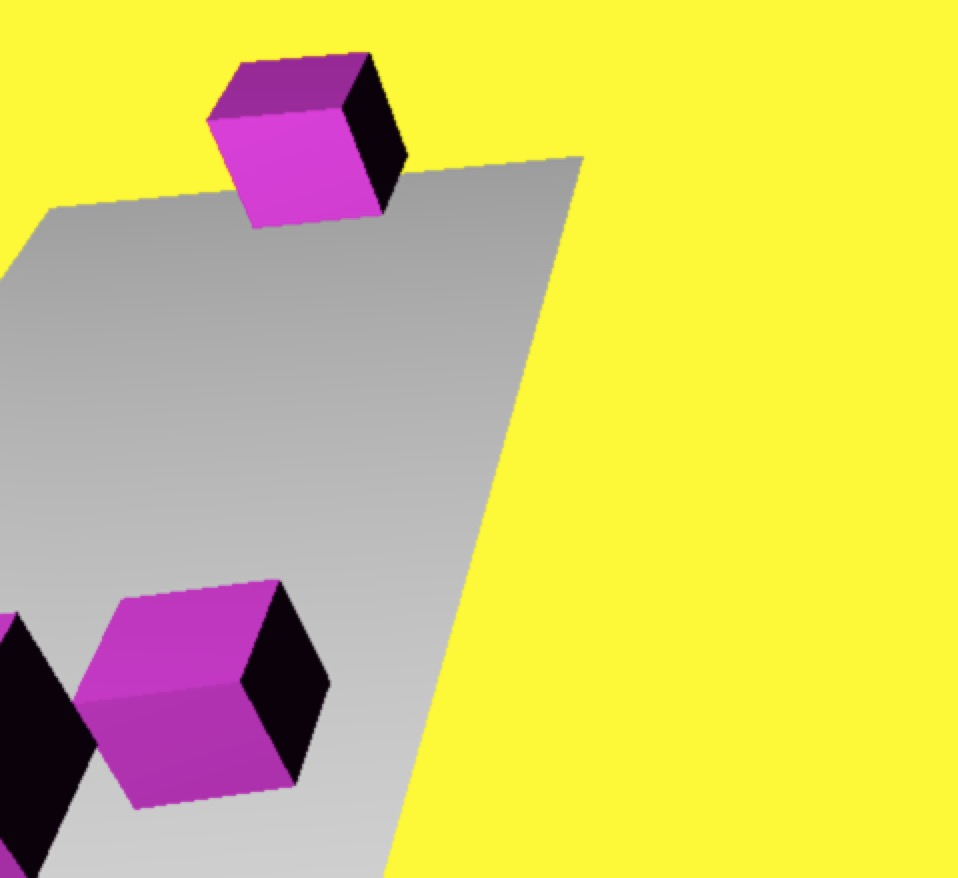
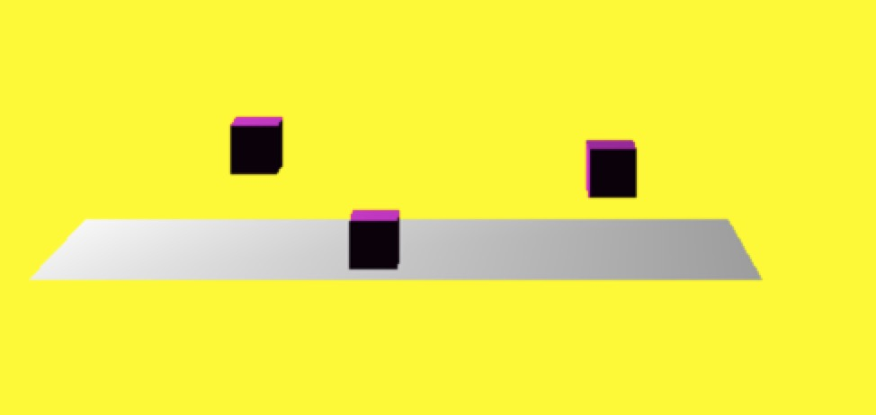

### 动画基础

* setTimeout / setInterval 存在弊端
* window.requestAnimationFrame 性能更高
* 通过递归循环实现

#### 相机分类

* FirstPersonControls 第一人称控件,类似于使用鼠标使相机移动
* FlyControls 飞行控件,通过键盘或者鼠标使相机移动
* RollControls 翻滚控件,飞行控件的简化版本，绕着z轴旋转
* TrackballControls 轨迹球控件,最常用的控件，可以用鼠标轻松的平移和缩放场景
* OrbitControls 轨迹控件，用于特定场景，模拟轨道中的卫星等等
* PathControls 路径控件，相机可以按照特定的路径进行移动，例如过山车等等

<!-- more -->

完整示例代码如下：



var scene = new THREE.Scene();
var camera = new THREE.PerspectiveCamera(45, window.innerWidth/window.innerHeight, .1, 1000);

var renderer = new THREE.WebGLRenderer();
renderer.setClearColor(new THREE.Color(0xEEEEEE,1.0));
renderer.setSize(window.innerWidth,window.innerHeight);

// 定义一个几何体
var planeGeometry = new THREE.PlaneGeometry(60,20,1,1);
var planeMaterial = new THREE.MeshLambertMaterial({color:0xffffff});
var plane = new THREE.Mesh(planeGeometry,planeMaterial);

plane.position.set(15,0,0);

plane.rotation.x = -0.5 * Math.PI;

scene.add(plane);

// 定义一个立方体
 var cubeGeometry = new THREE.BoxGeometry(4,4,4);
 var cubeMaterial = new THREE.MeshLambertMaterial({color:0xffffff});
 var cube = new THREE.Mesh(cubeGeometry,cubeMaterial);

 cube.position.set(-9,3,0);

 scene.add(cube);

 // 定义一个圆柱体
 var cylinderGeometry = new THREE.CylinderGeometry(2,2,20);
 var cylinderMaterial = new THREE.MeshLambertMaterial({color:0x77ff78});
 var cylinder = new THREE.Mesh(cylinderGeometry,cylinderMaterial);

 cylinder.position.set(0,0,1);
 scene.add(cylinder);

 camera.position.set(-30,40,30);
 camera.lookAt(scene.position);

 // 定义环境光
 var ambientLight = new THREE.AmbientLight(0x0c0c0c);
 scene.add(ambientLight);

 // 定义聚光灯
 var spotLight = new THREE.SpotLight(0xffffff);
 spotLight.position.set(-40,60,-10);
 scene.add(spotLight);

 document.body.appendChild(renderer.domElement);

 render();

 function render(){
   requestAnimationFrame(render);
   cube.rotation.x += 0.01;
   cube.rotation.y += 0.01;
   cube.rotation.z += 0.01;

   cylinder.rotation.x += 0.01;
   cylinder.rotation.y += 0.01;
   cylinder.rotation.z += 0.01;

   renderer.render(scene,camera)
 }
 

 最终效果如下图：

 

### 轨迹球控件

#### 属性

* THREE.TrackballControls(camera)创建
* rotateSpeed 转速
* zoomSpeed 变焦速度
* panSpeed 平移速度

完整示例代码如下：


var clock = new THREE.Clock();

var scene = new THREE.Scene();
var camera = new THREE.PerspectiveCamera(45, window.innerWidth/window.innerHeight, .1, 1000);

var renderer = new THREE.WebGLRenderer();
renderer.setClearColor(new THREE.Color(0xEEEEEE,1.0));
renderer.setSize(window.innerWidth,window.innerHeight);

// 定义一个几何体
var planeGeometry = new THREE.PlaneGeometry(60,20,1,1);
var planeMaterial = new THREE.MeshLambertMaterial({color:0xffffff});
var plane = new THREE.Mesh(planeGeometry,planeMaterial);

plane.position.set(15,0,0);

plane.rotation.x = -0.5 * Math.PI;

scene.add(plane);

// 定义一个立方体
function addCube(x,y,z){
  var cubeGeometry = new THREE.BoxGeometry(4,4,4);
  var cubeMaterial = new THREE.MeshLambertMaterial({color:0xff00ff});
  var cube = new THREE.Mesh(cubeGeometry,cubeMaterial);

  cube.position.set(x,y,z);

  scene.add(cube);
}

addCube(3,10,5);
addCube(13,2,5);
addCube(33,8,5);

var trackballControls = new THREE.TrackballControls(camera);
trackballControls.rotateSpeed = 1.0;
trackballControls.zoomSpeed = 1.0;
trackballControls.panSpeed = 1.0;
trackballControls.staticMoving = true;

 camera.position.set(-30,40,30);
 camera.lookAt(scene.position);

 // 定义环境光
 var ambientLight = new THREE.AmbientLight(0x0c0c0c);
 scene.add(ambientLight);

// 定义聚光灯
var spotLight = new THREE.SpotLight(0xffffff);
spotLight.position.set(-40,60,-10);
scene.add(spotLight);

 document.body.appendChild(renderer.domElement);

 render();

 function render(){
   requestAnimationFrame(render);

   var delta = clock.getDelta();
   trackballControls.update(delta);

   renderer.render(scene,camera)
 }
 

 最终效果如下图：

 

 ### 飞行控件

 #### 属性

 * THREE.FlyControls(camera)创建
 * movementSpeed 移动速度
 * rollSpeed 转速
 * autoForward 自动前进

 完整示例代码如下：


 var clock = new THREE.Clock();

var scene = new THREE.Scene();
var camera = new THREE.PerspectiveCamera(45, window.innerWidth/window.innerHeight, .1, 1000);

var renderer = new THREE.WebGLRenderer();
renderer.setClearColor(new THREE.Color(0xEEEEEE,1.0));
renderer.setSize(window.innerWidth,window.innerHeight);

// 定义一个几何体
var planeGeometry = new THREE.PlaneGeometry(60,20,1,1);
var planeMaterial = new THREE.MeshLambertMaterial({color:0xffffff});
var plane = new THREE.Mesh(planeGeometry,planeMaterial);

plane.position.set(15,0,0);

plane.rotation.x = -0.5 * Math.PI;

scene.add(plane);

var cylinderMaterial = new THREE.MeshLambertMaterial({color:0x77ff78});

// 定义一个立方体
function addCyliner(x,y,z){
  // 定义一个圆柱体
  var cylinderGeometry = new THREE.CylinderGeometry(2,2,20);
  var cylinder = new THREE.Mesh(cylinderGeometry,cylinderMaterial);

  cylinder.position.set(x,y,z);
  scene.add(cylinder);
}

addCyliner(3,10,5);
addCyliner(13,2,5);
addCyliner(33,8,5);

camera.position.set(-30,40,30);
camera.lookAt(scene.position);

// 定义环境光
var ambientLight = new THREE.AmbientLight(0x0c0c0c);
scene.add(ambientLight);

// 定义聚光灯
var spotLight = new THREE.SpotLight(0xffffff);
spotLight.position.set(-40,60,-10);
scene.add(spotLight);

document.body.appendChild(renderer.domElement);

// 创建飞行控件
var flyControls = new THREE.FlyControls(camera);
flyControls.movementSpeed = 25;
flyControls.domElement = document.body;
flyControls.rollSpeed = Math.PI / 24;
flyControls.autoForward = true;

render();

function render(){
  requestAnimationFrame(render);
  var d = clock.getDelta();
  flyControls.update(d);
  renderer.render(scene,camera)
}

 

 最终效果如下图：

 

### 翻滚控件 

#### 属性

* THREE.RollControls(camera) 创建
* movementSpeed 移动速度
* lookSpeed 观看速度

核心示例代码如下：


// 创建翻滚控件
var rollControls = new THREE.RollControls(camera);
rollControls.movementSpeed = 25;
rollControls.lookSpeed = 3;

render();

function render(){
  requestAnimationFrame(render);
  var d = clock.getDelta();
  rollControls.update(d);
  renderer.render(scene,camera)
}

 

 最终效果如下图：

 

 ### 第一人称控件 

 #### 属性

 * THREE.FirstPersonControls(camera) 创建
 * movementSpeed 移动速度
 * noFly 非飞行模式
 * lon／lat定位相机位置

 核心示例代码如下：


// 创建控件
var controls = new THREE.FirstPersonControls(camera);
controls.movementSpeed = 25;
controls.lookSpeed = 0.4;
controls.noFly = true;
controls.lookVertical = true;
controls.constrainVertical = true;
controls.verticalMax = 2.0;
controls.verticalMin = 2.0;
controls.lon = -150;
controls.lat = 120;

render();

function render(){
  requestAnimationFrame(render);
  var d = clock.getDelta();
  controls.update(d);
  renderer.render(scene,camera)
}

 

 最终效果如下图：

 

源码链接请访问 https://github.com/wqzwh/webgl-code/tree/master/18
